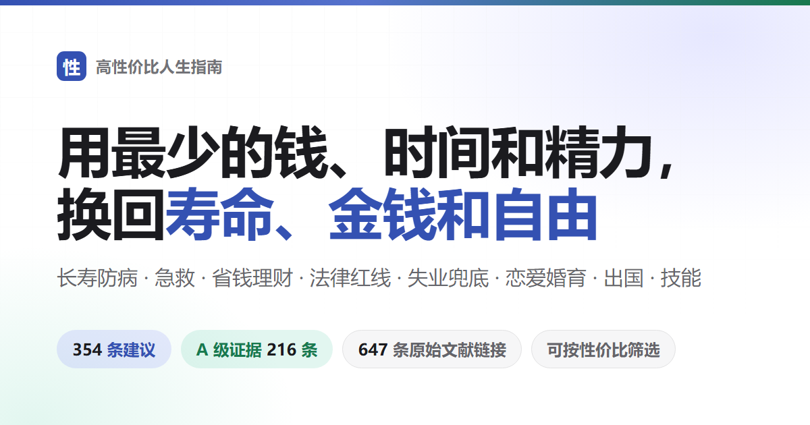

<div align="center">



# 高性价比人生指南

覆盖长寿与防病、意外与急救、省钱与理财、防骗与法律红线、失业兜底、创业风险、恋爱婚育、出国与技能。<br>
354 条建议，每条写明花掉什么、换回什么、证据有多硬，来源只引期刊论文和官方文件。

[](https://eternity4719.github.io/HowToLiveBetter/)
[](#目录)
[](#证据分级)
[](docs/核实记录/)
[](LICENSE)

**[打开在线检索页](https://eternity4719.github.io/HowToLiveBetter/)** · [目录](#目录) · [术语表](#读懂数字术语表) · [核实记录](docs/核实记录/) · [结婚划不划算（长文）](docs/结婚划不划算.md)

</div>

---

## 这本书想回答的问题

| 问题 | 去哪看 |
| --- | --- |
| 几乎不花钱，就能明显降低早死概率的事有哪些？ | [1. 不要早死](#1-不要早死) |
| 抽烟、喝酒、久坐、熬夜到底折寿多少？ | [2. 不要慢慢死](#2-不要慢慢死) |
| 每天精力不够用、总被打断，怎么改？ | [3. 不要浪费精力](#3-不要浪费精力) |
| 时间都花哪去了，怎么少做无收益的事？ | [4. 不要浪费时间](#4-不要浪费时间) |
| 攒下的钱该怎么放，才不被利息、费率和骗局吃掉？ | [5. 不要浪费钱](#5-不要浪费钱) |
| 哪些保健品、体检套餐、智商税可以直接不买？ | [6. 反面清单](#6-反面清单) |
| 失业了、被欠薪了、身上没钱了，能领什么、去哪求助？ | [7. 没钱的时候怎么活](#7-没钱的时候怎么活) |
| 彩礼、婚前房产、恋爱期间的大额转账，法律上算谁的？ | [8. 法律与财产安全](#8-别把自己搭进去法律与财产安全) |
| 哪些「兼职」和顺手的小事会让普通人变成刑事被告？ | [9. 普通人容易踩的法律红线](#9-普通人容易踩的法律红线) |
| 追人该广撒网还是死磕一个，异地恋能不能成，领证要带什么？ | [10. 恋爱和结婚划不划算](#10-恋爱和结婚划不划算) |
| 写哪些代码、接哪些单会被判刑？ | [11. 程序员和技术人容易踩的红线](#11-程序员和技术人容易踩的红线) |
| 借钱开店、开公司之前最该先想清楚什么？ | [12. 创业与做生意](#12-创业与做生意别把家底赔进去) |
| 有人倒地没了呼吸、大出血、火灾、迷路，先做什么？ | [13. 紧急情况：先做什么](#13-紧急情况先做什么) |
| 账号被盗、手机丢了，第一步做什么？ | [14. 账号与信息安全](#14-账号与信息安全) |
| 押金被扣、房东赶人、长租公寓暴雷怎么办？ | [15. 租房与买房](#15-租房与买房) |
| 确诊慢性病之后，长期该怎么管、怎么少花钱？ | [16. 得了慢性病之后怎么活](#16-得了慢性病之后怎么活) |
| 老人的监护、遗嘱和钱该怎么提前安排？ | [17. 家里有老人](#17-家里有老人) |
| 生孩子能领什么、要占掉多少时间和钱？ | [18. 养孩子划不划算](#18-养孩子划不划算) |
| 被裁员该拿多少补偿，上班受了伤怎么认定和拿钱？ | [19. 被裁员、离职和工伤](#19-被裁员离职和工伤) |
| 孩子刚出生，最要紧的几件事是什么？ | [20. 刚出生的孩子怎么带](#20-刚出生的孩子怎么带) |
| 哪些国家现在别去，出事了使领馆管到哪一步？ | [21. 出国、旅行与境外安全](#21-出国旅行与境外安全) |
| 去 KTV、网吧、密室怎么不踩坑，压力大时做什么最有用？ | [22. 怎么放松：娱乐场所和减压](#22-怎么放松娱乐场所和减压) |
| 学电焊、学英语、考证，哪些真的回本？ | [23. 学什么技能划算](#23-学什么技能划算) |
| 同一个病在社区看和在三级医院看，差多少钱？ | [24. 看病：怎么少花钱少走弯路](#24-看病怎么少花钱少走弯路) |
| 家里人走了，哪些钱能取回来、哪些费用可以不交？ | [25. 人走了以后要办什么](#25-人走了以后要办什么) |

## 怎么读

- **想按条件筛**：打开[在线检索页](https://eternity4719.github.io/HowToLiveBetter/)，可以按关键词、章节、证据等级，以及「花不花钱、花多少时间、要不要毅力」三个成本维度组合筛选。数据直接读本文件，改正文即改检索页。
- **想按顺序读**：每节内的条目按性价比从高到低排列，从每节前几条开始看就行。
- **只想看结论最硬的**：在检索页里勾选证据等级 A，只留下有具体数字、来自荟萃分析或大型试验的 216 条。
- **只想看最值得做的**：勾选性价比「极高」，得到 64 条既不花钱、不花时间、不需要毅力，收益又落在最大一档的条目。再叠加一个「换回什么」，就是该口径下的优先清单。

每条建议长这样：

```markdown
### 4. 把家里的食盐换成低钠盐（钾盐）
- 成本：每袋贵几元
- 收益：脑卒中降 14%，心血管事件降 13%，总死亡率降 12%
- 证据等级：A
- 来源：Neal B, et al. (2021). NEJM. https://doi.org/10.1056/NEJMoa2105675
- 备注：争议。肾功能不全、正在吃保钾利尿剂的人不要用。另有一项覆盖 181 个国家的生态学研究发现钠摄入越高的国家预期寿命反而越长、总死亡率反而越低（β=−131 例/克每日钠摄入，R²=0.60，P<0.001），作者据此反对把钠当作缩短寿命的元凶；但生态学研究比的是国家而不是人，富国吃盐多也活得久，无法排除经济水平这个混杂，证据等级低于上面那项随机对照试验。来源：Messerli FH, Hofstetter L, Syrogiannouli L, et al. (2021). Sodium intake, life expectancy, and all-cause mortality. European Heart Journal, 42(21), 2103-2112. <https://doi.org/10.1093/eurheartj/ehaa947>
```

## 四种资源

本指南优化的不只是寿命，而是四种资源：

- **寿命**：活得更久，少死于本来可以避免的事
- **时间与精力**：活着的时间不被无收益的事占用，每天的注意力和体力少被无谓消耗
- **金钱**：少花冤枉钱，把钱花在收益确定的地方
- **人身自由**：不因为不知道一条红线，把自己送进拘留所或者看守所

每一条建议都回答两个问题：花掉什么（钱/时间/精力/毅力），换回什么（总死亡率变化 / 特定死因下降 / 时间与精力节省 / 金钱节省 / 保障与人身自由）。条目按性价比排序，不按类别排序：成本接近零、收益大的放最前面。

死亡率类数字、时间/精力类数字、金钱类数字和法律后果分开口径，不做跨口径换算。这四种资源对应检索页上的四个「换回什么」，互相之间不做比较。

## 证据分级

每条建议都标注证据等级：

| 等级 | 含义 |
| --- | --- |
| A | 有可量化证据，来自荟萃分析、大型队列或 RCT，能给出具体数字（HR、RR、下降百分比） |
| B | 有研究支撑但难以量化，或证据来自小样本/单一研究 |
| C | 作者经验或普遍共识，没有直接文献 |

全书 354 条中 A 级 216 条、B 级 91 条、C 级 47 条，另有 44 条标注了争议、31 处标注了 TODO 待核实。有争议的 A/B 级条目会标注「争议」并列出反方证据。所有来源只引原始文献（期刊论文附 DOI 或 PubMed 链接，或 WHO/CDC/国家统计局等官方机构报告），不引二手转述。不确定的数字标「待核实」。

## 性价比档

证据等级回答的是「这个数字可不可信」，不回答「值不值得做」。所以每条另外标一个收益量级和一个口径，检索页由它和三项成本合成一个性价比档：

| 维度 | 取值 | 怎么定的 |
| --- | --- | --- |
| 口径 | 换寿命 / 换钱 / 换时间精力 / 换人身自由 | 按这条主要换回什么。**不同口径之间不做比较**，「总死亡率降 12%」和「每年省 500 元」不在一把尺子上 |
| 收益量级 | 大 / 中 / 小 | 尽量按阈值从条目自己的「收益」栏里机械套：换寿命看相对降幅（≥20% 为大，10–20% 为中，<10% 或只有替代终点为小）；换钱看金额（万元级为大，数百到数千为中，几十元为小）；换人身自由看后果（避免刑事责任为大，避免拘留或行政处罚为中，避免民事纠纷为小）；换时间精力看节省量（每天小时级为大，每周小时级为中，一次性为小） |
| 性价比 | 极高 / 高 / 一般 | 收益大且三项成本全为零 = 极高；收益大且成本较低，或收益中且成本为零 = 高；其余 = 一般 |

全书 354 条中性价比极高 64 条（18%）、高 180 条（51%）、一般 110 条（31%）。中间一档偏厚是有意的：底层的收益量级只有三级判断，再往下切就是假装精度。

**这一档是作者判断，不是证据**，本质上是 C 级，和证据等级正交。可以是 A 级但性价比一般（带状疱疹疫苗有 97.2% 效力的三期 RCT，但两针三四千元、带状疱疹很少致命），也可以是 C 级但性价比极高（出境前把行程发给家人）。「一般」不等于不该做——全书的条目都是建议做的，只是这一档要你自己权衡那笔花销。

## 读懂数字（术语表）

正文尽量说人话，但引用研究时绕不开几个统计名词。看不懂时查这张表；在线检索页里把鼠标放到（或点一下）带虚线的词上也会弹出解释。

<details>
<summary>展开 38 条术语（总死亡率、HR、RR、95% CI、荟萃分析、BMI、LPR、定金与订金……）</summary>

| 术语 | 意思 |
| --- | --- |
| 总死亡率 | 一段时间内死于任何原因的人数比例，不分死因。本书用它衡量「活得久不久」。原文献叫全因死亡率，英文缩写 ACM |
| HR | 风险比。两组人在同样时间里出事（死亡、发病）的速度之比。HR 0.87 表示比对照组低 13%，HR 1.21 表示高 21% |
| RR | 相对风险。两组人出事的概率之比，读法同 HR |
| OR | 比值比。两组人出事「几率」之比，事件少见时接近 RR，事件常见时会夸大差异 |
| IRR | 发病率之比，读法同 RR |
| RaR | 发生次数之比（如跌倒次数），读法同 RR |
| 95% CI | 95% 置信区间。真实值大概率落在的范围。比值类区间跨过 1、差值类区间跨过 0，就说明差异可能只是巧合，文中会写「无统计学意义」 |
| RCT | 随机对照试验。把人随机分成两组，一组做干预一组不做，比较结果。最能说明因果 |
| 荟萃分析 | 把多项研究的结果合并统计，得到一个总的估计。也叫 meta 分析 |
| 队列 | 队列研究。追踪一群人多年，看谁出事。能说明相关，不能完全说明因果 |
| 观察性 | 观察性研究。研究者只观察不干预，结果可能受混杂和反向因果影响，数字要打折看 |
| 混杂 | 第三个因素同时影响原因和结果，让相关看起来像因果。爱吃菜的人往往也更爱运动 |
| 反向因果 | 不是 A 导致 B，而是 B 导致 A。不是睡得多让人早死，而是病重的人睡得多 |
| d、g | 效应量。两组平均值差了多少个标准差。0.2 算小，0.5 中等，0.8 大 |
| r | 相关系数。两件事同向变化的程度，从 -1 到 1，0.1 弱、0.3 中、0.5 强 |
| MET | 运动强度单位。1 MET 是安静坐着，快走约 3 到 4 MET。MET·h 是强度乘小时数 |
| GRADE | 给证据质量打分的国际标准，分高、中、低、极低四档 |
| 意向筛查分析 | 按「邀请了谁」而不是「谁真去做了」来算效果，会低估筛查对真去做的人的作用 |
| 包年 | 吸烟量单位。每天包数乘以吸烟年数，30 包年就是每天一包抽 30 年 |
| BMI | 体重指数。体重（公斤）除以身高（米）的平方 |
| LDL | 低密度脂蛋白胆固醇，俗称坏胆固醇 |
| HBsAg | 乙肝表面抗原，阳性表示已感染乙肝病毒 |
| HPV | 人乳头瘤病毒，部分型别长期感染会导致宫颈癌 |
| LDCT | 低剂量胸部 CT，辐射量约为普通 CT 的五分之一到十分之一 |
| PM2.5 | 直径 2.5 微米以下的空气颗粒物 |
| NOVA | 一种按加工程度给食品分类的方法，「超加工食品」就是它的第四类 |
| LPR | 贷款市场报价利率。中国的基准贷款利率，每月 20 日公布，房贷和民间借贷上限都参照它 |
| 一裁终局 | 劳动仲裁裁决直接生效，用人单位不能再向法院起诉 |
| 粗结婚率、粗离婚率 | 每千人中当年登记结婚、离婚的对数。离婚对数除以结婚对数是另一个口径，叫离结比，两者不能混 |
| AED | 自动体外除颤器。公共场所常见的红色或黄色急救箱，开机后按语音提示操作，会自己判断要不要电击 |
| CPR | 心肺复苏。心脏骤停时用力按压胸口，让血继续流动 |
| 3C 认证 | 中国强制性产品认证。列入目录的产品没有这个标志不准出厂、销售 |
| ICP 备案 | 网站或 App 上线前在工信部系统登记的手续 |
| 等级保护 | 网络安全等级保护制度。按系统重要程度分级，落实相应的安全措施 |
| GPL | 一种开源许可证。用了它的代码做产品，分发时通常要一并开源 |
| 竞业限制 | 离职后一段时间内不去竞争对手处任职的约定，公司要按月付补偿，最长 2 年 |
| 认缴出资 | 注册公司时承诺投入的钱。承诺了就要在法定期限内实缴，不是写着好看 |
| 定金与订金 | 定金有罚则，收方违约要双倍返还，最多为合同额 20%；订金只是预付款，没有罚则 |

</details>

## 目录

1. [不要早死](#1-不要早死)：外因死亡、燃气与中毒、疫苗、筛查、心理危机。口径：总死亡率 或特定死因。
2. [不要慢慢死](#2-不要慢慢死)：烟酒、运动、睡眠、饮食、久坐。口径：总死亡率 或特定死因。
3. [不要浪费精力](#3-不要浪费精力)：睡眠、打断、多任务、决策疲劳、人际负债。口径：精力/时间。
4. [不要浪费时间](#4-不要浪费时间)：无收益项目、沉没成本、拖延、会议、通勤。口径：时间。
5. [不要浪费钱](#5-不要浪费钱)：订阅、彩票、利息、保险、基金费率、车险、预付款、直播带货、医保个人账户。口径：金钱。
6. [反面清单](#6-反面清单)：看起来性价比高但其实不高的东西。
7. [没钱的时候怎么活](#7-没钱的时候怎么活)：救助、补贴、找活、住宿吃饭、医疗、欠薪维权、避坑。口径：金钱/保障。
8. [别把自己搭进去：法律与财产安全](#8-别把自己搭进去法律与财产安全)：交通事故、被骗止付、被指控、彩礼、婚前财产、担保、反诈、养犬责任。口径：金钱/人身自由。
9. [普通人容易踩的法律红线](#9-普通人容易踩的法律红线)：谣言、侮辱英烈、传播色情、兼职洗钱、高空抛物、仿真枪、无人机、偷拍、赌博、野味。口径：人身自由/金钱。
10. [恋爱和结婚划不划算](#10-恋爱和结婚划不划算)：择偶策略、纠缠的红线、兴趣信号、关系质量、异地恋、登记流程、婚检、健康账、时间账、钱账、退出成本。长文见 [docs/结婚划不划算.md](docs/结婚划不划算.md)。
11. [程序员和技术人容易踩的红线](#11-程序员和技术人容易踩的红线)：外挂、爬虫、抢票脚本、删库、带走源码、接单开发、竞业、开源许可、备案。口径：人身自由/金钱。
12. [创业与做生意：别把家底赔进去](#12-创业与做生意别把家底赔进去)：本钱、担保、主体选择、加盟、许可证、发票、合同、用人、量产、退场。口径：金钱/法律责任。
13. [紧急情况：先做什么](#13-紧急情况先做什么)：心脏骤停、大出血、咬伤、烧烫伤、过敏性休克、癫痫、低血糖、触电、一氧化碳、骗局、隐私威胁、中暑、火灾、溺水、迷路、失温、蛇咬、地震、野兽、雷击、高原病、蜱虫、野外饮水。口径：存活率与金钱。
14. [账号与信息安全](#14-账号与信息安全)：二次验证、密码、SIM 卡、手机丢失、登录设备、App 权限、查阅与删除权。口径：金钱/个人信息。
15. [租房与买房](#15-租房与买房)：押金、暴力腾退、中介代收、资金监管、买卖不破租赁、产权核对、交易资金专户、隔断房。口径：金钱。
16. [得了慢性病之后怎么活](#16-得了慢性病之后怎么活)：服药依从、门诊慢特病跨省结算、复查记录、别停药试偏方、长期处方、家庭医生签约、并发症筛查。口径：总死亡率/金钱。
17. [家里有老人](#17-家里有老人)：意定监护、遗嘱形式、账户与话术、长期护理保险。口径：金钱/人身自由。
18. [养孩子划不划算](#18-养孩子划不划算)：育儿补贴、产假与生育津贴、三期保护、时间账、钱账。口径：金钱/时间。
19. [被裁员、离职和工伤](#19-被裁员离职和工伤)：N、代通知金、2N、别签主动辞职、留证；工伤认定时限、单位未参保、劳动能力鉴定、工亡待遇。口径：金钱。
20. [刚出生的孩子怎么带](#20-刚出生的孩子怎么带)：安全睡眠、乙肝首针、母乳与辅食、冲奶水温、蜂蜜、维生素 K、发热就医红线、不摇晃、尿布与大件采购。口径：婴儿死亡率/金钱。
21. [出国、旅行与境外安全](#21-出国旅行与境外安全)：安全提醒级别、12308、领事保护的边界、境外医疗保险、境外高薪招聘骗局、证件丢失、境外驾照、中介备案。口径：金钱/人身自由。
22. [怎么放松：娱乐场所和减压](#22-怎么放松娱乐场所和减压)：安全出口、明码标价、涉毒红线、网吧实名、剧本杀选址；运动、正念、呼吸、社交、绿地。口径：金钱/人身自由，以及精力/总死亡率。
23. [学什么技能划算](#23-学什么技能划算)：教育回报率、山寨证书、培训补贴、抗自动化的维度、技能等级、紧缺职业怎么查。口径：金钱/时间。
24. [看病：怎么少花钱少走弯路](#24-看病怎么少花钱少走弯路)：分级诊疗与转诊、起付线连续计算、报销比例差、预留号源、异地就医必要性评估、病历留存。口径：金钱/时间。
25. [人走了以后要办什么](#25-人走了以后要办什么)：殡葬基础项目清单、价格违法、中介备案、公积金余额与社保待遇、死者个人信息权利。口径：金钱。

每节内条目按性价比从高到低排列。每条来源的核实过程记录在 [docs/核实记录](docs/核实记录/)。

仓库根目录的 `index.html` 是在线检索页：按关键词、章节、证据等级和成本维度（花钱、花时间、要毅力）筛选条目，数据直接读本文件。在仓库设置里开启 GitHub Pages（Deploy from a branch，分支 main，目录 /）后即可访问。

## 1. 不要早死

本节只收外因死亡和少数证据最硬的疫苗、筛查。收益一栏的数字来自随机试验、大型队列或官方统计，成本一栏是作者按市价的粗估，只用于比较，不作引用。

### 1. 系安全带，前排后排都系
<!-- 成本标签: 钱=0 时间=少 毅力=否 收益=大 口径=死亡率 -->
- 成本：0 元，每次上车 2 秒
- 收益：美国 NHTSA 估计安全带使轿车前排乘员致死伤害风险下降 45%，轻型卡车前排下降 60%；2022 年美国死亡的乘用车乘员中，已知系带情况者有 50% 未系；WHO 口径为车内人员死亡风险最多降低 50%。WHO 估计中国 2021 年道路交通死亡 248,099 人（17.4/10 万）
- 证据等级：A
- 来源：NHTSA (2024). Occupant Protection in Passenger Vehicles: 2022 Data (DOT HS 813 573). <https://crashstats.nhtsa.dot.gov/Api/Public/ViewPublication/813573> ; WHO (2025). Road traffic injuries fact sheet. <https://www.who.int/news-room/fact-sheets/detail/road-traffic-injuries> ; WHO GHO RS_196/RS_198 (China, 2021). <https://ghoapi.azureedge.net/api/RS_196?$filter=SpatialDim%20eq%20%27CHN%27>
- 备注：NHTSA 的 45%/60% 是基于美国事故数据库的官方估计（引 Kahane 2015），不是随机试验。后排不系同样致命，NHTSA 同一报告中第二排被撞死者 60% 未系带。WHO 的中国死亡数是模型估计，比公安交管登记口径高出数倍，两者定义不同，这里只用 WHO 口径。

### 2. 骑摩托车、电动自行车戴头盔并扣好
<!-- 成本标签: 钱=少 时间=少 毅力=否 收益=大 口径=死亡率 -->
- 成本：100 到 300 元买一顶，每次戴 5 秒
- 收益：Cochrane 荟萃分析：摩托车骑行者戴头盔使死亡风险下降 42%（OR 0.58，95% CI 0.50 到 0.68），头部损伤下降 69%（OR 0.31，95% CI 0.25 到 0.38）
- 证据等级：A
- 来源：Liu BC 等 (2008). Helmets for preventing injury in motorcycle riders. Cochrane Database of Systematic Reviews. <https://doi.org/10.1002/14651858.CD004333.pub3>
- 备注：数据来自摩托车，电动自行车是外推，但受伤机制一样。头盔要扣好扣带，挂在车把上不算。

### 3. 装烟雾报警器；冬天在室内烧煤、用燃气取暖的再装一氧化碳报警器
<!-- 成本标签: 钱=少 时间=少 毅力=否 收益=大 口径=死亡率 -->
- 成本：烟雾报警器 30 到 100 元一个，一氧化碳报警器 50 到 150 元一个，装完每年换一次电池
- 收益：北卡罗来纳州住宅火灾病例对照研究：可工作的烟雾报警器使死亡风险下降（OR 0.39，95% CI 0.18 到 0.83）。美国 2018 到 2020 年有人居住的住宅致死火灾中 24% 没有烟雾报警器，41% 起火时人在睡觉。中国 2018 年报告一氧化碳中毒死亡 11,523 例，12 月、1 月、2 月死亡有 72.59%、67.42%、66.48% 发生在家中
- 证据等级：B
- 来源：Marshall SW 等 (1998). Fatal residential fires: who dies and who survives? JAMA. <https://doi.org/10.1001/jama.279.20.1633> ; USFA (2022). Fatal Fires in Residential Buildings (2018-2020), Topical Fire Report Series 22(2). <https://www.usfa.fema.gov/downloads/pdf/statistics/v22i2.pdf> ; You J 等 (2020). Number of Deaths due to Carbon Monoxide Poisoning by Month and by Place of Death — China, 2018. China CDC Weekly. <https://doi.org/10.46234/ccdcw2020.008>
- 备注：烟雾报警器对死亡率的证据是单个病例对照研究，没有随机试验，所以只给 B。一氧化碳报警器本身没有死亡率研究，收益按「中毒死亡集中在冬季家中」推断。

### 4. 燃气软管和灶具到期就换，不自己改管道，燃气公司上门推销可以直接拒绝
<!-- 成本标签: 钱=少 时间=少 毅力=否 收益=大 口径=死亡率 -->
- 成本：一根合规燃气软管几十元，灶具几年一换；换的时候顺手看一眼有没有过期
- 收益：条例把「及时更换国家明令淘汰或者使用年限已届满的燃气燃烧器具、连接管」写成用户义务，把「擅自安装、改装、拆除户内燃气设施和燃气计量装置」列为禁止行为；同时明确燃气经营者不得要求用户购买其指定的产品或者接受其提供的服务
- 证据等级：A
- 来源：国务院 (2010). 城镇燃气管理条例（国务院令第 583 号）第二十七条：「燃气用户应当遵守安全用气规则，使用合格的燃气燃烧器具和气瓶，及时更换国家明令淘汰或者使用年限已届满的燃气燃烧器具、连接管等」；第二十八条禁止行为含「（一）擅自操作公用燃气阀门」「（二）将燃气管道作为负重支架或者接地引线」「（四）擅自安装、改装、拆除户内燃气设施和燃气计量装置」；第二十条燃气经营者不得「（六）要求燃气用户购买其指定的产品或者接受其提供的服务」；第二十九条用户可就收费、服务向燃气管理等部门投诉，「有关部门应当自收到投诉之日起15个工作日内予以处理」. <http://www.gov.cn/gongbao/content/2010/content_1758214.htm>
- 备注：以「安检」名义上门、检查完就推销自闭阀和报警器的，条例第二十条第六项直接堵掉了这条路，可以拒绝并投诉。TODO（待核实：闻到燃气味之后的标准处置步骤——开窗、关阀、不开关任何电器、到室外打电话——本次未取得可逐字核对的官方原文）。一氧化碳中毒是另一件事，见第 13 节。

### 5. 不采、不买、不吃野生蘑菇，任何「土办法鉴别」都不成立
<!-- 成本标签: 钱=0 时间=少 毅力=些 收益=大 口径=死亡率 -->
- 成本：0 元；代价是放弃一种季节性的野味
- 收益：中国疾控中心 2025 年调查了 828 起蘑菇中毒事件，涉及 2165 人、死亡 13 人，病死率 0.6%；2019 到 2024 年每年 276 到 676 起，病死率在 0.87% 到 2.86% 之间。仅 2025 年就鉴定出 138 种有毒蘑菇，其中 34 种是国内首次记录到引起中毒
- 证据等级：A
- 来源：Mushroom Poisoning Outbreaks — China, 2025. China CDC Weekly (2026)：「In 2025, China CDC investigated 828 mushroom poisoning incidents across 27 provincial-level administrative divisions (PLADs), affecting 2,165 individuals and causing 13 deaths - a case fatality rate of 0.6%, the lowest of the past six years. In total, 138 poisonous mushroom species were identified, including 34 newly recorded in poisoning incidents in China.」「From 2019 to 2024, the annual number of incidents ranged from 276 to 676, and the case fatality rate ranged from 0.87% to 2.86%.」<https://doi.org/10.46234/ccdcw2026.120>；同刊 2024 年度报告 <https://doi.org/10.46234/ccdcw2025.106>
- 备注：每年都有新种类被记录到中毒，说明「本地人认得清」这个前提本身站不住。银针验毒、和大蒜同煮、虫子吃过就没毒、颜色鲜艳才有毒，全都不成立。误食后立刻催吐并带上剩余蘑菇或照片去医院——毒蘑菇中毒有好几种临床类型，鉴定种类直接决定怎么治。

### 6. 电动自行车不推进楼道、不进电梯、不在家里充电
<!-- 成本标签: 钱=0 时间=少 毅力=些 收益=大 口径=死亡率 -->
- 成本：0 元；停到楼下集中充电点，多走几十米
- 收益：应急管理部部门规章明文禁止：「禁止在高层民用建筑公共门厅、疏散走道、楼梯间、安全出口停放电动自行车或者为电动自行车充电」；拒不改正的，非经营性单位和个人罚 500 至 1000 元，经营性的罚 2000 至 10000 元
- 证据等级：A
- 来源：应急管理部 (2021). 高层民用建筑消防安全管理规定（应急管理部令第 5 号，第三十七条、第四十七条）. <https://www.gov.cn/zhengce/zhengceku/2021-08/01/content_5628815.htm>
- 备注：锂电池起火是几十秒内的轰燃加剧毒烟，堵在楼道就是把唯一的逃生通道点着。别买改装电池和杂牌充电器，别整夜充电。TODO（待核实：全国电动自行车火灾起数与死亡人数的官方年度数字）

### 7. 量血压，高了就吃药降到达标
<!-- 成本标签: 钱=少 时间=少 毅力=些 收益=大 口径=死亡率 -->
- 成本：电子血压计 100 到 200 元，一次 1 分钟；降压药多数每月几元到几十元
- 收益：荟萃分析（123 项试验，61 万余人）：收缩压每降 10 mmHg，主要心血管事件 RR 0.80（95% CI 0.77 到 0.83），卒中 RR 0.73，心力衰竭 RR 0.72，总死亡率 下降 13%（RR 0.87，95% CI 0.84 到 0.91）。中国 35 到 75 岁 170 万人筛查：44.7% 有高血压，其中知晓 44.7%、治疗 30.1%、控制 7.2%
- 证据等级：A
- 来源：Ettehad D 等 (2016). Blood pressure lowering for prevention of cardiovascular disease and death: a systematic review and meta-analysis. Lancet. <https://doi.org/10.1016/S0140-6736(15)01225-8> ; Lu J 等 (2017). Prevalence, awareness, treatment, and control of hypertension in China (China PEACE Million Persons Project). Lancet. <https://doi.org/10.1016/S0140-6736(17)32478-9>
- 备注：降压目标值（130 还是 140）仍有讨论，但「知道自己高血压并把它降下来」本身没有争议。中国 10 个高血压里只有不到 1 个控制住，量一次血压是这本书里性价比最高的动作之一。

### 8. 35 岁以后只要超重，就去查一次空腹血糖，正常也每三年再查
<!-- 成本标签: 钱=少 时间=少 毅力=否 收益=中 口径=死亡率 -->
- 成本：空腹血糖十几元，糖化血红蛋白几十元；抽一次血
- 收益：美国预防服务工作组现行建议：对 35 到 70 岁、超重或肥胖（体重指数分别 ≥25 和 ≥30）的无症状成年人筛查糖尿病前期和 2 型糖尿病，推荐等级 B；「对血糖正常的成年人，每 3 年筛查一次是合理的做法」
- 证据等级：A
- 来源：US Preventive Services Task Force (2021). Screening for Prediabetes and Type 2 Diabetes. <https://www.uspreventiveservicestaskforce.org/uspstf/recommendation/screening-for-prediabetes-and-type-2-diabetes>
- 备注：查出糖尿病前期不等于要吃药，生活方式干预就能让相当一部分人逆转。中国成人糖尿病知晓率长期偏低，很多人是等到并发症才发现

### 9. 开车不超速、不酒驾
<!-- 成本标签: 钱=0 时间=少 毅力=些 收益=大 口径=死亡率 -->
- 成本：0 元，多花几分钟车程，饭局上少喝
- 收益：WHO：平均车速每升高 1%，致死事故风险升高 4%；酒驾风险从很低的血液酒精浓度就开始上升
- 证据等级：B
- 来源：WHO (2025). Road traffic injuries fact sheet. <https://www.who.int/news-room/fact-sheets/detail/road-traffic-injuries>
- 备注：速度与死亡的 1%/4% 来自事故模型的估计，不是随机试验。酒驾 WHO 只给了定性结论，具体剂量效应本节未核实原始文献。

### 10. 给 4 岁以下儿童用安全座椅，不要抱在怀里
<!-- 成本标签: 钱=多 时间=少 毅力=否 收益=大 口径=死亡率 -->
- 成本：300 到 2000 元一个，能用几年，每次多花 1 分钟
- 收益：美国 NHTSA 估计安全座椅使轿车内 1 岁以下婴儿致死伤害风险下降 71%，1 到 4 岁幼儿下降 54%；WHO 口径为婴儿死亡下降 71%
- 证据等级：A
- 来源：NHTSA (2024). Occupant Protection in Passenger Vehicles: 2022 Data (DOT HS 813 573). <https://crashstats.nhtsa.dot.gov/Api/Public/ViewPublication/813573> ; WHO (2025). Road traffic injuries fact sheet. <https://www.who.int/news-room/fact-sheets/detail/road-traffic-injuries>
- 备注：数字是美国官方基于事故数据的估计。安全座椅装错等于没装，按说明书固定，1 岁以下反向安装。

### 11. 家里有小孩就给窗户和阳台装限位器，纱窗不算防护
<!-- 成本标签: 钱=少 时间=少 毅力=否 收益=大 口径=死亡率 -->
- 成本：一副窗户限位器或儿童安全锁几十元，装十分钟
- 收益：纽约市 1972 年起的「孩子不会飞」项目在高风险区免费发放窗户护栏并入户宣教，布朗克斯区报告的坠落数 1973 到 1975 年下降 50%；此后纽约市修改卫生法典，强制房东为住有 10 岁及以下儿童的公寓安装窗户护栏
- 证据等级：B
- 来源：Spiegel CN, Lindaman FC (1977). Children can't fly: a program to prevent childhood morbidity and mortality from window falls. American Journal of Public Health：「Significant reduction in falls resulted, particularly in the Bronx, where reported falls declined 50 percent from 1973 to 1975」，1976 年纽约市卫生法典修订「to require that landlords provide window guards in apartments where children ten years old and younger reside」. <https://doi.org/10.2105/AJPH.67.12.1143>；(2021). Unintentional Window Falls in Children and Adolescents. Academic Pediatrics：2007 年 1 月至 2017 年 8 月全国电子伤害监测系统 38,840 例急诊就诊，「The majority of falls occurred in children under the age of 6 and were related to falls from a second story or below」. <https://doi.org/10.1016/j.acap.2020.07.008>
- 备注：不是只有高层才要装：美国那份数据里多数坠落发生在二层或更低。纱窗只挡蚊子，一推就掉，别把它当护栏。窗边和阳台边不要放床、沙发、箱子这类小孩能爬的东西。

### 12. 儿童近水不离视线，划船、野泳穿救生衣
<!-- 成本标签: 钱=少 时间=中 毅力=否 收益=大 口径=死亡率 -->
- 成本：救生衣 50 到 200 元；看护孩子的注意力
- 收益：美国海岸警卫队数据配对队列：休闲船只落水者穿救生衣溺亡风险调整 RR 0.51（95% CI 0.35 到 0.74）。中国 20 岁以下溺水死亡率从 2013 年 6.60/10 万降到 2021 年 3.28/10 万，农村约为城市 2 倍，溺水仍是 1 到 14 岁儿童首位死因；2021 年 0 到 19 岁伤害死亡中溺水占 31.1%、道路交通占 27.9%
- 证据等级：A
- 来源：Cummings P 等 (2011). Association between wearing a personal floatation device and death by drowning among recreational boaters. Injury Prevention. <https://doi.org/10.1136/ip.2010.028688> ; Li Z 等 (2023). Unintentional Drowning Mortality Among Individuals Under Age 20 — China, 2013–2021. China CDC Weekly. <https://doi.org/10.46234/ccdcw2023.198> ; Zhou J 等 (2024). Injury Mortality of Children and Adolescents Aged 0–19 Years — China, 2010–2021. China CDC Weekly. <https://doi.org/10.46234/ccdcw2024.057>
- 备注：A 级只对应救生衣；「不离视线」是共识（C），没有随机试验也不会有。中国溺水死亡集中在农村、夏季、15 到 19 岁男性。

### 13. 60 岁以上练平衡和腿部力量，改造家里的浴室和楼梯
<!-- 成本标签: 钱=少 时间=多 毅力=是 收益=大 口径=死亡率 -->
- 成本：每周 2 到 3 次各 30 分钟的太极或平衡训练；浴室防滑垫、扶手、夜灯几十到几百元
- 收益：Cochrane 荟萃分析（108 项试验，23,407 人）：运动使老年人跌倒率下降 23%（RaR 0.77，95% CI 0.71 到 0.83），跌倒人数下降 15%（RR 0.85）；居家安全评估与改造使跌倒率下降（RR 0.81，95% CI 0.68 到 0.97）；太极使跌倒风险 RR 0.71。中国跌倒是 65 岁以上伤害死亡首位原因，2018 年监测的老年人跌倒 55.97% 发生在家中
- 证据等级：A
- 来源：Sherrington C 等 (2019). Exercise for preventing falls in older people living in the community. Cochrane Database of Systematic Reviews. <https://doi.org/10.1002/14651858.CD012424.pub2> ; Gillespie LD 等 (2012). Interventions for preventing falls in older people living in the community. Cochrane Database of Systematic Reviews. <https://doi.org/10.1002/14651858.CD007146.pub3> ; Lu Z 等 (2021). Characteristics of Falls Among Older People — China, 2018. China CDC Weekly. <https://doi.org/10.46234/ccdcw2021.013>
- 备注：结局是跌倒次数，不是死亡；跌倒到髋部骨折再到死亡的链条在老年人里很短。适用人群为社区居住的 60 岁以上老人。

### 14. 查乙肝两对半，没有抗体就打疫苗
<!-- 成本标签: 钱=少 时间=少 毅力=否 收益=大 口径=死亡率 -->
- 成本：检查几十元；成人乙肝疫苗 3 针共约 100 到 300 元，半年打完
- 收益：启东整群随机试验 30 年随访：新生儿接种乙肝疫苗使原发性肝癌下降 84%（95% CI 23% 到 97%），HBsAg 阳性率下降 72%（95% CI 68% 到 75%）。中国全人群 HBsAg 流行率 1992 到 2014 年下降 52%，5 岁以下下降 97%
- 证据等级：A
- 来源：Qu C 等 (2014). Efficacy of neonatal HBV vaccination on liver cancer and other liver diseases over 30-year follow-up of the Qidong hepatitis B intervention study. PLoS Medicine. <https://doi.org/10.1371/journal.pmed.1001774> ; Cui F 等 (2017). Prevention of Chronic Hepatitis B after 3 Decades of Escalating Vaccination Policy, China. Emerging Infectious Diseases. <https://doi.org/10.3201/eid2305.161477>
- 备注：适用人群是 1992 年前出生、没接种过或抗体已消失的成人。肝癌下降的数字来自新生儿接种，同一试验里青少年补种对 HBsAg 的效力只有 21%，成人接种的收益主要是不再感染，不能直接套用 84%。已感染者（HBsAg 阳性）打疫苗无用，要去看肝病科随访。

### 15. 被铁钉、木刺扎到或者伤口沾了泥土，当天去处理，顺便问破伤风要不要打
<!-- 成本标签: 钱=少 时间=少 毅力=否 收益=大 口径=死亡率 -->
- 成本：挂号加处置几十元；需要打的话，疫苗或免疫球蛋白几十到几百元
- 收益：美国的破伤风病例里约每 10 例死 1 例；深的、被泥土污染的伤口风险更高
- 证据等级：B
- 来源：美国疾病控制与预防中心. 破伤风：「Tetanus bacteria can get into someone's body through broken skin, usually through injuries.」「Tetanus can lead to death (1 in 10 cases in the United States are fatal).」「People who didn't complete the primary series or who aren't up to date with their 10-year tetanus booster shots are also at increased risk.」「Vaccination also helps prevent tetanus in people with wounds, depending on their tetanus vaccination history.」<https://www.cdc.gov/tetanus/about/index.html>；国家卫生健康委办公厅 (2024). 关于印发非新生儿破伤风诊疗规范（2024 年版）的通知（国卫办医急函〔2024〕381 号）. <https://www.gov.cn/zhengce/zhengceku/202410/content_6982262.htm>
- 备注：不是所有伤口都要打，医生按伤口性质加上一次接种时间决定，所以别自己判断也别拒绝问。「小时候打过就一辈子有效」是错的，加强针按 10 年算。TODO（待核实：中国《非新生儿破伤风诊疗规范（2024 年版）》正文的伤口分级与免疫程序表，附件是 PDF，本机读不了）。

### 16. 女性接种 HPV 疫苗，越早越好
<!-- 成本标签: 钱=多 时间=少 毅力=否 收益=大 口径=死亡率 -->
- 成本：国产二价约 300 多元一针，进口九价约 1300 元一针，2 到 3 针；打针半天
- 收益：瑞典 167 万女性队列：接种者浸润性宫颈癌发病率比未接种者低，17 岁前接种 IRR 0.12（95% CI 0.00 到 0.34），17 到 30 岁接种 IRR 0.47（95% CI 0.27 到 0.75）
- 证据等级：A
- 来源：Lei J 等 (2020). HPV Vaccination and the Risk of Invasive Cervical Cancer. New England Journal of Medicine. <https://doi.org/10.1056/NEJMoa1917338>
- 备注：9 到 14 岁收益最大，17 到 30 岁仍有一半以上的下降，30 岁后收益递减。接种后仍要做筛查（见下一条）。

### 17. 女性 40 岁起做乳腺癌筛查，每两年一次钼靶
<!-- 成本标签: 钱=少 时间=少 毅力=否 收益=中 口径=死亡率 -->
- 成本：钼靶每次两三百元，很多地区有免费筛查项目；每两年花半天
- 收益：美国预防服务工作组现行建议：「建议 40 至 74 岁女性每两年做一次筛查性乳腺 X 线摄影」，推荐等级 B；对 75 岁及以上女性和致密型乳腺的补充超声、磁共振，均判定为「现有证据不足」
- 证据等级：A
- 来源：US Preventive Services Task Force (2024). Breast Cancer: Screening. <https://www.uspreventiveservicestaskforce.org/uspstf/recommendation/breast-cancer-screening>
- 备注：起始年龄各国不同，中国部分指南和地方项目从 45 岁起。有一级亲属乳腺癌史、携带 BRCA 突变的属于高危，要单独找医生定方案，不适用本条

### 18. 30 岁以上女性做宫颈癌筛查，优先 HPV 检测
<!-- 成本标签: 钱=少 时间=少 毅力=否 收益=大 口径=死亡率 -->
- 成本：HPV 检测 100 到 300 元一次，阴性可 5 年一次；取样几分钟
- 收益：印度农村整群随机试验（30 到 59 岁女性）：单次 HPV 检测筛查使宫颈癌死亡 HR 0.52（95% CI 0.33 到 0.83），晚期宫颈癌 HR 0.47（95% CI 0.32 到 0.69）
- 证据等级：A
- 来源：Sankaranarayanan R 等 (2009). HPV screening for cervical cancer in rural India. New England Journal of Medicine. <https://doi.org/10.1056/NEJMoa0808516>
- 备注：这是少数用死亡作为结局的筛查随机试验，且只筛了一轮。打过 HPV 疫苗也要筛，疫苗不覆盖全部型别。

### 19. 45 到 50 岁起做结直肠癌筛查，粪便免疫化学检测或肠镜
<!-- 成本标签: 钱=少 时间=中 毅力=否 收益=中 口径=死亡率 -->
- 成本：粪便检测几十元，每 1 到 2 年一次；肠镜几百到一千多元，阴性可 10 年一次，需要一天肠道准备
- 收益：Cochrane 荟萃分析：粪便隐血筛查使结直肠癌死亡 RR 0.84（95% CI 0.78 到 0.90），参加至少一轮者 RR 0.75。NordICC 随机试验：邀请做肠镜使 10 年结直肠癌发病从 1.20% 降到 0.98%（RR 0.82，95% CI 0.70 到 0.93）
- 证据等级：A
- 来源：Hewitson P 等 (2007). Screening for colorectal cancer using the faecal occult blood test, Hemoccult. Cochrane Database of Systematic Reviews. <https://doi.org/10.1002/14651858.CD001216.pub2> ; Bretthauer M 等 (2022). Effect of Colonoscopy Screening on Risks of Colorectal Cancer and Related Death. New England Journal of Medicine. <https://doi.org/10.1056/NEJMoa2208375>
- 备注：争议。NordICC 意向筛查分析中结直肠癌死亡 0.28% 对 0.31%（RR 0.90，95% CI 0.64 到 1.16），没有统计学意义，肠镜对死亡率的好处被高估过；粪便检测的死亡率证据反而更硬。起始年龄各国指南在 45 到 50 岁之间，有家族史的更早。

### 20. 有心血管病的人和老年人每年打流感疫苗
<!-- 成本标签: 钱=少 时间=少 毅力=否 收益=大 口径=死亡率 -->
- 成本：50 到 150 元一针，每年秋天一次
- 收益：心肌梗死后随机双盲试验（2571 人）：接种流感疫苗 12 个月 总死亡率 2.9% 对安慰剂 4.9%（HR 0.59，95% CI 0.39 到 0.89），心血管死亡 HR 0.59。荟萃分析：流感疫苗使主要心血管事件 3.6% 对 5.4%（RR 0.66，95% CI 0.53 到 0.83），心血管死亡 RR 0.74（95% CI 0.42 到 1.30，无统计学意义）
- 证据等级：A
- 来源：Fröbert O 等 (2021). Influenza Vaccination After Myocardial Infarction: A Randomized, Double-Blind, Placebo-Controlled, Multicenter Trial. Circulation. <https://doi.org/10.1161/CIRCULATIONAHA.121.057042> ; Behrouzi B 等 (2022). Association of Influenza Vaccination With Cardiovascular Risk: A Meta-analysis. JAMA Network Open. <https://doi.org/10.1001/jamanetworkopen.2022.8873>
- 备注：争议。A 级只对应有心血管病的人。对健康老年人，Cochrane 综述（Demicheli V 等 2018，Vaccines for preventing influenza in the elderly，<https://doi.org/10.1002/14651858.CD004876.pub4>）只能给出一季流感发病从 6% 降到 2.4% 的低确定性证据，对死亡率的证据是极低确定性。

### 21. 50 岁以后打带状疱疹疫苗
<!-- 成本标签: 钱=多 时间=少 毅力=否 收益=中 口径=死亡率 -->
- 成本：重组带状疱疹疫苗两针合计约 3000 到 4000 元，自费
- 收益：18 国 1.54 万人的三期随机对照试验，平均随访 3.2 年：疫苗组 6 例、安慰剂组 210 例发生带状疱疹（每千人年 0.3 对 9.1），「疫苗对带状疱疹的总体效力为 97.2%（95% CI 93.7–99.0，P<0.001）」，各年龄组效力在 96.6% 到 97.9% 之间
- 证据等级：A
- 来源：Lal H, Cunningham AL, Godeaux O, et al. (2015). Efficacy of an adjuvanted herpes zoster subunit vaccine in older adults. New England Journal of Medicine, 372(22), 2087-2096. <https://doi.org/10.1056/NEJMoa1501184>
- 备注：本条按性价比排在后面是因为贵。带状疱疹本身很少致命，真正麻烦的是带状疱疹后神经痛，可能疼上几个月到几年。疫苗接种后局部疼痛、发热的比例不低（三级症状 17.0% 对 3.2%）

### 22. 65 岁以上打肺炎球菌疫苗
<!-- 成本标签: 钱=少 时间=少 毅力=否 收益=中 口径=死亡率 -->
- 成本：几百元，部分地区对老年人免费
- 收益：荷兰 8.45 万名 65 岁以上老人的随机对照试验：13 价肺炎球菌结合疫苗对疫苗覆盖型肺炎的效力 45.6%（95.2% CI 21.8–62.5），对侵袭性肺炎球菌病 75.0%（95% CI 41.4–90.8）；对全部原因的肺炎无效
- 证据等级：A
- 来源：Bonten MJ, Huijts SM, Bolkenbaas M, et al. (2015). Polysaccharide conjugate vaccine against pneumococcal pneumonia in adults. New England Journal of Medicine, 372(12), 1114-1125. <https://doi.org/10.1056/NEJMoa1408544>
- 备注：只防疫苗覆盖的那些型别，不是打了就不得肺炎。中国老年人常用的是 23 价多糖疫苗，与本试验用的 13 价结合疫苗不是同一种，效力数据不能直接套用

### 23. 查幽门螺杆菌，阳性就根除
<!-- 成本标签: 钱=少 时间=少 毅力=些 收益=大 口径=死亡率 -->
- 成本：碳 13/14 呼气试验 100 到 200 元；四联根除 2 周药费 200 到 500 元
- 收益：山东临朐随机干预试验 22 年随访：幽门螺杆菌根除治疗使胃癌发病 OR 0.48（95% CI 0.32 到 0.71），胃癌死亡 HR 0.62（95% CI 0.39 到 0.99）
- 证据等级：A
- 来源：Li WQ 等 (2019). Effects of Helicobacter pylori treatment and vitamin and garlic supplementation on gastric cancer incidence and mortality: follow-up of a randomized intervention trial. BMJ. <https://doi.org/10.1136/bmj.l5016>
- 备注：试验人群是胃癌高发区居民，低发区绝对收益会小得多。根除后可能再感染，家人同查同治。

### 24. 重度吸烟者每年做一次低剂量胸部 CT
<!-- 成本标签: 钱=少 时间=少 毅力=否 收益=大 口径=死亡率 -->
- 成本：200 到 400 元一次，10 分钟；假阳性后的复查和焦虑
- 收益：美国 NLST 随机试验（53,454 人，55 到 74 岁、吸烟史 30 包年以上、戒烟不超过 15 年）：低剂量 CT 比胸片使肺癌死亡相对下降 20.0%（95% CI 6.8 到 26.7），总死亡率 相对下降 6.7%（95% CI 1.2 到 13.6）
- 证据等级：A
- 来源：National Lung Screening Trial Research Team (2011). Reduced Lung-Cancer Mortality with Low-Dose Computed Tomographic Screening. New England Journal of Medicine. <https://doi.org/10.1056/NEJMoa1102873>
- 备注：只适用于高危吸烟者。同一试验中低剂量 CT 组 24.2% 的筛查为阳性，其中 96.4% 是假阳性，不吸烟的人做这项检查是花钱买焦虑。

### 25. 抑郁或有自杀念头时打 12356，家里不囤安眠药和农药
<!-- 成本标签: 钱=0 时间=少 毅力=否 收益=大 口径=死亡率 -->
- 成本：0 元；一个电话，或者把药锁起来、农药不放家里
- 收益：10 年系统综述：限制致死手段的证据持续增强，镇痛药管控相关自杀下降 43%，跳楼热点加防护后下降 86%（79% 到 91%）；校园认知项目使自杀未遂 OR 0.45（95% CI 0.24 到 0.85）；抑郁的药物和心理治疗是预防的重要环节。中国 2025 年 5 月 1 日起全国拨 12356 接通心理援助热线，每日不少于 18 小时
- 证据等级：B
- 来源：Zalsman G 等 (2016). Suicide prevention strategies revisited: 10-year systematic review. Lancet Psychiatry. <https://doi.org/10.1016/S2215-0366(16)30030-X> ; 国家卫生健康委 (2024). 关于应用"12356"全国统一心理援助热线电话号码的通知（国卫医政函〔2024〕259 号）. <https://www.gov.cn/zhengce/zhengceku/202412/content_6994470.htm>
- 备注：限制手段的证据多为生态学研究（政策前后对比），热线本身没有死亡率证据，所以给 B。自杀冲动往往只持续几分钟到几小时，把致死工具放远一步就是干预。

## 2. 不要慢慢死

本节只收对总死亡率效应大、证据硬的慢性风险因素，按性价比从高到低排。除特别标注的随机试验外，数字都来自观察性研究，HR/RR 里含混杂和反向因果，读成「方向和量级」而不是「照做就能拿到的折扣」。

### 1. 戒烟，越早越好
<!-- 成本标签: 钱=0 时间=少 毅力=是 收益=大 口径=死亡率 -->
- 成本：戒断期的毅力（数周到数月）；金钱是负成本，一天一包烟约 20–30 元，戒了就省下。
- 收益：美国队列（观察性）：现吸烟者比从不吸烟者预期寿命短 10 年以上；40 岁前戒掉可消除继续吸烟所带来死亡风险的约 90%，25–34、35–44、45–54 岁戒烟分别约多活 10、9、6 年（原文以寿命年报告）。中国队列（观察性）：2010 年代城市男性吸烟者 总死亡率 RR 1.65，农村男性 RR 1.22；主动戒烟满 10 年后归因风险接近消失。
- 证据等级：A
- 来源：Jha P 等 (2013). 21st-century hazards of smoking and benefits of cessation in the United States. NEJM. <https://doi.org/10.1056/NEJMsa1211128>；Chen Z 等 (2015). Contrasting male and female trends in tobacco-attributed mortality in China: evidence from successive nationwide prospective cohort studies. Lancet. <https://doi.org/10.1016/S0140-6736(15)00340-2>
- 备注：二手烟同样致死：2004 年全球约 60.3 万人死于二手烟暴露，占当年总死亡约 1%（Oberg M 等 (2011). Worldwide burden of disease from exposure to second-hand smoke: a retrospective analysis of data from 192 countries. Lancet. <https://doi.org/10.1016/S0140-6736(10)61388-8>）。自己不吸也要避开别人的烟，尤其别让孩子吸。

### 2. 别在家里和车里抽烟，也别让客人在家里抽
<!-- 成本标签: 钱=0 时间=少 毅力=些 收益=大 口径=死亡率 -->
- 成本：0 元，难的是跟家人和客人开口
- 收益：2004 年全球有 603,000 人死于二手烟，约占全球死亡的 1.0%，其中 28% 是儿童；57 项研究的荟萃分析里，二手烟暴露者高血压比值比 1.28、心脏病 1.39、心肌梗死 1.50、卒中 1.36，且家庭内暴露的风险高于家庭外
- 证据等级：A
- 来源：Öberg M, Jaakkola MS, Woodward A, Peruga A, Prüss-Ustün A (2011). Worldwide burden of disease from exposure to second-hand smoke: a retrospective analysis of data from 192 countries. Lancet：「603,000 deaths were attributable to second-hand smoke in 2004, which was about 1·0% of worldwide mortality. 47% of deaths from second-hand smoke occurred in women, 28% in children, and 26% in men」，「61% of DALYs were in children」. <https://doi.org/10.1016/S0140-6736(10)61388-8>；(2026). The Associations Between Secondhand Smoke Exposure and Various Cardiovascular Diseases: A Meta-Analysis. Nicotine & Tobacco Research：57 项研究，「hypertension (OR: 1.28, 95% CI: 1.15 to 1.40), heart disease (OR: 1.39, 95% CI: 1.28 to 1.50), myocardial infarction (OR: 1.50, 95% CI: 1.17 to 1.84), stroke (OR: 1.36, 95% CI: 1.18 to 1.54)」「Home exposure has a higher risk of CVD than non-home exposure」. <https://doi.org/10.1093/ntr/ntaf111>
- 备注：家里是最该管的地方，不只因为待得久，也因为荟萃分析里家庭内暴露的效应比家庭外更大。儿童承担了二手烟伤残调整生命年损失的 61%。自己戒烟见本节第 1 条。

### 3. 不喝含糖饮料
<!-- 成本标签: 钱=0 时间=少 毅力=些 收益=大 口径=死亡率 -->
- 成本：零；换成白水或无糖茶还省钱。
- 收益：美国两大队列（观察性，约 11.8 万人、3.6 万例死亡）：每天 ≥2 份 vs 每月 <1 份，总死亡率 HR 1.21；每天 1–2 份 HR 1.14。欧洲 EPIC 队列（观察性，45 万人）：每天 ≥2 杯 vs 每月 <1 杯，含糖软饮 HR 1.08，所有软饮合计 HR 1.17。
- 证据等级：A
- 来源：Malik VS 等 (2019). Long-Term Consumption of Sugar-Sweetened and Artificially Sweetened Beverages and Risk of Mortality in US Adults. Circulation. <https://doi.org/10.1161/CIRCULATIONAHA.118.037401>；Mullee A 等 (2019). Association Between Soft Drink Consumption and Mortality in 10 European Countries. JAMA Internal Medicine. <https://doi.org/10.1001/jamainternmed.2019.2478>
- 备注：观察性，重度饮用者整体生活方式更差，效应可能被高估。EPIC 里代糖饮料每天 ≥2 杯 HR 1.26 反而高于含糖饮料，可能是反向因果（已有代谢病的人改喝代糖），别把代糖饮料当成安全替代品大量喝，替代品首选水。

### 4. 不嚼槟榔
<!-- 成本标签: 钱=0 时间=少 毅力=些 收益=大 口径=死亡率 -->
- 成本：0 元，还省下买槟榔的钱
- 收益：17 项亚洲研究、38.8 万人的荟萃分析：嚼槟榔者相对不嚼者总死亡率的相对风险 1.21（P=0.02，17.96 万人），糖尿病 1.47，代谢综合征 1.51；槟榔本身是口腔癌和食管癌的已知危险因素
- 证据等级：A
- 来源：Yamada T, Hara K, Kadowaki T (2013). Chewing betel quid and the risk of metabolic disease, cardiovascular disease, and all-cause mortality: a meta-analysis. PLoS One, 8(8), e70679. <https://doi.org/10.1371/journal.pone.0070679>
- 备注：口腔癌风险与嚼的年数和每天的量成正比，戒了以后风险随时间下降。含烟草的槟榔更危险

### 5. 把家里的食盐换成低钠盐（钾盐）
<!-- 成本标签: 钱=少 时间=少 毅力=否 收益=中 口径=死亡率 -->
- 成本：每袋比普通盐贵几元；口味几乎不变，不需要毅力。
- 收益：随机试验（中国农村，20995 名有卒中史或 ≥60 岁高血压者，随访 4.74 年）：低钠盐组 vs 普通盐组，全因死亡 RR 0.88，卒中 RR 0.86，主要心血管事件 RR 0.87；高钾血症事件两组无显著差异。
- 证据等级：A
- 来源：Neal B 等 (2021). Effect of Salt Substitution on Cardiovascular Events and Death. NEJM. <https://doi.org/10.1056/NEJMoa2105675>
- 备注：争议：PURE 队列（观察性，O'Donnell M 等 (2014). Urinary sodium and potassium excretion, mortality, and cardiovascular events. NEJM. <https://doi.org/10.1056/NEJMoa1311889>）报告估算钠排泄 <3 g/天者死亡+心血管事件复合 OR 1.27，≥7 g/天 OR 1.15，提示钠摄入呈 J 型。但 SSaSS 是随机试验，低钠盐只是部分替换，不会把钠压到那么低。试验人群是高危老人，健康年轻人的绝对获益更小；肾功能不全或在吃保钾类药物的人换盐前先问医生。

### 6. 认真刷牙，每天清一次牙缝，缺牙及时补
<!-- 成本标签: 钱=少 时间=少 毅力=些 收益=中 口径=死亡率 -->
- 成本：牙线或牙缝刷每年几十元，每天多花两三分钟；洗牙每次一两百元
- 收益：日本 9676 人 6 年队列：使用牙缝清洁工具者总死亡率风险比 0.89，使用舌苔清洁工具者 0.77；社区老人荟萃分析：全口无牙的死亡比值比 1.87（95% CI 1.35–2.59），牙齿少于 20 颗的 2.04（1.67–2.49）
- 证据等级：B
- 来源：Wang K, Matsuyama Y, Kiuchi S, et al. (2026). Routine oral health practices and all-cause mortality. Journal of Dentistry. <https://doi.org/10.1016/j.jdent.2026.106789>；Ko MJ, Seo S, So JS, et al. (2026). Deteriorated oral health and function as risk factors for physical disability and mortality in community-dwelling older adults: a systematic review and meta-analysis. European Geriatric Medicine. <https://doi.org/10.1007/s41999-025-01319-4>
- 备注：争议。观察性数据，牙不好的人往往整体健康和经济状况也差，因果方向不确定。但成本极低，牙周炎和缺牙本身就影响进食

### 7. 每天走到 7000–8000 步
<!-- 成本标签: 钱=0 时间=多 毅力=些 收益=大 口径=死亡率 -->
- 成本：约 60–90 分钟步行，可以拆进通勤和买菜里；不花钱。
- 收益：15 个队列的荟萃分析（观察性，47471 人、3013 例死亡）：按步数四分位，中位 5801、7842、10901 步/天 vs 3553 步/天，总死亡率 HR 分别 0.60、0.55、0.47；≥60 岁者获益在 6000–8000 步后趋平，<60 岁者在 8000–10000 步后趋平。另一荟萃分析：从约 3867 步/天起开始有效，每多 1000 步/天 总死亡率 降约 15%。
- 证据等级：A
- 来源：Paluch AE 等 (2022). Daily steps and all-cause mortality: a meta-analysis of 15 international cohorts. Lancet Public Health. <https://doi.org/10.1016/S2468-2667(21)00302-9>；Banach M 等 (2023). The association between daily step count and all-cause and cardiovascular mortality: a meta-analysis. European Journal of Preventive Cardiology. <https://doi.org/10.1093/eurjpc/zwad229>
- 备注：观察性，走得最少的人里混有已经病弱者（反向因果），HR 偏大是常态；但剂量反应清楚，从 4000 步走到 7000 步的边际收益最大，不必执着一万步。和第 7 条是同一件事的两种计量方式，达标一个即可。

### 8. 有高血压、高血脂就按医嘱规律吃药，别自行停
<!-- 成本标签: 钱=少 时间=少 毅力=些 收益=大 口径=死亡率 -->
- 成本：集采降压药、他汀每月几元到几十元；每天一次的习惯。
- 收益：随机试验荟萃分析：收缩压每降 10 mmHg，总死亡率 RR 0.87，主要心血管事件 RR 0.80，卒中 RR 0.73，心衰 RR 0.72；他汀使 LDL 每降 1.0 mmol/L，总死亡率 RR 0.90，主要血管事件 RR 0.78。依从性荟萃分析（观察性）：他汀、降压药依从 ≥80% 者 vs 依从差者，总死亡率 RR 分别 0.55、0.71。
- 证据等级：A
- 来源：Ettehad D 等 (2016). Blood pressure lowering for prevention of cardiovascular disease and death: a systematic review and meta-analysis. Lancet. <https://doi.org/10.1016/S0140-6736(15)01225-8>；Cholesterol Treatment Trialists' (CTT) Collaboration (2010). Efficacy and safety of more intensive lowering of LDL cholesterol: a meta-analysis of data from 170 000 participants in 26 randomised trials. Lancet. <https://doi.org/10.1016/S0140-6736(10)61350-5>；Chowdhury R 等 (2013). Adherence to cardiovascular therapy: a meta-analysis of prevalence and clinical consequences. European Heart Journal. <https://doi.org/10.1093/eurheartj/eht295>
- 备注：只对有用药指征的人成立，健康人不需要吃。依从性那组数字是观察性的，「能坚持吃药的人本身更自律」会夸大效应，前两组随机试验数字更可靠。本节不单列血糖控制：强化降糖对 总死亡率 的证据不如血压、血脂一致。

### 9. 每晚睡 7 小时左右，作息固定
<!-- 成本标签: 钱=0 时间=多 毅力=些 收益=中 口径=死亡率 -->
- 成本：时间（多数人是把刷手机的时间换成睡觉）；固定作息需要一点自律。
- 收益：荟萃分析（观察性，16 项研究、138 万人、11.3 万例死亡）：睡得短者 总死亡率 RR 1.12，睡得长者 RR 1.30。剂量反应荟萃分析：以 7 小时为最低点，少于 7 小时每少 1 小时 RR 1.06，多于 7 小时每多 1 小时 RR 1.13。UK Biobank 约 6.1 万人腕表数据（观察性）：睡眠最规律的四个五分位 vs 最不规律的五分位，总死亡率 低 20%–48%，规律性比时长更能预测死亡。
- 证据等级：A
- 来源：Cappuccio FP 等 (2010). Sleep duration and all-cause mortality: a systematic review and meta-analysis of prospective studies. Sleep. <https://doi.org/10.1093/sleep/33.5.585>；Yin J 等 (2017). Relationship of Sleep Duration With All-Cause Mortality and Cardiovascular Events: A Systematic Review and Dose-Response Meta-Analysis of Prospective Cohort Studies. JAHA. <https://doi.org/10.1161/JAHA.117.005947>；Windred DP 等 (2024). Sleep regularity is a stronger predictor of mortality risk than sleep duration: A prospective cohort study. Sleep. <https://doi.org/10.1093/sleep/zsad253>
- 备注：长睡的高风险多半是反向因果（抑郁、慢性病、睡眠呼吸暂停让人睡得多），不必刻意压缩睡眠；短睡和不规律更值得改。规律性证据目前来自单一队列，单独看属 B 级。

### 10. 每周累计 150–300 分钟中等强度运动，快走即可
<!-- 成本标签: 钱=0 时间=多 毅力=些 收益=大 口径=死亡率 -->
- 成本：每天 20–45 分钟；不花钱。
- 收益：多队列汇总分析（观察性）：达到指南下限 1–2 倍（7.5–15 MET·h/周，约合快走 150–300 分钟/周）者 vs 不运动者 总死亡率 HR 0.69；不足下限也有 HR 0.80；3–5 倍时 HR 0.61 到顶，再多不再降但也无害（≥10 倍 HR 0.69）。加速度计测量的荟萃分析：中高强度活动最高四分位 vs 最低 HR 0.52。
- 证据等级：A
- 来源：Arem H 等 (2015). Leisure time physical activity and mortality: a detailed pooled analysis of the dose-response relationship. JAMA Internal Medicine. <https://doi.org/10.1001/jamainternmed.2015.0533>；Ekelund U 等 (2019). Dose-response associations between accelerometry measured physical activity and sedentary time and all cause mortality: systematic review and harmonised meta-analysis. BMJ. <https://doi.org/10.1136/bmj.l4570>
- 备注：观察性；加速度计研究随访短、样本偏老，HR 里含反向因果成分，真实效应应小于 0.52 这种量级。和第 4 条二选一即可。

### 11. 每周打三次球拍类运动，每次 45 分钟
<!-- 成本标签: 钱=少 时间=中 毅力=些 收益=大 口径=死亡率 -->
- 成本：场地费每次几十元；每周约 2 小时
- 收益：英国 8.03 万人队列：相对不做该项目，球拍类运动（网球、羽毛球、乒乓球）的总死亡率风险比 0.53（95% CI 0.40–0.69），心血管死亡 0.44（0.24–0.83）；游泳 0.72 和 0.59；有氧操 0.73 和 0.64；骑车 0.85；跑步和足球未见显著关联
- 证据等级：A
- 来源：Oja P, Kelly P, Pedisic Z, et al. (2017). Associations of specific types of sports and exercise with all-cause and cardiovascular-disease mortality: a cohort study of 80 306 British adults. British Journal of Sports Medicine, 51(10), 812-817. <https://doi.org/10.1136/bjsports-2016-096822>
- 备注：争议。观察性研究，打球的人本身更健康、社交更多；跑步组无显著关联也提示存在选择效应。别据此认为跑步没用，本节另有运动总量的条目

### 12. 把爬楼梯、快走赶路这类零碎的用力活动攒到每天四五分钟
<!-- 成本标签: 钱=0 时间=少 毅力=些 收益=大 口径=死亡率 -->
- 成本：0 元；不用额外挤出锻炼时间
- 收益：英国生物银行 2.52 万名不专门锻炼者、平均随访 6.9 年、852 例死亡：每天 3 次、每次 1–2 分钟的零碎剧烈活动，相对完全没有的人，总死亡率和癌症死亡率降低 38%–40%，心血管死亡率降低 48%–49%；每天累计 4.4 分钟对应总死亡率和癌症死亡率降低 26%–30%，心血管死亡率降低 32%–34%
- 证据等级：A
- 来源：Stamatakis E, Ahmadi MN, Gill JMR, et al. (2022). Association of wearable device-measured vigorous intermittent lifestyle physical activity with mortality. Nature Medicine, 28, 2521-2529. <https://doi.org/10.1038/s41591-022-02100-x>
- 备注：争议。用可穿戴设备实测，比问卷可靠，但仍是观察性研究，随访只有 6.9 年。研究对象是完全不锻炼的人，对已经规律运动的人不适用

### 13. 每周做 30–60 分钟力量训练
<!-- 成本标签: 钱=0 时间=中 毅力=些 收益=中 口径=死亡率 -->
- 成本：每周 1–2 次、每次 20–30 分钟；徒手深蹲、俯卧撑不花钱。
- 收益：队列荟萃分析（观察性）：做力量训练者 vs 不做者 总死亡率 低 10%–17%；剂量反应呈 J 型，约 30–60 分钟/周时降幅最大（约 10%–20%），更多不再增益；力量+有氧都做 vs 都不做，总死亡率 更低。
- 证据等级：A
- 来源：Momma H 等 (2022). Muscle-strengthening activities are associated with lower risk and mortality in major non-communicable diseases: a systematic review and meta-analysis of cohort studies. British Journal of Sports Medicine. <https://doi.org/10.1136/bjsports-2021-105061>
- 备注：观察性，自报运动量。J 型曲线右侧上升段的证据薄，不必因此限制训练量；对老年人另有防跌倒、保肌肉的收益，那是第 1 节的事。

### 14. 别连着坐太久，隔一阵起身动一动
<!-- 成本标签: 钱=0 时间=少 毅力=些 收益=大 口径=死亡率 -->
- 成本：零；设个提醒。
- 收益：美国队列（观察性，加速度计）：久坐总时长最高四分位 vs 最低 总死亡率 HR 2.63；连续不起身的久坐时段最长四分位 vs 最短 HR 1.96，总量和连续时长各自独立相关。百万人汇总分析（观察性）：每天坐 >8 小时且几乎不运动者 vs 坐 <4 小时且最活跃者 HR 1.59；每天约 60–75 分钟中等强度活动可抵消久坐的超额风险（最活跃组坐 >8 小时 HR 1.04，不显著）。
- 证据等级：A
- 来源：Diaz KM 等 (2017). Patterns of Sedentary Behavior and Mortality in U.S. Middle-Aged and Older Adults: A National Cohort Study. Annals of Internal Medicine. <https://doi.org/10.7326/M17-0212>；Ekelund U 等 (2016). Does physical activity attenuate, or even eliminate, the detrimental association of sitting time with mortality? A harmonised meta-analysis of data from more than 1 million men and women. Lancet. <https://doi.org/10.1016/S0140-6736(16)30370-1>
- 备注：观察性，坐得最多的人里含大量病弱者，HR 2.63 这种量级明显含反向因果。可靠的结论是：坐多久不如动多少重要，运动量够时久坐风险基本消失；看电视 ≥3 小时/天的风险各活动水平都在，最活跃组也只是把阈值推到 ≥5 小时（HR 1.16）。

### 15. 少吃加工肉（火腿、培根、香肠、午餐肉）
<!-- 成本标签: 钱=0 时间=少 毅力=些 收益=大 口径=死亡率 -->
- 成本：零，甚至省钱；口味上的一点牺牲。
- 收益：荟萃分析（观察性）：加工肉最高 vs 最低摄入组 总死亡率 RR 1.23，总红肉 RR 1.29，未加工红肉 RR 1.10（不显著）；另一荟萃分析按剂量：加工肉每多 1 份/天 RR 1.23，红肉每多 1 份/天 RR 1.10。
- 证据等级：A
- 来源：Larsson SC, Orsini N (2014). Red meat and processed meat consumption and all-cause mortality: a meta-analysis. American Journal of Epidemiology. <https://doi.org/10.1093/aje/kwt261>；Schwingshackl L 等 (2017). Food groups and risk of all-cause mortality: a systematic review and meta-analysis of prospective studies. American Journal of Clinical Nutrition. <https://doi.org/10.3945/ajcn.117.153148>
- 备注：争议：NutriRECS 指南（Johnston BC 等 (2019). Unprocessed Red Meat and Processed Meat Consumption: Dietary Guideline Recommendations From the NutriRECS Consortium. Annals of Internal Medicine. <https://doi.org/10.7326/M19-1621>）用 GRADE 把证据评为低确定性，给出「维持现有摄入」的弱推荐。争的是证据质量而不是方向，没有研究说加工肉有益。未加工红肉效应小且不显著，重点是加工肉。

### 16. 少喝或不喝酒
<!-- 成本标签: 钱=0 时间=少 毅力=些 收益=大 口径=死亡率 -->
- 成本：社交场合的一点尴尬；省钱。
- 收益：83 项前瞻研究 60 万现饮者汇总（观察性）：总死亡率 最低点在每周 ≤100 g 纯酒精（约合 5% 啤酒 2.5 L 或 40° 白酒 300 mL）；40 岁时每周 100–200 g 者预期寿命少约 6 个月，200–350 g 少 1–2 年，>350 g 少 4–5 年（原文以寿命年报告）。GBD 2016：把各类健康损失合计，风险最低的饮酒量是 0 杯/周。校正研究设计偏倚的荟萃分析：少量饮酒（1.3–24 g/天）vs 终身不饮 RR 0.93（不显著），45–64 g/天 RR 1.19，≥65 g/天 RR 1.35。
- 证据等级：A
- 来源：Wood AM 等 (2018). Risk thresholds for alcohol consumption: combined analysis of individual-participant data for 599 912 current drinkers in 83 prospective studies. Lancet. <https://doi.org/10.1016/S0140-6736(18)30134-X>；GBD 2016 Alcohol Collaborators (2018). Alcohol use and burden for 195 countries and territories, 1990–2016: a systematic analysis for the Global Burden of Disease Study 2016. Lancet. <https://doi.org/10.1016/S0140-6736(18)31310-2>；Zhao J 等 (2023). Association Between Daily Alcohol Intake and Risk of All-Cause Mortality: A Systematic Review and Meta-analyses. JAMA Network Open. <https://doi.org/10.1001/jamanetworkopen.2023.6185>
- 备注：争议。J 型曲线一方：34 项前瞻研究荟萃（Di Castelnuovo A 等 (2006). Alcohol dosing and total mortality in men and women: an updated meta-analysis of 34 prospective studies. Archives of Internal Medicine. <https://doi.org/10.1001/archinte.166.22.2437>）报告少量饮酒 总死亡率 最多低 17%–18%，男性 ≤4 杯/天、女性 ≤2 杯/天仍呈负相关。反方认为「不饮者」里混入了因病戒酒者和整体健康更差的人，Zhao 2023 校正这些偏倚后保护作用消失，GBD 2018 也给 0 最安全。稳妥读法：少喝不会明显伤寿命，多喝一定伤，「为了健康开始喝」没有依据。

### 17. 每天吃一小把坚果
<!-- 成本标签: 钱=少 时间=少 毅力=否 收益=大 口径=死亡率 -->
- 成本：每天 28 克，一年约两三百元
- 收益：两个美国队列 11.9 万人、300 多万人年：相对不吃坚果，每周吃不到 1 次的总死亡率风险比 0.93（95% CI 0.90–0.96），每周 1 次 0.89（0.86–0.93），每周 2–4 次 0.87（0.83–0.90），每周 5–6 次 0.85（0.79–0.91），每周 7 次以上 0.80（0.73–0.86）
- 证据等级：A
- 来源：Bao Y, Han J, Hu FB, et al. (2013). Association of nut consumption with total and cause-specific mortality. New England Journal of Medicine, 369(21), 2001-2011. <https://doi.org/10.1056/NEJMoa1307352>
- 备注：观察性队列，吃坚果的人整体生活方式更好，数字要打折。选原味不加盐的；热量不低，别当零食无限吃

### 18. 把一部分红肉换成鱼和禽肉
<!-- 成本标签: 钱=0 时间=少 毅力=些 收益=小 口径=死亡率 -->
- 成本：0 元，是替换不是增加
- 收益：美国 6 个队列近 3 万人的合并分析：每周多吃两份加工肉，总死亡率风险比 1.03（95% CI 1.02–1.05）；每周多吃两份未加工红肉 1.03（1.01–1.05）；同样吃法的禽肉 0.99（0.97–1.02）、鱼 0.99（0.97–1.01），均无统计学意义
- 证据等级：A
- 来源：Zhong VW, Van Horn L, Greenland P, et al. (2020). Associations of Processed Meat, Unprocessed Red Meat, Poultry, or Fish Intake With Incident Cardiovascular Disease and All-Cause Mortality. JAMA Internal Medicine, 180(4), 503-512. <https://doi.org/10.1001/jamainternmed.2019.6969>
- 备注：每周两份的效应量很小，别指望靠换肉延寿；这条的价值在于同样花钱吃肉时选哪一种

### 19. 把一部分精米白面换成全谷物
<!-- 成本标签: 钱=少 时间=少 毅力=些 收益=大 口径=死亡率 -->
- 成本：糙米、燕麦、全麦面价格略高，口感需要适应。
- 收益：荟萃分析（观察性）：全谷物每多 90 g/天（约 3 份）总死亡率 RR 0.83，收益持续到 210–225 g/天；另一荟萃分析每多 1 份/天 RR 0.92。
- 证据等级：A
- 来源：Aune D 等 (2016). Whole grain consumption and risk of cardiovascular disease, cancer, and all cause and cause specific mortality: systematic review and dose-response meta-analysis of prospective studies. BMJ. <https://doi.org/10.1136/bmj.i2716>；Schwingshackl L 等 (2017). Food groups and risk of all-cause mortality: a systematic review and meta-analysis of prospective studies. American Journal of Clinical Nutrition. <https://doi.org/10.3945/ajcn.117.153148>
- 备注：观察性，吃全谷物的人整体更健康，效应偏大；研究间异质性高（I² 83%）。不必全换，换一半就已在剂量反应曲线的陡段。

### 20. 每周喝三次以上茶
<!-- 成本标签: 钱=少 时间=少 毅力=否 收益=中 口径=死亡率 -->
- 成本：每年几十到几百元
- 收益：中国 10.09 万人、中位随访 7.3 年的队列（China-PAR）：习惯饮茶者总死亡率风险比 0.85（95% CI 0.79–0.90）；以 50 岁为起点，习惯饮茶者无动脉粥样硬化性心血管病的年数多 1.41 年，预期寿命多 1.26 年
- 证据等级：A
- 来源：Wang X, Liu F, Li J, et al. (2020). Tea consumption and the risk of atherosclerotic cardiovascular disease and all-cause mortality: The China-PAR project. European Journal of Preventive Cardiology, 27(18), 1956-1963. <https://doi.org/10.1177/2047487319894685>
- 备注：争议。观察性研究，中国男性饮茶者中吸烟饮酒比例高，作者已校正但残余混杂难免。别喝滚烫的，见本节关于热饮温度的一条

### 21. 每天喝三到四杯咖啡，不加糖不加奶盖
<!-- 成本标签: 钱=少 时间=少 毅力=否 收益=大 口径=死亡率 -->
- 成本：自己冲每天一两元
- 收益：涵盖 201 项观察性研究荟萃分析的伞形综述：每天 3–4 杯相对不喝，总死亡率相对风险 0.83（95% CI 0.79–0.88），即低 17%
- 证据等级：A
- 来源：Poole R, Kennedy OJ, Roderick P, et al. (2017). Coffee consumption and health: umbrella review of meta-analyses of multiple health outcomes. BMJ, 359, j5024. <https://doi.org/10.1136/bmj.j5024>
- 备注：争议。原作者写明证据几乎全是观察性的，「需要可靠的随机对照试验才能判断是否为因果」。孕妇和有心律失常、焦虑、失眠问题的人另说；加糖加奶盖会把好处抵消

### 22. 每天吃够 5 份（约 400 g）水果蔬菜
<!-- 成本标签: 钱=少 时间=中 毅力=些 收益=中 口径=死亡率 -->
- 成本：每天几元到十几元；洗切的时间。
- 收益：荟萃分析（观察性）：每多 200 g/天 总死亡率 RR 0.90，收益持续到 800 g/天；美国两大队列加 26 项队列荟萃：每天 5 份 vs 2 份 总死亡率 HR 0.87，2 份水果+3 份蔬菜最优，再多不再降。
- 证据等级：A
- 来源：Aune D 等 (2017). Fruit and vegetable intake and the risk of cardiovascular disease, total cancer and all-cause mortality: a systematic review and dose-response meta-analysis of prospective studies. International Journal of Epidemiology. <https://doi.org/10.1093/ije/dyw319>；Wang DD 等 (2021). Fruit and Vegetable Intake and Mortality: Results From 2 Prospective Cohort Studies of US Men and Women and a Meta-Analysis of 26 Cohort Studies. Circulation. <https://doi.org/10.1161/CIRCULATIONAHA.120.048996>
- 备注：观察性，混杂明显（吃菜多的人收入、教育、运动都不同），RR 0.90 是上限量级。两项研究对「够不够」的答案一致：5 份到位，10 份不必。

### 23. 少吃超加工食品（薯片、方便面、糕点、速食）
<!-- 成本标签: 钱=0 时间=多 毅力=是 收益=大 口径=死亡率 -->
- 成本：要自己做饭或挑原材料食物，时间和毅力成本中等。
- 收益：伞状综述（汇总观察性荟萃分析）：超加工食品摄入高 vs 低，总死亡率 RR 1.21，心血管病死亡 RR 1.50；两者证据分级分别为「高度提示」和「令人信服」，但 GRADE 确定性为低/极低。
- 证据等级：A
- 来源：Lane MM 等 (2024). Ultra-processed food exposure and adverse health outcomes: umbrella review of epidemiological meta-analyses. BMJ. <https://doi.org/10.1136/bmj-2023-077310>
- 备注：争议：分类标准（NOVA）把营养差异很大的食物归为一类，且与含糖饮料、加工肉（第 2、10 条）高度重叠，独立效应难以分离，GRADE 评级低。做到第 2、10 条之后，这一条的边际收益不确定；反方证据是同一篇综述里的低确定性评级本身，目前没有反向结论的原始研究。

### 24. 不喝甜味饮料，无糖的也算
<!-- 成本标签: 钱=0 时间=少 毅力=些 收益=中 口径=死亡率 -->
- 成本：0 元，还省钱
- 收益：欧洲 10 国 45 万人队列：每天喝两杯以上软饮料相对每月不到一杯，总死亡率风险比 1.17（95% CI 1.11–1.22）；其中含糖饮料 1.08（1.01–1.16），人工甜味剂饮料 1.26（1.16–1.35）
- 证据等级：A
- 来源：Mullee A, Romaguera D, Pearson-Stuttard J, et al. (2019). Association Between Soft Drink Consumption and Mortality in 10 European Countries. JAMA Internal Medicine, 179(11), 1479-1490. <https://doi.org/10.1001/jamainternmed.2019.2478>
- 备注：争议。人工甜味剂饮料的关联更强，很可能是反向因果：已经超重或得了糖尿病的人才改喝无糖版。但至少说明「换成无糖就没事」没有证据支持

### 25. 做饭、取暖不烧煤和柴，换成电或燃气
<!-- 成本标签: 钱=多 时间=少 毅力=否 收益=大 口径=死亡率 -->
- 成本：农村家庭换灶具加燃料费，每年几百到上千元；城市居民基本已达成。
- 收益：中国慢性病前瞻队列（观察性，27.1 万无心血管病成人）：做饭用固体燃料 vs 清洁燃料 总死亡率 HR 1.11，取暖用固体燃料 HR 1.14；已从固体燃料换成清洁燃料者 vs 继续用固体燃料者，做饭 HR 0.87、取暖 HR 0.67。室外 PM2.5：104 项队列荟萃，长期暴露每高 10 µg/m³，自然原因死亡 RR 1.08。
- 证据等级：A
- 来源：Yu K 等 (2018). Association of Solid Fuel Use With Risk of Cardiovascular and All-Cause Mortality in Rural China. JAMA. <https://doi.org/10.1001/jama.2018.2151>；Chen J, Hoek G (2020). Long-term exposure to PM and all-cause and cause-specific mortality: A systematic review and meta-analysis. Environment International. <https://doi.org/10.1016/j.envint.2020.105974>
- 备注：观察性；换燃料的家庭往往也更富裕，HR 0.67 含混杂。室外 PM2.5 个人能做的有限（搬家、口罩、净化器），空气净化器没有以死亡率为终点的研究，本节不给数字。

### 26. 热的东西放一放再喝，不喝滚烫的茶、汤和咖啡
<!-- 成本标签: 钱=0 时间=少 毅力=些 收益=大 口径=死亡率 -->
- 成本：0 元；多等两三分钟
- 收益：伊朗北部食管癌高发区 300 例病例、571 名对照：相对喝温的茶，喝「热」的茶患食管鳞癌的比值比 2.07（95% CI 1.28–3.35），喝「很热」的 8.16（3.93–16.9）；倒出后不到 2 分钟就喝相对等 4 分钟以上的 5.41（2.63–11.1）
- 证据等级：A
- 来源：Islami F, Pourshams A, Nasrollahzadeh D, et al. (2009). Tea drinking habits and oesophageal cancer in a high risk area in northern Iran: population based case-control study. BMJ, 338, b929. <https://doi.org/10.1136/bmj.b929>；Loomis D, Guyton KZ, Grosse Y, et al. (2016). Carcinogenicity of drinking coffee, mate, and very hot beverages. Lancet Oncology, 17(7), 877-878. <https://doi.org/10.1016/S1470-2045(16)30239-X>
- 备注：国际癌症研究机构把 65 ℃ 以上的热饮列为 2A 类（很可能致癌），同时认定咖啡本身不致癌。中国潮汕、太行山一带食管癌高发，与趁烫喝的习惯有关

### 27. 白天出门晒晒太阳，别整天不见光
<!-- 成本标签: 钱=0 时间=少 毅力=否 收益=中 口径=死亡率 -->
- 成本：0 元；每天十几分钟，通勤和午休就够
- 收益：瑞典 2.95 万名女性、20 年随访：相对晒太阳最多的一组，回避晒太阳者的预期寿命少 0.6 到 2.1 年；作者写道「不吸烟但回避晒太阳的人，预期寿命与晒太阳最多组里的吸烟者相当」
- 证据等级：B
- 来源：Lindqvist PG, Epstein E, Nielsen K, et al. (2016). Avoidance of sun exposure as a risk factor for major causes of death: a competing risk analysis of the Melanoma in Southern Sweden cohort. Journal of Internal Medicine, 280(4), 375-387. <https://doi.org/10.1111/joim.12496>
- 备注：争议。瑞典纬度高、日照少，结论不能直接搬到中国；回避晒太阳的人可能本来就体弱、不出门。晒太阳增加皮肤癌风险，别晒到晒伤，正午强光下仍要遮挡

### 28. 把 BMI 控制在 20–25，超重就减
<!-- 成本标签: 钱=0 时间=多 毅力=是 收益=大 口径=死亡率 -->
- 成本：毅力最大的一条：饮食加运动长期坚持，减下来之后维持更难。
- 收益：239 项前瞻研究个体数据荟萃（观察性，限定从不吸烟、基线无慢性病、存活满 5 年者）：总死亡率 在 BMI 20–25 最低，25–27.5 HR 1.07，27.5–30 HR 1.20，30–35 HR 1.45，35–40 HR 1.94，40–60 HR 2.76；BMI 25 以上每高 5 kg/m²，东亚人群 HR 1.39。
- 证据等级：A
- 来源：Global BMI Mortality Collaboration (2016). Body-mass index and all-cause mortality: individual-participant-data meta-analysis of 239 prospective studies in four continents. Lancet. <https://doi.org/10.1016/S0140-6736(16)30175-1>
- 备注：争议：「肥胖悖论」一方（Flegal KM 等 (2013). Association of all-cause mortality with overweight and obesity using standard body mass index categories: a systematic review and meta-analysis. JAMA. <https://doi.org/10.1001/jama.2012.113905>）汇总得超重 HR 0.94、1 级肥胖 HR 0.95，即轻度超重反而略低。分歧主要来自是否剔除吸烟者、已患病者和早期随访（病重的人先瘦下来），Global BMI 剔除后超重的风险重新出现。另外没有随机试验证明减重本身降低 总死亡率，收益是从横断比较推出来的，不能直接当成「减掉就能拿到」的折扣。
### 29. 每周吃四次以上辣椒
<!-- 成本标签: 钱=0 时间=少 毅力=否 收益=大 口径=死亡率 -->
- 成本：0 元
- 收益：意大利 2.28 万人、中位随访 8.2 年、1236 例死亡：每周吃辣椒 4 次以上相对很少吃，总死亡率风险比 0.77（95% CI 0.66–0.90），心血管死亡 0.66（0.50–0.86）
- 证据等级：B
- 来源：Bonaccio M, Di Castelnuovo A, Costanzo S, et al. (2019). Chili Pepper Consumption and Mortality in Italian Adults. Journal of the American College of Cardiology, 74(25), 3139-3149. <https://doi.org/10.1016/j.jacc.2019.09.068>
- 备注：争议。地中海饮食背景下的观察性研究，吃辣的人可能整体饮食更接近传统模式。有胃食管反流、痔疮、肠易激的人吃辣会加重症状，不必勉强

### 30. 每天喝一两份奶或酸奶
<!-- 成本标签: 钱=少 时间=少 毅力=否 收益=大 口径=死亡率 -->
- 成本：每天几元
- 收益：21 国 13.6 万人、平均随访 9.1 年、6796 例死亡的 PURE 队列：每天两份以上奶制品相对不吃，总死亡率风险比 0.83（95% CI 0.72–0.96，趋势 P=0.0052）
- 证据等级：B
- 来源：Dehghan M, Mente A, Rangarajan S, et al. (2018). Association of dairy intake with cardiovascular disease and mortality in 21 countries from five continents (PURE): a prospective cohort study. Lancet, 392(10161), 2288-2297. <https://doi.org/10.1016/S0140-6736(18)31812-9>
- 备注：争议。PURE 纳入大量中低收入国家，那里能天天喝奶本身就是经济条件的标志，混杂很难排干净。乳糖不耐受的人换酸奶或低乳糖奶，不必硬喝

### 31. 鸡蛋不用戒，但别每天三四个
<!-- 成本标签: 钱=0 时间=少 毅力=否 收益=小 口径=死亡率 -->
- 成本：0 元
- 收益：美国 52.1 万人队列、12.9 万例死亡：每天多吃半个全蛋，总死亡率风险比 1.07（95% CI 1.06–1.08）；把半个全蛋换成等量蛋清、禽肉、鱼、奶制品或坚果豆类，总死亡率、心血管、癌症和呼吸系统死亡率都更低
- 证据等级：B
- 来源：Zhuang P, Wu F, Mao L, et al. (2021). Egg and cholesterol consumption and mortality from cardiovascular and different causes in the United States: A population-based cohort study. PLoS Medicine, 18(2), e1003508. <https://doi.org/10.1371/journal.pmed.1003508>
- 备注：争议大。也有大型队列和荟萃分析没发现鸡蛋与死亡率相关，美国膳食指南已取消胆固醇的每日上限。本条只反对每天三四个，一天一个不必焦虑

### 32. 有条件就泡澡，别只冲淋浴
<!-- 成本标签: 钱=少 时间=中 毅力=否 收益=大 口径=死亡率 -->
- 成本：水费电费；每次半小时
- 收益：日本 3.0 万人、19 年随访、2097 例心血管事件：几乎每天泡澡相对每周不超过两次，心血管事件风险比 0.72（95% CI 0.62–0.84），冠心病 0.65（0.45–0.94），脑卒中 0.74（0.62–0.87），脑出血 0.54（0.40–0.73）
- 证据等级：B
- 来源：Ukai T, Iso H, Yamagishi K, et al. (2020). Habitual tub bathing and risks of incident coronary heart disease and stroke. Heart, 106(10), 732-737. <https://doi.org/10.1136/heartjnl-2019-315752>
- 备注：争议。日本人群和浴缸文化下的结果，中国多数家庭没有条件天天泡。水温过高、泡太久对老年人和有心脑血管病的人反而危险，日本每年有大量老人在浴缸内猝死


## 3. 不要浪费精力

本节只算精力和时间账：每天可用的注意力、反应速度、错误率、被打断后的恢复时间。所有数字都来自实验或队列研究里的直接测量，不换算成寿命或死亡率。多数条目证据等级是 B，这是这个领域的常态，不代表建议不成立。

### 1. 关掉非必要通知，工作时把手机放到视线之外
<!-- 成本标签: 钱=0 时间=少 毅力=否 收益=中 口径=时间 -->
- 成本：几分钟设置；几乎不需要毅力
- 收益：只是收到通知（不看不碰）就显著拉低注意力任务成绩，效应量与实际接打电话或发短信相当（实验室，大学生）；两项实验显示，即便成功克制住不去看手机，自己的手机在场本身就会降低可用认知容量，手机依赖强的人下降最多
- 证据等级：B
- 来源：Stothart, Mitchum & Yehnert (2015). The attentional cost of receiving a cell phone notification. Journal of Experimental Psychology: Human Perception and Performance. <https://doi.org/10.1037/xhp0000100>；Ward, Duke, Gneezy & Bos (2017). Brain Drain: The Mere Presence of One's Own Smartphone Reduces Available Cognitive Capacity. Journal of the Association for Consumer Research. <https://doi.org/10.1086/691462>
- 备注：都是单次实验室任务，日常工作中的累积效应没有直接测量。真正需要随叫随到的岗位可以只留少数联系人的通知

### 2. 固定起床时间，周末也一样
<!-- 成本标签: 钱=0 时间=少 毅力=些 收益=中 口径=时间 -->
- 成本：不花钱；周末少睡懒觉，需要一点毅力
- 收益：61 名大学生记录 30 天，作息最不规律的五分之一比最规律的五分之一昼夜节律晚约 2.5 小时（褪黑素起始 00:08 vs 21:32），睡眠倾向高峰晚约 1.8 小时；作息规律性与学业成绩正相关（r = 0.37）
- 证据等级：B
- 来源：Phillips et al. (2017). Irregular sleep/wake patterns are associated with poorer academic performance and delayed circadian and sleep/wake timing. Scientific Reports. <https://doi.org/10.1038/s41598-017-03171-4>
- 备注：单一队列、观察性、样本小。模型分析提示节律差异主要来自光照模式不同，所以固定起床时间要配合早上见光才有效

### 3. 每晚睡够 7 到 8 小时，别把 6 小时当作够用
<!-- 成本标签: 钱=0 时间=多 毅力=些 收益=大 口径=时间 -->
- 成本：每天多留 1 到 2 小时给睡眠
- 收益：48 名 21 到 38 岁健康成人连续 14 天每晚只睡 6 小时，认知表现累计下降到相当于连续 2 晚完全不睡的水平；而主观困倦评分只在头几天上升，之后几乎不再增加，6 小时组和 4 小时组的主观困倦没有差别（RCT）；急性剥夺睡眠（不超过 48 小时）对简单注意力走神的效应量 g = -0.776，对推理准确率 g = -0.125（70 项研究荟萃分析）
- 证据等级：A
- 来源：Van Dongen, Maislin, Mullington & Dinges (2003). The cumulative cost of additional wakefulness. Sleep. <https://doi.org/10.1093/sleep/26.2.117>；Lim & Dinges (2010). A meta-analysis of the impact of short-term sleep deprivation on cognitive variables. Psychological Bulletin. <https://doi.org/10.1037/a0018883>
- 备注：最重要的一点是「自己觉得不困」不是睡够的证据，长期睡 6 小时的人主观上适应了，表现没有。荟萃分析针对的是急性完全剥夺，慢性限制的效应量来自单项 RCT

### 4. 下午两点以后不碰咖啡因
<!-- 成本标签: 钱=0 时间=少 毅力=些 收益=大 口径=时间 -->
- 成本：零；习惯下午喝咖啡的人需要一点毅力
- 收益：睡前 6 小时喝 400 mg 咖啡因，客观监测的总睡眠时间比安慰剂少 1.1 到 1.2 小时，而受试者的睡眠日记没有报告出差别，即自己察觉不到；荟萃分析：咖啡因平均使总睡眠时间减少 45 分钟、睡眠效率下降 7%，一杯咖啡（107 mg）需在睡前 8.8 小时以上喝完才不影响睡眠
- 证据等级：A
- 来源：Drake, Roehrs, Shambroom & Roth (2013). Caffeine effects on sleep taken 0, 3, or 6 hours before going to bed. Journal of Clinical Sleep Medicine. <https://doi.org/10.5664/jcsm.3170>；Gardiner et al. (2023). The effect of caffeine on subsequent sleep: A systematic review and meta-analysis. Sleep Medicine Reviews. <https://doi.org/10.1016/j.smrv.2023.101764>
- 备注：Drake 是单一实验室研究，用的 400 mg 剂量偏大（约两三杯咖啡）。对咖啡因代谢慢的人截止时间要更早。收益口径是睡眠时长，和第 3 条叠加

### 5. 把邮件和消息改成每天固定几次批量处理
<!-- 成本标签: 钱=0 时间=少 毅力=些 收益=中 口径=时间 -->
- 成本：不花钱；需要和同事说明回复节奏；毅力中等
- 收益：124 名成年人两周内自身对照，限制为每天查 3 次邮件的那周，日常压力显著低于不限次数那周（Cohen's d = 0.37），收到和回复的邮件数量两周并无差别；基线时人们平均每天查邮件 15.5 次
- 证据等级：B
- 来源：Kushlev & Dunn (2015). Checking email less frequently reduces stress. Computers in Human Behavior. <https://doi.org/10.1016/j.chb.2014.11.005>
- 备注：单一研究，效应量中等偏小，结果指标是压力而非产出。即时消息未直接研究，只能类推

### 6. 需要连续思考的工作，隔离几秒钟的打断
<!-- 成本标签: 钱=0 时间=少 毅力=否 收益=大 口径=时间 -->
- 成本：关门、戴耳机或挂个「勿扰」牌；不花钱
- 收益：平均 2.8 秒的打断使序列任务的步骤错误率翻倍，4.4 秒的打断使其翻三倍（实验室）；24 名信息工作者的现场观察：平均每 11 分钟切换一次工作主题，57% 的工作主题被打断，当天恢复被打断工作平均要 25 分 26 秒，中间还插了 2.26 个别的事；被打断的人做得更快但报告更高的压力、挫败感、时间压力和努力度（48 人实验）
- 证据等级：B
- 来源：Altmann, Trafton & Hambrick (2014). Momentary interruptions can derail the train of thought. Journal of Experimental Psychology: General. <https://doi.org/10.1037/a0030986>；Mark, Gonzalez & Harris (2005). No task left behind? Examining the nature of fragmented work. CHI 2005. <https://doi.org/10.1145/1054972.1055017>；Mark, Gudith & Klocke (2008). The cost of interrupted work: More speed and stress. CHI 2008. <https://doi.org/10.1145/1357054.1357072>
- 备注：现场研究把打断分为外部打断和自己发起的内部打断两类，关门只挡得住前者，配合第 1、5 条使用

### 7. 一次只做一件事，不要边开会边回消息
<!-- 成本标签: 钱=0 时间=少 毅力=些 收益=中 口径=时间 -->
- 成本：零；需要一点毅力
- 收益：任务切换后的反应明显更慢、更容易出错（综述）；重度媒体多任务者更容易被无关刺激和无关记忆干扰，在任务切换测试上反而表现更差（实验室，大学生）
- 证据等级：B
- 来源：Monsell (2003). Task switching. Trends in Cognitive Sciences. <https://doi.org/10.1016/S1364-6613(03)00028-7>；Ophir, Nass & Wagner (2009). Cognitive control in media multitaskers. PNAS. <https://doi.org/10.1073/pnas.0903620106>
- 备注：切换成本的具体百分比高度依赖任务类型，这里不给统一数字。Ophir 是横断面比较，无法区分「多任务导致注意力差」还是「注意力差的人更爱多任务」

### 8. 睡前一小时不看发光屏幕，要看就看纸书或墨水屏
<!-- 成本标签: 钱=0 时间=少 毅力=是 收益=中 口径=时间 -->
- 成本：不花钱；需要毅力
- 收益：实验室交叉试验，睡前读发光电子书比读纸书入睡慢约 10 分钟（25.7 vs 15.8 分钟），晚间褪黑素被压低 55%，次日昼夜节律推迟超过 1.5 小时（褪黑素起始 22:31 vs 21:01），第二天早上更困、要更长时间才完全清醒
- 证据等级：B
- 来源：Chang, Aeschbach, Duffy & Czeisler (2015). Evening use of light-emitting eReaders negatively affects sleep, circadian timing, and next-morning alertness. PNAS. <https://doi.org/10.1073/pnas.1418490112>
- 备注：样本小，实验室受控条件，日常手机亮度和时长下效应可能更小。手机夜间模式能减少多少没有在本研究中测量

### 9. 到点就睡，不为游戏、短视频、色情内容熬夜
<!-- 成本标签: 钱=0 时间=少 毅力=是 收益=大 口径=时间 -->
- 成本：不花钱；需要长期对抗「再看一集」的惯性，手机不进卧室最省力
- 收益：2025 年我国居民夜间平均睡眠 6.97 小时、平均入睡时间 0:10（中国睡眠研究会）。睡前用便携设备与睡不够（OR 2.17）、睡眠质量差（OR 1.46）、白天嗜睡（OR 2.72）相关，设备只是放在卧室里不用也一样（OR 1.79/1.53/2.27）（20 项横断面研究、125198 名儿童青少年的荟萃分析）；844 名 18 到 94 岁成人中，关灯后仍用手机的人入睡更慢、睡眠效率更低、白天更疲劳（横断面）
- 证据等级：B
- 来源：Carter et al. (2016). Association Between Portable Screen-Based Media Device Access or Use and Sleep Outcomes. JAMA Pediatrics. <https://doi.org/10.1001/jamapediatrics.2016.2341>；Exelmans & Van den Bulck (2016). Bedtime mobile phone use and sleep in adults. Social Science & Medicine. <https://doi.org/10.1016/j.socscimed.2015.11.037>；中国睡眠研究会 (2026). 2026 中国睡眠健康研究白皮书（福建省卫健委转载健康报报道）. <https://wjw.fujian.gov.cn/jggk/csxx/xcc/mtbd/202603/t20260323_7114382.htm>
- 备注：争议：熬夜本身的代价见本节第 3 条；色情内容对普通人精力和认知的影响没有可靠的因果证据，一项系统综述加荟萃分析认为「色情问题」更多来自个人观念与行为的不一致而非内容本身（Grubbs et al. 2019, <https://doi.org/10.1007/s10508-018-1248-x>），另一项汇总 280 名男性数据的研究发现观看时长与伴侣性生活中的勃起功能无关（Prause & Pfaus 2015, <https://doi.org/10.1002/sm2.58>）；本条针对的只是它挤占睡眠时间。TODO（待核实：中国睡眠研究会官网原文页为动态加载未能抓取，数字以省卫健委转载为准）

### 10. 深夜不做重大决定、不发要紧的消息
<!-- 成本标签: 钱=0 时间=少 毅力=些 收益=小 口径=时间 -->
- 成本：不花钱；只是把事情推到睡醒之后
- 收益：34 名健康人在 49.5 小时不睡后做爱荷华赌博任务（一种衡量风险决策的实验），休息充足时能很快学会避开高风险选项，缺觉后反而更多地选高风险选项，年纪大的人受影响更大（实验，单一研究）
- 证据等级：B
- 来源：Killgore, Balkin & Wesensten (2006). Impaired decision making following 49 h of sleep deprivation. Journal of Sleep Research. <https://doi.org/10.1111/j.1365-2869.2006.00487.x>
- 备注：研究的是连续两晚不睡的极端情况，普通熬夜到凌晨两点的效应没有直接测量；「不发消息」部分是经验（C），第二天再发也不迟

### 11. 下午困了就睡 10 分钟，不要睡半小时
<!-- 成本标签: 钱=0 时间=少 毅力=否 收益=中 口径=时间 -->
- 成本：10 分钟加一个能躺或趴的地方
- 收益：前一晚睡眠受限后，10 分钟小睡立刻改善困倦、疲劳、精力和认知表现，部分收益维持到 155 分钟后；5 分钟几乎没有收益；20 分钟的收益要等 35 分钟后才出现；30 分钟小睡后先有一段睡眠惰性（醒来后表现反而更差），之后才改善
- 证据等级：B
- 来源：Brooks & Lack (2006). A brief afternoon nap following nocturnal sleep restriction: Which nap duration is most recuperative? Sleep. <https://doi.org/10.1093/sleep/29.6.831>
- 备注：单一实验室研究，健康年轻人。睡不着也不必勉强，闭眼躺 10 分钟本身没有研究支持的收益

### 12. 在开放式办公室工作时用耳塞或找安静房间做需要记忆的活
<!-- 成本标签: 钱=少 时间=少 毅力=否 收益=小 口径=时间 -->
- 成本：耳塞几十元；预订会议室要花点时间
- 收益：学生在模拟开放办公室工作，背景噪音从 39 dB 升到 51 dB（LAeq）时，记住的词更少、自评更疲劳、动机下降；休息时看带声音的自然影片比只听河流声或办公室噪音更能恢复精力评分
- 证据等级：B
- 来源：Jahncke, Hygge, Halin, Green & Dimberg (2011). Open-plan office noise: Cognitive performance and restoration. Journal of Environmental Psychology. <https://doi.org/10.1016/j.jenvp.2011.07.002>
- 备注：单一实验室研究。噪音的主要危害来自能听清内容的人声，白噪音耳机对这一点有帮助，但本研究没有测试耳机

### 13. 每周工作时间不要超过 49 小时
<!-- 成本标签: 钱=少 时间=少 毅力=些 收益=大 口径=时间 -->
- 成本：可能少加班费，或者和上级谈判的成本
- 收益：一战时期英国军工厂工人的产出记录：每周 49 小时以内，产出与工时成正比；49 小时以上，产出增速递减，约 63 小时达到最大，70 小时的产出与 56 小时几乎没有差别，即多干的 14 小时是白干
- 证据等级：B
- 来源：Pencavel (2015). The Productivity of Working Hours. The Economic Journal. <https://doi.org/10.1111/ecoj.12166>
- 备注：数据来自体力劳动、百年前的工厂、以女性为主，阈值对脑力工作不一定相同，作者自己也说其他工种可能更高或更低。方向性结论（超过某个点边际产出趋零）比具体的 49 这个数字可靠

### 14. 发现自己在反复回想同一件糟心事时，换个需要动手的活
<!-- 成本标签: 钱=0 时间=少 毅力=些 收益=中 口径=时间 -->
- 成本：不花钱；需要察觉自己在反刍，这本身要练习
- 收益：综述：反刍思维加重抑郁、强化负面思考、损害问题解决能力、妨碍实际行动、消耗社会支持；与焦虑、暴食、酗酒、自伤相关
- 证据等级：B
- 来源：Nolen-Hoeksema, Wisco & Lyubomirsky (2008). Rethinking Rumination. Perspectives on Psychological Science. <https://doi.org/10.1111/j.1745-6924.2008.00088.x>
- 备注：这是精力口径里最难量化的一条，综述给的是方向而非数字。「换个活」是作者的经验做法，文献支持的是分散注意力优于继续反刍，具体做什么活没有比较研究

### 15. 把「事情肯定会更糟」这类念头当症状看，不当事实看
<!-- 成本标签: 钱=0 时间=少 毅力=些 收益=中 口径=死亡率 -->
- 成本：0 元
- 收益：澳大利亚 2978 名 50 岁以上双生子、平均随访 20 年、1068 例死亡：悲观量表每高 1 个标准差，总死亡率风险比 1.134（95% CI 1.065–1.207，P=8.85×10⁻⁵），心血管死亡 1.196（1.045–1.368，P=0.0093），与癌症死亡无关；乐观得分与死亡率没有显著关联
- 证据等级：B
- 来源：Whitfield JB, Zhu G, Landers JG, Martin NG (2020). Pessimism is associated with greater all-cause and cardiovascular mortality, but optimism is not protective. Scientific Reports, 10, 12609. <https://doi.org/10.1038/s41598-020-69388-y>
- 备注：争议。观察性研究，作者用「若是疾病导致悲观，癌症死亡也应相关」来反驳反向因果，但残余混杂仍在。注意乐观没有保护作用，所以不必强迫自己「积极思考」，要做的是别把悲观预期当成对未来的准确预测

### 16. 减少让你消耗的人际关系，学会拒绝不想接的请求
<!-- 成本标签: 钱=0 时间=少 毅力=是 收益=中 口径=时间 -->
- 成本：短期社交摩擦，可能失去部分关系；需要相当的毅力
- 收益：120 名 60 到 89 岁丧偶女性的调查：负面社交互动与心理幸福感的关联比正面互动更一致、更强，即一个消耗你的人造成的损失大于一个支持你的人带来的收益
- 证据等级：C
- 来源：Rook (1984). The negative side of social interaction: Impact on psychological well-being. Journal of Personality and Social Psychology. <https://doi.org/10.1037/0022-3514.46.5.1097>
- 备注：样本特殊且是横断面数据，结果指标是幸福感而非精力，放在本节是作者的推断。哪些关系算「消耗」没有客观标准，只能自己判断

### 17. 把穿什么、吃什么这类低价值决策固定下来
<!-- 成本标签: 钱=0 时间=少 毅力=否 收益=小 口径=时间 -->
- 成本：不花钱；前期要花一点时间定下默认选项
- 收益：无法量化。原始实验称做选择和自我控制会消耗一种共用的有限资源（自我损耗），但两次大规模预注册多实验室复制都没有复现：23 个实验室 2141 人，d = 0.04，95% CI [-0.07, 0.15]；36 个实验室 3531 人，d = 0.06，不显著
- 证据等级：C
- 来源：Baumeister, Bratslavsky, Muraven & Tice (1998). Ego depletion: Is the active self a limited resource? Journal of Personality and Social Psychology. <https://doi.org/10.1037/0022-3514.74.5.1252>；Hagger et al. (2016). A Multilab Preregistered Replication of the Ego-Depletion Effect. Perspectives on Psychological Science. <https://doi.org/10.1177/1745691616652873>；Vohs et al. (2021). A Multisite Preregistered Paradigmatic Test of the Ego-Depletion Effect. Psychological Science. <https://doi.org/10.1177/0956797621989733>
- 备注：争议。「决策疲劳」在大众读物里被当成定论，但实验室证据在复制危机中基本站不住。这条保留的理由只是它成本几乎为零，且省下的时间是实打实的；别指望它能改善下午的判断力

### 18. 生气时先离场，把对方当天气而不是当敌人
<!-- 成本标签: 钱=0 时间=少 毅力=些 收益=中 口径=时间 -->
- 成本：不花钱；当场忍住不回嘴、转身走开，事后再决定要不要处理，需要一点练习
- 收益：306 组实验比较的荟萃分析：换个角度解释发生的事（认知重评）对情绪的效应 d = 0.36，站到对方立场看 d = 0.45，转移注意 d = 0.27，硬压住感受无效（d = -0.04）；三项实验显示惩罚冒犯者的人事后反而更久地反复想对方，不惩罚的人更快「翻篇」，人们事先高估了报复带来的痛快
- 证据等级：B
- 来源：Webb TL, Miles E, Sheeran P (2012). Dealing with feeling: A meta-analysis of the effectiveness of strategies derived from the process model of emotion regulation. Psychological Bulletin. <https://doi.org/10.1037/a0027600>；Carlsmith KM, Wilson TD, Gilbert DT (2008). The paradoxical consequences of revenge. Journal of Personality and Social Psychology. <https://doi.org/10.1037/a0012165>
- 备注：荟萃分析测的是情绪强度而非精力，效应量小到中等，报复研究是单一系列实验，所以给 B。「空船」是庄子《山木》的寓言：空船撞来不生气，船上有人才生气，撞的是同一下——这是类比，不是证据。真有损失走第 8、9 节的法律路径，比当场发作便宜得多。

### 19. 情绪低落时先做性价比最高的几件事：动起来、晒太阳、按时睡、找人说、打 12356
<!-- 成本标签: 钱=0 时间=中 毅力=些 收益=大 口径=时间 -->
- 成本：不花钱或很少；每周几次快走、慢跑或力量训练，白天出门晒太阳，固定作息，一个电话
- 收益：218 项随机对照试验、14170 人的网络荟萃分析：与积极对照相比，步行或慢跑对抑郁的效应 g = -0.62（95% 可信区间 -0.80 到 -0.45），瑜伽 -0.55，力量训练 -0.49，强度越大效果越好；光照治疗荟萃分析：季节性抑郁效应量 0.84（0.60 到 1.08），非季节性抑郁 0.53（0.18 到 0.89）；互联网认知行为疗法（网上自助课程）的个体数据网络荟萃分析：有人指导和无人指导都优于对照，中重度（PHQ-9 大于 9 分）时有人指导的更好；12356 全国心理援助热线每日不少于 18 小时
- 证据等级：A
- 来源：Noetel M 等 (2024). Effect of exercise for depression: systematic review and network meta-analysis of randomised controlled trials. BMJ. <https://doi.org/10.1136/bmj-2023-075847>；Golden RN 等 (2005). The efficacy of light therapy in the treatment of mood disorders: a review and meta-analysis of the evidence. American Journal of Psychiatry. <https://doi.org/10.1176/appi.ajp.162.4.656>；Karyotaki E 等 (2021). Internet-Based Cognitive Behavioral Therapy for Depression: A Systematic Review and Individual Patient Data Network Meta-analysis. JAMA Psychiatry. <https://doi.org/10.1001/jamapsychiatry.2020.4364>；国家卫生健康委 (2024). 关于应用"12356"全国统一心理援助热线电话号码的通知（国卫医政函〔2024〕259 号）. <https://www.gov.cn/zhengce/zhengceku/202412/content_6994470.htm>
- 备注：这些是轻中度抑郁的辅助手段，中重度、有自杀念头的要就医，先打 12356（见第 1 节第 16 条）。运动试验多为小样本且无法盲法，光照研究截至 2003 年且样本小，「按时睡」「找人说」是作者经验，没有单列文献。别把「动起来」当成对抑郁者的要求，能走十分钟就算数。

## 4. 不要浪费时间

本节只算时间账：每天、每周、每年能省回多少小时，或任务完成率能提高多少。不换算成寿命，也不换算成钱；涉及钱的地方只给算法，不给结论。多数条目的证据是单一研究或时间利用统计，等级以 B、C 为主。

### 1. 把「打算做」写成「几点、在哪、遇到什么就做什么」
<!-- 成本标签: 钱=0 时间=少 毅力=否 收益=大 口径=时间 -->
- 成本：每件事花 1 到 2 分钟写一句「如果……就……」（如「周二早 8 点坐到书桌前就先写引言」），零金钱
- 收益：荟萃分析 94 项独立检验，形成实施意图的人目标达成率提高，效应量 d = 0.65（中到大），覆盖开始行动、抵御干扰、从失败路线撤出等环节
- 证据等级：A
- 来源：Gollwitzer, P. M., & Sheeran, P. (2006). Implementation intentions and goal achievement: A meta-analysis of effects and processes. Advances in Experimental Social Psychology, 38, 69–119. <https://doi.org/10.1016/S0065-2601(06)38002-1>
- 备注：只对自己真想做的事有效，目标本身不想要时写再多也没用；样本多为学生和健康行为研究，工作场景外推需谨慎

### 2. 开工前写下退出条件
<!-- 成本标签: 钱=0 时间=少 毅力=些 收益=大 口径=时间 -->
- 成本：立项时花 5 分钟写清「到某日期没达到某指标就停」，零金钱；执行时需要一点面子
- 收益：实施意图荟萃分析显示，预先设定的「如果……就……」同样促进「从失败路线上撤出」（disengagement from failing courses of action）；省下的是本来会继续投进去的全部时间
- 证据等级：B
- 来源：Gollwitzer, P. M., & Sheeran, P. (2006). Implementation intentions and goal achievement: A meta-analysis of effects and processes. Advances in Experimental Social Psychology, 38, 69–119. <https://doi.org/10.1016/S0065-2601(06)38002-1>
- 备注：撤出效应在荟萃分析里是分项结论，没有单独的时间节省数字；退出条件要在情绪冷静的立项期定，事后再定会被已投入的成本带偏（见下一条）

### 3. 决定是否继续时，只看未来投入和未来回报，不看已投入多少
<!-- 成本标签: 钱=0 时间=少 毅力=些 收益=中 口径=时间 -->
- 成本：零金钱；需要接受「之前的时间已经没了」这个事实
- 收益：已投入的钱、精力、时间会让人更倾向继续（沉没成本效应），98 个效应量的荟萃分析确认效应稳定存在；避开它省下的是被「不想浪费」绑住的后续时间
- 证据等级：B
- 来源：Arkes, H. R., & Blumer, C. (1985). The psychology of sunk cost. Organizational Behavior and Human Decision Processes, 35, 124–140. <https://doi.org/10.1016/0749-5978(85)90049-4>；Roth, S., Robbert, T., & Straus, L. (2015). On the sunk-cost effect in economic decision-making: A meta-analytic review. Business Research, 8(1), 99–138. <https://doi.org/10.1007/s40685-014-0014-8>
- 备注：Arkes & Blumer 的剧院实验只核实到定性结论（付更高价买季票的人半年内看戏更多），各组场次数字待核实；Roth 等发现效应随时间推移减弱、年长者受影响更小

### 4. 估工期时按过去同类任务的实际耗时估，不按计划推
<!-- 成本标签: 钱=0 时间=少 毅力=否 收益=大 口径=时间 -->
- 成本：零金钱；估之前花几分钟翻一下上次同类事做了多久
- 收益：学生预计 33.9 天完成论文，实际 55.5 天，只有 29.7% 按自己的估计按时完成；被要求把过去经历和当前任务挂钩后，按时完成比例从对照组 29.3% 升到 60.0%，乐观偏差消失
- 证据等级：B
- 来源：Buehler, R., Griffin, D., & Ross, M. (1994). Exploring the "planning fallacy": Why people underestimate their task completion times. Journal of Personality and Social Psychology, 67(3), 366–381. <https://doi.org/10.1037/0022-3514.67.3.366>；Flyvbjerg, B. (2006). From Nobel Prize to project management: Getting risks right. Project Management Journal, 37(3), 5–15. <https://doi.org/10.1177/875697280603700302>；Halkjelsvik, T., & Jørgensen, M. (2012). From origami to software development: A review of studies on judgment-based predictions of performance time. Psychological Bulletin, 138(2), 238–271. <https://doi.org/10.1037/a0025996>
- 备注：Buehler 的样本是加拿大大学生，单研究、小样本（37 人和每组约 40 人）；参考类预测在工程项目上的做法见 Flyvbjerg；Halkjelsvik 综述指出低估比高估更常见，但效应大小随任务和研究方法变化很大

### 5. 会前发议程，没议程的会不开；能站着开就站着开
<!-- 成本标签: 钱=0 时间=少 毅力=否 收益=中 口径=时间 -->
- 成本：组织者会前花 5 到 10 分钟写议程；站会需要参会者配合
- 收益：两项调查（958 人和 292 人）中，使用议程是感知会议效果的显著预测因子；实验中 55 组坐着开会比 56 组站着开会时长多 34%，决策质量没有差别
- 证据等级：B
- 来源：Leach, D. J., Rogelberg, S. G., Warr, P. B., & Burnfield, J. L. (2009). Perceived meeting effectiveness: The role of design characteristics. Journal of Business and Psychology, 24(1), 65–76. <https://doi.org/10.1007/s10869-009-9092-6>；Bluedorn, A. C., Turban, D. B., & Love, M. S. (1999). The effects of stand-up and sit-down meeting formats on meeting outcomes. Journal of Applied Psychology, 84(2). <https://doi.org/10.1037/0021-9010.84.2.277>
- 备注：站会实验是 5 人小组的实验室任务，长会和大型会议不宜直接外推；Leach 的结论是「感知效果」，不是客观产出

### 6. 砍会议数量，能用文字异步解决的不开会
<!-- 成本标签: 钱=0 时间=少 毅力=些 收益=大 口径=时间 -->
- 成本：需要同事和上级配合；写清楚一段文字比开口说费一点精力
- 收益：每周工作 35 小时以上的员工中（676 人和 304 人两项调查），会议时间需求与工作态度和幸福感的关系受会议质量、任务依赖程度调节；一周日记研究显示当天开会次数越多，疲劳和主观工作量越高。省下的时间等于砍掉的会议时长本身
- 证据等级：B
- 来源：Rogelberg, S. G., Leach, D. J., Warr, P. B., & Burnfield, J. L. (2006). "Not another meeting!" Are meeting time demands related to employee well-being? Journal of Applied Psychology, 91(1). <https://doi.org/10.1037/0021-9010.91.1.83>；Luong, A., & Rogelberg, S. G. (2005). Meetings and more meetings: The relationship between meeting load and the daily well-being of employees. Group Dynamics: Theory, Research, and Practice, 9(1). <https://doi.org/10.1037/1089-2699.9.1.58>
- 备注：争议：Rogelberg 2006 发现会议多少与幸福感的关系并非单向，任务高度依赖他人的岗位上会议多反而不坏；没有直接研究把「异步替代」和会议做过对照，异步替代属于作者推论

### 7. 把大任务拆成子任务再估时、再开工
<!-- 成本标签: 钱=0 时间=少 毅力=否 收益=中 口径=时间 -->
- 成本：拆分本身花 5 到 15 分钟，零金钱
- 收益：人们估工期时不会自发把多面任务拆成子部分（写文献综述、写讨论、整理参考文献等），先列出子任务再估计可以减少规划谬误；拆开后每一小步都成为一个可以立刻开始的动作，也降低拖延（拖延的强预测因子包括任务厌恶感和任务延迟）
- 证据等级：B
- 来源：Kruger, J., & Evans, M. (2004). If you don't want to be late, enumerate: Unpacking reduces the planning fallacy. Journal of Experimental Social Psychology, 40(5), 586–598. <https://doi.org/10.1016/j.jesp.2003.11.001>；Steel, P. (2007). The nature of procrastination: A meta-analytic and theoretical review of quintessential self-regulatory failure. Psychological Bulletin, 133(1). <https://doi.org/10.1037/0033-2909.133.1.65>
- 备注：Kruger & Evans 只核实到摘要的定性结论，未核实到具体百分比；拆得过细本身也耗时间，以「每个子任务能在一次坐下来的时间内完成」为度

### 8. 给没有外部截止的事自己定一个日期
<!-- 成本标签: 钱=0 时间=少 毅力=些 收益=大 口径=时间 -->
- 成本：零金钱；定了要认，否则等于没定
- 收益：有外部截止的学生 80.6% 在截止前完成，而只有 38.7% 在自己预计的时间内完成；完成时间与截止日期强相关（r = 0.82），与自己的预计只弱相关
- 证据等级：B
- 来源：Buehler, R., Griffin, D., & Ross, M. (1994). Exploring the "planning fallacy": Why people underestimate their task completion times. Journal of Personality and Social Psychology, 67(3), 366–381. <https://doi.org/10.1037/0022-3514.67.3.366>
- 备注：研究证实的是外部截止的作用，自己设的截止（时间盒、番茄钟一类）效果没有直接检验，属于类推；把自设截止告诉别人可以让它更接近外部截止

### 9. 用自己的时薪决定哪些家务外包
<!-- 成本标签: 钱=多 时间=少 毅力=否 收益=大 口径=时间 -->
- 成本：外包费用；需要先算一次账
- 收益：中国居民家务劳动每日平均 1 小时 17 分钟，做家务的人平均 1 小时 59 分钟（2024 年调查，3.85 万户 10.7 万人）；四国 6271 人的样本里，花钱买时间的人生活满意度更高，田野实验中买时间的一次消费比买实物带来更高的当下幸福感
- 证据等级：B
- 来源：Whillans, A. V., Dunn, E. W., Smeets, P., Bekkers, R., & Norton, M. I. (2017). Buying time promotes happiness. Proceedings of the National Academy of Sciences. <https://doi.org/10.1073/pnas.1706541114>；国家统计局 (2024). 第三次全国时间利用调查公报（第二号）. <https://www.stats.gov.cn/sj/zxfb/202410/t20241031_1957216.html>
- 备注：算法：时薪 = 一个月税后收入 ÷ 一个月实际工作小时；某项家务的外包单价低于时薪、且省下的时间你确实会用在收入或休息上，就外包。只给方法，不给结论，因为每个人的时薪和外包价不同；Whillans 的结果是幸福感口径，不是时间口径

### 10. 给短视频和无目的刷屏设硬上限
<!-- 成本标签: 钱=0 时间=少 毅力=是 收益=大 口径=时间 -->
- 成本：毅力大；需要关推送、删应用或设应用限时
- 收益：中国居民互联网使用每日平均 5 小时 37 分钟，使用者平均 6 小时 3 分钟，参与率 92.9%（2024 年）；2018 年同口径为 2 小时 42 分钟。这是本节里数字最大的一项，砍掉其中一小时等于每年多出 365 小时
- 证据等级：C
- 来源：国家统计局 (2024). 第三次全国时间利用调查公报（第二号）. <https://www.stats.gov.cn/sj/zxfb/202410/t20241031_1957216.html>；国家统计局 (2019). 2018年全国时间利用调查公报. <https://www.stats.gov.cn/sj/zxfb/202302/t20230203_1900224.html>；TODO（待核实：CNNIC 第55次/第56次《中国互联网络发展状况统计报告》中的网民人均每周上网时长与短视频用户规模，官方 PDF 无法提取文本，数字未核实）
- 备注：互联网使用时间包含工作、学习和社交，不全是浪费；C 级是因为没有研究量化「限制后省回多少并用到哪里」，只有总量统计

### 11. 不看电视和滚动新闻，需要的信息定时集中看
<!-- 成本标签: 钱=0 时间=少 毅力=些 收益=大 口径=时间 -->
- 成本：毅力中等；可能错过一些即时消息
- 收益：美国 15 岁以上人群看电视每天 2.6 小时，占全部休闲时间（5.2 小时）的一半（2025 年）；中国居民看电视每天平均 1 小时 40 分钟，75 到 84 岁人群 3 小时 16 分钟（2018 年）
- 证据等级：C
- 来源：U.S. Bureau of Labor Statistics (2026). American Time Use Survey — 2025 Results. <https://www.bls.gov/news.release/atus.nr0.htm>；国家统计局 (2019). 2018年全国时间利用调查公报. <https://www.stats.gov.cn/sj/zxfb/202302/t20230203_1900224.html>
- 备注：只有总量统计，没有研究量化减少看电视/新闻后时间被用去了哪里；「集中看」的做法是作者经验

### 12. 花一次时间学常用软件的键盘快捷键和自动化
<!-- 成本标签: 钱=0 时间=中 毅力=些 收益=中 口径=时间 -->
- 成本：一次性投入几小时到几十小时；初期比用鼠标慢
- 收益：251 名有经验的 Word 用户中，多数人很少使用更高效的快捷键，仍以图标工具栏为主；对照实验确认快捷键是三种方式中最快的。省回的时间随每天操作次数累积，长期做同一类工作的人收益最大
- 证据等级：B
- 来源：Lane, D. M., Napier, H. A., Peres, S. C., & Sándor, A. (2005). Hidden costs of graphical user interfaces: Failure to make the transition from menus and icon toolbars to keyboard shortcuts. International Journal of Human-Computer Interaction. <https://doi.org/10.1207/s15327590ijhc1802_1>
- 备注：效率实验只有 6 名参与者，摘要没有给出每次操作节省的秒数；只学每天用到十次以上的操作，学得太全是另一种浪费

### 13. 选住处时把通勤时长放在前面，缩短单程通勤
<!-- 成本标签: 钱=多 时间=中 毅力=否 收益=大 口径=时间 -->
- 成本：高，可能是更高房租或更小的房子，搬家本身也耗时
- 收益：中国居民交通活动每日平均 50 分钟，参与者 1 小时 2 分钟（2024 年）；德国面板数据显示通勤越长主观幸福感系统性越低，且没有在收入或住房上得到补偿；综述确认通勤满意度随时长下降，与交通方式无关。单程少 30 分钟，每周约省 5 小时
- 证据等级：B
- 来源：Stutzer, A., & Frey, B. S. (2008). Stress that doesn't pay: The commuting paradox. Scandinavian Journal of Economics, 110(2), 339–366. <https://doi.org/10.1111/j.1467-9442.2008.00542.x>；Chatterjee, K., et al. (2020). Commuting and wellbeing: A critical overview of the literature with implications for policy and future research. Transport Reviews, 40(1), 5–34. <https://doi.org/10.1080/01441647.2019.1649317>；国家统计局 (2024). 第三次全国时间利用调查公报（第二号）. <https://www.stats.gov.cn/sj/zxfb/202410/t20241031_1957216.html>
- 备注：争议：Chatterjee 等综述指出通勤与整体生活满意度之间尚未确立一致关联，人们大体上能用更好的工作或住房换回长通勤的损失；交通活动统计包含所有出行，不只是通勤；能错峰上下班也能把同样的路程压短

## 5. 不要浪费钱

本节口径是金钱：节省比例、年化收益差、期望值，不换算成寿命或时间。凡涉及投资的条目只讲算法与已核实的历史数据，不构成投资建议。

### 1. 关掉所有自动续费，改为到期手动续
<!-- 成本标签: 钱=0 时间=少 毅力=否 收益=中 口径=金钱 -->
- 成本：一次性花 10 到 20 分钟翻一遍支付宝/微信/苹果/安卓的「自动扣款」列表；此后每次续费多点一次
- 收益：省下的钱等于「已不再使用却仍在扣费」的订阅总额，因人而异；监管已要求经营者在续费前显著提醒并提供「简便的随时取消」选项，取消无需额外成本（中国，2021 年起施行）
- 证据等级：C
- 来源：国家市场监督管理总局 (2021, 2025 修正). 网络交易监督管理办法（总局令第 37 号，第十八条）. <https://www.samr.gov.cn/zw/zfxxgk/fdzdgknr/fgs/art/2025/art_4b47c79b8d994a42bba4835997688faa.html>
- 备注：确实高频使用的服务，年付通常比月付便宜，保留自动续费反而合算；本条针对的是「忘了在扣」的那部分。

### 2. 每年三月到六月做一次个税汇算，专项附加扣除该填的填
<!-- 成本标签: 钱=0 时间=少 毅力=否 收益=中 口径=金钱 -->
- 成本：0 元；个人所得税 App 上十几分钟
- 收益：工资薪金、劳务报酬、稿酬、特许权使用费四项合并后多退少补。国家税务总局 2023 年公告延续到 2027 年 12 月 31 日的免申报口径：年综合所得收入不超过 12 万元，或者补税金额不超过 400 元的，可以不办。反过来，全年只有几个月有收入、年中换过工作、有子女教育或房贷房租赡养老人等扣除没填的，通常能退到钱
- 证据等级：A
- 来源：国家税务总局 (2025). 个人所得税综合所得汇算清缴管理办法（第六条）及其解读. <https://www.gov.cn/zhengce/202502/content_7006465.htm>；财政部、税务总局 (2023). 关于延续实施个人所得税综合所得汇算清缴有关政策的公告. <https://www.gov.cn/zhengce/zhengceku/202308/content_6900594.htm>
- 备注：该补税的也要办，不办属于违法。专项附加扣除包括子女教育、继续教育、大病医疗、住房贷款利息、住房租金、赡养老人、3 岁以下婴幼儿照护，房贷和房租只能二选一

### 3. 公积金不只用来买房：租房、装修、物业费都能提，2026 年 9 月 20 日起按新条例办
<!-- 成本标签: 钱=0 时间=少 毅力=否 收益=中 口径=金钱 -->
- 成本：办一次提取手续
- 收益：修改后的条例把可提取情形列到九项，包括支付房租、装修自住住房、支付自住住房物业费；管理中心应当自受理申请之日起 3 日内作出准予或者不准提取的决定
- 证据等级：A
- 来源：国务院 (2026). 国务院关于修改《住房公积金管理条例》的决定（国务院令第 844 号，2026 年 7 月 31 日国务院第 93 次常务会议通过，「自2026年9月20日起施行」）：修改后第二十四条「职工有下列情形之一的，可以提取职工住房公积金账户内的存储余额：（一）支付房租的；（二）购买、建造、翻建、大修自住住房的；（三）偿还购房贷款本息的；（四）装修自住住房的；（五）支付自住住房物业费的；（六）离休、退休的；（七）完全丧失劳动能力，并与单位终止劳动关系的；（八）出境定居的；（九）国务院批准的其他住房消费情形。」；第二十五条「住房公积金管理中心应当自受理申请之日起3日内作出准予提取或者不准提取的决定」；第十八条缴存比例「均不得低于职工上一年度月平均工资的5％」. <https://www.gov.cn/gongbao/2026/issue_12946/202608/content_7079363.html>
- 备注：账户里的钱是你的工资加单位配的那部分，放着只按很低的利率结息。条例还写明：职工死亡或者被宣告死亡的，继承人、受遗赠人可以提取余额。各地的办理材料和细则由当地管理中心定，先查本地中心的办事指南再跑。

### 4. 每年重算一次手机和宽带套餐，用不上的降档，运营商不给转就投诉
<!-- 成本标签: 钱=0 时间=少 毅力=些 收益=中 口径=金钱 -->
- 成本：0 元；查一次账单十几分钟
- 收益：工信部规章明确运营商不得「无正当理由拒绝、阻止、拖延向用户提供携号转网服务」，不得「采取拦截、限制等技术手段影响携号转网用户的通信服务质量」，也不得「为携号转网用户设置专项资费方案和营销方案」。老套餐往往比在售套餐贵几十元，长期不动就是每年白扔几百元
- 证据等级：A
- 来源：工业和信息化部 (2019). 携号转网服务管理规定（工信部信管〔2019〕242 号）. <http://www.gov.cn/zhengce/zhengceku/2019-11/13/content_5451483.htm>
- 备注：先在营业厅 App 查近半年实际用量，再按用量选套餐。客服说「降档要到营业厅」「合约期内不能改」时，要求给出书面依据，不行就打 12300 投诉

### 5. 不买彩票
<!-- 成本标签: 钱=0 时间=少 毅力=否 收益=中 口径=金钱 -->
- 成本：0 元
- 收益：按财政部规定，乐透型/数字型彩票奖金比例下限为销售额的 50%，即开型 65%，竞猜型 73%；双色球按销售额的 51% 计提奖金，每投入 1 元长期期望仅返还 0.51 元，期望亏损 49%。2024 年全国彩票销售 6234.86 亿元，其中 1610.31 亿元进入公益金，未回到购彩者手中（中国，2024 年）
- 证据等级：A
- 来源：财政部 (2015). 关于规范和加强彩票资金构成比例管理的通知（财综〔2015〕94 号）. <http://m.mof.gov.cn/czxw/201511/t20151113_1560814.htm>；财政部 (2025). 财政部公告 2025 年第 8 号（2024 年彩票公益金筹集分配情况）. <http://zhs.mof.gov.cn/zhengcefabu/202508/t20250828_3970977.htm>；中国福利彩票双色球游戏规则（第十四条）. <https://mzj.nc.gov.cn/ncsmzj/flcp/202111/5dccc1a5da89434e94a62f8ea0e5887e.shtml>
- 备注：期望值为负是彩票制度设计的结果，不是运气问题；把它当作 2 元一次的娱乐消费、而非理财，是唯一合理的定位。

### 6. 看到「高收益」「保本」「稳赚」直接走开
<!-- 成本标签: 钱=0 时间=少 毅力=否 收益=大 口径=金钱 -->
- 成本：零；只需要在听到这几个词时停下来
- 收益：原银保监会主席在 2018 年陆家嘴论坛上的原话：「收益率超过 6% 的就要打问号，超过 8% 的就很危险，10% 以上就要准备损失全部本金」；资管新规要求金融机构「不得承诺保本保收益」、「出现兑付困难时，金融机构不得以任何形式垫资兑付」，也就是正规理财已经没有保本一说；参与非法集资的损失「由集资参与人自行承担」，出事后没有人替你兜底（中国，2018、2021 年）
- 证据等级：A
- 来源：郭树清在第十届陆家嘴论坛的讲话（2018 年 6 月），天津市地方金融管理局转载. <https://jrgz.tj.gov.cn/ztlm/ztzl/jrjfwphjr/202006/t20200625_2744709.html>；中国人民银行等 (2018). 关于规范金融机构资产管理业务的指导意见（银发〔2018〕106 号，第二条、第六条）. <https://www.gov.cn/gongbao/content/2018/content_5323101.htm>；国务院 (2021). 防范和处置非法集资条例（国务院令第 737 号，第二十五条）. <https://www.gov.cn/gongbao/content/2021/content_5588815.htm>
- 备注：6%/8%/10% 是监管者给出的经验阈值，不是法律条文；TODO（待核实：原银保监会官网的讲话原文页为动态加载未能抓取，引句以天津市地方金融管理局转载为准）。不构成投资建议。

### 7. 不用信用卡最低还款，不为消费开分期或消费贷
<!-- 成本标签: 钱=0 时间=少 毅力=些 收益=中 口径=金钱 -->
- 成本：零；需要在账单日前留足全额还款的现金
- 收益：信用卡透支利率 2020 年前以「日利率万分之五」为上限、其 0.7 倍为下限，折合单利年化 18.25%（2021 年起改为发卡机构与持卡人协商定价）；最低还款后剩余本金按日全额计息，免息期同时失效。央行已要求发卡机构必须以明显方式展示年化利率，「不得仅展示日利率、日还款额」，看年化数字再决定（中国，2020 年通知）
- 证据等级：C
- 来源：中国人民银行 (2020). 关于推进信用卡透支利率市场化改革的通知（银发〔2020〕327 号）. <https://xining.pbc.gov.cn/zhengwugongkai/4081330/4406346/4693549/4159909/index.html>
- 备注：18.25% 由「万分之五 × 365」算得，为单利口径，按月计复利会更高；个别银行有折扣，以自己账单上公示的年化利率为准。真周转不开时，优先找利率更低的正规渠道，不要拖着最低还款滚利息。

### 8. 不给主播打赏、不给游戏充值、不冲动下单
<!-- 成本标签: 钱=0 时间=少 毅力=些 收益=中 口径=金钱 -->
- 成本：零；一次花几分钟关掉免密支付、设单笔和每日限额、删掉平台里绑定的支付方式
- 收益：这是一笔很大的支出：2024 年国内游戏市场实际销售收入 3257.83 亿元，用户 6.74 亿人，人均约 480 元（由前两数相除算得）。花出去的钱基本追不回：只有限制民事行为能力人（未成年人）未经监护人同意的打赏和充值，监护人请求返还时「人民法院应予支持」；成年人的打赏和充值没有这样的规定。未成年人玩网络游戏本来就只有周五、周六、周日和法定节假日 20 时至 21 时各 1 小时（中国，2020、2021 年）
- 证据等级：B
- 来源：国家新闻出版署 (2024). 今年中国游戏市场收入超 3257 亿元创新高（中国音数协游戏工委《2024 年中国游戏产业报告》）. <https://www.nppa.gov.cn/xxfb/ywdt/202412/t20241216_877445.html>；最高人民法院 (2020). 关于依法妥善审理涉新冠肺炎疫情民事案件若干问题的指导意见（二）（法发〔2020〕17 号，第 9 条）. <https://www.court.gov.cn/zixun/xiangqing/230181.html>；国家新闻出版署 (2021). 关于进一步严格管理 切实防止未成年人沉迷网络游戏的通知（国新出发〔2021〕14 号）. <https://www.nppa.gov.cn/xxfb/tzgs/202108/t20210830_666285.html>
- 备注：B 级是因为没有「不打赏能省多少」的直接测量，只有总量数字；关免密、设限额是经验做法（C）。TODO（待核实：民法典第十九条、第一百四十五条原文，npc.gov.cn 与 gov.cn 页面均无法打开）。不构成投资建议。

### 9. 孩子用手机充值打赏，八岁以上的大额支出未经家长追认可以主张退
<!-- 成本标签: 钱=0 时间=中 毅力=些 收益=中 口径=金钱 -->
- 成本：0 元；要花时间取证和交涉，平台通常先拒后退
- 收益：八周岁以上的未成年人是限制民事行为能力人，与其年龄智力不相适应的民事法律行为，须经法定代理人同意或者追认才有效；不满八周岁的属无民事行为能力人，其行为由法定代理人代理实施。法定代理人未作表示的，视为拒绝追认
- 证据等级：A
- 来源：全国人大 (2020). 民法典. 最高人民检察院转载全文. <https://www.spp.gov.cn/spp/fl/202006/t20200602_463888.shtml> 第十九条：「八周岁以上的未成年人为限制民事行为能力人，实施民事法律行为由其法定代理人代理或者经其法定代理人同意、追认；但是，可以独立实施纯获利益的民事法律行为或者与其年龄、智力相适应的民事法律行为。」第二十条：「不满八周岁的未成年人为无民事行为能力人，由其法定代理人代理实施民事法律行为。」第一百四十五条：「限制民事行为能力人实施的纯获利益的民事法律行为或者与其年龄、智力、精神健康状况相适应的民事法律行为有效；实施的其他民事法律行为经法定代理人同意或者追认后有效。」「法定代理人未作表示的，视为拒绝追认。」
- 备注：关键在举证：要证明操作的是孩子而不是你。有用的材料是充值时间集中在上课或家长上班时段、设备使用记录、孩子的聊天与游戏记录、以及孩子本人的说明。「与年龄智力相适应」没有统一金额线，几十元的皮肤和几万元的打赏不是一回事。事前更省力：给支付方式设免密上限、开启青少年模式、别把支付密码告诉孩子。自己冲动打赏充值的那一面见本节「不给主播打赏、不给游戏充值、不冲动下单」那条。

### 10. 拒绝电子产品的延长保修（延保）
<!-- 成本标签: 钱=0 时间=少 毅力=否 收益=中 口径=金钱 -->
- 成本：零；承担保修期外自费维修的小概率支出
- 收益：延保定价通常为商品原价的 10% 到 50%；研究引用的行业估计称延保平均毛利率 50% 到 60%，约为普通商品毛利率的 18 倍，2003 年延保只占百思买营收的 3% 到 4% 却贡献了超过 50% 的利润（美国，2000 年代零售数据）
- 证据等级：B
- 来源：Chen T, Kalra A, Sun B (2009). Why Do Consumers Buy Extended Service Contracts? Journal of Consumer Research 36(4):611-623. <https://doi.org/10.1086/605298>
- 备注：毛利率数字是论文转引的行业估计（Business Week 2004），非论文自己的测算；适用于自己能承担一次维修费的普通人，靠一台设备吃饭且无备机的人另算。手机碎屏险类产品要单独按自己的摔机频率算期望值。

### 11. 优先选通过一致性评价的仿制药和集采中选药
<!-- 成本标签: 钱=0 时间=少 毅力=否 收益=大 口径=金钱 -->
- 成本：零；处方或购药时多问一句「有没有集采/通用名药」
- 收益：国家组织药品集采第二批平均降价 53%、最高 93%；截至 2026 年 4 月已开展 11 批、覆盖 490 种药品，通过或视同通过一致性评价的药品达 1695 个，约占临床常用化学药的 2/3（中国，2020 到 2026 年官方数据）
- 证据等级：A
- 来源：国家医疗保障局 (2020). 第二批国家组织药品集中采购和使用工作答记者问. <https://www.nhsa.gov.cn/art/2020/1/17/art_38_2264.html>；国家医疗保障局 (2026). 国务院政策例行吹风会：健全全周期全渠道药品价格形成机制. <http://www.nhsa.gov.cn/art/2026/4/15/art_14_20221.html>
- 备注：争议：集采入围以一致性评价为质量门槛，官方立场是疗效等同；部分临床医生对个别品种的实际疗效差异有质疑，但缺少可引用的系统性证据。换药前问医生，慢病长期用药尤其如此。

### 12. 职工医保个人账户里的钱，可以给配偶、父母、子女看病买药用
<!-- 成本标签: 钱=0 时间=少 毅力=否 收益=中 口径=金钱 -->
- 成本：0 元；在参保地医保 App 或经办机构办一次家庭共济绑定
- 收益：个人账户可用于支付本人及其配偶、父母、子女在定点医疗机构就医由个人负担的医疗费用，以及在定点零售药店购买药品、医疗器械、医用耗材由个人负担的费用；文件还提出探索用于家人参加城乡居民医保的个人缴费
- 证据等级：A
- 来源：国务院办公厅 (2021). 关于建立健全职工基本医疗保险门诊共济保障机制的指导意见（国办发〔2021〕14 号）第（五）项：「个人账户主要用于支付参保人员在定点医疗机构或定点零售药店发生的政策范围内自付费用。可以用于支付参保人员本人及其配偶、父母、子女在定点医疗机构就医发生的由个人负担的医疗费用，以及在定点零售药店购买药品、医疗器械、医用耗材发生的由个人负担的费用。探索个人账户用于配偶、父母、子女参加城乡居民基本医疗保险等的个人缴费。个人账户不得用于公共卫生费用、体育健身或养生保健消费等不属于基本医疗保险保障范围的支出。」<https://www.gov.cn/zhengce/zhengceku/2021-04/22/content_5601280.htm>
- 备注：很多人的个人账户里躺着几千元，同时家里老人在自费买药。绑定一次以后长期有效，各地叫法多为「家庭共济」，在本地医保 App 里办。注意反向的红线：个人账户不能用于健身、养生保健这类消费，拿它去药店买保健品套现属于骗保。

### 13. 喝烧开的自来水，不常年买瓶装水
<!-- 成本标签: 钱=0 时间=少 毅力=否 收益=中 口径=金钱 -->
- 成本：烧水的时间和少量燃气/电费；一个水壶
- 收益：北京居民第一阶梯水价 5 元/立方米，即 0.005 元/升；若瓶装水按 1 元/500 毫升计，每升 2 元，是自来水的 400 倍。生活饮用水执行强制性国家标准 GB 5749-2022（2022 年 3 月 15 日发布，2023 年 4 月 1 日起施行，主管部门为国家疾控局）（中国，2015 年水价与 2022 年标准）
- 证据等级：C
- 来源：北京市发展和改革委员会. 居民用水价格表. <https://fgw.beijing.gov.cn/bmcx/djcx/jzldj/202003/t20200331_1752796.htm>；国家市场监督管理总局 国家标准全文公开系统. GB 5749-2022 生活饮用水卫生标准. <https://openstd.samr.gov.cn/bzgk/std/newGbInfo?hcno=99E9C17E3547A3C0CE2FD1FFD9F2F7BE>
- 备注：瓶装水 1 元/500 毫升是为算式设的假设价，按自己所在城市的实价重算；老旧小区二次供水设施不达标的，可以加装过滤或只在此场景买水。各地水价不同，北京数字仅作量级参考。

### 14. 不频繁交易股票
<!-- 成本标签: 钱=0 时间=少 毅力=些 收益=大 口径=金钱 -->
- 成本：零；需要克制「看到消息就想动」的冲动
- 收益：对 66,465 个美国折扣券商家庭账户（1991 到 1996 年）的研究：交易最频繁的一组年化收益 11.4%，同期市场 17.9%，平均家庭 16.4%；平均家庭年换手率 75%。频繁交易组与不频繁组的毛收益差别很小，差距主要来自交易成本（美国，1991 到 1996 年）
- 证据等级：A
- 来源：Barber BM, Odean T (2000). Trading Is Hazardous to Your Wealth: The Common Stock Investment Performance of Individual Investors. The Journal of Finance 55(2):773-806. <https://doi.org/10.1111/0022-1082.00226>
- 备注：数据是美国 1990 年代的，A 股的佣金、印花税结构不同，但「换手越高、净收益越低」的机制一致。不构成投资建议。

### 15. 不借钱投资、不加杠杆、不买自己看不懂的
<!-- 成本标签: 钱=0 时间=少 毅力=些 收益=大 口径=金钱 -->
- 成本：零；需要在行情好的时候忍住不「借点钱多赚一点」
- 收益：杠杆把亏损放大：融资买入后，抵押物市值跌到维持担保比例线以下又没能追加担保，就会被强制平仓，浮亏当场变成实亏，没有「等它涨回来」的机会。监管规定「从事证券交易时间不足半年、缺乏风险承担能力、最近 20 个交易日日均证券类资产低于 50 万元」的客户不得开立信用账户，这个门槛本身就在说明它不是给普通人的工具（中国，2015 年）
- 证据等级：B
- 来源：中国证监会 (2015). 证券公司融资融券业务管理办法（证监会令第 117 号，第十二条）. <https://www.csrc.gov.cn/csrc/c106256/c1654005/content.shtml>；上海证券交易所. 《上海证券交易所融资融券交易实施细则》解读（投资者教育材料）. <https://www.sse.com.cn/services/tradingservice/margin/edu/c/10074042/files/a1f1c4833302451fb9130dbb94116c56.pdf>
- 备注：「看不懂的不买」没有直接文献，是共识（C）；用消费贷、信用卡套现去投资是变相杠杆，利率见本节第 3 条。不构成投资建议。

### 16. 用宽基指数基金替代主动管理基金作为长期底仓
<!-- 成本标签: 钱=0 时间=少 毅力=些 收益=大 口径=金钱 -->
- 成本：放弃「选中明星基金经理」的可能性；需要接受和指数一样的下跌
- 收益：美国主动股票型基金的整体组合接近市场组合，但主动管理的高成本原封不动地变成了投资者更低的净回报；自助法模拟显示很少有基金能产生足以覆盖成本的超额收益（美国，2010 年发表）
- 证据等级：B
- 来源：Fama EF, French KR (2010). Luck versus Skill in the Cross-Section of Mutual Fund Returns. The Journal of Finance 65(5):1915-1947. <https://doi.org/10.1111/j.1540-6261.2010.01598.x>；TODO（待核实：S&P Dow Jones Indices, SPIVA U.S. Scorecard Year-End 2024，网站拒绝自动抓取，其中「长期多数主动大盘基金跑输标普 500」的具体百分比未能核对）；TODO（待核实：中国市场同类研究，未找到可引用的原始文献）
- 备注：争议：Harvey CR, Liu Y (2022). Luck versus Skill in the Cross Section of Mutual Fund Returns: Reexamining the Evidence. The Journal of Finance 77(3). <https://doi.org/10.1111/jofi.13123> 指出 Fama-French 的自助法存在欠采样问题，即使部分基金有显著超额收益也可能无法拒绝零假设，即「几乎没有基金有技能」的结论可能过强。中国主动基金整体是否跑输指数尚无本节可引用的原始文献。不构成投资建议。

### 17. 同类基金优先选费率低的
<!-- 成本标签: 钱=0 时间=少 毅力=否 收益=大 口径=金钱 -->
- 成本：零；申购前多看一眼「管理费 + 托管费 + 销售服务费」
- 收益：费率差异按复利侵蚀：年费率高 1 个百分点，20 年后终值少 0.99^20 ≈ 18.2%，30 年后少约 26%。中国 2023 年起推行公募基金费率改革，下调主动权益类基金管理费率和托管费率上限（具体上限数字待核实）
- 证据等级：C
- 来源：中国证监会 (2023). 证监会有关部门负责人就公募基金费率改革答记者问. <http://www.csrc.gov.cn/csrc/c100028/c7418692/content.shtml>；Fama EF, French KR (2010). 见第 11 条. <https://doi.org/10.1111/j.1540-6261.2010.01598.x>
- 备注：复利算式为纯算术，假设两只基金费前收益相同；实际还要算申购费、赎回费和 C 类份额的销售服务费。不构成投资建议。

### 18. 别把钱押在一只股票、一个平台、一套房上
<!-- 成本标签: 钱=0 时间=少 毅力=些 收益=大 口径=金钱 -->
- 成本：零；接受「不会正好押中最赚的那一个」
- 收益：只要几项资产不是完全同涨同跌，把钱分开放，预期收益不变而波动更小，这是 Markowitz 1952 年提出、此后几十年沿用的组合选择基本结论；反过来，钱全在一只股票或一个平台上，它的方差就是你全部的方差，出事时没有任何对冲
- 证据等级：B
- 来源：Markowitz, H. (1952). Portfolio Selection. The Journal of Finance, 7(1), 77–91. <https://doi.org/10.1111/j.1540-6261.1952.tb01525.x>
- 备注：B 级是因为经典文献是理论推导，没有给出「分散能少亏多少」的实证数字；分散只降波动，不保证不亏。买宽基指数基金（本节第 11 条）本身就是最省事的分散。不构成投资建议。

### 19. 健身房按次付费或短周期付费，除非有一年以上的稳定记录
<!-- 成本标签: 钱=少 时间=少 毅力=否 收益=中 口径=金钱 -->
- 成本：单次价格比年卡均摊价高；需要诚实评估自己的去场频率
- 收益：对美国 3 家健身俱乐部 7,752 名会员 3 年数据的研究：选择月费超过 70 美元合同的会员平均每月只去 4.3 次，折合每次超过 17 美元，而 10 次卡只需每次 10 美元；这些用户在会籍期间平均多付 600 美元。月付会员超过一年仍未退卡的比例比年付会员高 17%（美国，三年面板数据）
- 证据等级：B
- 来源：DellaVigna S, Malmendier U (2006). Paying Not to Go to the Gym. American Economic Review 96(3):694-719. <https://doi.org/10.1257/aer.96.3.694>
- 备注：单一研究、美国数据，但机制（高估未来自控力）普遍。已有连续一年每周两次以上记录的人，年卡确实更便宜。

### 20. 交预付款要签书面合同；商家出风险要停收，跑路前你有权要回未消费的余额
<!-- 成本标签: 钱=0 时间=少 毅力=些 收益=中 口径=金钱 -->
- 成本：0 元；难的是当场坚持要合同，不接受「先充了再说」
- 收益：条例规定收预付款必须订立书面合同并约定退款方式；出现重大经营风险应当停止收取预付款；决定停业或迁移应当提前告知，消费者有权要求继续履行或者退还未消费余额。违反的可处违法所得 1 到 10 倍罚款，无违法所得的处 50 万元以下罚款
- 证据等级：A
- 来源：国务院 (2024). 中华人民共和国消费者权益保护法实施条例（国务院令第 778 号，2024 年 7 月 1 日施行）. <https://www.gov.cn/zhengce/zhengceku/202403/content_6940159.htm> 第二十二条：「经营者以收取预付款方式提供商品或者服务的，应当与消费者订立书面合同，约定商品或者服务的具体内容、价款或者费用、预付款退还方式、违约责任等事项。」「经营者未按照约定提供商品或者服务的，应当按照消费者的要求履行约定或者退还预付款。」「经营者出现重大经营风险，有可能影响经营者按照合同约定或者交易习惯正常提供商品或者服务的，应当停止收取预付款。经营者决定停业或者迁移服务场所的，应当提前告知消费者……消费者……有权要求经营者继续履行提供商品或者服务的义务，或者要求退还未消费的预付款余额。」；第五十条罚则
- 备注：这条给的是事后的法律依据，不是事前的安全感——商家真跑了，钱多半已经不在账上。所以顺序仍然是：先按本节「健身房按次付费或短周期付费」那条少充，再靠这一条维权。同一条例第二十七条还规定，收押金必须事先约定退还方式、程序和时限，不得对退还设置不合理条件。

### 21. 大额非必需购买设 24 小时冷静期，网购善用七日无理由退货
<!-- 成本标签: 钱=0 时间=少 毅力=些 收益=中 口径=金钱 -->
- 成本：延后一天满足；退货运费通常自付
- 收益：省下的是冲动购买中「第二天就不想要了」的那部分，无法给出统一比例；网络购买商品自收到之日起七日内可无理由退货，定作、鲜活易腐、已拆封数字商品、报刊除外（中国，2017 年起施行）
- 证据等级：C
- 来源：国家市场监督管理总局 (2020 修订). 网络购买商品七日无理由退货暂行办法（总局令第 31 号）. <https://www.gov.cn/zhengce/zhengceku/2020-11/03/content_5557118.htm>
- 备注：「冷静期」本身是经验规则，没有直接文献；七日退货是它的制度兜底，退货前先确认商品是否在排除清单内、包装是否完好。

### 22. 不为「划线价」和大促囤货
<!-- 成本标签: 钱=0 时间=少 毅力=些 收益=中 口径=金钱 -->
- 成本：放弃部分真折扣；需要记住常购商品的日常价
- 收益：判断锚定于最先看到的数字，之后的调整通常不足，所以「原价 999 现价 499」会系统性抬高你对便宜程度的估计；监管规定折价基准应为促销前七日内同店最低成交价，也就是说划线价并不必然是曾经的售价（中国，2020 年起施行）
- 证据等级：C
- 来源：Tversky A, Kahneman D (1974). Judgment under Uncertainty: Heuristics and Biases. Science 185(4157):1124-1131. <https://doi.org/10.1126/science.185.4157.1124>；国家市场监督管理总局 (2020). 规范促销行为暂行规定（总局令第 32 号，第二十一条）. <https://www.samr.gov.cn/zw/zfxxgk/fdzdgknr/fgs/art/2023/art_cae53a080be2401e8f91c6d6291539f8.html>
- 备注：锚定效应是实验室结论，对囤货损失没有直接的金钱量化；囤货的隐性成本还包括过期、占地和「反正有，多用点」。只囤保质期长、确定会用完、单价确实低于历史价的东西。

### 23. 保险优先买消费型，把「返还」「分红」当作不保证的部分
<!-- 成本标签: 钱=0 时间=少 毅力=些 收益=大 口径=金钱 -->
- 成本：消费型保险到期无返还，心理上像「白花了」；需要自己安排储蓄
- 收益：监管规则要求分红型产品说明书用加粗字体提示「未来的保单红利为非保证利益，其红利分配是不确定的」，且红利演示的利差上限为 4.5% 减去产品预定利率；返还型/分红型的额外保费本质上是交给保险公司代管的储蓄，收益不保证、流动性差（中国，2023 年起施行）
- 证据等级：C
- 来源：中国银保监会 (2022). 一年期以上人身保险产品信息披露规则（银保监规〔2022〕24 号）. <https://www.gov.cn/zhengce/zhengceku/2023-01/04/content_5735014.htm>
- 备注：争议：对完全存不下钱的人，返还型的强制储蓄功能有实际价值；本条针对的是有自律的普通人。精算原理上「消费型 + 自己投资」优于「返还型」的量化差距因产品而异，本节没有可引用的系统性数据。不构成投资建议。

### 24. 交强险的限额是全国统一的，不够的部分从你自己家里出，三者险才是防线
<!-- 成本标签: 钱=多 时间=少 毅力=否 收益=大 口径=金钱 -->
- 成本：商业第三者责任险一年几百到上千元，保额越高单位保费越便宜
- 收益：交强险在全国范围内实行统一责任限额，且分为死亡伤残、医疗费用、财产损失以及无责任四项分别计算；超出限额的部分由侵权人自己承担。不投交强险的，车辆被扣留并处应缴保险费 2 倍罚款
- 证据等级：A
- 来源：国务院 (2006, 2012 修订). 机动车交通事故责任强制保险条例（国务院令第 462 号，第 618 号令修改）第二十三条：「机动车交通事故责任强制保险在全国范围内实行统一的责任限额。责任限额分为死亡伤残赔偿限额、医疗费用赔偿限额、财产损失赔偿限额以及被保险人在道路交通事故中无责任的赔偿限额。」「责任限额由保监会会同国务院公安部门、国务院卫生主管部门、国务院农业主管部门规定。」第二十一条限额内赔偿；第三十九条未投保的「由公安机关交通管理部门扣留机动车……处依照规定投保最低责任限额应缴纳的保险费的2倍罚款」. <http://www.gov.cn/gongbao/content/2012/content_2131962.htm>
- 备注：TODO（待核实：现行的交强险各项责任限额具体金额，由金融监管部门规定，本次未取得可逐字核对的原文）。要点是结构而不是数字：交强险分项赔、限额统一且不高，撞伤人的赔偿总额可以远超它，差额没有任何兜底。三者险保额买多少本书不给数字，但它是这本书里少数「多花几百元换掉一个可能压垮家庭的尾部风险」的地方。

### 25. 先存出 3 到 6 个月生活费的应急金，放在随时能取的地方
<!-- 成本标签: 钱=0 时间=少 毅力=些 收益=大 口径=金钱 -->
- 成本：不花钱，但这笔钱要放弃更高收益，只放活期、货币基金或随时可取的存款
- 收益：有应急金就不用在失业、生病时借钱（消费贷、最低还款的年化利率见本节第 3 条）或割肉卖掉投资；放在银行的存款受存款保险保护，同一家银行最高偿付 50 万元（中国，2015 年）
- 证据等级：C
- 来源：国务院 (2015). 存款保险条例（国务院令第 660 号，第五条）. <https://www.gov.cn/zhengce/content/2015-03/31/content_9562.htm>
- 备注：「3 到 6 个月」是通行经验，没有找到官方或学术原文，故标 C；金额按自己的固定支出算，不按收入算。不构成投资建议。

### 26. 提前还房贷之前先做一道比较题，不要凭感觉
<!-- 成本标签: 钱=0 时间=少 毅力=否 收益=大 口径=金钱 -->
- 成本：半小时算账；需要诚实估计自己能拿到的税后稳定收益率
- 收益：算法：设房贷年利率 r（按合同，2026 年 8 月 20 日 5 年期以上 LPR 为 3.5%，实际执行利率为 LPR 加减点），可选替代投资的税后年化收益 g。提前还款的确定收益率就是 r；若 g 稳定大于 r，钱留在投资里更划算；若 g 小于 r 或不确定，提前还款等于锁定一笔无风险的 r。等额本息前期利息占比高，越早还省息越多，这一点用银行 App 的「提前还款试算」直接看数字（中国，2026 年利率）
- 证据等级：C
- 来源：全国银行间同业拆借中心受中国人民银行授权 (2026). 2026 年 8 月 20 日贷款市场报价利率（LPR）公告. <https://www.chinamoney.com.cn/chinese/rdgz/20260820/3399885.html>
- 备注：只写算法不下结论：g 很难稳定超过 r 是常态，但留够应急现金优先于任何一方。注意合同里的提前还款违约金条款。不构成投资建议。

### 27. 网购认平台规则和法条，不认主播和「好评」
<!-- 成本标签: 钱=0 时间=少 毅力=些 收益=中 口径=金钱 -->
- 成本：不花钱；下单前多看一眼售后条款和定金规则，收货后留好订单、直播回放截图和聊天记录
- 收益：经营者有欺诈行为的按价款三倍赔偿，不足 500 元按 500 元；平台明知或应知卖家侵权不处理的承担连带责任；直播间和主播不得虚构交易、关注、浏览、点赞等流量、不得发布虚假信息，造成损害的承担民事责任；组织虚假交易、虚假评价帮人刷宣传的罚 100 万元以下，情节严重 100 万到 200 万元并可吊销执照；定金不得超过合同标的额 20%，你不履行定金不退，卖家不履行双倍返还；用个人信息做自动化决策不得在交易价格等条件上搞不合理差别待遇（大数据杀熟）（全国）
- 证据等级：A
- 来源：全国人大常委会 (2013 修正). 消费者权益保护法（第四十四、五十五条）. <https://www.samr.gov.cn/zfjcj/tzgg/art/2023/art_615af9ed6bcd4974bf853dd2e02bc663.html>（市场监管总局转载）；国家网信办等七部门 (2021). 网络直播营销管理办法（试行）（第十八、二十八条）. <https://www.gov.cn/zhengce/zhengceku/2021-04/23/content_5601682.htm>；全国人大常委会 (2025 修订). 反不正当竞争法（第九、二十五条）. <https://www.ssf.gov.cn/portal/rootfiles/2025/09/01/1758444945285569-1758444945303119.pdf>（全国社保基金理事会转载）；全国人大 (2020). 民法典（第五百八十六、五百八十七条）. <https://www.court.gov.cn/zixun/xiangqing/233181.html>；全国人大常委会 (2021). 个人信息保护法（第二十四条）. <https://www.stats.gov.cn/gk/tjfg/xgfxfg/202503/t20250310_1958923.html>（国家统计局转载）；山东省市场监管局 (2025). 六起网络不正当竞争典型案例. <https://www.samr.gov.cn/jjj/fbzdjz/art/2025/art_cbaed1c006584baeb6823a6b01325ba4.html>
- 备注：「哪个平台性价比最高、不容易买到劣质品」没有可引用的官方对比数据，本书不做平台排名，能查到的只有整体抽查（见下一条）。反不正当竞争法 2025 年修订后虚假宣传由旧第八条改为第九条、罚则由第二十条改为第二十五条，2025 年 10 月 15 日起施行，别抄旧条号；山东案例里一家公司组织「刷手」虚假交易 75 笔、本金 68 万余元被查处，罚款数字通报未写。七日无理由退货见本节第 15 条。

### 28. 直播间买的东西出了问题，平台必须把卖家和带货人的信息给你
<!-- 成本标签: 钱=0 时间=少 毅力=否 收益=中 口径=金钱 -->
- 成本：0 元；向平台提出要求即可
- 收益：发生消费争议时，直播营销平台经营者应当根据消费者的要求，提供直播间运营者、直播营销人员的相关信息以及相关经营活动记录——这解决的是直播维权里最常见的死结：找不到该告谁
- 证据等级：A
- 来源：国务院 (2024). 中华人民共和国消费者权益保护法实施条例（国务院令第 778 号，2024 年 7 月 1 日施行）. <https://www.gov.cn/zhengce/zhengceku/202403/content_6940159.htm>：「经营者通过网络直播等方式提供商品或者服务的，应当依法履行消费者权益保护相关义务。直播营销平台经营者应当建立健全消费者权益保护制度，明确消费争议解决机制。发生消费争议的，直播营销平台经营者应当根据消费者的要求提供直播间运营者、直播营销人员相关信息以及相关经营活动记录等必要信息。」「直播间运营者、直播营销人员发布的直播内容构成商业广告的，应当依照《中华人民共和国广告法》的有关规定履行广告发布者、广告经营者或者广告代言人的义务。」
- 备注：下单前把直播画面和承诺录屏，出问题时先向平台要主体信息，再决定投诉还是起诉。同一条例还规定：不得擅自扩大不适用七日无理由退货的商品范围，不得把「不适用无理由退货」设成默认选项，未经你确认不得拒绝退货。

### 29. 买大件前先查国家抽检通报、3C 认证和能效标识
<!-- 成本标签: 钱=0 时间=少 毅力=否 收益=中 口径=金钱 -->
- 成本：不花钱；几分钟，在市场监管总局和认监委官网查一下
- 收益：2024 年国家监督抽查 25250 批次产品，不合格率 14.3%；其中电商渠道抽 7297 批次、不合格率 23.5%，比上年升 1.8 个百分点，实体店抽 8055 批次、不合格率 15.1%；强制性产品认证（3C）证书可在认监委官网「认证结果」栏查真伪；能效标识按产品目录强制管理，标识须含能效等级、能效指标和能效信息码，伪造、冒用或该标不标的依节约能源法处罚（全国）
- 证据等级：B
- 来源：市场监管总局 (2025). 关于 2024 年产品质量国家监督抽查情况的通报. <https://www.samr.gov.cn/zw/zfxxgk/fdzdgknr/zljds/art/2025/art_02676c16ac634fd9a48ec6ea10eb000d.html>；国家认监委. 官网「认证结果」查询入口. <https://www.cnca.gov.cn/> ；国家发展改革委、国家质检总局 (2016). 能源效率标识管理办法（令第 35 号，第三、七、二十七条）. <https://www.gov.cn/zhengce/2021-11/30/content_5713245.htm>
- 备注：抽查是监管抽样，不等于市场整体合格率，也不能据此给平台排名；「查一下能少买到多少劣质品」没有研究，所以给 B。认监委查询平台 cx.cnca.cn 本节核实时打不开，入口以 cnca.gov.cn 首页为准。抽查通报的数字每年更新，用时查最新一期。

## 6. 反面清单

本节收的是「看起来便宜又有效」但原始证据显示收益接近零、为零或为负的东西。排序按大众花钱多少与证据硬度综合，越靠前越值得先停掉。

### 1. 不要为了长寿或防心血管病吃复合维生素
<!-- 成本标签: 钱=0 时间=少 毅力=否 收益=中 口径=金钱 -->
- 成本：约 0.5–2 元/天，一年 200–700 元；长期吞药的心理依赖
- 收益：PHS II（14,641 名男医生，中位随访 11.2 年）主要心血管事件 HR 1.01（95% CI 0.91–1.10），全因死亡 HR 0.94（0.88–1.02）；USPSTF 2022 汇总 9 项 RCT 51,550 人，多维片与全因死亡无关联，评级 I（证据不足）；看起来划算是因为「一片补齐所有营养」的直觉和单价低
- 证据等级：A
- 来源：Sesso HD et al. (2012). Multivitamins in the prevention of cardiovascular disease in men: the Physicians' Health Study II randomized controlled trial. JAMA. <https://doi.org/10.1001/jama.2012.14805>；US Preventive Services Task Force (2022). Vitamin, Mineral, and Multivitamin Supplementation to Prevent Cardiovascular Disease and Cancer. JAMA. <https://doi.org/10.1001/jama.2022.8970>
- 备注：争议：PHS II 同队列的癌症分析显示总癌症发生 HR 0.92（0.86–0.998，P=0.04），癌症死亡 HR 0.88（0.77–1.01）未达显著（Gaziano JM et al. 2012, JAMA, <https://doi.org/10.1001/jama.2012.14641>），效应很小且仅见于男医生人群。确诊营养缺乏者、孕妇（叶酸）、饮食极不均衡者不在此列，按医嘱补

### 2. 不要为了预防心血管病吃普通鱼油
<!-- 成本标签: 钱=0 时间=少 毅力=否 收益=中 口径=金钱 -->
- 成本：约 1–3 元/天，一年 400–1000 元
- 收益：VITAL（25,871 人，1 g/天，中位随访 5.3 年）主要心血管事件 HR 0.92（95% CI 0.80–1.06），全因死亡 HR 1.02（0.90–1.15）；ASCEND（15,480 名糖尿病患者，1 g/天，平均随访 7.4 年）严重血管事件 RR 0.97（0.87–1.08），全因死亡 RR 0.95（0.86–1.05）；看起来划算是因为「吃鱼有益」被直接等同于「吃鱼油胶囊有益」
- 证据等级：A
- 来源：Manson JE et al. (2019). Marine n-3 Fatty Acids and Prevention of Cardiovascular Disease and Cancer. NEJM. <https://doi.org/10.1056/NEJMoa1811403>；ASCEND Study Collaborative Group (2018). Effects of n-3 Fatty Acid Supplements in Diabetes Mellitus. NEJM. <https://doi.org/10.1056/NEJMoa1804989>
- 备注：争议：REDUCE-IT（8,179 人，已有心血管病或糖尿病、服他汀且甘油三酯 135–499 mg/dL）用 4 g/天纯 EPA 处方药，主要终点 17.2% vs 22.0%，HR 0.75（0.68–0.83）（Bhatt DL et al. 2019, NEJM, <https://doi.org/10.1056/NEJMoa1812792>）。那是高剂量处方 EPA 用于高危人群，不等于保健品鱼油用于普通人；吃鱼本身不在本条范围

### 3. 不要为了长寿给不缺维生素 D 的人补维生素 D
<!-- 成本标签: 钱=0 时间=少 毅力=否 收益=中 口径=金钱 -->
- 成本：约 0.2–0.5 元/天，一年 100–200 元；钱不多，主要是「以为已经做了预防」的错觉
- 收益：VITAL（25,871 人，2000 IU/天，中位随访 5.3 年）浸润性癌 HR 0.96（95% CI 0.88–1.06），主要心血管事件 HR 0.97（0.85–1.12），全因死亡 HR 0.99（0.87–1.12）；D-Health（21,315 名 60 岁以上澳大利亚人，60,000 IU/月，5 年）全因死亡 HR 1.04（0.93–1.18），死亡率 5.3% vs 5.1%；看起来划算是因为观察性研究里维 D 水平低的人死亡率高，被误读为补充即有效
- 证据等级：A
- 来源：Manson JE et al. (2019). Vitamin D Supplements and Prevention of Cancer and Cardiovascular Disease. NEJM. <https://doi.org/10.1056/NEJMoa1809944>；Neale RE et al. (2022). The D-Health Trial: a randomised controlled trial of the effect of vitamin D on mortality. Lancet Diabetes Endocrinol. <https://doi.org/10.1016/S2213-8587(21)00345-4>
- 备注：争议：两项试验都没有专门纳入真正缺乏者，结论只适用于「不缺的人」；确诊缺乏、骨质疏松、长期不见光、婴幼儿等特定人群仍按医嘱补。本条只针对全因死亡与癌症/心血管终点

### 4. 不要为了防癌吃抗氧化补剂（β 胡萝卜素、维生素 E、维生素 A）
<!-- 成本标签: 钱=0 时间=少 毅力=否 收益=中 口径=死亡率 -->
- 成本：约 0.5–2 元/天；吸烟者的成本是肺癌风险上升
- 收益：Cochrane 综述（78 项 RCT，296,707 人）抗氧化补剂总死亡 RR 1.02（95% CI 0.98–1.05），低偏倚风险试验 RR 1.04（1.01–1.07），β 胡萝卜素 RR 1.05（1.01–1.09），维生素 E RR 1.03（1.00–1.05）；ATBC（29,133 名男性吸烟者，20 mg/天）肺癌发生率升高 18%（3%–36%），总死亡升高 8%（1%–16%）；CARET（18,314 名吸烟者/石棉暴露者）肺癌 RR 1.28（1.04–1.57），全因死亡 RR 1.17（1.03–1.33）；看起来划算是因为「抗氧化 = 抗衰老 = 防癌」的推理链每一步都像常识
- 证据等级：A
- 来源：Bjelakovic G et al. (2012). Antioxidant supplements for prevention of mortality in healthy participants and patients with various diseases. Cochrane Database Syst Rev. <https://doi.org/10.1002/14651858.CD007176.pub2>；The Alpha-Tocopherol, Beta Carotene Cancer Prevention Study Group (1994). The effect of vitamin E and beta carotene on the incidence of lung cancer and other cancers in male smokers. NEJM. <https://doi.org/10.1056/NEJM199404143301501>；Omenn GS et al. (1996). Effects of a combination of beta carotene and vitamin A on lung cancer and cardiovascular disease. NEJM. <https://doi.org/10.1056/NEJM199605023341802>
- 备注：USPSTF 2022 对 β 胡萝卜素和维生素 E 给出 D 级（建议不用），吸烟者和石棉暴露者是明确的受害人群；从蔬菜水果摄入抗氧化物不在本条范围

### 5. 不要指望氨糖（葡萄糖胺）/软骨素治膝关节炎
<!-- 成本标签: 钱=0 时间=少 毅力=否 收益=中 口径=金钱 -->
- 成本：约 2–5 元/天，一年 700–1800 元
- 收益：GAIT（1,583 名膝骨关节炎患者，24 周）疼痛缓解应答率安慰剂 60.1%，氨糖比安慰剂高 3.9 个百分点（P=0.30），软骨素高 5.3 个百分点（P=0.17），两者合用高 6.5 个百分点（P=0.09），均不显著；对照药塞来昔布高 10.0 个百分点（P=0.008）；看起来划算是因为「补软骨的原料」听起来直接对症，且安慰剂本身就有六成应答
- 证据等级：A
- 来源：Clegg DO et al. (2006). Glucosamine, chondroitin sulfate, and the two in combination for painful knee osteoarthritis. NEJM. <https://doi.org/10.1056/NEJMoa052771>
- 备注：争议：同一试验中基线中重度疼痛亚组合用应答率 79.2% vs 54.3%（P=0.002），但作者明确称之为「探索性分析」。膝关节炎的减重和肌力训练是有证据的替代方案，见第 2 节

### 6. 不要靠维生素 C 预防感冒
<!-- 成本标签: 钱=0 时间=少 毅力=否 收益=小 口径=金钱 -->
- 成本：泡腾片约 1–2 元/片，一年 300–700 元
- 收益：Cochrane 综述（29 项对照，11,306 人）普通人群规律补充维 C 的感冒发生率 RR 0.97（95% CI 0.94–1.00），即基本不减少得感冒的次数；感冒后才开始吃「在治疗性试验中未见一致效应」；看起来划算是因为便宜、酸甜好喝、且「维 C 防感冒」流传了半个世纪
- 证据等级：A
- 来源：Hemilä H, Chalker E (2013). Vitamin C for preventing and treating the common cold. Cochrane Database Syst Rev. <https://doi.org/10.1002/14651858.CD000980.pub4>
- 备注：争议：同一综述显示长期规律补充可把感冒病程缩短约 8%（成人，3%–12%）、14%（儿童，7%–21%），一次感冒少病半天左右；马拉松、滑雪、寒地行军士兵（5 项试验，598 人）发生率 RR 0.48（0.35–0.64）。绝大多数人不属于这两类

### 7. 不要给没有症状的自己做「全身 PET-CT」或「肿瘤标志物套餐」
<!-- 成本标签: 钱=0 时间=少 毅力=否 收益=中 口径=死亡率 -->
- 成本：全身 PET-CT 约 7000–10000 元/次并伴随电离辐射；肿瘤标志物套餐几百元；真正的成本是假阳性之后的复查、活检与手术
- 收益：USPSTF 对无症状女性用 CA-125 和超声筛查卵巢癌给 D 级（建议不做）：PLCO 试验卵巢癌死亡率筛查组 0.34% vs 常规组 0.29%（RR 1.18，95% CI 0.82–1.71），无获益；因假阳性接受手术的比例在各试验为 0.2%–3.25%，其中最多 15% 出现严重手术并发症；全身 CT 筛查 1,192 名无症状者，86% 至少有一处「异常」，37% 被建议进一步检查，而「大多数发现按描述是良性的」；看起来划算是因为「一次查全身、早发现早治疗」符合直觉
- 证据等级：A
- 来源：US Preventive Services Task Force (2018). Screening for Ovarian Cancer: US Preventive Services Task Force Recommendation Statement. JAMA. <https://doi.org/10.1001/jama.2017.21926>（官方页 <https://www.uspreventiveservicestaskforce.org/uspstf/recommendation/ovarian-cancer-screening>）；Furtado CD et al. (2005). Whole-body CT screening: spectrum of findings and recommendations in 1192 patients. Radiology. <https://doi.org/10.1148/radiol.2372041741>
- 备注：肿瘤标志物部分是 RCT 证据，全身 CT/PET-CT 部分只有描述性研究（相当于 B 级）。有证据的筛查（结直肠、宫颈、乳腺、高危者的低剂量胸 CT）是另一回事，见第 1 节；已有症状或确诊癌症者的 PET-CT 是诊疗手段，不在本条范围

### 8. 不要指望手环/手表的运动量化帮你减重
<!-- 成本标签: 钱=0 时间=少 毅力=否 收益=中 口径=金钱 -->
- 成本：200–2000 元设备，加上每天看数据的注意力
- 收益：IDEA 试验（471 名超重/肥胖成人，24 个月）在同样的生活方式干预基础上，佩戴可穿戴设备组减重 3.5 kg（95% CI 2.6–4.5），不戴组反而减 5.9 kg（5.0–6.8），差 2.4 kg（1.0–3.7，P=0.002）；看起来划算是因为「量化才能管理」的说法和设备一次性付费
- 证据等级：B
- 来源：Jakicic JM et al. (2016). Effect of Wearable Technology Combined With a Lifestyle Intervention on Long-term Weight Loss: The IDEA Randomized Clinical Trial. JAMA. <https://doi.org/10.1001/jama.2016.12858>
- 备注：单一试验，用的是 2010 年代初的臂戴设备，结论不能外推到「所有可穿戴设备无用」；运动本身有效，见第 2 节，本条只说设备不是减重的必要开销

### 9. 不要为了「更健康」花溢价买有机食品
<!-- 成本标签: 钱=0 时间=少 毅力=否 收益=中 口径=金钱 -->
- 成本：通常是普通食品价格的 1–3 倍
- 收益：系统综述（17 项人体研究，223 项食品成分研究）「缺乏有力证据表明有机食品比常规食品显著更有营养」；仅 3 项人体研究看临床结局（过敏、症状性感染），组间无显著差异；有机农产品检出农药残留的风险低 30 个百分点，但检出不等于超标；看起来划算是因为「无农药 = 更安全 = 更健康」每一步都像常识
- 证据等级：B
- 来源：Smith-Spangler C et al. (2012). Are organic foods safer or healthier than conventional alternatives?: a systematic review. Ann Intern Med. <https://doi.org/10.7326/0003-4819-157-5-201209040-00007>
- 备注：健康结局的人体研究极少，属于「没有证据支持有益」而非「证明无益」；环境、动物福利、口味不在本条口径内。多吃蔬菜水果本身有效，有机与否不影响这一条

### 10. 不要花大钱买保健品、膏方、滋补品来「调理身体」
<!-- 成本标签: 钱=0 时间=少 毅力=否 收益=大 口径=金钱 -->
- 成本：从几百元到上万元不等，礼品化之后常常成倍上涨
- 收益：国家市场监管总局规定保健食品包装主展示面必须用不小于 20% 的面积标注「保健食品不是药物，不能代替药物治疗疾病」，并把保健食品的目的界定为「补充膳食营养物质、维持改善机体健康状态或者降低疾病发生风险因素」，即监管机构本身不认可其治疗功效；本节前 6 条已列出其中最常见成分（多维、鱼油、维 D、抗氧化剂、氨糖、维 C）的 RCT 结果；看起来划算是因为「不治病但调理」的说法无法被证伪，且送礼场景下购买决策由人情而非证据驱动
- 证据等级：C
- 来源：国家市场监督管理总局 (2019). 市场监管总局就《保健食品标注警示用语指南》和《保健食品原料目录与保健功能目录管理办法》有关情况举办专题新闻发布会. <https://www.samr.gov.cn/tssps/sjdt/tpxw/art/2023/art_4b658b824b1b4b0ba57c09a56cc93aad.html>
- 备注：这是「没有证据支持」而非「证明无效」，故为 C 级。成分明确的产品按前几条查对应文献；确诊营养缺乏或在治疗中的人按医嘱

### 11. 不要在没有肠道问题时长期吃益生菌
<!-- 成本标签: 钱=0 时间=少 毅力=否 收益=小 口径=金钱 -->
- 成本：约 2–5 元/天，一年 700–1800 元
- 收益：综述 45 项健康成人试验，「未能支持益生菌能引起肠道菌群的持久改变，也未能改善健康成人的血脂」，菌群变化是暂时性的，停用即消失；看起来划算是因为「肠道健康」的概念足够宽泛，且每天一瓶的单价很低
- 证据等级：B
- 来源：Khalesi S et al. (2019). A review of probiotic supplementation in healthy adults: helpful or hype? Eur J Clin Nutr. <https://doi.org/10.1038/s41430-018-0135-9>
- 备注：同一综述报告健康人在排便性状、女性阴道乳杆菌等指标上有小幅改善。抗生素相关腹泻、特定菌株的特定适应证有独立证据，不在本条范围；本条只针对「健康人日常保健」

### 12. 不要为了「增强免疫力」逼自己洗冷水澡
<!-- 成本标签: 钱=0 时间=少 毅力=否 收益=小 口径=金钱 -->
- 成本：钱 0；每天 30–90 秒不适感，冬季坚持需要毅力；心血管病患者有冷刺激风险
- 收益：荷兰 RCT（3,018 人，热水澡结尾冲 30/60/90 秒冷水）病假次数减少 29%（IRR 0.71），但「病假天数没有显著组间差异」，生活质量、工作效率、焦虑均无临床相关差异；2025 年系统综述（11 项 RCT，3,177 人）显示冷水浸泡后即刻与 1 小时炎症指标反而升高，免疫指标无变化，压力仅在 12 小时时点降低，作者称证据「受限于 RCT 少、样本小」；看起来划算是因为免费，且「吃苦 = 有效」的直觉
- 证据等级：B
- 来源：Buijze GA et al. (2016). The Effect of Cold Showering on Health and Work: A Randomized Controlled Trial. PLOS ONE. <https://doi.org/10.1371/journal.pone.0161749>；Cain T et al. (2025). Effects of cold-water immersion on health and wellbeing: A systematic review and meta-analysis. PLOS ONE. <https://doi.org/10.1371/journal.pone.0317615>
- 备注：争议：病假次数减少 29% 是真实的显著结果，但生病天数不减，更像「生病了也照常上班」而非少生病；运动员训练后恢复是另一个问题。冷水澡本身对健康人无害，本条只说别把它当健康投资

### 13. 不要买排毒、清肠、酵素、碱性水这类产品
<!-- 成本标签: 钱=0 时间=少 毅力=否 收益=中 口径=金钱 -->
- 成本：数百到数千元；断食式「排毒」还可能带来低血糖与营养不足
- 收益：综述结论「尽管排毒产业蓬勃发展，支持这些饮食的临床证据非常少」，且「没有针对商业排毒饮食的随机对照试验」；碱性饮食/碱性水与癌症的系统综述筛了 8,278 篇文献，只有 1 篇符合纳入标准且未见关联，作者称「向公众推广碱性饮食和碱性水用于癌症预防或治疗是不合理的」；看起来划算是因为「身体里有毒素要排」「酸性体质致癌」这两个前提听起来像生理学
- 证据等级：C
- 来源：Klein AV, Kiat H (2015). Detox diets for toxin elimination and weight management: a critical review of the evidence. J Hum Nutr Diet. <https://doi.org/10.1111/jhn.12286>；Fenton TR, Huang T (2016). Systematic review of the association between dietary acid load, alkaline water and cancer. BMJ Open. <https://doi.org/10.1136/bmjopen-2015-010438>
- 备注：属于「没有证据支持」，故为 C 级。肝肾本身承担代谢废物清除，无对应疾病时不需要额外「排毒」

### 14. 不要为了凑够「每天 8 杯水」强迫自己喝水
<!-- 成本标签: 钱=0 时间=少 毅力=否 收益=小 口径=金钱 -->
- 成本：钱 0；时间与精力少量，夜尿增多
- 收益：对「8×8」（每天 8 杯 8 盎司水）的文献回顾「未找到任何支持 8×8 的科学研究」，反而「对数千名成年人的食物与液体摄入调查强烈提示不需要如此大量」，因为食物和其他饮品已提供大量水分；看起来划算是因为水免费、数字整齐、且「多喝水」在任何场合都显得无害
- 证据等级：C
- 来源：Valtin H (2002). "Drink at least eight glasses of water a day." Really? Is there scientific evidence for "8 x 8"? Am J Physiol Regul Integr Comp Physiol. <https://doi.org/10.1152/ajpregu.00365.2002>
- 备注：这是「没有证据支持固定数字」而非「多喝水有害」；渴了就喝、看尿色即可。高温作业、剧烈运动、肾结石病史、老年人口渴感减退者需要主动补水，不在本条范围

### 15. 不要花钱算命、看塔罗、看星座来做决定
<!-- 成本标签: 钱=0 时间=少 毅力=否 收益=中 口径=金钱 -->
- 成本：钱 0；放弃一种拿主意的捷径
- 收益：经典课堂实验：学生做完性格测验后拿到的「个人分析」其实人人相同，却普遍认为很准，作者的结论是「被本人或分析者接受，不能证明解释正确」，这解释了算命为什么总显得准（巴纳姆效应）；占星术的双盲检验：两组双盲测试检验「星盘能否准确描述受试者性格」，发表在 Nature 上；官方案例：河南息县检察院通报的网络算命诈骗团伙，以免费看手相引流再收「香火钱」和最高 3888 元的「供养套餐」，被害人 50 余人、追回赃款 200 余万元，主犯判有期徒刑十一年并处罚金 10 万元
- 证据等级：B
- 来源：Forer BR (1949). The fallacy of personal validation: A classroom demonstration of gullibility. Journal of Abnormal and Social Psychology. <https://doi.org/10.1037/h0059240>；Carlson S (1985). A double-blind test of astrology. Nature. <https://doi.org/10.1038/318419a0>；最高人民检察院 (2026). 河南息县：历经三年持续追踪打掉一批网络算命诈骗团伙. <https://www.spp.gov.cn/zdgz/202607/t20260728_732935.shtml>
- 备注：两篇都是单一研究，本节只核实到摘要：Forer 的评分均值、Carlson 的占星师命中率等具体数字 TODO（待核实：APA 和 Nature 页面付费墙，未能在可打开的页面里找到）。口径是「没有预测效度」，不评价信仰；当娱乐花几十块钱不在本条范围，拿它决定辞职、结婚、投资才是亏的地方。

## 7. 没钱的时候怎么活

本节口径是金钱与保障：能领多少钱、免多少钱、得到什么服务、条件是什么，不换算成寿命。政策逐年变、各地不同，所有金额和门槛以当地当年公布为准；排序按「不花钱、手续少、见效快」优先，需要长期资格或地区差异大的靠后，经验条目放最后。

### 1. 失业了先在线申领失业保险金
<!-- 成本标签: 钱=0 时间=少 毅力=否 收益=大 口径=金钱 -->
- 成本：0 元；用「掌上 12333」App、电子社保卡小程序（微信/支付宝）或国家社会保险公共服务平台提交申请，凭社保卡或身份证即可，多数地区不用跑现场；前提是已办失业登记
- 收益：条件是单位和本人缴失业保险累计满 1 年、非因本人意愿中断就业、已办失业登记并有求职要求；累计缴费满 1 年不足 5 年最长领 12 个月，满 5 年不足 10 年最长 18 个月，10 年以上最长 24 个月；金额由省级政府定，低于当地最低工资、高于城市低保，国家目标是逐步提到最低工资标准的 90%（全国，条例 1999 年起施行）
- 证据等级：A
- 来源：国务院 (1999). 失业保险条例（国务院令第 258 号，第十四、十七、十八条）. <https://xzfg.moj.gov.cn/front/law/detail?LawID=517>；人力资源社会保障部. 全国人社政务服务平台·失业保险待遇申领办事指南. <https://www.12333.gov.cn/portal/common/bszn/sydysl?pfaId=202105281700000004>；国家发展改革委就业司 (2022). 失业保险金标准，将逐步提高至最低工资的 90%. <https://www.ndrc.gov.cn/fggz/jyysr/jysrsbxf/202206/t20220627_1328819.html>
- 备注：主动辞职不算「非因本人意愿」；领取期间由失业保险代缴职工医保。各省金额差异大，以参保地公布为准。「最低工资 90%」出自人社部 2017 年指导意见，人社部与政府网原文页均未能打开，文号待核实。

### 2. 被欠薪先投诉劳动监察，再申请劳动仲裁，两条路都不收费，多数案子几个月内有结果
<!-- 成本标签: 钱=0 时间=中 毅力=些 收益=大 口径=金钱 -->
- 成本：0 元，投诉、仲裁都不收费；备齐劳动合同、工资条、考勤、转账和聊天记录，跑人社局或仲裁委 1 到 3 趟；仲裁时效 1 年，在职期间被拖欠不受 1 年限制，离职后 1 年内必须提出
- 收益：第一步拨 12333 或去当地人社局劳动监察投诉，法定立案后 60 个工作日内查完（复杂案件可延 30 个工作日），可责令限期支付、逾期按应付金额 50% 到 100% 加付赔偿金，2024 年全国监察机构查处 13.7 万件、为 65.4 万人追回工资 86.5 亿元；有欠条或工资表、欠薪事实清楚的，可直接向基层法院申请支付令，受理后 15 日内发出；第二步申请仲裁，法定受理后 45 日内结案（可延 15 日），追索劳动报酬可申请先予执行，金额不超过当地月最低工资 12 倍的一裁终局、公司不能起诉，2024 年全国办理 425.7 万件、办结 415.6 万件、结案金额 934.7 亿元，调解成功率 79.6%、仲裁结案率 98.2%、仲裁终结率 73.7%；「半年一年」来自仲裁后进法院的那部分案子：一审 6 个月（简易程序 3 个月）加二审 3 个月，2024 年法院审结追索劳动报酬案 8.8 万件、追回 285.4 亿元，998 人因拒不支付劳动报酬罪获刑（全国）
- 证据等级：A
- 来源：人力资源社会保障部 (2025). 2024 年度人力资源和社会保障事业发展统计公报. <https://www.mohrss.gov.cn/SYrlzyhshbzb/zwgk/szrs/tjgb/202506/W020250616518526345602.pdf>；最高人民法院 (2025). 最高人民法院工作报告. <https://www.gov.cn/yaowen/liebiao/202503/content_7013680.htm>；国务院 (2004). 劳动保障监察条例（国务院令第 423 号，第九、十七、二十六条）. <https://www.gov.cn/gongbao/content/2004/content_63042.htm>；全国人大常委会 (2007). 劳动争议调解仲裁法（主席令第八十号，第二十七、四十三、四十四、四十七、五十、五十三条）. <https://chinajob.mohrss.gov.cn/h5/c/2022-07-15/356212.shtml>；全国人大常委会 (2012 修正). 劳动合同法（第三十、八十五条）. <https://fgk.chinatax.gov.cn/zcfgk/c100009/c5193025/content.html>；全国人大常委会 (2023 修正). 民事诉讼法（第一百零九、一百五十二、一百六十四、一百八十三、二百二十五、二百二十七条）. <https://amr.guizhou.gov.cn/zwgk/xxgkml/jcxxgk/zcfg/fl/202401/t20240129_83645867.html>；全国人大常委会 (2011). 刑法修正案（八）第四十一条，即刑法第二百七十六条之一. <http://www.npc.gov.cn/cwhhdbdh/c6626/c14002/c14003/201905/t20190523_390477.html>；最高人民法院 (2013). 关于审理拒不支付劳动报酬刑事案件适用法律若干问题的解释（法释〔2013〕3 号，第三条）. <https://www.court.gov.cn/fabu/xiangqing/5041.html>；国务院 (2019). 保障农民工工资支付条例（国务院令第 724 号，第十、二十六、三十、三十一、三十二、四十一条）. <https://www.gov.cn/gongbao/content/2020/content_5469641.htm>；全国人大常委会 (2021). 法律援助法（第三十一、四十二条）. <https://www.beijing.gov.cn/zhengce/zhengcefagui/qtwj/202504/t20250402_4053713.html>
- 备注：有用，但要分清「结案」和「到账」：98.2% 的结案率说的是程序走完，公司没财产、老板跑路，裁决赢了也执行不到；最高法只公布执行到位总额（2024 年 2.3 万亿元）和「执行完毕率保持高位」，没有公布欠薪案实际到账比例，这一环没有官方数据。「仲裁终结率」公报未给定义，本条按「裁决后未再进法院」理解。欠一人 3 个月以上且 5000 到 2 万元以上、或欠 10 人以上累计 3 万到 10 万元以上，经责令仍不付即达刑事立案标准，投诉时直接提；工地农民工另有工资专用账户和总包先行清偿，找总包比找包工头管用；进城务工人员申请支付劳动报酬的法律援助免查经济困难。劳动合同法、民事诉讼法原文引自税务总局和贵州省市场监管局转载页（均为 gov.cn），中国人大网页面未能打开；刑法修正案（八）中国人大网页面 WebFetch 握手失败，改用 curl 打开核对

### 3. 打不起官司就申请法律援助，讨薪、赡养费、工伤这类案子本来就在范围内
<!-- 成本标签: 钱=0 时间=少 毅力=否 收益=大 口径=金钱 -->
- 成本：0 元，法律援助不向受援人收费
- 收益：行政法规列明的民事援助范围包括「依法请求国家赔偿的；请求给予社会保险待遇或者最低生活保障待遇的；请求发给抚恤金、救济金的；请求给付赡养费、抚养费、扶养费的；请求支付劳动报酬的；主张因见义勇为行为产生的民事权益的」；刑事方面，可能判处死刑的，以及盲、聋、哑和未成年被告人，不看经济状况一律指派律师
- 证据等级：A
- 来源：国务院 (2003). 法律援助条例（国令第 385 号，第十条、第十一条、第十二条）. <https://www.gov.cn/zhengce/zhengceku/2008-03/28/content_6944.htm>；司法部有关负责人 (2021). 就贯彻实施法律援助法答记者问. <http://www.gov.cn/zhengce/2021-12/29/content_5665114.htm>
- 备注：2022 年 1 月 1 日起施行的法律援助法把「提交经济困难证明」改成了本人如实说明经济状况，不用再回原籍开证明。入口是各地法律援助中心、公共法律服务中心，或者打 12348

### 4. 走投无路时去救助站，管吃住和返乡车票
<!-- 成本标签: 钱=0 时间=少 毅力=些 收益=中 口径=金钱 -->
- 成本：0 元；到当地救助管理站求助（或告知民警、民政部门），如实登记姓名和随身物品
- 收益：救助站提供符合卫生要求的食物、住处、站内突发急病送医、帮联系亲属和单位，没有交通费返回户籍地或住所地的发乘车（船）凭证；救助期限一般不超过 10 天，等待接回、治疗、安置的可延长；公安和其他行政机关人员执行职务时发现流浪乞讨人员应告知其求助，对残疾人、未成年人、老年人和行动不便者要引导护送（全国，2003 年起）
- 证据等级：A
- 来源：国务院 (2003). 城市生活无着的流浪乞讨人员救助管理办法（国务院令第 381 号，第五、六、七条）. <https://www.gov.cn/gongbao/content/2003/content_62246.htm>；民政部 (2003). 城市生活无着的流浪乞讨人员救助管理办法实施细则（民政部令第 24 号，第十一、十二条）. <https://www.gov.cn/gongbao/content/2003/content_62510.htm>
- 备注：自愿求助、自愿离站，不是收容。提供的是基本食宿，不发现金。乘车凭证按户籍地或住所地开，求助前想清楚要去哪。

### 5. 急危重症先救治后付费，没钱也要拨 120
<!-- 成本标签: 钱=0 时间=少 毅力=否 收益=大 口径=死亡率 -->
- 成本：0 元电话；急救之后的治疗费另算
- 收益：急救中心（站）和急救网络医院不得因费用问题拒绝或延误院前急救，违者责令改正并处分责任人；各级各类医疗机构不得以任何理由拒绝、推诿或拖延急重危伤患者救治；身份不明或无力支付的急救费用由疾病应急救助基金支付（全国，2013 年、2014 年起）
- 证据等级：A
- 来源：国务院办公厅 (2013). 关于建立疾病应急救助制度的指导意见（国办发〔2013〕15 号）. <https://www.gov.cn/zhengce/zhengceku/2013-03/01/content_6069.htm>；国家卫生计生委 (2013). 院前医疗急救管理办法（国家卫生计生委令第 3 号，第二十五、三十七条）. <https://www.gov.cn/gongbao/content/2014/content_2580977.htm>
- 备注：基金只覆盖急救阶段的费用，后续住院和治疗费仍要自付或走医保、医疗救助（见第 8 条）；不要因为怕账单拖延急症。

### 6. 找活先用免费的公共就业服务和零工市场，不找收费中介
<!-- 成本标签: 钱=0 时间=少 毅力=否 收益=中 口径=金钱 -->
- 成本：0 元；到县级以上公共就业服务机构（就业服务中心、人力资源市场）或本地零工市场登记，或拨 12333 问地址
- 收益：法定免费提供就业政策咨询、职业供求信息、职业指导和职业介绍、就业和失业登记、对就业困难人员的就业援助，机构不得从事经营性活动；零工求职招聘信息登记和发布免费向社会提供，纳入公共就业信息服务范围，对待工时间长、低收入家庭等困难零工人员加强帮扶（全国）
- 证据等级：A
- 来源：全国人大常委会 (2007, 2015 修正). 就业促进法（第三十五条）. <https://www.gov.cn/guoqing/2021-10/29/content_5647636.htm>；人力资源社会保障部等五部门 (2022). 关于加强零工市场建设 完善求职招聘服务的意见（人社部发〔2022〕38 号）. <https://www.gov.cn/zhengce/zhengceku/2022-07/09/content_5700177.htm>
- 备注：失业登记是领失业保险金、认定就业困难人员的前置手续，顺手办掉。零工日结要当场核对工钱、留联系方式和记录。

### 7. 突发变故先申请临时救助
<!-- 成本标签: 钱=0 时间=中 毅力=否 收益=中 口径=金钱 -->
- 成本：0 元；向乡镇政府或街道办提出申请，说明变故（火灾、交通事故、家人突发重大疾病、生活必需支出骤增），经审核公示后由县级民政审批；材料按当地清单，通常跑 1 到 2 趟
- 收益：因意外事件、家庭成员突发重大疾病等导致基本生活暂时严重困难的家庭，以及生活必需支出突然增加超出承受能力的低保家庭，可获临时救助；具体事项和标准由县级以上地方政府确定并公布（全国制度，金额地方定，2014 年起）
- 证据等级：B
- 来源：国务院 (2014, 2019 修订). 社会救助暂行办法（国务院令第 649 号，第四十七、四十八、四十九条）. <https://www.gov.cn/gongbao/content/2019/content_5468952.htm>
- 备注：不要求已经是低保户；多为一次性发放，金额各地差异大，以当地当年公布为准。

### 8. 收入低于当地低保线就申请低保
<!-- 成本标签: 钱=0 时间=中 毅力=些 收益=大 口径=金钱 -->
- 成本：0 元；由共同生活的家庭成员向户籍所在地乡镇政府或街道办书面申请，申请有困难可委托村委会、居委会代办；接受家庭收入和财产核查，通常跑 2 到 3 趟，需身份证、户口本和收入财产证明
- 收益：家庭人均收入低于当地低保标准且财产符合规定的家庭可获保障；2024 年末全国城市低保平均标准 798.1 元/人·月、农村 593.9 元/人·月，分别保障 625.0 万人和 3361.5 万人；标准按当地上年度居民人均消费支出乘以量化比例确定并适时调整（全国平均，各地不同）
- 证据等级：A
- 来源：国务院 (2014, 2019 修订). 社会救助暂行办法（国务院令第 649 号，第九、十、十一条）. <https://www.gov.cn/gongbao/content/2019/content_5468952.htm>；国家统计局 (2025). 社会事业向好发展 民生福祉不断增进——「十四五」以来社会民生统计报告. <https://www.gov.cn/lianbo/bumen/202509/content_7042627.htm>；民政部等四部门 (2024). 关于进一步做好最低生活保障标准确定调整工作的指导意见（民发〔2024〕16 号）. <https://www.gov.cn/zhengce/zhengceku/202403/content_7007237.htm>
- 备注：低保是兜底，按户籍地申请，家庭财产（房、车、存款）超标或有赡养能力的子女可能不符合；低保身份还联动医保资助参保、医疗救助、法律援助免核查等（见第 2、8 条）。

### 9. 持残疾人证的去申请残疾人两项补贴
<!-- 成本标签: 钱=0 时间=少 毅力=否 收益=中 口径=金钱 -->
- 成本：0 元；带证到街道或乡镇提交一次申请
- 收益：国务院建立的两项制度：困难残疾人生活补贴「对象为低保家庭中的残疾人，有条件的地方可逐步扩大到低收入残疾人及其他困难残疾人」；重度残疾人护理补贴「对象为残疾等级被评定为一级、二级且需要长期照护的重度残疾人」。两项可以同时享受
- 证据等级：A
- 来源：国务院 (2015). 关于全面建立困难残疾人生活补贴和重度残疾人护理补贴制度的意见（国发〔2015〕52 号）. <https://www.gov.cn/zhengce/zhengceku/2015-09/25/content_10181.htm>
- 备注：标准由省级政府定，各地差别很大，几十元到几百元每月不等。申请要带第二代残疾人证，本人不便的可以委托家属代办

### 10. 居民医保每年 400 元不要断，困难户可减免
<!-- 成本标签: 钱=少 时间=少 毅力=否 收益=大 口径=金钱 -->
- 成本：个人缴费每人每年不低于 400 元（2024、2025 年国家标准，各地可高于此数），在集中缴费期缴纳；特困人员全额资助，低保对象定额资助
- 收益：财政按人头补助每年不低于 670 元（2024 年）、700 元（2025 年，河北省文件转述的国家标准），2026 年政府工作报告再提高 24 元；低保对象、特困人员符合规定的医疗费经医保报销后可按不低于 70% 的比例医疗救助。断缴代价：未在集中期参保或未连续参保的，参保后固定待遇等待期 3 个月，每多断保 1 年原则上加 1 个月（2025 年起，全国）
- 证据等级：A
- 来源：国家医保局 (2024). 《关于做好 2024 年城乡居民基本医疗保障有关工作的通知》政策解读（医保发〔2024〕19 号）. <https://www.nhsa.gov.cn/art/2024/8/26/art_105_13634.html>；河北省医疗保障局等 (2025). 关于做好 2025 年城乡居民基本医疗保障有关工作的通知（冀医保发〔2025〕6 号，地方文件）. <https://www.renqiu.gov.cn/renqiu/ybjbmwj/202510/6d90754638a248cba655e94ea518a3bb.shtml>；国务院办公厅 (2021). 关于健全重特大疾病医疗保险和救助制度的意见（国办发〔2021〕42 号）. <https://www.gov.cn/gongbao/content/2021/content_5659514.htm>；国务院办公厅 (2024). 关于健全基本医疗保险参保长效机制的指导意见（国办发〔2024〕38 号）. <https://www.gov.cn/zhengce/content/202408/content_6965741.htm>；国家医保局 (2026). 2026 年政府工作报告提到这些医保工作. <https://www.nhsa.gov.cn/art/2026/3/5/art_14_19809.html>
- 备注：国家医保局 2025 年通知（医保发〔2025〕22 号）原文页未能打开，700 元取自地方文件转述，待核实；领失业保险金期间职工医保由失业保险代缴，不必重复参保。

### 11. 得了重病先走医保、大病保险、医疗救助和异地备案，不碰网贷
<!-- 成本标签: 钱=0 时间=中 毅力=些 收益=大 口径=金钱 -->
- 成本：0 元；顺序是：跨省住院前用「国家医保局」微信公众号里的「国家异地就医备案」小程序备案 → 出院直接结算 → 报销后自付仍过重的，向乡镇政府或街道办申请医疗救助 → 在职的按医疗期请病假、工伤的走工伤保险 → 还不上信用卡的主动找银行协商分期 → 实在不够再上民政部指定的个人求助平台；材料主要是诊断证明、费用清单、结算单，跑 2 到 4 趟
- 收益：国家把基本医保、大病保险、医疗救助合称「三重制度」综合保障，低保对象、特困人员符合规定的医疗费用按不低于 70% 救助，因病致贫重病患者可依申请救助；跨省备案后可直接结算，不必先垫全款再回参保地报；患病停工有 3 到 24 个月医疗期（按工龄定），期内不得解除劳动合同，病假工资不得低于当地最低工资的 80%；工伤职工停工留薪期原工资福利待遇不变、由单位按月发，一般不超过 12 个月；信用卡欠款超出还款能力且有还款意愿的，可与银行协商个性化分期，最长 5 年，签了协议银行须停止催收；个人求助平台须经国务院民政部门指定，平台须核验求助信息真实性，捐助资金只能打给求助人本人或其提供的账户（全国）
- 证据等级：A
- 来源：国务院办公厅 (2021). 关于健全重特大疾病医疗保险和救助制度的意见（国办发〔2021〕42 号）. <https://www.gov.cn/gongbao/content/2021/content_5659514.htm>；国家医保局 (2025). 跨省异地就医如何直接报销？. <https://www.nhsa.gov.cn/art/2025/3/16/art_14_16010.html>；劳动部 (1994). 企业职工患病或非因工负伤医疗期规定（劳部发〔1994〕479 号，第二、三条）. <https://www.gov.cn/zhengce/2022-08/31/content_5711269.htm>；劳动部 (1995). 关于贯彻执行《劳动法》若干问题的意见（劳部发〔1995〕309 号，第 59 条）. <http://hrss.jl.gov.cn/ldgx/ldyggl/201608/t20160824_2401358.html>（吉林省人社厅转载）；国务院 (2010 修订). 工伤保险条例（国务院令第 586 号，第三十、三十三条）. <https://www.gov.cn/gongbao/content/2011/content_1778064.htm>；银监会 (2011). 商业银行信用卡业务监督管理办法（银监会令 2011 年第 2 号，第七十条）. <https://www.gov.cn/gongbao/content/2011/content_1893974.htm>；全国人大常委会 (2023). 关于修改慈善法的决定（第一百二十四条）. <https://www.gov.cn/yaowen/liebiao/202312/content_6923390.htm>；民政部等五部门 (2024). 个人求助网络服务平台管理办法（令第 75 号，第三、十一、十三、十七条）. <https://www.gov.cn/gongbao/2024/issue_11646/202410/content_6980857.html>
- 备注：医疗救助的具体比例和年度限额由各统筹地区定；医疗期按「实际工作年限」和「本单位工作年限」分六档，期满后可能被合法解约，提前看清自己在哪一档。急诊抢救人员也被列在需备案的人群里，医保局页面未说急诊是否视同备案，事后补备案是否可行问参保地。网贷和民间高息借款不要碰：司法保护上限是一年期 LPR 的 4 倍（见第 13 条），超出部分不受保护但本金照还，病床上没有精力去打这种官司。劳部发〔1995〕309 号原文页在人社部官网未能打开，取自省人社厅转载。

### 12. 身份证丢了立刻补办，急用先领临时身份证
<!-- 成本标签: 钱=少 时间=少 毅力=否 收益=小 口径=金钱 -->
- 成本：证件工本费（法定收费，标准由国务院价格主管部门会同财政部门核定，以当地公示为准）；到常住户口所在地派出所申请，跑 1 趟
- 收益：公安机关自提交《居民身份证申领登记表》之日起 60 日内发证；申领、换领、补领期间急用的可申请临时居民身份证，公安机关收到申请后 3 日内发放，有效期 3 个月（全国）
- 证据等级：A
- 来源：全国人大常委会 (2003). 居民身份证法（主席令第四号，第十二、二十条）. <https://www.gov.cn/gongbao/content/2003/content_62254.htm>；公安部 (2005). 临时居民身份证管理办法（公安部令第 78 号，第二、七、九、十二、十七条）. <https://www.gov.cn/zhengce/2021-12/25/content_5712922.htm>
- 备注：没有身份证，找工作、住宿、开户、领补贴都办不了，这是所有手续的前置。身份证法 2011 年有修正，所引为 2003 年公布文本，条款以现行为准；异地办理是否可行以当地公安公告为准。

### 13. 办失业登记后争取就业困难人员认定，拿社保补贴或公益性岗位
<!-- 成本标签: 钱=0 时间=中 毅力=些 收益=大 口径=金钱 -->
- 成本：0 元；到街道或社区的公共就业服务机构申请认定，认定条件各地不同（大龄、长期失业、低保家庭、残疾、零就业家庭等），需失业登记在先
- 收益：认定后灵活就业自缴社保可获补贴，标准原则上不超过实际缴费的 2/3，最长 3 年；单位招用或公益性岗位安置的，单位按实际缴纳的养老、医疗、失业保险费获补贴，公益性岗位补贴参照当地最低工资，政府开发的公益性岗位优先安排就业困难人员；低保家庭、零就业家庭、特困人员中的高校毕业生以及残疾、获国家助学贷款的高校毕业生，毕业学年有一次性求职补贴（全国框架，认定条件与金额地方定）
- 证据等级：B
- 来源：财政部、人力资源社会保障部 (2023 修订). 就业补助资金管理办法（财社〔2017〕164 号，2023 年 12 月修订印发）. <https://www.gov.cn/zhengce/zhengceku/202401/content_6926462.htm>；全国人大常委会 (2007, 2015 修正). 就业促进法（第五十二、五十三条）. <https://www.gov.cn/guoqing/2021-10/29/content_5647636.htm>
- 备注：公益性岗位工资不高但有社保，适合过渡；社保补贴多是先缴后补，要先垫钱。具体条件问 12333 或街道。

### 14. 失业期间去领职业培训补贴、就业见习补贴和社保补贴，别自费上培训班
<!-- 成本标签: 钱=0 时间=中 毅力=些 收益=中 口径=金钱 -->
- 成本：0 元；培训本身要花时间
- 收益：财政部、人社部规章规定的就业补助资金项目：参加培训并取得符合规定证书的，给予职业培训补贴，同一人最多享受 3 次；就业困难人员灵活就业的社保补贴最长 3 年，距法定退休年龄不足 5 年的可延到退休；高校毕业生灵活就业的社保补贴最长 2 年，企业吸纳的最长 1 年；毕业 2 年内未就业的高校毕业生和 16 至 24 岁失业青年可参加就业见习，领基本生活费
- 证据等级：A
- 来源：财政部、人力资源社会保障部 (2023). 就业补助资金管理办法（第五条、第七条、第十条）. <https://www.gov.cn/zhengce/zhengceku/202401/content_6926462.htm>
- 备注：具体补贴目录和金额由各省定，先在当地人社局官网查「职业培训补贴目录」。低保家庭、零就业家庭、有助学贷款或残疾的毕业年度高校毕业生还有一次性求职创业补贴

### 15. 求职别只投简历，用系统方法：学技巧、定目标、找人帮
<!-- 成本标签: 钱=0 时间=中 毅力=是 收益=大 口径=金钱 -->
- 成本：每天 1 到 2 小时，坚持数周；可用公共就业服务机构的免费职业指导替代付费课程
- 收益：对 47 项实验或准实验评估的求职干预做荟萃分析，参加干预者获得就业的几率是对照组的 2.67 倍（OR 2.67）；有效成分是教求职技巧、改善自我呈现、提升自我效能、鼓励主动、设定目标、争取社会支持，同时含技能训练和动机提升的干预效果最大
- 证据等级：A
- 来源：Liu S, Huang JL, Wang M (2014). Effectiveness of job search interventions: a meta-analytic review. Psychological Bulletin 140(4): 1009–1041. <https://doi.org/10.1037/a0035923>
- 备注：纳入研究多来自欧美，干预多为结构化小组课程，中国情境是外推；「争取社会支持」在实践中就是让熟人帮忙介绍和内推，别不好意思开口。

### 16. 不交押金、不押证件、不签「培训贷」、不进传销、不借高利贷
<!-- 成本标签: 钱=0 时间=少 毅力=些 收益=大 口径=金钱 -->
- 成本：0 元；遇到「先交钱再上岗」「先培训再安排工作」「拉人头」当场拒绝，留好聊天记录和转账凭证
- 收益：用人单位不得扣押身份证等证件、不得要求担保或以其他名义收取财物，违者责令退还并按每人 500 元以上 2000 元以下罚款；职业中介不得扣证件、收押金，介绍不成功须退中介费；以招聘为名诱导付费培训或贷款是人社部等五部门明确提示的「招转培」「培训贷」骗局；拉人头计酬、交费取得加入资格属传销，参加者可罚 2000 元以下；民间借贷利率超过合同成立时一年期 LPR 4 倍的部分法院不支持，替代了原 24%/36% 两线三区（全国，2020 年 8 月起）
- 证据等级：A
- 来源：全国人大常委会 (2007). 劳动合同法（主席令第六十五号，第九、八十四条）. <https://www.gov.cn/gongbao/content/2007/content_711013.htm>；劳动保障部 (2007). 就业服务与就业管理规定（劳动保障部令第 28 号，第十四、五十五、五十八条）. <https://www.gov.cn/zhengce/2022-11/28/content_5711307.htm>；人力资源社会保障部等五部门 (2026). 警惕「招转培」「培训贷」等风险提示. <https://chinajob.mohrss.gov.cn/h5/c/2026-05-18/543038.shtml>；国务院 (2005). 禁止传销条例（国务院令第 444 号，第二、七、二十四条）. <https://www.gov.cn/gongbao/content/2005/content_80604.htm>；最高人民法院 (2020). 关于修改《关于审理民间借贷案件适用法律若干问题的规定》的决定（法释〔2020〕6 号，第二十六条）. <https://www.court.gov.cn/fabu/xiangqing/249031.html>；最高人民法院 (2020). 民间借贷利率司法保护上限调整为「一年期 LPR 的 4 倍」. <https://www.court.gov.cn/zixun/xiangqing/249051.html>
- 备注：4 倍 LPR 是司法保护上限，不等于借了不用还本金；该司法解释 2020 年 12 月再次修正，条文序号有变，以现行文本为准。越急着用钱越容易被这些套路盯上，先走第 1 到 7 条的正规渠道。

### 17. 住房困难先排公租房
<!-- 成本标签: 钱=0 时间=中 毅力=否 收益=大 口径=金钱 -->
- 成本：0 元申请费；向市、县住房保障部门提交材料，书面同意核实申报信息，材料不齐会一次性告知补正；轮候期一般不超过 5 年
- 收益：符合三项条件即可申请：在本地无住房或住房面积低于规定标准、收入和财产低于规定标准、外来务工人员在本地稳定就业达规定年限；具体条件由直辖市和市、县住房保障部门定并公布，登记为轮候对象的应在轮候期内安排房源（全国框架，门槛和租金地方定，2012 年起）
- 证据等级：B
- 来源：住房和城乡建设部 (2012). 公共租赁住房管理办法（住房和城乡建设部令第 11 号，第七、八、十条）. <https://www.gov.cn/gongbao/content/2012/content_2226147.htm>
- 备注：远水不解近渴，但排队不花钱，早报名早轮到；各地另有保障性租赁住房等类型，规则不同，去当地住建部门网站查。

### 18. 把住和吃压到最低：合租月租代替日租，自炊和助餐食堂代替外卖
<!-- 成本标签: 钱=0 时间=中 毅力=些 收益=大 口径=金钱 -->
- 成本：找房 1 到 3 天，押金通常 1 个月（作者粗估）；自炊每天 30 到 60 分钟
- 收益：2025 年全国居民人均消费支出 29476 元，其中食品烟酒 8631 元占 29.3%、居住 6397 元占 21.7%，两项过半，压这两项最有效；老年助餐服务（老年食堂、老年餐桌、助餐点）面向全体老年人开展，困难老人有差异化补贴；作参照，截至 2026 年 1 月 1 日各省第一档月最低工资在 2080 元（青海）到 2740 元（上海）之间（全国，2025 至 2026 年）
- 证据等级：B
- 来源：国家统计局 (2026). 2025 年居民收入和消费支出情况. <https://www.stats.gov.cn/sj/zxfbhjd/202601/t20260119_1962321.html>；民政部等十一部门 (2023). 积极发展老年助餐服务行动方案（民发〔2023〕58 号）. <https://www.gov.cn/govweb/zhengce/zhengceku/202310/content_6911233.htm>；四川省人力资源和社会保障厅 (2026). 全国各省、自治区、直辖市最低工资标准情况（截至 2026 年 1 月 1 日，转载人社部官网表）. <https://rst.sc.gov.cn/rst/ylbxjwjgzxx/2026/7/10/89a8ef06cc264d29b282d7c62f362a6b.shtml>
- 备注：日租、钟点房按月算比合租贵得多，是经验判断，无官方数字；老年助餐点是否对非老年人开放、价格多少各地不同；找工作时问清是否包吃住，包吃住的岗位能直接抹掉这两大项。人社部原表页面未能打开，数字取自四川省人社厅转载页。

### 19. 社保断缴不要慌：养老按累计算，医保按规则补
<!-- 成本标签: 钱=0 时间=少 毅力=否 收益=大 口径=金钱 -->
- 成本：0 元；居民养老、居民医保可按年自缴，职工社保断缴期间不必为了「不断」去花钱挂靠
- 收益：基本养老保险按累计缴费年限计算，达到法定退休年龄累计满 15 年即可按月领养老金，不足的可续缴至满 15 年；跨统筹地区就业的养老关系随人转移、缴费年限累计；职工医保累计缴费达国家规定年限的退休后不再缴费；居民医保断缴的代价是等待期（见第 8 条）（全国）
- 证据等级：A
- 来源：全国人大常委会 (2010, 2018 修正). 社会保险法（第十六、十九、二十七条）. <https://www.gov.cn/guoqing/2021-10/29/content_5647616.htm>；国务院办公厅 (2024). 关于健全基本医疗保险参保长效机制的指导意见（国办发〔2024〕38 号）. <https://www.gov.cn/zhengce/content/202408/content_6965741.htm>
- 备注：断缴影响的主要是各地与连续缴费挂钩的资格（购房、落户、积分等），那是地方规则，需自行核对；花钱找第三方「挂靠」缴社保有资金和法律风险，不建议。

### 20. 坐过牢、破过产、上过失信名单，法律上都有重来的路，先把手续走完
<!-- 成本标签: 钱=0 时间=中 毅力=是 收益=中 口径=金钱 -->
- 成本：0 元手续费；刑满释放后到户籍地或居住地司法所、街道报到并申请安置帮教；失信被执行人履行完义务后向执行法院申请删除；深圳参保满 3 年的个人可申请个人破产；每一步都要面对材料、面谈和 1 到 3 年的考察期
- 收益：刑满释放人员依法享有与其他公民平等的权利，在就业、就学和享受社会保障方面不受歧视，生活困难的由户籍地或居住地政府帮助安置、依法救助帮扶（监狱法 2026 年修订，11 月 1 日起施行）；中央 2010 年文件要求对其强化职业培训、符合条件的纳入低保、建立过渡性安置基地；犯罪时不满 18 岁且判刑 5 年以下的，犯罪记录封存，入伍、就业时免除报告义务，本人申请无犯罪记录证明的 3 个工作日内出具；失信名单纳入期限为 2 年，履行完毕、达成和解等情形下法院应在 3 个工作日内删除；深圳经济特区个人破产条例是目前唯一的个人破产法规，宣告破产后 3 年考察期满可免除未清偿债务；企业法人不能清偿到期债务且资不抵债的，可申请重整、和解或破产清算，债务随法人了结（全国，个人破产仅深圳）
- 证据等级：A
- 来源：全国人大常委会 (2026). 监狱法（2026 年修订，第五十九、六十、六十二条）. <https://www.spp.gov.cn/spp/fl/202604/t20260430_726746.shtml>；中共中央办公厅、国务院办公厅 (2010). 转发《中央社会治安综合治理委员会关于进一步加强刑满释放解除劳教人员安置帮教工作的意见》的通知（中办发〔2010〕5 号）. <http://www.hnziyang.gov.cn/jc_zy/63/84/content_19460.html>（益阳市资阳区政府转载）；全国人大常委会 (2018). 刑事诉讼法（2018 年修正，第二百八十六条）. <https://www.spp.gov.cn/zdgz/201810/t20181027_396818.shtml>；最高人民法院、最高人民检察院、公安部、司法部 (2022). 关于未成年人犯罪记录封存的实施办法（第九、十五条）. <https://gat.hunan.gov.cn/gat/jwgk/zfxxgk/xxgkml/zcfgjjd/zcfg/202205/t20220531_24795836.html>（湖南省公安厅转载）；最高人民法院 (2017 修正). 关于公布失信被执行人名单信息的若干规定（第二、十条）. <https://www.court.gov.cn/fabu/xiangqing/37182.html>；深圳市人大常委会 (2020). 深圳经济特区个人破产条例（第二、二十三、九十五、九十七、一百零三条）. <https://sf.sz.gov.cn/xxgk/xxgkml/zcfg/content/post_8586018.html>；全国人大常委会 (2006). 企业破产法（主席令第五十四号，第二、七条）. <http://www.gov.cn/gongbao/content/2006/content_413952.htm>
- 备注：不美化：成年人的前科不封存，刑法第一百条规定入伍、就业时必须如实报告曾受刑事处罚，公务员、法官、律师、教师等职业和政审有法定限制，本条不改变这一点。监狱法 2026 年 11 月 1 日前的现行文本对应第三十七、三十八条，条号以生效文本为准；中办发〔2010〕5 号未在中央政府网找到原文页，取自区政府转载；个人破产考察期内限制乘坐飞机头等舱、高消费、买房等，因故意侵害人身产生的赔偿等 8 类债务不免除，欺诈取得的免责可被撤销。失信名单删除不等于征信修复，两套系统。

### 21. 大病之前，基本医保之外配一份一年期医疗险或重疾险，看清「保证续保」四个字
<!-- 成本标签: 钱=少 时间=少 毅力=否 收益=大 口径=金钱 -->
- 成本：年轻人一年期费用补偿型医疗险每年几百元，重疾险每年几千元起（作者粗估，无官方数字）；投保前如实告知健康状况，一次性半小时
- 收益：官方分类里，医疗保险按实际医疗费用补偿，疾病保险在确诊约定疾病时定额给付，两者补的是医保报完之后的自付和停工损失；保险期间一年及以下且不含保证续保条款的是短期健康险，超过一年或含保证续保条款的才是长期健康险，「保证续保」指到期续保时公司必须按原条款和约定费率承保；保险公司不得诱导为同一被保险人重复购买保障功能相同或类似的费用补偿型医疗险；重疾险的疾病定义有行业统一规范，28 种重度疾病和 3 种轻度疾病，恶性肿瘤、急性心肌梗死、脑中风后遗症是核心病种（全国，2019、2020 年起）
- 证据等级：B
- 来源：银保监会 (2019). 健康保险管理办法（银保监会令 2019 年第 3 号，第二、四、四十一条）. <https://www.gov.cn/zhengce/zhengceku/2019-12/04/content_5458542.htm>；中国保险行业协会、中国医师协会 (2020). 重大疾病保险的疾病定义使用规范（2020 年修订版）答记者问. <https://www.iachina.cn/art/2020/11/5/art_8616_104705.html>；银保监会 (2020). 关于使用《中国人身保险业重大疾病经验发生率表（2020）》有关事项的通知（银保监发〔2020〕51 号）. <https://www.gov.cn/zhengce/zhengceku/2020-11/06/content_5557791.htm>
- 备注：B 级原因是官方只给定义和规则，没有「买了能省多少」的数字。「百万医疗险」是市场叫法，法律类别是短期健康险，不含保证续保的产品明年可能停售或涨价，买前看条款里有没有「保证续保」；两份费用补偿型医疗险不能重复报销同一笔费用，别叠着买。带病投保未如实告知会被拒赔，先把基本医保（第 8 条）交上，再考虑这条。疾病定义规范由行业协会发布、银保监会指导，非政府文件。

### 22. 实在没地方睡，24 小时营业场所只能应急一晚，优先去救助站
<!-- 成本标签: 钱=少 时间=少 毅力=些 收益=小 口径=金钱 -->
- 成本：机场、火车站候车区通常 0 元，快餐店、网吧需要低消费；睡眠质量差，财物有被盗风险
- 收益：能撑过一夜，有厕所和充电；没有官方数字
- 证据等级：C
- 来源：作者经验，无官方文件
- 备注：安全风险真实存在：财物贴身，不接陌生人递的饮料食物，避开偏僻角落，夜间不要露宿桥洞、河边、工地；极端天气露宿会出人命。第 3 条的救助站免费管吃住，先去那里。部分场所会清场，不要与安保冲突。

## 8. 别把自己搭进去：法律与财产安全

本节口径是金钱与人身自由：法律规定的责任是什么、能避免多大的损失、你有哪些程序上的权利，不换算成寿命。条款号以核实过的官方原文为准，排序按「一次事故损失最大、做起来最省事」从高到低，需要提前安排的放中间，经验条目放最后。

### 1. 出了交通事故先停车、救人、报警，不要跑
<!-- 成本标签: 钱=0 时间=少 毅力=否 收益=大 口径=自由 -->
- 成本：0 元；停车、开双闪、救人、打电话报警，最多耗掉一两个小时等交警；没人受伤、对事实没争议的小事故，拍照记下对方姓名、电话、车牌、驾驶证号、保险凭证号和碰撞部位，双方签字后即可撤离现场自行协商
- 收益：逃逸的一方承担事故全部责任，只有证明对方也有过错才可减轻；逃逸吊销驾驶证并终生不得重新取得；构成交通肇事罪的，逃逸判 3 到 7 年，因逃逸致人死亡判 7 年以上；商业车险的车损险和三者险对「交通肇事逃逸」「故意破坏、伪造现场、毁灭证据」一律不赔，几十万的赔偿全部自掏（全国）
- 证据等级：A
- 来源：全国人大常委会 (2021). 道路交通安全法（2021 年修订，第七十、一百零一条）. <https://jtgl.beijing.gov.cn/jgj/jgxx/flfg/fl/205308/index.html>（北京市公安交通管理局转载）；国务院 (2017). 道路交通安全法实施条例（国务院令第 405 号，2017 年修订，第八十六、九十二条）. <http://xzfg.moj.gov.cn/front/law/detail?LawID=75>；全国人大 (1997). 刑法（第一百三十三条）. <https://www.spp.gov.cn/spp/fl/201802/t20180206_364975.shtml>；中国保险行业协会 (2020). 机动车商业保险示范条款（2020 版）（第九、二十二条）. <https://www.iachina.cn/art/2020/9/4/art_24_104621.html>
- 备注：有人受伤时先救人再报警，为救人挪动现场要标明位置。「撞了没感觉就走了」在事后认定里也可能算逃逸，拿不准就报警。示范条款是行业示范文本，各公司条款以自己的保单为准。

### 2. 发现被骗，立刻打 110 或 96110 要求止付，别先自己查
<!-- 成本标签: 钱=0 时间=少 毅力=否 收益=大 口径=金钱 -->
- 成本：0 元；一个电话，说清转账时间、金额、对方账号，把转账截图和聊天记录留好
- 收益：公安机关有权对涉案资金做即时查询、紧急止付、快速冻结，银行和支付机构必须配合，冻结住的钱按程序返还被害人；钱一旦被转走分散，追回概率大幅下降，止付越早越有效；96110 是全国统一的反诈预警热线，来电是警方在劝阻你，务必接（全国，2022 年 12 月起）
- 证据等级：A
- 来源：全国人大常委会 (2022). 反电信网络诈骗法（第二十、三十四条）. <https://www.spp.gov.cn/spp/fl/202209/t20220902_575631.shtml>；福建省公安厅 (2023). 96110 来电，请务必接听. <http://gat.fujian.gov.cn/ztzl/fjjffpzxrx/spjq/202303/t20230306_6126156.htm>（省级公安机关页面）
- 备注：法律只规定「建立止付冻结制度」，能追回多少取决于报警时钱是否还在账上。「国家反诈中心」App 和 96110 的介绍引自福建省公安厅页面，公安部网站原文页未能打开。凡自称公检法要你转到「安全账户」的都是骗局。

### 3. 记住反诈硬规则：来电不轻信、信息不透露、链接不点击、转账多核实
<!-- 成本标签: 钱=0 时间=少 毅力=些 收益=大 口径=金钱 -->
- 成本：0 元；把「三不一多」记住，凡要你转账、共享屏幕、下载陌生 App、点链接、报验证码的，一律先挂断再打官方电话核实；装「国家反诈中心」App
- 收益：法律要求政府和有关部门普及各类电信网络诈骗方式，公安机关会同金融、电信、网信部门建立预警劝阻系统，对预警发现的潜在被害人及时劝阻，96110 就是这条全国统一的预警劝阻热线，来电要接；事前识别比事后止付便宜得多，止付能追回多少取决于报警时钱是否还在账上（见第 2 条）（全国，2022 年 12 月起）
- 证据等级：B
- 来源：全国人大常委会 (2022). 反电信网络诈骗法（第八、二十、三十四条）. <https://www.spp.gov.cn/spp/fl/202209/t20220902_575631.shtml>；福建省公安厅 (2023). 96110 来电，请务必接听. <http://gat.fujian.gov.cn/ztzl/fjjffpzxrx/spjq/202303/t20230306_6126156.htm>（省级公安机关页面，含「来电不轻信，信息不透露，链接不点击，转账多核实」口诀及「警惕 192 开头的诈骗电话」提示）
- 备注：B 级原因是口诀是官方宣传口径，没有「记住后少被骗多少」的数字。公安部官网（mps.gov.cn）在本次核实时无法打开，口诀取自省级公安厅页面，TODO（待核实：公安部或国家反诈中心的原文页）。自称公检法、客服、领导、平台风控要你「配合调查」「取消会员」「刷单返利」「投资内幕」的，全是同一套路的不同皮。

### 4. 被指控或被传唤，先请律师，不私了、不删记录
<!-- 成本标签: 钱=多 时间=中 毅力=些 收益=大 口径=自由 -->
- 成本：律师费从几千元起；经济困难可以向法律援助机构申请免费律师；讯问时只回答与本案有关的问题，其余交给律师
- 收益：从第一次讯问或被采取强制措施起就有权委托律师，侦查阶段只能委托律师；律师提出会见，看守所最迟 48 小时内安排，会见不被监听；不得强迫任何人证实自己有罪，与本案无关的问题有权拒绝回答；传唤、拘传一次最长 12 小时，特别重大复杂的最长 24 小时，不得连续传唤变相拘禁；捏造事实诬告他人使其受刑事追究的，判 3 年以下，造成严重后果判 3 到 10 年；被拘留、逮捕后撤案、不起诉或判无罪的，可申请国家赔偿，每天按上年度全国职工日平均工资计算（全国）
- 证据等级：A
- 来源：全国人大常委会 (2018). 刑事诉讼法（2018 年修正，第三十四、三十五、三十九、五十二、一百一十九、一百二十条）. <https://www.spp.gov.cn/zdgz/201810/t20181027_396818.shtml>；全国人大 (1997). 刑法（第二百四十三条）. <https://www.spp.gov.cn/spp/fl/201802/t20180206_364975.shtml>；全国人大常委会 (2012). 国家赔偿法（2012 年修正，第十七、三十三条）. <https://www.stats.gov.cn/gk/tjfg/xgfxfg/202503/t20250306_1958899.html>（国家统计局转载）
- 备注：不要私下接触对方或其家属，任何「私了」都可能被解读为承认；聊天记录、通话记录、行程记录是你自证的材料，删掉只会失去证据。诬告陷害罪不适用于错告或检举失实。本条对被指控者性别不做区分。

### 5. 喝了酒就不碰方向盘，包括电动车和「挪一下车」
<!-- 成本标签: 钱=少 时间=少 毅力=些 收益=大 口径=自由 -->
- 成本：代驾或打车几十元；朋友聚会前说好谁不喝
- 收益：酒后驾车暂扣驾驶证 6 个月并罚 1000 到 2000 元，再犯拘留 10 日以下并吊销；醉驾直接吊销驾驶证、5 年内不得重考，并按危险驾驶罪追究刑事责任（拘役并处罚金）；开营运车的酒驾拘留 15 日、罚 5000 元、5 年禁驾，醉驾 10 年禁驾且终生不得再开营运车；酒后或醉驾造成重大事故构成犯罪的终生禁驾；商业车险对饮酒、吸毒后驾车一律不赔（全国）
- 证据等级：A
- 来源：全国人大常委会 (2021). 道路交通安全法（2021 年修订，第九十一条）. <https://jtgl.beijing.gov.cn/jgj/jgxx/flfg/fl/205308/index.html>（北京市公安交通管理局转载）；全国人大常委会 (2015). 刑法修正案（九）（第八条，即刑法第一百三十三条之一）. <https://www.spp.gov.cn/spp/fl/201802/t20180205_364562.shtml>；中国保险行业协会 (2020). 机动车商业保险示范条款（2020 版）（第九、二十二条）. <https://www.iachina.cn/art/2020/9/4/art_24_104621.html>
- 备注：醉驾是刑事犯罪，会留案底，影响本人政审和部分职业资格。「饮酒」和「醉酒」的血液酒精含量界线由国家标准规定，本节未核实具体数值，不要靠感觉估算。

### 6. 不把银行卡、手机卡、支付账号借给任何人，「跑分」不是兼职
<!-- 成本标签: 钱=0 时间=少 毅力=否 收益=大 口径=自由 -->
- 成本：0 元；拒绝「借卡走个账给你几百块」这类请求
- 收益：出租、出借、买卖电话卡、银行账户、支付账户、互联网账号本身就是违法，没收违法所得并罚 1 到 10 倍，没有所得的最高罚 20 万元，情节严重的拘留 15 日以下，还可能被记入信用记录、限制账户功能、停非柜面业务；明知他人用网络实施犯罪仍提供支付结算等帮助、情节严重的，构成帮助信息网络犯罪活动罪，判 3 年以下并处罚金（全国）
- 证据等级：A
- 来源：全国人大常委会 (2022). 反电信网络诈骗法（第三十一、四十四条）. <https://www.spp.gov.cn/spp/fl/202209/t20220902_575631.shtml>；全国人大常委会 (2015). 刑法修正案（九）（第二十九条，即刑法第二百八十七条之二）. <https://www.spp.gov.cn/spp/fl/201802/t20180205_364562.shtml>
- 备注：「明知」在实务中常按客观情况推定，收了好处费、明显不合常理的交易量都可能被认定为明知。卡被别人用来收赃款，即使不构成犯罪，账户也会被冻结、本人被惩戒。

### 7. 每年免费查两次自己的征信报告，看有没有不是自己办的贷款和卡
<!-- 成本标签: 钱=0 时间=少 毅力=否 收益=中 口径=金钱 -->
- 成本：0 元；网上查十分钟
- 收益：行政法规规定「个人信息主体有权每年两次免费获取本人的信用报告」；不良信息「自不良行为或者事件终止之日起为 5 年；超过 5 年的，应当予以删除」；对报告有异议的可以提出，征信机构或信息提供者应当在收到异议之日起 20 日内书面答复
- 证据等级：A
- 来源：国务院 (2013). 征信业管理条例（国令第 631 号，第十六条、第十七条、第二十五条）. <https://www.gov.cn/zhengce/zhengceku/2013-01/29/content_2303.htm>
- 备注：身份证被冒用去网贷、办卡，本人往往是买房贷款被拒时才发现，那时已经拖了几年。入口是中国人民银行征信中心官网或手机银行，别用第三方「查征信」App，那类 App 本身就在收集你的信息

### 8. 起了冲突先报警不动手，先动手的那个几乎一定吃亏
<!-- 成本标签: 钱=0 时间=少 毅力=些 收益=大 口径=自由 -->
- 成本：0 元；忍住不还嘴不推搡，退到人多处报警，让对方的行为留在监控里
- 收益：殴打他人或故意伤害的，拘留 5 到 10 日并罚 500 到 1000 元；结伙、打老人孕妇儿童残疾人、多次打人或一次打多人的，拘留 10 到 15 日并罚 1000 到 2000 元；结伙斗殴按寻衅滋事最高拘留 15 日并罚 2000 元；故意伤害他人身体构成犯罪的判 3 年以下，致重伤 3 到 10 年；相互斗殴不算正当防卫，但对方先动手且手段明显过激、或你努力避免冲突对方仍继续侵害时，还击一般认定为防卫；防卫过当要同时满足「明显超过必要限度」和「造成重大损害」，即使过当也应减轻或免除处罚（全国，治安管理处罚法 2026 年 1 月 1 日起施行）
- 证据等级：A
- 来源：全国人大常委会 (2025). 治安管理处罚法（2025 年修订，第三十、五十一条）. <https://www.spp.gov.cn/spp/fl/202506/t20250627_699863.shtml>；全国人大 (1997). 刑法（第二十、二百三十四条）. <https://www.spp.gov.cn/spp/fl/201802/t20180206_364975.shtml>；最高人民法院、最高人民检察院、公安部 (2020). 关于依法适用正当防卫制度的指导意见（法发〔2020〕31 号，第 6、9、11、14 条）. <https://www.court.gov.cn/zixun/xiangqing/251611.html>
- 备注：治安管理处罚法 2025 年修订后条款号全变，殴打他人由旧法第四十三条改为第五十一条，引用旧条号的资料已过时。「轻伤即入刑」的伤情标准由鉴定标准规定，本节未核实。对方已倒地或逃跑后再追打，不法侵害已结束，不再是防卫。

### 9. 网上不骂人、不造谣、不转发没核实的事；被网暴先留证再报警
<!-- 成本标签: 钱=0 时间=少 毅力=些 收益=大 口径=自由 -->
- 成本：0 元；发之前多想十秒；被攻击时截图、录屏、保存链接和账号 ID，向平台投诉，再报警
- 收益：公然侮辱或捏造事实诽谤他人的，拘留 5 日以下或罚 1000 元以下，情节较重拘留 5 到 10 日；多次发送侮辱恐吓信息、滋扰纠缠跟踪、偷拍散布隐私同罚；故意散布谣言扰乱公共秩序的拘留 5 到 10 日；情节严重的构成侮辱罪、诽谤罪，判 3 年以下，通过网络诽谤的，受害人取证困难可请法院要求公安协助（全国，治安管理处罚法 2026 年 1 月 1 日起施行）
- 证据等级：A
- 来源：全国人大常委会 (2025). 治安管理处罚法（2025 年修订，第二十九、五十条）. <https://www.spp.gov.cn/spp/fl/202506/t20250627_699863.shtml>；全国人大 (1997). 刑法（第二百四十六条）. <https://www.spp.gov.cn/spp/fl/201802/t20180206_364975.shtml>；全国人大常委会 (2015). 刑法修正案（九）（第十六条，增加刑法第二百四十六条第三款）. <https://www.spp.gov.cn/spp/fl/201802/t20180205_364562.shtml>
- 备注：侮辱、诽谤罪原则上「告诉的才处理」，即要自己去法院起诉，公安不会主动立案，所以证据只能靠自己留。转发不等于免责，「捏造事实」包括明知是假仍散布。侮辱诽谤由旧法第四十二条改为新法第五十条。

### 10. 签字前把纸看完，不替人签字，不在空白纸上签
<!-- 成本标签: 钱=0 时间=少 毅力=些 收益=大 口径=金钱 -->
- 成本：0 元；多花几分钟把合同、借条、担保书、入职文件从头读到尾，看不懂的当场问、拍照留底
- 收益：依法成立的合同受法律保护、对当事人有约束力，签了就要按约定全面履行，「没看清」「以为是别的」在法庭上很难成立；不签就不会背上不属于自己的债务和责任（全国）
- 证据等级：A
- 来源：全国人大 (2020). 民法典（第四百六十五、五百零九条）. <https://www.spp.gov.cn/spp/fl/202006/t20200602_463888.shtml>
- 备注：「不替人签字、不签空白纸、身份证复印件加注用途」是经验做法，没有单独的官方文件，但目的都是避免被伪造成一份「依法成立的合同」。电子签、人脸识别确认同样算签字。

### 11. 借钱写清借条，替人担保前先想清楚自己愿不愿意替他还
<!-- 成本标签: 钱=0 时间=少 毅力=否 收益=大 口径=金钱 -->
- 成本：0 元；一张纸写清出借人、借款人、金额、利率、期限、还款方式，双方签名；转账留痕，不给现金
- 收益：借款合同应当采用书面形式，内容一般包括借款种类、币种、用途、数额、利率、期限和还款方式，写全了才好起诉；担保合同没有约定保证方式或约定不明的，按一般保证承担责任，一般保证人在债权人先起诉或仲裁并强制执行债务人财产仍不能清偿之前有权拒绝代偿；反过来，签了「连带责任保证」就没有这层保护，债权人可以直接找你（全国）
- 证据等级：A
- 来源：全国人大 (2020). 民法典（第六百六十八、六百八十一、六百八十六、六百八十七条）. <https://www.spp.gov.cn/spp/fl/202006/t20200602_463888.shtml>
- 备注：借出去的钱利息超过 4 倍 LPR 的部分法院不保护，见第 7 节。借条上写身份证号、注明「借款」是经验做法。担保书上的「连带」两个字决定你是第二顺位还是和借款人并排，签前务必看清。

### 12. 网购、二手交易被骗，先平台投诉，再报警，再算值不值得起诉
<!-- 成本标签: 钱=少 时间=中 毅力=些 收益=中 口径=金钱 -->
- 成本：平台投诉和报警 0 元；起诉标的 1 万元以内受理费 50 元，简易程序、调解或撤诉再减半；立案、开庭、执行至少各占半天到一天，网上立案可省跑腿；保存订单、聊天记录、转账记录、物流单
- 收益：诈骗 3000 元至 1 万元以上（各省在此幅度内定本地标准）构成诈骗罪「数额较大」，判 3 年以下并处或单处罚金；不够刑事标准的按治安管理处罚，拘留 5 到 10 日或罚 2000 元以下，情节较重拘留 10 到 15 日并可罚 3000 元以下；民事上，网购合同纠纷可在收货地法院起诉，不必去卖家所在地；标的额在本省上年度就业人员年平均工资 50% 以下的适用小额诉讼，一审终审，立案后 2 个月内审结，简易程序 3 个月；民事诉讼可经信息网络平台在线进行，与线下同等效力（全国，民诉法 2024 年 1 月起，治安管理处罚法 2026 年 1 月起）
- 证据等级：A
- 来源：最高人民法院、最高人民检察院 (2011). 关于办理诈骗刑事案件具体应用法律若干问题的解释（法释〔2011〕7 号，第一条）. <https://www.spp.gov.cn/spp/sfjs/201802/t20180201_363736.shtml>；全国人大 (1997). 刑法（第二百六十六条）. <https://www.spp.gov.cn/spp/fl/201802/t20180206_364975.shtml>；全国人大常委会 (2025). 治安管理处罚法（2025 年修订，第五十八条）. <https://www.spp.gov.cn/spp/fl/202506/t20250627_699863.shtml>；全国人大常委会 (2023 修正). 民事诉讼法（第十六、一百六十四、一百六十五、一百六十八条）. <https://fgw.sh.gov.cn/ys-syjf-zc-2.4.1-h5/20240408/073febdb2b04464390546232d4089f51.html>（上海市发展改革委转载）；最高人民法院 (2022 修正). 关于适用《民事诉讼法》的解释（第二十条）. <https://www.court.gov.cn/zixun/xiangqing/353651.html>；国务院 (2006). 诉讼费用交纳办法（国务院令第 481 号，第十三、十五、十六条）. <https://www.gov.cn/zhengce/zhengceku/2008-03/28/content_6929.htm>
- 备注：值不值的算法：用自己的税后时薪 × 预计耗时（立案、开庭、可能的执行，各按半天到一天算）+ 受理费，和标的额比，再打个折扣估胜诉后能否执行到钱；只给方法不给结论。治安管理处罚法 2025 年修订后条号全变，盗窃诈骗由旧法第四十九条改为第五十八条；民诉法 2023 年修正后小额诉讼在第一百六十五条，两者都别抄旧资料。「平台投诉优先」是经验：平台有保证金和处罚规则，处理最快。法释〔2011〕7 号在检察院官网页面未标文号，文号待与最高法原文页核对。

### 13. 恋爱和婚内的大额赠与，交付之前想清楚，交付之后原则上要不回
<!-- 成本标签: 钱=0 时间=少 毅力=些 收益=大 口径=金钱 -->
- 成本：0 元；大额转账前想一下这是借还是送，是借就写借条、备注「借款」
- 收益：赠与在财产权利转移之前可以撤销，转移之后只有受赠人严重侵害赠与人或其近亲属、不履行扶养义务、不履行赠与合同约定义务三种情形才能撤销；节日、生日等有纪念意义时点给的价值不大的礼物礼金、为表达或增进感情的日常消费支出，不属于彩礼，分手时不按彩礼返还（全国）
- 证据等级：A
- 来源：全国人大 (2020). 民法典（第六百五十八、六百六十三条）. <https://www.spp.gov.cn/spp/fl/202006/t20200602_463888.shtml>；最高人民法院 (2024). 关于审理涉彩礼纠纷案件适用法律若干问题的规定（法释〔2024〕1 号，第三条）. <https://www.court.gov.cn/fabu/xiangqing/423442.html>
- 备注：「520、1314 这类特殊数额通常认定为赠与」是实务中常见说法，本节未找到最高法官方原文，不作为结论。经过公证的赠与不能任意撤销。转账性质是借还是赠，最终看证据，聊天记录里的一句「这钱我先借你」比事后争论有用得多。

### 14. 彩礼走转账并备注，聊天记录留好；借婚姻要钱可以要回
<!-- 成本标签: 钱=0 时间=少 毅力=否 收益=大 口径=金钱 -->
- 成本：0 元；彩礼、三金、改口费走转账并备注用途，口头约定用聊天记录或家人在场确认
- 收益：禁止借婚姻索取财物，一方以彩礼为名借婚姻索取财物的，另一方要求返还法院支持；没办结婚登记、办了登记但确未共同生活、婚前给付导致给付人生活困难的，可以要求返还；已登记且共同生活的一般不返还，但共同生活时间短且彩礼数额过高的，法院按实际使用、嫁妆、孕育、双方过错等确定返还比例；没登记但已同居的同样按比例处理（全国，2024 年 2 月起）
- 证据等级：A
- 来源：全国人大 (2020). 民法典（第一千零四十二条）. <https://www.spp.gov.cn/spp/fl/202006/t20200602_463888.shtml>；最高人民法院 (2024). 关于审理涉彩礼纠纷案件适用法律若干问题的规定（法释〔2024〕1 号，第二、五、六条）. <https://www.court.gov.cn/fabu/xiangqing/423442.html>；最高人民法院 (2020). 关于适用《民法典》婚姻家庭编的解释（一）（法释〔2020〕22 号，第五条）. <https://www.court.gov.cn/fabu/xiangqing/282071.html>
- 备注：「数额过高」按给付方所在地人均可支配收入和家庭情况判断，没有全国统一数字；返还比例由法官个案裁量。本条对给付方和接收方一视同仁，谁给的钱谁留证据。

### 15. 婚前财产不用怕，房子加名和父母出资先写清楚
<!-- 成本标签: 钱=少 时间=中 毅力=些 收益=大 口径=金钱 -->
- 成本：书面财产协议 0 元，公证另收费；父母出资时一句书面说明；一次性几小时
- 收益：婚前财产是个人财产，不因结婚年头长而变成共同财产；夫妻可以书面约定婚前财产和婚后所得归各自、共同或部分共同，约定对双方有约束力；婚前父母出资购房视为对自己子女的赠与，除非明确表示给双方；婚后父母出资按约定处理，没有约定的按共同财产原则处理；婚前或婚内约定把一方房产赠与另一方或共有的，变更登记之前赠与方可以撤销，登记之后就是对方的；离婚时隐藏、转移、变卖、挥霍共同财产或伪造债务的一方可以少分或不分（全国）
- 证据等级：A
- 来源：全国人大 (2020). 民法典（第一千零六十三、一千零六十五、一千零九十二条）. <https://www.spp.gov.cn/spp/fl/202006/t20200602_463888.shtml>；最高人民法院 (2020). 关于适用《民法典》婚姻家庭编的解释（一）（法释〔2020〕22 号，第二十九、三十一、三十二条）. <https://www.court.gov.cn/fabu/xiangqing/282071.html>
- 备注：财产协议对男女双方同样有效，不是某一方的「防身术」。协议对夫妻一方对外债务的效力以债权人知道该约定为前提。公证不是协议生效的条件，但能减少事后对签名和时间的争议。

### 16. 结婚前核对对方婚姻状况，以结婚为幌子骗钱的按诈骗罪追究
<!-- 成本标签: 钱=0 时间=少 毅力=否 收益=大 口径=金钱 -->
- 成本：0 元；登记前看对方身份证、户口簿上的婚姻状况，大额财物往来留转账和聊天记录
- 收益：重婚的婚姻无效；有配偶而重婚、或明知对方有配偶仍与之结婚的，判 2 年以下；诈骗公私财物数额较大判 3 年以下并处罚金，数额巨大 3 到 10 年，数额特别巨大 10 年以上或无期，并处罚金或没收财产（全国）
- 证据等级：A
- 来源：全国人大 (2020). 民法典（第一千零五十一条）. <https://www.spp.gov.cn/spp/fl/202006/t20200602_463888.shtml>；全国人大 (1997). 刑法（第二百五十八、二百六十六条）. <https://www.spp.gov.cn/spp/fl/201802/t20180206_364975.shtml>
- 备注：「骗婚」不是独立罪名，能否按诈骗罪处理看是否以非法占有为目的、用虚构事实骗取财物，需要公安立案侦查。「数额较大」的具体金额由司法解释规定并可按地区调整，本节未核实。骗婚的受害者不分性别，男女都有被骗彩礼和被骗嫁妆的案例。

### 17. 上门维修、验车、装修，先问价再动手，全程在旁边看着
<!-- 成本标签: 钱=0 时间=少 毅力=些 收益=中 口径=金钱 -->
- 成本：0 元；动手前问清收费标准和要换的件，报价拍照或让对方发文字，修完要维修凭证和发票，旧件留下；站在旁边看一两个小时
- 收益：家电维修经营者须明示服务项目和配件的收费标准、质量规范、质保期限、投诉电话，须向消费者提供维修服务凭证和收费发票并如实填写维修项目和详情，不得虚列、夸大、伪造维修项目，不得虚报故障部件、故意替换性能正常的部件，情节严重的处 3 万元以下罚款；所有经营者须明码标价，不得在标价之外加价、不得收取任何未予标明的费用，低价诱骗高价结算、虚假折价属价格欺诈；经营者须以显著方式标明服务的项目、内容、价格和计价方法，不得作虚假或引人误解的宣传（全国）
- 证据等级：B
- 来源：商务部 (2012). 家电维修服务业管理办法（商务部令 2012 年第 7 号，第五、七、九、十四条）. <http://www.gov.cn/gongbao/content/2012/content_2231695.htm>；市场监管总局 (2022). 明码标价和禁止价格欺诈规定（市场监管总局令第 56 号，第五、八、十九条）. <http://www.gov.cn/gongbao/content/2022/content_5699926.htm>；国务院 (2024). 消费者权益保护法实施条例（国务院令第 778 号，第九、十条）. <https://www.gov.cn/zhengce/zhengceku/202403/content_6940159.htm>
- 备注：B 级原因是规则是官方的，「在旁边看着能少花多少」没有数字，主要是经验。警惕不等于以貌取人，看的是流程不是人：问价、留凭证、留旧件，对谁都一样做。家电办法只管家电维修，验车、装修参照明码标价规定和实施条例；消费者权益保护法本身（第八、十条知情权和公平交易权）的官方原文页未能打开，TODO（待核实），暂以实施条例替代。被多收了先打 12315，处罚由商务、市场监管部门做，不用自己打官司。

### 18. 别当「挂名法人」，别把身份证借给人注册公司
<!-- 成本标签: 钱=0 时间=少 毅力=否 收益=大 口径=自由 -->
- 成本：0 元；拒绝「挂个名不用管事」的请求
- 收益：法定代表人由实际执行公司事务的董事或经理担任，法律预设你就是管事的人；法定代表人执行职务造成他人损害的公司先赔，赔完可以向有过错的法定代表人追偿；董事、高管对公司负忠实和勤勉义务，执行职务给他人造成损害且有故意或重大过失的，本人也要承担赔偿责任；「不知情」在法律上不是免责事由（全国，2024 年 7 月起）
- 证据等级：B
- 来源：全国人大常委会 (2023). 公司法（2023 年修订，第十、十一、一百八十、一百九十一条）. <https://www.gov.cn/yaowen/liebiao/202312/content_6923395.htm>
- 备注：公司法原文只给出责任原则，挂名法人在实务中更常见的后果（公司被执行时法定代表人被限制高消费、税务和行政处罚牵连）出自其他法律和执行规定，本节未核实原文，故定 B 级。已经挂名的，公司法允许辞任，公司须在 30 日内确定新的法定代表人。

### 19. 出入境不帮陌生人带东西，不代收来路不明的包裹
<!-- 成本标签: 钱=0 时间=少 毅力=否 收益=大 口径=自由 -->
- 成本：0 元；拒绝就行
- 收益：外交部领事司给出国公民的建议是「请务必避免为他人携带行李物品，特别是违禁物品或不了解的物品」，目的是避免在不知情中替人携带违禁品而承担法律责任；行李里查出毒品或走私品时，「不知道里面是什么」需要你自己举证
- 证据等级：B
- 来源：外交部领事司 (2023). 对准备出国的中国公民有哪些建议. <https://cs.mfa.gov.cn/gyls/lscs/201106/t20110615_876383.shtml>
- 备注：海关总署和公安部关于此事的官方提示页面未能打开，本条只引外交部领事司页面，且原文只给原则不给法条，故定 B 级。国内代收快递同理，尤其是让你先垫付再退款的。

### 20. 养狗必须牵绳：不牵绳出了事是无过错责任，赔到底
<!-- 成本标签: 钱=0 时间=少 毅力=些 收益=大 口径=金钱 -->
- 成本：一根绳几十元；难的是每次都牵
- 收益：饲养的动物造成他人损害，饲养人或者管理人应当承担侵权责任，只有能证明损害是被侵权人故意或者重大过失造成的才可以减免；而违反管理规定未采取安全措施的，只有「被侵权人故意」才能减轻——不牵绳等于把这条唯一的减责通道也堵死；禁止饲养的烈性犬伤人则没有任何免责事由
- 证据等级：A
- 来源：全国人大 (2020). 民法典. 最高人民检察院转载全文. <https://www.spp.gov.cn/spp/fl/202006/t20200602_463888.shtml> 第一千二百四十五条：「饲养的动物造成他人损害的，动物饲养人或者管理人应当承担侵权责任；但是，能够证明损害是因被侵权人故意或者重大过失造成的，可以不承担或者减轻责任。」第一千二百四十六条：「违反管理规定，未对动物采取安全措施造成他人损害的，动物饲养人或者管理人应当承担侵权责任；但是，能够证明损害是因被侵权人故意造成的，可以减轻责任。」第一千二百四十七条：「禁止饲养的烈性犬等危险动物造成他人损害的，动物饲养人或者管理人应当承担侵权责任。」第一千二百四十九条：遗弃、逃逸的动物在此期间造成损害，由原饲养人或者管理人承担责任
- 备注：狗咬人的赔偿包含医疗费、误工费、狂犬疫苗和免疫球蛋白，一次上万很常见，重伤或者伤到小孩的量级还要高。丢弃不管也不脱责：遗弃、逃逸期间伤人仍然算原饲养人的。被咬之后怎么处置见第 13 节。

## 9. 普通人容易踩的法律红线

本节口径是人身自由与金钱：下面这些事普通人常以为「没什么」，实际会被拘留、罚款或判刑，每条给出法条里的具体数字和官方渠道公布的案例。治安管理处罚法引用的是 2025 年修订版（2026 年 1 月 1 日起施行，条款号与旧法不同），刑法引用北京市公安交管局转载的「根据刑法修正案（十一）修正」整合文本并注明对应修正案；排序按「最容易无意中踩到 × 后果最重」从高到低。

### 1. 群里不转发不知真假的灾情、疫情、警情消息，不 P 图、不用 AI 造现场图
<!-- 成本标签: 钱=0 时间=少 毅力=些 收益=大 口径=自由 -->
- 成本：0 元；转发前看一眼是不是官方通报，拿不准就不转、不改图、不加「据说」
- 收益：故意散布谣言，谎报险情、疫情、灾情、警情扰乱公共秩序的，拘留 5 到 10 日并可罚 1000 元以下，情节较轻拘留 5 日以下或罚 1000 元以下；编造虚假险情、疫情、灾情、警情在网上传播，或明知是假仍故意传播，严重扰乱社会秩序的，判 3 年以下，造成严重后果判 3 到 7 年（全国）
- 证据等级：A
- 来源：全国人大常委会 (2025). 治安管理处罚法（2025 年修订，第二十九条）. <https://www.spp.gov.cn/spp/fl/202506/t20250627_699863.shtml>；全国人大常委会 (2015). 刑法修正案（九）（第三十二条，即刑法第二百九十一条之一第二款）. <https://www.spp.gov.cn/spp/fl/201802/t20180205_364562.shtml>；全国人大 (2020). 刑法（根据刑法修正案（十一）修正，第二百九十一条之一）. <https://jtgl.beijing.gov.cn/jgj/jgxx/flfg/fl/11033925/index.html>（北京市公安交通管理局转载）
- 备注：「明知是假仍转发」和「自己编」用的是同一条，转发不等于免责；P 图、AI 生成的假现场图同样是编造。公安部 2025 年公布过多批涉灾情、险情网络谣言典型案例，本节写作时其网站无法打开，未引用具体案例。

### 2. 不发、不转侮辱英烈的图片、表情包和评论，不拿国旗国歌开玩笑
<!-- 成本标签: 钱=0 时间=少 毅力=些 收益=大 口径=自由 -->
- 成本：0 元；涉及英烈、国旗、国徽、国歌的内容不评论、不改图、不转
- 收益：以侮辱、诽谤或其他方式侵害英雄烈士姓名、肖像、名誉、荣誉损害公共利益的，或亵渎、否定英烈事迹精神，制作传播美化侵略战争的言论、图片、音视频扰乱公共秩序的，拘留 5 到 10 日或罚 1000 到 3000 元，情节较重拘留 10 到 15 日并可罚 5000 元以下；情节严重的构成犯罪，判 3 年以下；公共场合侮辱国旗国徽，或篡改国歌歌词曲谱、以歪曲贬损方式奏唱国歌情节严重的，判 3 年以下；官方案例：肖某在 499 人的村民微信群发 2 条信息诋毁侮辱袁隆平，判管制 6 个月；仇某用 250 余万粉丝的微博发 2 条歪曲卫国戍边官兵事迹，判 8 个月并在全国性媒体公开道歉（全国）
- 证据等级：A
- 来源：全国人大常委会 (2025). 治安管理处罚法（2025 年修订，第三十五条）. <https://www.spp.gov.cn/spp/fl/202506/t20250627_699863.shtml>；全国人大常委会 (2018). 英雄烈士保护法（第二十二、二十六条）. <https://www.spp.gov.cn/spp/gyssshmhsh/201912/t20191202_440079.shtml>；全国人大常委会 (2020). 刑法修正案（十一）（第三十五条，即刑法第二百九十九条之一）. <https://www.spp.gov.cn/zdgz/202012/t20201227_503682.shtml>；全国人大 (2020). 刑法（根据刑法修正案（十一）修正，第二百九十九条、第二百九十九条之一）. <https://jtgl.beijing.gov.cn/jgj/jgxx/flfg/fl/11033925/index.html>；最高人民法院 (2022). 涉英烈权益保护十大典型案例（案例二、案例三）. <https://www.court.gov.cn/zixun/xiangqing/382301.html>
- 备注：治安法这一条 2025 年修订才加进来，之前只能靠刑法和民事公益诉讼；几百人的微信群在法院眼里就是公开场合。

### 3. 黄色视频自己看归自己，别往群里发、别卖「资源」、别建群
<!-- 成本标签: 钱=0 时间=少 毅力=否 收益=大 口径=自由 -->
- 成本：0 元；不转、不存进群文件、不当这种群的群主群管
- 收益：利用信息网络传播淫秽信息的，拘留 10 到 15 日并可罚 5000 元以下，情节较轻拘留 5 日以下或罚 1000 到 3000 元，内容涉及未成年人从重；传播淫秽物品情节严重的判 2 年以下；以牟利为目的贩卖、传播的判 3 年以下并处罚金，情节严重 3 到 10 年，特别严重 10 年以上或无期；建立主要用于传播淫秽电子信息的群，成员 30 人以上或造成严重后果的，建立者、管理者和主要传播者按传播淫秽物品罪定罪（全国）
- 证据等级：A
- 来源：全国人大常委会 (2025). 治安管理处罚法（2025 年修订，第八十条）. <https://www.spp.gov.cn/spp/fl/202506/t20250627_699863.shtml>；全国人大 (2020). 刑法（根据刑法修正案（十一）修正，第三百六十三、三百六十四条）. <https://jtgl.beijing.gov.cn/jgj/jgxx/flfg/fl/11033925/index.html>；最高人民法院、最高人民检察院 (2010). 关于办理利用互联网、移动通讯终端、声讯台制作、复制、出版、贩卖、传播淫秽电子信息刑事案件具体应用法律若干问题的解释（二）（第三条）. <https://www.spp.gov.cn/zdgz/201002/t20100204_25001.shtml>
- 备注：两部法律罚的都是「传播」，私下观看不在条款里；往群里发一次就是向全群传播。「情节严重」的数量标准由司法解释规定，本节未核实具体数字。

### 4. 「兼职」要你用自己的卡收钱、取现、转账，不管给多少好处费都不做
<!-- 成本标签: 钱=0 时间=少 毅力=否 收益=大 口径=自由 -->
- 成本：0 元；放弃这类「日结几百、带卡去银行」的活
- 收益：明知是犯罪所得仍代为转移、收购、销售或以其他方法掩饰隐瞒的，判 3 年以下并处或单处罚金；官方案例：王某某按指示带身份证和 1 张银行卡到指定地点配合转账取款，获利 500 余元，检察院不起诉，公安按反电信网络诈骗法拘留 10 日并罚 1000 元；满某某把自己和他人的银行卡、手机卡交给团伙收款、转账、取现，判 2 年 3 个月并罚 2.2 万元（全国）
- 证据等级：A
- 来源：全国人大 (2020). 刑法（根据刑法修正案（十一）修正，第三百一十二条）. <https://jtgl.beijing.gov.cn/jgj/jgxx/flfg/fl/11033925/index.html>；最高人民检察院 (2023). 检察机关依法惩治电信网络诈骗及其关联犯罪典型案例（案例九）. <https://www.spp.gov.cn/xwfbh/wsfbt/202311/t20231130_635188.shtml>；最高人民法院、最高人民检察院 (2025). 依法惩治掩饰、隐瞒犯罪所得、犯罪所得收益犯罪典型案例（案例五）. <https://www.spp.gov.cn/xwfbh/wsfbt/202508/t20250825_704514.shtml>
- 备注：借卡、跑分见第 8 节第 6 条，本条讲的是自己动手取现转账；「不知道钱哪来的」在实务中按报酬明显过高、要求刷脸配合、交易不合常理等推定明知。最轻的结果也是拘留 10 日加案底。

### 5. 捡到银行卡不取钱，捡到手机、钱包联系失主或交给警察，不揣走
<!-- 成本标签: 钱=0 时间=少 毅力=否 收益=大 口径=自由 -->
- 成本：0 元；打个电话或送到派出所
- 收益：拾得遗失物应当返还权利人，及时通知领取或送交公安等部门；把他人遗忘物占为己有、数额较大拒不交出的构成侵占罪，判 2 年以下，数额巨大 2 到 5 年；拾得他人信用卡在 ATM 上使用属于「冒用他人信用卡」，构成犯罪的按信用卡诈骗罪处理，数额较大判 5 年以下并罚 2 万到 20 万元，数额巨大或有其他严重情节 5 到 10 年并罚 5 万到 50 万元（全国）
- 证据等级：A
- 来源：全国人大 (2020). 民法典（第三百一十四条）. <https://www.spp.gov.cn/spp/fl/202006/t20200602_463888.shtml>；全国人大 (2020). 刑法（根据刑法修正案（十一）修正，第一百九十六、二百七十条）. <https://jtgl.beijing.gov.cn/jgj/jgxx/flfg/fl/11033925/index.html>；最高人民检察院 (2008). 关于拾得他人信用卡并在自动柜员机（ATM 机）上使用的行为如何定性问题的批复. <https://www.spp.gov.cn/spp/flfg/sfjs/201208/t20120830_47871.shtml>
- 备注：侵占罪「告诉的才处理」，要失主自己去法院起诉，但拿捡来的卡取钱是公诉案件，警察会直接立案；「数额较大」的具体金额由司法解释规定，本节未核实。捡到的东西送交后，失主领取时要付保管费用（民法典第三百一十七条）。

### 6. 阳台、窗户不往外扔任何东西，烟头、垃圾袋、酒瓶都算
<!-- 成本标签: 钱=0 时间=少 毅力=否 收益=大 口径=自由 -->
- 成本：0 元
- 收益：从建筑物或其他高空抛掷物品，有危害他人人身、财产或公共安全危险的，拘留 5 日以下或罚 1000 元以下，情节严重拘留 10 到 15 日并可罚 1000 元以下；情节严重的构成高空抛物罪，判 1 年以下并处或单处罚金；砸伤砸死人的按更重的罪名处理，官方案例：李某晨在 21 楼酒后把空酒瓶、玻璃杯扔到楼下操场，砸中 13 岁学生致重伤二级，以危险方法危害公共安全罪判 10 年；周某从 32 楼向人群投掷 8 块砖头砸死 1 人，2024 年最高法核准死刑（全国）
- 证据等级：A
- 来源：全国人大常委会 (2025). 治安管理处罚法（2025 年修订，第四十三条）. <https://www.spp.gov.cn/spp/fl/202506/t20250627_699863.shtml>；全国人大常委会 (2020). 刑法修正案（十一）（第三十三条，即刑法第二百九十一条之二）. <https://www.spp.gov.cn/zdgz/202012/t20201227_503682.shtml>；全国人大 (2020). 刑法（根据刑法修正案（十一）修正，第二百九十一条之二）. <https://jtgl.beijing.gov.cn/jgj/jgxx/flfg/fl/11033925/index.html>；最高人民法院 (2024). 依法惩治危害公共安全犯罪典型案例（案例一）. <https://www.court.gov.cn/zixun/xiangqing/429522.html>；最高人民法院 (2025). 专访最高法副院长李勇：让高空抛物行为人都能被处罚. <https://www.court.gov.cn/zixun/xiangqing/458381.html>
- 备注：没砸到人也能拘留，条文只要求「有危险」。民法典对高空抛物另有民事赔偿条款（第一千二百五十四条），本节未能打开原文，未引用。

### 7. 不网购仿真枪、钢珠枪、气枪，不买来路不明的「玩具枪」
<!-- 成本标签: 钱=0 时间=少 毅力=否 收益=大 口径=自由 -->
- 成本：0 元；想打枪去正规射击馆
- 收益：非法持有、私藏枪支的判 3 年以下，情节严重 3 到 7 年；不能发射制式弹药的非制式枪支，枪口比动能大于等于 1.8 焦耳/平方厘米一律认定为枪支，不少网购的钢珠枪、气枪超过这个数；2018 年起两高要求对低比动能气枪综合外观、材质、价格、用途、主观认知等评估再定罪，官方案例：赵某某夫妇在集贸市场卖「玩具枪」，起获 43 支，18 支经鉴定符合枪支标准，因无充分证据证明其明知是枪支，存疑不起诉（全国）
- 证据等级：A
- 来源：全国人大 (2020). 刑法（根据刑法修正案（十一）修正，第一百二十八条）. <https://jtgl.beijing.gov.cn/jgj/jgxx/flfg/fl/11033925/index.html>；最高人民法院、最高人民检察院 (2018). 关于涉以压缩气体为动力的枪支、气枪铅弹刑事案件定罪量刑问题的批复（法释〔2018〕8 号）. <https://www.spp.gov.cn/xwfbh/wsfbt/201803/t20180328_372604.shtml>；最高人民法院 (2018). 《批复》的理解与适用. <https://www.court.gov.cn/zixun/xiangqing/88472.html>
- 备注：不起诉的关键是「不明知」，成年人特意网购钢珠枪、气枪再说不知道是枪，很难成立。弩和管制刀具的管理规定本节未核实原文，未写。

### 8. 买了无人机先实名登记，机场、军事区和城市管制空域不飞，不破解限高
<!-- 成本标签: 钱=0 时间=少 毅力=否 收益=中 口径=自由 -->
- 成本：登记 0 元，几分钟；每次起飞前用官方渠道查一下空域
- 收益：未实名登记就飞的，责令改正并可罚 200 元以下，情节严重罚 2000 到 2 万元；未经批准在管制空域飞微型、轻型、小型无人机的，责令停止飞行并可罚 500 元以下，情节严重没收无人机并罚 1000 到 1 万元；违反空域管理规定飞行情节较重的拘留 5 到 10 日；官方案例：李某某付费破解限高后把无人机飞到近 3000 米拍云层并发布，拘留 5 日；张某某替人破解限高和禁飞区限制 20 余台次、获利 1.5 万余元，以提供侵入、非法控制计算机信息系统程序、工具罪判 6 个月缓刑 1 年并处罚金（全国，2024 年 1 月起）
- 证据等级：A
- 来源：国务院、中央军委 (2023). 无人驾驶航空器飞行管理暂行条例（国令第 761 号，第十、十九、四十七、五十一条）. <https://www.gov.cn/zhengce/content/202306/content_6888799.htm>；全国人大常委会 (2025). 治安管理处罚法（2025 年修订，第四十六条）. <https://www.spp.gov.cn/spp/fl/202506/t20250627_699863.shtml>；湖北省公安厅 (2026). 公安部公布依法打击无人机「黑飞」违法犯罪八起典型案例（转载人民公安报）. <http://gat.hubei.gov.cn/bmdt/gayw/202602/t20260205_5870949.shtml>
- 备注：微型（空机重量小于 0.25 千克）、轻型无人机在适飞空域不需要批准，但适飞空域是「管制空域以外」，机场、军事设施、政府机关周边多属管制空域。公安部原文页面本节写作时无法打开，引用的是湖北省公安厅转载页。

### 9. 不偷拍别人，不在出租屋、民宿、酒店房间装摄像头
<!-- 成本标签: 钱=0 时间=少 毅力=否 收益=大 口径=自由 -->
- 成本：0 元
- 收益：偷窥、偷拍、窃听、散布他人隐私的，拘留 5 日以下或罚 1000 元以下，情节较重拘留 5 到 10 日并可罚 1000 元以下；非法使用窃听、窃照专用器材造成严重后果的，判 2 年以下；官方案例：颜某平、颜某建网购窃照器材装进三家酒店多个房间远程偷拍，分别判 1 年 3 个月和 1 年（全国）
- 证据等级：A
- 来源：全国人大常委会 (2025). 治安管理处罚法（2025 年修订，第五十条）. <https://www.spp.gov.cn/spp/fl/202506/t20250627_699863.shtml>；全国人大 (2020). 刑法（根据刑法修正案（十一）修正，第二百八十四条）. <https://jtgl.beijing.gov.cn/jgj/jgxx/flfg/fl/11033925/index.html>；最高人民法院 (2024). 依法惩治非法生产、销售、使用窃听、窃照设备犯罪典型案例（案例二）. <https://www.court.gov.cn/shenpan/xiangqing/449581.html>
- 备注：偷拍内容一旦贩卖或传播，另按制作、贩卖淫秽物品牟利等罪处理，同批案例里有判 10 年的。自己家装监控不算，装在别人使用的房间就是。

### 10. 麻将、扑克可以打，不抽头、不当庄、不组局收钱，不玩网络赌博
<!-- 成本标签: 钱=0 时间=少 毅力=些 收益=大 口径=自由 -->
- 成本：0 元；亲友之间小额娱乐可以，不从局里抽成
- 收益：以营利为目的为赌博提供条件，或参与赌博赌资较大的，拘留 5 日以下或罚 1000 元以下，情节严重拘留 10 到 15 日并罚 1000 到 5000 元；以营利为目的聚众赌博或以赌博为业的判 3 年以下并处罚金；开设赌场判 5 年以下并处罚金，情节严重 5 到 10 年（全国）
- 证据等级：B
- 来源：全国人大常委会 (2025). 治安管理处罚法（2025 年修订，第八十二条）. <https://www.spp.gov.cn/spp/fl/202506/t20250627_699863.shtml>；全国人大 (2020). 刑法（根据刑法修正案（十一）修正，第三百零三条）. <https://jtgl.beijing.gov.cn/jgj/jgxx/flfg/fl/11033925/index.html>；全国人大常委会 (2020). 刑法修正案（十一）（第三十六条，开设赌场刑期提高到五年以下、五年以上十年以下）. <https://www.spp.gov.cn/zdgz/202012/t20201227_503682.shtml>
- 备注：「赌资较大」没有全国统一数字，由各地掌握，故定 B 级；抽头、替网络赌博平台代收投注在实务中常按开设赌场处理，相关司法解释原文本节未核实。未找到官方案例。

### 11. 不吃野味，不买卖、不养保护动物当宠物
<!-- 成本标签: 钱=0 时间=少 毅力=否 收益=大 口径=自由 -->
- 成本：0 元；宠物只买有合法来源、人工繁育的品种
- 收益：食用或为食用购买国家重点保护野生动物的，没收并罚价值 2 到 20 倍；无许可证繁育国家重点保护野生动物的，没收并罚 1 到 10 倍；非法收购、运输、出售国家重点保护的珍贵、濒危野生动物及其制品的判 5 年以下并处罚金，情节严重 5 到 10 年，特别严重 10 年以上；以食用为目的猎捕、收购、运输、出售其他陆生野生动物情节严重的判 3 年以下；官方案例：养殖户王某等 3 人卖 40 余只人工繁育的费氏牡丹鹦鹉（国家二级保护），总价不到 400 元，2021 年检察院不起诉；2022 年起两高明确人工繁育技术成熟、已成规模、作为宠物买卖运输的一般不作为犯罪处理（全国）
- 证据等级：A
- 来源：全国人大常委会 (2022). 野生动物保护法（2022 年修订，第三十一、五十一、五十三条）. <https://www.mee.gov.cn/ywgz/fgbz/fl/202302/t20230220_1016885.shtml>（生态环境部转载）；全国人大 (2020). 刑法（根据刑法修正案（十一）修正，第三百四十一条）. <https://jtgl.beijing.gov.cn/jgj/jgxx/flfg/fl/11033925/index.html>；全国人大常委会 (2020). 刑法修正案（十一）（第四十一条，即刑法第三百四十一条第三款）. <https://www.spp.gov.cn/zdgz/202012/t20201227_503682.shtml>；最高人民法院、最高人民检察院 (2022). 关于办理破坏野生动物资源刑事案件适用法律若干问题的解释（法释〔2022〕12 号，第十三条）. <https://www.spp.gov.cn/spp/xwfbh/wsfbt/202204/t20220407_553506.shtml>；最高人民检察院 (2023). 鹦鹉小案 民生大案. <https://www.spp.gov.cn/spp/zdgz/202302/t20230211_601023.shtml>
- 备注：「一般不作为犯罪」只针对人工繁育、宠物类，野外抓的、来路不明的不适用；哪些算国家重点保护动物以名录为准，买之前查名录比事后解释便宜。

### 12. 要债不扣人、不关人、不跟到家里赖着不让走
<!-- 成本标签: 钱=0 时间=少 毅力=些 收益=大 口径=自由 -->
- 成本：0 元；欠钱不还去法院起诉，借条怎么写见第 8 节第 10 条
- 收益：非法限制他人人身自由、非法侵入他人住宅或非法搜查他人身体的，拘留 10 到 15 日并罚 1000 到 2000 元，情节较轻拘留 5 到 10 日并罚 1000 元以下；非法拘禁判 3 年以下、拘役、管制或剥夺政治权利，致人重伤 3 到 10 年，致人死亡 10 年以上；为索取债务扣押、拘禁他人的按同样规定处罚，债是真的也一样（全国）
- 证据等级：A
- 来源：全国人大常委会 (2025). 治安管理处罚法（2025 年修订，第四十七条）. <https://www.spp.gov.cn/spp/fl/202506/t20250627_699863.shtml>；全国人大 (2020). 刑法（根据刑法修正案（十一）修正，第二百三十八条）. <https://jtgl.beijing.gov.cn/jgj/jgxx/flfg/fl/11033925/index.html>
- 备注：「他欠我钱」在这条里不是抗辩理由，法条专门写了「为索取债务」也按非法拘禁处理。中国法院网上有多起讨合法债务把人关起来被判 7 个月到 1 年的案例，本节写作时该站无法打开，未引用。

### 13. 身份证不借人，不用别人的身份证，也不拿别人的证件登记、开卡、买票
<!-- 成本标签: 钱=0 时间=少 毅力=否 收益=大 口径=自由 -->
- 成本：0 元；拒绝就行，需要复印件的写明用途
- 收益：出租、出借、转让居民身份证的，警告并罚 200 元以下；冒用他人身份证或使用骗领的身份证，购买、出售、使用伪造变造身份证的，罚 200 到 1000 元或拘留 10 日以下；在按国家规定应当提供身份证明的活动中使用伪造、变造或盗用他人的身份证、护照、社保卡、驾驶证等，情节严重的判拘役或管制并处或单处罚金（全国）
- 证据等级：A
- 来源：全国人大常委会 (2011). 居民身份证法（2011 年修正，第十六、十七条）. <https://jtgl.beijing.gov.cn/jgj/jgxx/flfg/fl/203777/index.html>（北京市公安交通管理局转载）；全国人大 (2020). 刑法（根据刑法修正案（十一）修正，第二百八十条之一）. <https://jtgl.beijing.gov.cn/jgj/jgxx/flfg/fl/11033925/index.html>
- 备注：身份证借出去被拿去注册公司、办卡的后果见第 8 节第 17、6 条。用别人身份证买火车票、住店属于「应当提供身份证明的活动」。未找到官方案例。

### 14. 被警察拦下或带走时配合，不推、不打、不抢执法记录仪，喝了酒更要忍
<!-- 成本标签: 钱=0 时间=少 毅力=些 收益=大 口径=自由 -->
- 成本：0 元；有异议事后投诉、复议、起诉，现场不动手
- 收益：阻碍国家机关工作人员依法执行职务的，警告或罚 500 元以下，情节严重拘留 5 到 10 日并可罚 1000 元以下，阻碍人民警察的从重；暴力袭击正在依法执行职务的人民警察判 3 年以下，用枪支、管制刀具或驾车撞击等严重危及其人身安全的判 3 到 7 年；撕咬、掌掴、踢打、抱摔、投掷物品造成轻微伤以上的就算「暴力袭击」，甩手、挣脱、蹬腿等一般性抗拒不算（全国）
- 证据等级：A
- 来源：全国人大常委会 (2025). 治安管理处罚法（2025 年修订，第六十一条）. <https://www.spp.gov.cn/spp/fl/202506/t20250627_699863.shtml>；全国人大常委会 (2020). 刑法修正案（十一）（第三十一条，即刑法第二百七十七条第五款）. <https://www.spp.gov.cn/zdgz/202012/t20201227_503682.shtml>；全国人大 (2020). 刑法（根据刑法修正案（十一）修正，第二百七十七条）. <https://jtgl.beijing.gov.cn/jgj/jgxx/flfg/fl/11033925/index.html>；最高人民法院、最高人民检察院 (2025). 关于办理袭警刑事案件适用法律若干问题的解释（高检发释字〔2025〕1 号，第一、八、十二条）. <https://www.spp.gov.cn/xwfbh/wsfbt/202501/t20250116_679579.shtml>；最高人民检察院 (2021). 袭警罪入刑一月 检察机关批捕 405 人. <https://www.spp.gov.cn/xwfbh/wsfbh/202105/t20210517_518308.shtml>
- 备注：最高检 2021 年通报，袭警罪入刑一个月批捕 405 人，江苏 42 件里酒后滋事引发的占 47.6%，湖北 16 件里 12 件是拳打脚踢、撕咬等轻微暴力；对辅警动手按妨害公务罪处理。未找到写明个人案情的官方案例。

### 15. 对方不满 14 岁就不能发生关系，「她同意」不是理由
<!-- 成本标签: 钱=0 时间=少 毅力=否 收益=大 口径=自由 -->
- 成本：0 元；不确定年龄就不做
- 收益：奸淫不满 14 周岁幼女的以强奸论、从重处罚，基本刑 3 到 10 年；最高法的口径：以暴力、胁迫等强制手段的，不论是否明知是幼女都定强奸罪；非强制手段的，对不满 12 周岁一律认定「应当知道」，12 到 14 周岁从身体发育、言谈举止、衣着等能看出可能是幼女仍实施性侵害的认定「明知」，「确实不知道」的例外从严把握（全国）
- 证据等级：A
- 来源：全国人大 (2020). 刑法（根据刑法修正案（十一）修正，第二百三十六条）. <https://jtgl.beijing.gov.cn/jgj/jgxx/flfg/fl/11033925/index.html>；最高人民法院 (2015). 关于「与十四周岁以下幼女发生性关系是否要明知才构成犯罪」的答复. <https://www.court.gov.cn/hudong/xiangqing/13363.html>
- 备注：两高两部关于办理性侵害未成年人刑事案件的意见原文和最高法 2003 年批复页面本节未能打开，「明知」的认定标准引自最高法官网答复；法条用语为「幼女」，本条对行为人性别不作区分。

### 16. 动手打人前算清这笔账：拘留、赔钱、判刑
<!-- 成本标签: 钱=0 时间=少 毅力=些 收益=大 口径=自由 -->
- 成本：0 元；忍住那几秒钟
- 收益：殴打他人或故意伤害的，拘留 5 到 10 日并罚 500 到 1000 元；结伙、打残疾人孕妇老人小孩、多次或一次打多人的，拘留 10 到 15 日并罚 1000 到 2000 元；打成轻伤就是故意伤害罪，3 年以下有期徒刑、拘役或管制，重伤 3 到 10 年；民事上要赔医疗费、误工费、护理费、交通费、住院伙食补助费、营养费，致残的残疾赔偿金按受诉法院所在地上年度城镇居民人均可支配收入乘 20 年（60 岁以上每多一岁减一年，75 岁以上按 5 年）；2022 年全国检察机关受理轻伤害案件 7 万余件，多因婚姻家庭邻里纠纷或偶然事件引发；最高检典型案例：卢某打断对方三根肋骨（轻伤二级），赔 11.3 万元达成和解才获不起诉；石某打断对方桡骨（轻伤二级）没赔，判有期徒刑十个月（全国，治安管理处罚法 2026 年 1 月 1 日起施行）
- 证据等级：A
- 来源：全国人大常委会 (2025). 治安管理处罚法（2025 年修订，第九、五十一条）. <https://www.spp.gov.cn/spp/fl/202506/t20250627_699863.shtml>；全国人大 (1997). 刑法（第二百三十四条）. <https://www.spp.gov.cn/spp/fl/201802/t20180206_364975.shtml>；最高人民法院 (2022 修正). 关于审理人身损害赔偿案件适用法律若干问题的解释（法释〔2022〕14 号，第六至十二、十五条）. <https://www.court.gov.cn/zixun/xiangqing/357071.html>；最高人民检察院、公安部 (2023). 关于依法妥善办理轻伤害案件的指导意见. <https://www.spp.gov.cn/spp/xwfbh/wsfbt/202303/t20230302_604352.shtml>；最高人民检察院 (2023). 检察机关依法妥善办理轻伤害案件典型案例. <https://www.spp.gov.cn/xwfbh/dxal/202303/t20230302_605116.shtml>
- 备注：怎么避免冲突、先动手吃亏和正当防卫见第 8 节第 7 条，本条只算账。因民间纠纷引起、情节较轻的打架公安可以调解，轻伤害案件和解并履行的可以从宽甚至不起诉，但赔的钱一分不少；伤到多重算轻伤由鉴定标准定，本节未核实。误工费、护理费按实际收入和天数算，没有统一数字。

## 10. 恋爱和结婚划不划算

本节把「结婚划不划算」拆成几笔可以分开算的账：钱、时间、健康、法律风险和关系质量，每笔账只给官方统计或荟萃分析里能找到的数字，不做道德判断，也不替读者下结论；健康类数字按死亡风险口径，时间类数字按每日分钟口径，法律类按条文口径，三者不互相换算。拆账方法、填空清单和常见误区见 [docs/结婚划不划算.md](docs/结婚划不划算.md)。

### 1. 认识更多人，而不是死磕一个：两个人合不合得来，见面之前预测不出来
<!-- 成本标签: 钱=0 时间=中 毅力=些 收益=中 口径=时间 -->
- 成本：0 元；把时间花在扩大认识面上，而不是反复琢磨同一个人
- 收益：两场闪电约会研究里，参与者事先填了 100 多项与择偶有关的自陈量表，随机森林模型能预测「一个人整体上有多容易喜欢别人」（4%–18% 的方差）和「一个人整体上有多受欢迎」（7%–27%），但对「这两个具体的人之间来不来电」，用会前任何组合的特质与偏好都预测不出来。同一批研究者更早的一项闪电约会实验还发现，参与者会前自陈的理想型偏好（看重外貌还是看重经济前景），预测不了他们在现场对具体某个人的兴趣
- 证据等级：A
- 来源：Joel S, Eastwick PW, Finkel EJ (2017). Is romantic desire predictable? Machine learning applied to initial romantic attraction. Psychological Science, 28(10), 1478-1489. <https://doi.org/10.1177/0956797617714580>；Eastwick PW, Finkel EJ (2008). Sex differences in mate preferences revisited: do people know what they initially desire in a romantic partner? Journal of Personality and Social Psychology, 94(2), 245-264. <https://doi.org/10.1037/0022-3514.94.2.245>
- 备注：这两项研究说的是「见面之前算不出来」，不是「怎么努力都没用」。既然合不合得来只能见了面才知道，那把成本花在多认识几个人、每个都真正见一面，就比把全部时间押在一个人身上更划算。都是欧美大学生样本，中国的婚恋市场结构不同，结论迁移要打折

### 2. 对方明确拒绝之后就停下，继续纠缠是治安违法，不是「诚意」
<!-- 成本标签: 钱=0 时间=少 毅力=是 收益=中 口径=自由 -->
- 成本：0 元；忍住不再发消息、不再去等人
- 收益：2026 年 1 月 1 日起施行的治安管理处罚法把纠缠、跟踪单列出来：「多次发送淫秽、侮辱、恐吓等信息或者采取滋扰、纠缠、跟踪等方法，干扰他人正常生活的」，处五日以下拘留或者一千元以下罚款，情节较重的处五日以上十日以下拘留，可以并处一千元以下罚款；而且这一项还多一层——经公安机关负责人批准，可以责令行为人在一定期限内禁止接触被侵害人，违反禁止接触规定的，再处五日以上十日以下拘留
- 证据等级：A
- 来源：全国人大常委会 (2025 修订). 治安管理处罚法（第五十条第一款第五项、第二款）. <https://www.spp.gov.cn/spp/fl/202506/t20250627_699863.shtml>（最高人民检察院转载）
- 备注：「死追到底会感动对方」没有任何研究支持，但拘留和禁止接触令是白纸黑字的。留下的记录还会影响考公、考编、政审和一部分职业的从业资格。追一个人和骚扰一个人的分界线不由你的动机决定，由对方是否已经明确表示拒绝决定

### 3. 判断对方有没有兴趣，看行为不看「信号」：谁主动、谁安排、谁跟进
<!-- 成本标签: 钱=0 时间=少 毅力=些 收益=中 口径=时间 -->
- 成本：0 元；把注意力从解读表情、语气挪到记录事实
- 收益：两项研究测了人识别调情的准确率：52 对互不相识的异性两两交谈 10 到 12 分钟后各自报告自己有没有在调情、觉得对方有没有在调情，结果是「没有发生调情的互动被判断得更准，发生了调情的互动反而判断得更差」；第二项用 26 段一分钟视频给 261 名旁观者判断，结论一致——人能比较可靠地看出「对方没在调情」，却很难看出「对方在调情」
- 证据等级：B
- 来源：Hall JA, Xing C, Brooks S (2015). Accurately detecting flirting: error management theory, the traditional sexual script, and flirting base rate. Communication Research, 42(7), 939-958. <https://doi.org/10.1177/0093650214534972>
- 备注：争议。另有研究认为男性并非高估了女性的性意图，而是女性在自陈时低报了，双方到底谁的判断更准仍无定论（Perilloux C, Kurzban R (2015). Do men overperceive women's sexual interest? Psychological Science, 26(1), 70-77. <https://doi.org/10.1177/0956797614555727>）。但两派都同意一件事：从表情、语气这类细微线索反推对方心思，准确率很低。可观察的行为要可靠得多——是否主动发起、是否安排下一次、是否在你不推进时也跟进

### 4. 关系好不好，主要看你自己在这段关系里的感受，不是看对方条件
<!-- 成本标签: 钱=0 时间=少 毅力=些 收益=中 口径=时间 -->
- 成本：0 元；把择偶清单换成对相处过程的观察
- 收益：29 个实验室、43 份纵向配对数据的机器学习分析：预测关系质量最强的几个变量全部来自当事人对这段关系的感受——感觉到对方的承诺、欣赏、性满意度、感觉到对方满意、冲突；个体层面最强的是生活满意度、负面情绪、抑郁、回避型依恋、焦虑型依恋。关系变量能解释基线时最多 45% 的方差，研究结束时最多 18%。而且「自己报告的变量」预测力是「伴侣报告的变量」的二到四倍，加入个体差异和伴侣报告后，相对于只用自己报告的关系变量没有额外预测力
- 证据等级：A
- 来源：Joel S, Eastwick PW, Allison CJ, et al. (2020). Machine learning uncovers the most robust self-report predictors of relationship quality across 43 longitudinal couples studies. Proceedings of the National Academy of Sciences, 117(32), 19061-19071. <https://doi.org/10.1073/pnas.1917036117>
- 备注：同一项研究还发现，关系质量的「变化」（在研究期间是变好还是变坏）用任何自陈变量组合都基本预测不出来。所以这条能用的部分是：判断当下这段关系好不好，问自己的感受比核对对方的条件清单准；但别指望能预测它以后会怎样。与本节「情绪价值别只问有没有」那条说的是同一件事，这条给出具体是哪几项

### 5. 想拉近距离就轮流回答一组由浅入深的问题，别学话术
<!-- 成本标签: 钱=0 时间=少 毅力=否 收益=小 口径=时间 -->
- 成本：0 元；45 分钟
- 收益：把互不相识的两人配对，让他们轮流回答三组逐步深入的问题（共 36 题，从「你最想请谁吃饭」到「上一次当着别人的面哭是什么时候」），45 分钟后的亲近感显著高于做同样时长闲聊的对照组，也高于该研究中大学生对自己现实中最亲密关系的平均评分
- 证据等级：B
- 来源：Aron A, Melinat E, Aron EN, Vallone RD, Bator RJ (1997). The experimental generation of interpersonal closeness: a procedure and some preliminary findings. Personality and Social Psychology Bulletin, 23(4), 363-377. <https://doi.org/10.1177/0146167297234003>
- 备注：单次实验、样本是大学生，测的是短时间内的亲近感，不是能不能发展成长期关系。可用的部分是它的机制：亲近感来自逐步升级的双向自我披露，而不是话术、套路或单方面表现。所以聊天时的有效动作是「我说一点真实的，也问一句对等深度的」，并且两边轮流

### 6. 异地不比同城差，真正的坎是搬到一起之后的头三个月
<!-- 成本标签: 钱=多 时间=多 毅力=是 收益=中 口径=时间 -->
- 成本：路费和时间；见面频率低
- 收益：两项研究给出的图景一致：异地恋在分开期间反而比同城恋更稳定，因为异地关系里的理想化程度（理想化失真、浪漫爱、关系回忆、感知到的一致）明显更高，而理想化又与见面频率低相关；但这种稳定只在双方仍然分开时成立，一旦变成同城，异地伴侣更容易分手。追踪异地转同城的那项研究给出的比例是：约一半异地伴侣走到了搬到一起这一步，另一半在分开期间就结束了；而在重聚的这一半里，三分之一在重聚后 3 个月内分手。分开期间见面间隔越长、理想化越强，重聚后越不稳
- 证据等级：B
- 来源：Stafford L, Merolla AJ, Castle JD (2006). When long-distance dating partners become geographically close. Journal of Social and Personal Relationships, 23(6), 901-919. <https://doi.org/10.1177/0265407506070472>；Stafford L, Merolla AJ (2007). Idealization, reunions, and stability in long-distance dating relationships. Journal of Social and Personal Relationships, 24(1), 37-54. <https://doi.org/10.1177/0265407507072578>
- 备注：样本是美国大学生的恋爱关系，不含婚姻，年代也较早，绝对比例别直接套。另一项 717 人异地、425 人同城的研究发现两类关系在关系质量上差别很小，预测关系质量的是个人和关系特征而不是距离本身（Dargie E, et al. (2015). Journal of Sex & Marital Therapy, 41(2), 181-202. <https://doi.org/10.1080/0092623X.2013.864367>）。可用的结论：要不要异地，别拿「异地一定散」当理由；要提前准备的是重聚后那几个月——自主空间变少、彼此了解变多、冲突和吃醋变多

### 7. 先看登记数据再听长辈：结婚率、离婚率各是什么口径
<!-- 成本标签: 钱=0 时间=少 毅力=否 收益=小 口径=时间 -->
- 成本：0 元；读一遍民政部年度公报里的婚姻登记段落，几分钟
- 收益：2024 年全国依法办理结婚登记 610.6 万对，比上年下降 20.5%，结婚率 4.3‰；依法办理离婚手续 351.3 万对（民政部门登记离婚 262.2 万对、法院判决和调解离婚 89.1 万对），离婚率 2.5‰；公报注明结（离）婚率 = 当年结（离）婚对数 / 当年平均总人口数 × 1000‰，是「粗率」，分母是全体人口而不是已婚人口
- 证据等级：A
- 来源：民政部 (2025). 2024 年民政事业发展统计公报（五（二）1 婚姻登记服务、注释 5）. <https://www.mca.gov.cn/n1288/n1294/n1554/c1662004999980006190/content.html>（PDF：<https://www.mca.gov.cn/gdnps/n2445/n2451/n2458/n2681/c1662004999980006189/attr/400985.pdf>）
- 备注：网上常见的「离婚率 50% 以上」是用当年离婚对数除以当年结婚对数（351.3 / 610.6 ≈ 57.5%），这是「离结比」，分子分母不是同一批人，公报里没有这个指标，不能读成「一半婚姻会离」；「一段婚姻最终离婚的概率」需要队列数据，本节未找到官方原文

### 8. 把健康收益算进去，但按观察性数据打折
<!-- 成本标签: 钱=0 时间=少 毅力=否 收益=小 口径=死亡率 -->
- 成本：0 元；知道这些数字是「已婚者死亡率更低」的相关，不是「结婚会让你活得久」的因果
- 收益：老年人荟萃分析（53 组比较、25 万余人）已婚相对非婚全因死亡 RR 0.88（95% CI 0.85–0.91），丧偶 1.11、离异或分居 1.16、未婚 1.11，男女无差异，最保守估计 RR 0.94；未婚（从未结婚）相对已婚的荟萃分析（95 篇文献、5 亿余人）HR 1.24（1.19–1.30），效应随年龄增长而变小；按性别拆的荟萃分析（21 项研究、789 万余人）非婚与全因、癌症、心血管死亡在两性均相关，男性的心血管和全因死亡关联更强，未婚男性相对未婚女性卒中死亡多 31%、全因死亡多 9%
- 证据等级：A（争议）
- 来源：Manzoli L, et al. (2007). Marital status and mortality in the elderly: a systematic review and meta-analysis. Soc Sci Med 64:77–94. <https://doi.org/10.1016/j.socscimed.2006.08.031>；Roelfs DJ, et al. (2011). The rising relative risk of mortality for singles: meta-analysis and meta-regression. Am J Epidemiol 174(4):379–389. <https://doi.org/10.1093/aje/kwr111>；Wang Y, et al. (2020). Sex differences in the association between marital status and the risk of cardiovascular, cancer, and all-cause mortality: a systematic review and meta-analysis of 7,881,040 individuals. Glob Health Res Policy 5:4. <https://doi.org/10.1186/s41256-020-00133-8>
- 备注：争议在于选择效应：健康、收入高、社交多的人本来就更容易结婚也更容易活得久，三项荟萃都是观察性研究，作者自己也写明存在发表偏倚或方法局限，Roelfs 还发现研究质量越高效应越小；这些数字来自欧美为主的样本，对国内人群只能当量级参考

### 9. 时间账按「无酬劳动」算，谈清分工再领证
<!-- 成本标签: 钱=0 时间=中 毅力=些 收益=大 口径=时间 -->
- 成本：0 元；婚前花一两个小时把家务、照料、谁的工作让步这些无酬劳动谈成明确的分工，之后按分工执行
- 收益：2024 年全国时间利用调查，无酬劳动（家务、陪伴照料家人等）参与者每日平均 2 小时 45 分，男性 1 小时 52 分、女性 3 小时 29 分，参与率男性 67.5%、女性 83.9%；居民家务劳动每日平均 1 小时 17 分（参与者 1 小时 59 分，比 2018 年少 28 分），陪伴照料家人 30 分（参与者 1 小时 46 分）；2018 年家务劳动男性 45 分、女性 2 小时 6 分，陪伴照料孩子男性 17 分、女性 53 分
- 证据等级：A
- 来源：国家统计局 (2024). 第三次全国时间利用调查公报（第二号、第三号）. <https://www.stats.gov.cn/sj/zxfb/202410/t20241031_1957216.html>、<https://www.stats.gov.cn/sj/zxfb/202410/t20241031_1957215.html>；国家统计局 (2019). 2018 年全国时间利用调查公报. <https://www.stats.gov.cn/sj/zxfb/202302/t20230203_1900224.html>
- 备注：两次调查都只按性别、城乡、年龄分组，没有按婚姻状况分组，所以「结婚后家务会多多少」没有官方数字，只能用性别差距做上限参考；数字是全国平均，个体分工完全可以谈成另一个样子，这正是谈的价值

### 10. 钱账先看法律默认规则，再决定要不要书面约定
<!-- 成本标签: 钱=0 时间=中 毅力=些 收益=大 口径=金钱 -->
- 成本：0 元起；读一遍民法典婚姻家庭编财产条文，有需要就双方签书面财产约定（法律只要求书面形式，公证不是必要条件）
- 收益：默认规则是婚后所得的工资奖金劳务报酬、生产经营投资收益、知识产权收益、继承或受赠财产归夫妻共同所有（第一千零六十二条）；婚前财产、人身损害赔偿、遗嘱或赠与合同明确只归一方的财产、一方专用生活用品是个人财产（第一千零六十三条）；双方可以书面约定婚前和婚后财产归各自、共同或部分各自部分共同所有，约定对双方有法律约束力（第一千零六十五条）；因抚育子女、照料老人、协助另一方工作负担较多义务的一方，离婚时有权请求补偿（第一千零八十八条）
- 证据等级：A
- 来源：全国人民代表大会 (2020). 中华人民共和国民法典（2021 年 1 月 1 日起施行，第一千零六十二、一千零六十三、一千零六十五、一千零八十八条）. 国家法律法规数据库 <https://flk.npc.gov.cn/detail?title=%E4%B8%AD%E5%8D%8E%E4%BA%BA%E6%B0%91%E5%85%B1%E5%92%8C%E5%9B%BD%E6%B0%91%E6%B3%95%E5%85%B8&id=ff808081729d1efe01729d50b5c500bf>；条文全文见最高人民法院公报转载 <http://gongbao.court.gov.cn/Details/7f184078694d811fb3314f6af9accf.html>
- 备注：彩礼、婚礼、婚房没有官方统计，本条不写数字；第一千零八十八条的补偿金额由双方协议、协议不成由法院判，没有法定公式；财产约定是双向的，对收入高的一方和承担无酬劳动多的一方都有用

### 11. 领证只要身份证加一份签字声明，不用户口簿，不收钱，当场发证
<!-- 成本标签: 钱=0 时间=少 毅力=否 收益=小 口径=金钱 -->
- 成本：0 元；双方亲自到场，办完通常几十分钟
- 收益：2025 年 5 月 10 日起施行的新婚姻登记条例，内地居民结婚只需出具两样东西：「（一）本人的居民身份证；（二）本人无配偶以及与对方当事人没有直系血亲和三代以内旁系血亲关系的签字声明」，户口簿不再是必需材料；登记机关是「县级人民政府民政部门或者省、自治区、直辖市人民政府按照便民原则确定的乡（镇）人民政府」，旧条例里「到一方当事人常住户口所在地」的限制已经取消；「婚姻登记机关办理婚姻登记，不得收取费用」；「对当事人符合结婚条件的，应当当场予以登记，发给结婚证」
- 证据等级：A
- 来源：国务院 (2025). 婚姻登记条例（国令第 804 号，第二、六、八、十条）. <https://www.gov.cn/zhengce/zhengceku/202504/content_7017752.htm>
- 备注：不予登记的四种情形是：未到法定结婚年龄、非双方完全自愿、一方或双方已有配偶、属于直系血亲或三代以内旁系血亲。收费的只可能是照相、复印这类周边服务，登记本身一分钱不收，遇到「工本费」「加急费」直接拒绝并投诉。离婚登记的 30 天冷静期见本节退出成本那条

### 12. 婚前做一次婚检，有重大疾病必须在登记前如实告诉对方
<!-- 成本标签: 钱=少 时间=少 毅力=否 收益=中 口径=死亡率 -->
- 成本：多数地区对适龄人群免费或减免，自费也是几百元；半天
- 收益：隐瞒的法律后果是明确的：新婚姻登记条例规定「一方当事人患有重大疾病的，应当在结婚登记前如实告知另一方当事人；不如实告知的，另一方当事人可以依据民法典第一千零五十三条的规定向人民法院请求撤销婚姻」。国家把婚检当作出生缺陷防治的第一道关口，现行目标是「婚前医学检查率、孕前优生健康检查目标人群覆盖率分别保持在 70% 和 80% 以上」，并要求「推进婚前医学检查机构与婚姻登记场所就近设置方便群众」、推广「婚姻登记、婚前医学检查、生育指导『一站式』服务」
- 证据等级：B
- 来源：国务院 (2025). 婚姻登记条例（国令第 804 号，第十二条）. <https://www.gov.cn/zhengce/zhengceku/202504/content_7017752.htm>；国家卫生健康委办公厅 (2023). 出生缺陷防治能力提升计划（2023—2027 年）（国卫办妇幼发〔2023〕9 号）. <https://www.gov.cn/zhengce/zhengceku/202308/content_6900320.htm>
- 备注：婚检自 2003 年起就不是登记的前置条件，去不去自愿，但「不如实告知重大疾病」的撤销权是真实存在的救济。撤销要在知道之日起一年内向法院提出。是否免费、查哪些项目由各地定，去当地妇幼保健机构或婚姻登记处一站式窗口问。TODO（待核实：全国层面婚检免费政策的统一文件依据与覆盖范围）

### 13. 情绪价值别只问「有没有」，要看关系质量
<!-- 成本标签: 钱=0 时间=中 毅力=些 收益=中 口径=时间 -->
- 成本：0 元；婚前用几次冲突、几个月相处来观察关系质量，而不是只核对条件清单
- 收益：126 篇研究、7.2 万余人的荟萃分析显示婚姻质量越高健康越好，效应量 r 在 0.07 到 0.21 之间，其中死亡风险 r = 0.11、冲突时心血管反应 r = −0.13，量级与饮食等健康行为对健康的影响相当；明确检验性别差异的研究里基本没发现男女不同；心血管领域综述指出婚姻不满意度和婚姻质量对心血管风险有显著影响
- 证据等级：B（争议）
- 来源：Robles TF, et al. (2014). Marital quality and health: a meta-analytic review. Psychol Bull 140(1):140–187. <https://doi.org/10.1037/a0031859>；Dhindsa DS, et al. (2020). Marital status and outcomes in patients with cardiovascular disease. Trends Cardiovasc Med 30(4):215–220. <https://doi.org/10.1016/j.tcm.2019.05.012>
- 备注：争议在于效应量小、部分结局有发表偏倚、多为横断面设计不能推因果，Robles 原文自己列了这些局限；本节没有找到直接比较「低质量婚姻」与「未婚」死亡率的荟萃分析，「坏婚姻比不结婚差」这句话目前只能算推论，不能算数字结论

### 14. 算退出成本：协议离婚有 30 天冷静期，诉讼离婚有法定条件
<!-- 成本标签: 钱=0 时间=中 毅力=些 收益=大 口径=金钱 -->
- 成本：0 元；婚前把「万一要退出要花多久、走什么程序」读一遍
- 收益：协议离婚要签书面离婚协议并亲自到婚姻登记机关申请（第一千零七十六条）；自登记机关收到申请之日起 30 日内任何一方可撤回，期满后 30 日内双方须亲自申领离婚证，不申领视为撤回（第一千零七十七条）；一方不同意时走诉讼，法院应先调解，重婚或与他人同居、家庭暴力或虐待遗弃、赌博吸毒屡教不改、因感情不和分居满二年等情形调解无效应准予离婚，判不离后又分居满一年再诉应准予（第一千零七十九条）；2024 年全国离婚 351.3 万对里 89.1 万对走的是法院判决、调解
- 证据等级：A
- 来源：全国人民代表大会 (2020). 中华人民共和国民法典（第一千零七十六、一千零七十七、一千零七十九条）. <http://gongbao.court.gov.cn/Details/7f184078694d811fb3314f6af9accf.html>；民政部 (2020). 关于贯彻落实《中华人民共和国民法典》中有关婚姻登记规定的通知（民发〔2020〕116 号）. <https://www.gov.cn/zhengce/zhengceku/2020-12/04/content_5567010.htm>；民政部 (2025). 2024 年民政事业发展统计公报. 同第 1 条
- 备注：冷静期只适用于协议离婚，诉讼离婚没有冷静期但周期更长；诉讼费、律师费各地不同，本条不写数字；退出成本高不是不结婚的理由，但应当在结婚前就知道

### 15. 给「为长辈结婚」单独记一笔账，别和自己的账混在一起
<!-- 成本标签: 钱=0 时间=少 毅力=些 收益=中 口径=时间 -->
- 成本：0 元；在纸上分两栏写：这段婚姻里哪些收益是自己的（前 5 条能算出来的），哪些是长辈的（安心、面子、催婚停止）
- 收益：长辈的收益是真实的，但它不会自动转成第 2 条的健康收益或第 5 条的关系质量，而第 3、4、6 条的时间、财产和退出成本全部由当事人承担；分开记账以后，「做任务式结婚」的性价比是高是低一眼能看出来，不需要别人替你判断
- 证据等级：C
- 来源：作者经验，方法类建议；数据部分见本节第 1 至 6 条
- 备注：这一条不替读者下结论，长辈的账也可以算成很重的一笔；填空清单见 [docs/结婚划不划算.md](docs/结婚划不划算.md)

## 11. 程序员和技术人容易踩的红线

本节口径是人身自由与金钱：写代码、做技术的人常把下面这些事当成「只是技术问题」，实际对应的是刑法里的具体罪名或民事上的具体赔偿，每条给出法条里的数字和最高检、最高法官网公布的案例。刑法引用北京市公安交管局转载的「根据刑法修正案（十一）修正」整合文本；排序按「技术人最容易以为没事 × 后果最重」从高到低，第 1 条是总则。

### 1. 动手前先问三句：损害了谁的利益、对方多有能力追究、我留了多少证据；被追究后马上找刑事律师
<!-- 成本标签: 钱=0 时间=少 毅力=些 收益=大 口径=自由 -->
- 成本：0 元；把「技术上能不能做」换成「厂商、平台、公司会不会报案」来想，服务器日志、支付记录、群聊记录默认都会被调取
- 收益：任何单位和个人发现犯罪事实都有权报案，机关认为有犯罪事实就应当立案；被刑事拘留后公安 3 日内提请批捕、特殊情况可延长 1 到 4 日、流窜作案等可延长至 30 日，检察院再用 7 日决定，也就是最长 37 天内决定捕不捕；从第一次讯问或被采取强制措施起就可以委托律师，侦查阶段只能委托律师，律师要求会见看守所最迟 48 小时内安排；可能判管制、拘役或独立适用附加刑等情形可以取保候审，取保最长 12 个月（全国）
- 证据等级：C
- 来源：全国人大 (2018). 刑事诉讼法（2018 年修正，第三十四、三十九、六十七、七十九、九十一、一百一十、一百一十二条）. <https://www.spp.gov.cn/zdgz/201810/t20181027_396818.shtml>
- 备注：37 天是拘留到批捕决定的上限，不是关押上限，批捕后进入侦查羁押期限。「懂行的律师」起作用的窗口主要是这 37 天里的会见、向检察院提交不批捕意见和申请取保，等到起诉后再找就晚了；本节其余条目讲的都是「对方有没有报案的理由」。

### 2. 不做、不卖游戏外挂和辅助，包括「只读屏幕不碰内存」的 AI 辅助
<!-- 成本标签: 钱=0 时间=少 毅力=些 收益=大 口径=自由 -->
- 成本：0 元；放弃这类接单和「小工具」收入
- 收益：提供专门用于侵入、非法控制计算机信息系统的程序、工具，情节严重的判 3 年以下并处或单处罚金，情节特别严重 3 到 7 年并处罚金，情节严重的门槛是提供工具 20 人次以上或违法所得 5000 元以上；故意避开或破坏权利人技术措施还可构成侵犯著作权罪，判 3 年以下、严重 3 到 10 年；官方案例：王某等制售读取修改游戏内存实现透视、自瞄的外挂，3 个月卖 8 万余元、获利 3 万余元，判 1 年缓 1 年罚 5000 元；项某等卖「TZ」系列外挂销售额 20 余万元，项某判 3 年缓 3 年罚 2 万元；刘某某等拿到游戏服务端程序改参数开私服，收充值 2000 余万元，判 4 年到 2 年 6 个月、罚 1000 万到 130 万元（全国）
- 证据等级：A
- 来源：全国人大 (2020). 刑法（根据刑法修正案（十一）修正，第二百八十五条第三款、第二百一十七条第六项）. <https://jtgl.beijing.gov.cn/jgj/jgxx/flfg/fl/11033925/index.html>；最高人民法院、最高人民检察院 (2011). 关于办理危害计算机信息系统安全刑事案件应用法律若干问题的解释（第三条）. <https://ga.sz.gov.cn/ZWGK/ZCFG/ZCJD/content/post_1304363.html>（深圳市公安局转载）；最高人民检察院 (2026). 上海静安：严惩制售游戏外挂黑灰产共护清朗网络空间. <https://www.spp.gov.cn/spp/zdgz/202608/t20260825_735480.shtml>；最高人民检察院 (2021). 2020 年度检察机关保护知识产权典型案例（案例五）. <https://www.spp.gov.cn/spp/xwfbh/wsfbt/202104/t20210425_516525.shtml>
- 备注：已公布的外挂判例都是读写内存、绕过反作弊的；「只截屏、只模拟按键」的辅助尚未见官方判例，但第 3 条抢票案说明不碰内存、只发请求也能定非法获取数据罪，最终怎么定性由办案机关按厂商报案的材料判断，不由作者自己认定。卖 20 人次就够「情节严重」，量很小。

### 3. 不写、不卖抢票、秒杀、刷单、薅羊毛脚本，哪怕只是「自动化点按钮」
<!-- 成本标签: 钱=0 时间=少 毅力=否 收益=大 口径=自由 -->
- 成本：0 元
- 收益：侵入计算机信息系统或用其他技术手段获取其中数据，情节严重的判 3 年以下并处或单处罚金，特别严重 3 到 7 年，情节严重的门槛是违法所得 5000 元以上或造成损失 1 万元以上；官方案例：某人用外挂批量导入外购 12306 账号、多线程密集提交购票请求代抢火车票 200 余张、获利 2 万余元，以非法获取计算机信息系统数据罪判 1 年 6 个月缓 1 年 6 个月罚 5000 元；郑某在网店卖针对某售票 App 的抢票软件，被判构成不正当竞争赔 2 万元（全国）
- 证据等级：A
- 来源：全国人大 (2020). 刑法（根据刑法修正案（十一）修正，第二百八十五条第二款）. <https://jtgl.beijing.gov.cn/jgj/jgxx/flfg/fl/11033925/index.html>；最高人民法院、最高人民检察院 (2011). 关于办理危害计算机信息系统安全刑事案件应用法律若干问题的解释（第一条）. <https://ga.sz.gov.cn/ZWGK/ZCFG/ZCJD/content/post_1304363.html>；最高人民检察院 (2026). 上海静安：查办利用外挂软件批量代抢火车票牟利案. <https://www.spp.gov.cn/spp/dfjcdt/202607/t20260707_731426.shtml>；最高人民法院 (2025). 2024 年人民法院知识产权典型案例（案例七，抢票软件不正当竞争案）. <https://enipc.court.gov.cn/zh-cn/news/view-4205.html>
- 备注：抢票案里的脚本不改内存、不破解，只是「比人快」，仍然按 285 条定罪；收钱代抢和卖脚本都算牟利，自用一次的情形没有官方案例。

### 4. 爬虫只爬无需登录的公开页面，不绕反爬、不碰个人信息，爬到的数据不卖
<!-- 成本标签: 钱=0 时间=少 毅力=些 收益=大 口径=自由 -->
- 成本：0 元；看 robots 和接口授权，需要登录、token、破解签名才能拿的数据不爬
- 收益：绕过防护获取系统数据同第 3 条判 3 年以下或 3 到 7 年；非法获取、出售或提供公民个人信息，行踪轨迹、通信内容、征信、财产信息 50 条以上，住宿、通信记录、健康、交易信息 500 条以上，其他个人信息 5000 条以上，或违法所得 5000 元以上即「情节严重」，判 3 年以下并处或单处罚金，特别严重 3 到 7 年；官方案例：软件开发人员李某把窃取手机相册的功能伪装成「颜值检测」软件、拿到人脸照片 1751 张并倒卖社工库资料，判 3 年缓 3 年；某网络科技公司用爬虫拿外卖平台店铺、订单数据造成损失 4 万余元，被以非法获取计算机信息系统数据罪追诉（全国）
- 证据等级：A
- 来源：全国人大 (2020). 刑法（根据刑法修正案（十一）修正，第二百八十五条第二款、第二百五十三条之一）. <https://jtgl.beijing.gov.cn/jgj/jgxx/flfg/fl/11033925/index.html>；最高人民法院、最高人民检察院 (2017). 关于办理侵犯公民个人信息刑事案件适用法律若干问题的解释（第三、四、五条）. <https://www.spp.gov.cn/xwfbh/wsfbt/201705/t20170509_190088.shtml>；最高人民检察院 (2022). 检察机关依法惩治侵犯公民个人信息犯罪典型案例（案例二）. <https://www.spp.gov.cn/spp/xwfbh/wsfbt/202212/t20221207_594915.shtml>；最高人民检察院 (2025). 检察机关依法惩治侵害企业数据安全犯罪 服务保障企业创新发展（案例一）. <https://www.spp.gov.cn/xwfbh/wsfbh/202501/t20250124_680670.shtml>
- 备注：2017 年解释把「未经同意把合法收集的信息提供给他人」也算提供，公司里把用户表导给外部合作方同样适用；5000 条是一个小表的量。

### 5. 不接赌博、诈骗、色情 App 的开发单，不替「客户」搭支付通道、解封账号
<!-- 成本标签: 钱=0 时间=少 毅力=些 收益=大 口径=自由 -->
- 成本：0 元；放弃这类报价高、需求含糊的外包
- 收益：明知他人利用网络犯罪仍提供技术支持、支付结算等帮助，情节严重的判 3 年以下并处或单处罚金，同时构成其他犯罪按重的定；开设赌场判 5 年以下并处罚金，情节严重 5 到 10 年；官方案例：张盛集团研发赌博游戏后「包网外销」收建站费、报表费，涉案近 70 亿元，张盛判 9 年 9 个月罚 5000 万元，负责外包研发的王强等 79 人判 6 个月到 9 年 9 个月不等；陈东等人开发运营电竞竞猜 App，技术团队在海南写代码，28 人以开设赌场罪判 3 年 6 个月到 1 年不等并处罚金；张某某开工作室替诈骗团伙解封被封的 QQ 号，判 1 年 6 个月罚 2 万元（全国）
- 证据等级：A
- 来源：全国人大 (2020). 刑法（根据刑法修正案（十一）修正，第二百八十七条之二、第三百零三条第二款）. <https://jtgl.beijing.gov.cn/jgj/jgxx/flfg/fl/11033925/index.html>；最高人民检察院 (2023). 建赌博网站并出售，涉案近 70 亿元. <https://www.spp.gov.cn/spp/zdgz/202307/t20230711_621248.shtml>；最高人民检察院 (2022). 上海闵行区：办理一起新型开设网络赌场案. <https://www.spp.gov.cn/spp/zdgz/202208/t20220805_569952.shtml>；最高人民检察院 (2025). 依法惩治帮助信息网络犯罪活动及相关犯罪典型案例（案例一）. <https://www.spp.gov.cn/xwfbh/wsfbt/202507/t20250728_702377.shtml>
- 备注：「明知」不要求对方明说，报价明显高于市价、功能是充值提现加赔率、客户不肯说用途，在实务里都会拿来推定；开发赌博 App 的技术人员被按开设赌场罪共犯处理，不是帮信罪的 3 年上限。

### 6. 离职时交清账号权限，不删库、不留后门、不改密码锁系统，哪怕公司欠你钱
<!-- 成本标签: 钱=0 时间=少 毅力=些 收益=大 口径=自由 -->
- 成本：0 元；工资纠纷走劳动仲裁（见第 7 节）
- 收益：非法控制计算机信息系统，情节严重的判 3 年以下并处或单处罚金，特别严重 3 到 7 年；删除、修改系统功能或数据造成不能正常运行、后果严重的判 5 年以下，特别严重 5 年以上；官方案例：IT 高级工程师吕某某被辞退后用原管理员账号登录公司共享服务器改密码、删数据和日志，损失 12 万余元，判 3 年缓 5 年罚 3 万元；软件公司员工白某某写升级程序时故意加错误代码致客户系统无法登录，损失 4 万余元，以破坏计算机信息系统罪追诉（全国）
- 证据等级：A
- 来源：全国人大 (2020). 刑法（根据刑法修正案（十一）修正，第二百八十五条第二款、第二百八十六条）. <https://jtgl.beijing.gov.cn/jgj/jgxx/flfg/fl/11033925/index.html>；最高人民检察院 (2024). 检察机关「依法惩治网络犯罪 助力网络空间综合治理」典型案例（案例六）. <https://www.spp.gov.cn/xwfbh/wsfbh/202402/t20240223_644505.shtml>；最高人民检察院 (2025). 检察机关依法惩治侵害企业数据安全犯罪 服务保障企业创新发展（案例七）. <https://www.spp.gov.cn/xwfbh/wsfbh/202501/t20250124_680670.shtml>
- 备注：账号密码是公司给的不等于离职后还能用，用原账号登录就算「非法控制」；损失按数据恢复费用算，几万元就够立案。

### 7. 离职不带走源码、客户名单和技术文档，不上传个人网盘，不在下家复用
<!-- 成本标签: 钱=0 时间=少 毅力=些 收益=大 口径=自由 -->
- 成本：0 元；离职前把个人电脑和网盘里的公司资料删干净
- 收益：违反保密义务披露、使用商业秘密，情节严重的判 3 年以下并处或单处罚金，特别严重 3 到 10 年并处罚金；反不正当竞争法把「电子侵入」获取商业秘密和教唆、帮助他人违反保密义务都列为侵权；官方案例：孙某明等离职员工带走安检系统源码和核心算法用于新公司产品，孙某明判 5 年罚 50 万元，新公司罚 400 万元；田某某利用系统漏洞下载 3.3 万余个设计文件，判 1 年 10 个月罚 10 万元；工程师杨某某把 App 模块源码存进个人电脑和云端、跳槽后做同类 App，以侵犯商业秘密罪追诉（全国）
- 证据等级：A
- 来源：全国人大 (2020). 刑法（根据刑法修正案（十一）修正，第二百一十九条）. <https://jtgl.beijing.gov.cn/jgj/jgxx/flfg/fl/11033925/index.html>；全国人大常委会 (2025). 反不正当竞争法（2025 年修订，第十条）. <https://www.spp.gov.cn/spp/fl/202506/t20250627_699862.shtml>；最高人民检察院 (2025). 检察机关知识产权保护典型案例（案例七）. <https://www.spp.gov.cn/xwfbh/wsfbh/202504/t20250423_693691.shtml>；最高人民检察院 (2020). 2019 年度检察机关保护知识产权典型案例（案例十六）. <https://www.spp.gov.cn/xwfbh/wsfbh/202004/t20200425_459623.shtml>；最高人民检察院 (2025). 检察机关依法惩治侵害企业数据安全犯罪 服务保障企业创新发展（案例五）. <https://www.spp.gov.cn/xwfbh/wsfbh/202501/t20250124_680670.shtml>
- 备注：「自己写的代码」著作权也归公司（见第 11 条），带走就是拿公司的东西；客户名单属于经营信息，同样是商业秘密。刑事之外公司还会另起民事索赔。

### 8. 不在别人的电脑、服务器、摄像头上跑自己的程序，公司机器不拿来挖矿
<!-- 成本标签: 钱=0 时间=少 毅力=否 收益=大 口径=自由 -->
- 成本：0 元
- 收益：对计算机信息系统实施非法控制，情节严重的判 3 年以下并处或单处罚金，特别严重 3 到 7 年，非法控制 20 台以上即「情节严重」；尚不构成犯罪的，公安没收违法所得、拘留 5 日以下并可罚 5 万到 50 万元，情节较重拘留 5 到 15 日并可罚 10 万到 100 万元，受过治安处罚 5 年内、受过刑事处罚终身不得从事网络安全管理和网络运营关键岗位；官方案例：李某买网络摄像头 IP 用软件控制 105 台摄像头窥探隐私，判 3 年缓 5 年罚 2 万元；吴某等把木马植入手机主板控制 330 余万部手机回传验证码，判 2 年到 4 年 6 个月（全国）
- 证据等级：A
- 来源：全国人大 (2020). 刑法（根据刑法修正案（十一）修正，第二百八十五条第二款）. <https://jtgl.beijing.gov.cn/jgj/jgxx/flfg/fl/11033925/index.html>；最高人民法院、最高人民检察院 (2011). 关于办理危害计算机信息系统安全刑事案件应用法律若干问题的解释（第一条）. <https://ga.sz.gov.cn/ZWGK/ZCFG/ZCJD/content/post_1304363.html>；全国人大常委会 (2016). 网络安全法（第二十七、六十三条）. <http://www.npc.gov.cn/zgrdw/npc/xinwen/2016-11/07/content_2001605.htm>；最高人民检察院 (2022). 山东滨州开发区：办理一起非法控制计算机信息系统案. <https://www.spp.gov.cn/spp/dfjcdt/202205/t20220518_557113.shtml>；最高人民检察院 (2021). 充分发挥检察职能 推进网络空间治理典型案例（案例六）. <https://www.spp.gov.cn/spp/xwfbh/wsfbh/202101/t20210125_507452.shtml>
- 备注：用公司服务器挖矿没有找到最高检、最高法公布的案例，条目按「未经授权控制他人系统」的法条写；「终身不得从事关键岗位」是网络安全法的附带后果，对技术人比罚款重。

### 9. 不卖翻墙工具、VPN 账号，不替人搭这类节点
<!-- 成本标签: 钱=0 时间=少 毅力=否 收益=大 口径=自由 -->
- 成本：0 元
- 收益：直接进行国际联网必须使用国家公用电信网提供的国际出入口信道，任何单位和个人不得自行建立或使用其他信道，违反的由公安责令停止联网、警告、可并处 1.5 万元以下罚款、没收违法所得；以此经营，办案机关可按非法经营罪处理，情节严重判 5 年以下并处或单处违法所得 1 到 5 倍罚金，特别严重 5 年以上（全国）
- 证据等级：B
- 来源：国务院 (1997). 计算机信息网络国际联网管理暂行规定（第六、十四条）. <https://nyncw.cq.gov.cn/wsdw/zz/zhfb/wlyxxaq/202406/t20240619_13306645.html>（重庆市农业农村委员会转载）；全国人大 (2020). 刑法（根据刑法修正案（十一）修正，第二百二十五条第四项）. <https://jtgl.beijing.gov.cn/jgj/jgxx/flfg/fl/11033925/index.html>
- 备注：本节写作时未在最高法、最高检官网找到公布的翻墙类判例，各地处理差异大，故定 B 级；条目只讲「卖和搭」，个人使用的处罚以暂行规定第十四条的警告和罚款为上限。

### 10. 签了竞业协议，离职后公司不按月给补偿就书面催告，满 3 个月没给可以解除；没接触过商业秘密的岗位可请求确认条款不生效
<!-- 成本标签: 钱=0 时间=少 毅力=否 收益=中 口径=金钱 -->
- 成本：0 元；离职时留好协议原件和公司未付款的证据
- 收益：竞业限制只能约束高管、高级技术人员和其他负有保密义务的人，期限最长 2 年，公司必须在期限内按月给经济补偿；没约定补偿数额的按离职前 12 个月平均工资的 30% 且不低于当地最低工资；公司自身原因 3 个月未付，劳动者可请求解除；公司主动解除要额外付 3 个月补偿；2025 年起劳动者未知悉、接触商业秘密的可请求确认条款不生效，范围超出所知悉秘密的部分无效；官方案例：某医药公司起诉首席技术官郑某索赔违约金 710 万元，法院认定其新东家产品与原公司不具替代性、竞业范围应限于实际知悉的秘密，全部驳回（全国）
- 证据等级：A
- 来源：全国人大常委会 (2012). 劳动合同法（2012 年修正，第二十三、二十四条）. <https://yjglj.fushun.gov.cn/008/20260622/d846d3c2-df3d-4c4c-af16-898ede43e1ee.html>（抚顺市应急管理局转载）；最高人民法院 (2020). 关于审理劳动争议案件适用法律问题的解释（一）（第三十六至四十条）. <https://www.court.gov.cn/zixun/xiangqing/282121.html>；最高人民法院 (2025). 关于审理劳动争议案件适用法律问题的解释（二）（法释〔2025〕12 号，第十三至十五条）. <https://www.court.gov.cn/zixun/xiangqing/472691.html>；最高人民法院 (2025). 劳动争议典型案例（案例四）. <https://www.court.gov.cn/zixun/xiangqing/472681.html>
- 备注：这是保护自己的条目。反过来，协议有效且公司按月付了钱，去竞品就要按约定付违约金，付完还可能被要求继续履行；在职期间的竞业约定不以支付补偿为前提。

### 11. 上班时间、用公司资源写的代码归公司，自己的开源项目用自己的时间和设备做，不混公司代码
<!-- 成本标签: 钱=0 时间=少 毅力=些 收益=中 口径=金钱 -->
- 成本：0 元；入职时看清劳动合同里的知识产权条款
- 收益：为完成单位工作任务创作的作品是职务作品，一般情形著作权归作者、单位有权在业务范围内优先使用且 2 年内作者不得许可第三人以相同方式使用，但主要利用单位物质技术条件创作并由单位承担责任的工程设计、软件等作品，或合同约定归单位的，作者只保留署名权；执行本单位任务或主要利用本单位物质技术条件完成的发明创造是职务发明，专利申请权和专利权归单位（全国）
- 证据等级：A
- 来源：全国人大常委会 (2020). 著作权法（2020 年修正，第十八条）. <http://www.npc.gov.cn/npc/c2/c30834/202011/t20201119_308796.html>；全国人大常委会 (2020). 专利法（2020 年修正，第六条）. <http://www.npc.gov.cn/npc/c2/c30834/202011/t20201119_308800.html>
- 备注：软件明确列在「著作权归单位」的那一款里，程序员几乎没有第一款的空间；「下班写的」如果用了公司电脑、内网或公司业务数据，同样可能被认定为主要利用单位物质技术条件。想把个人项目做干净，就用自己的机器、不碰公司仓库、不和公司业务重叠。

### 12. 用 GPL 等开源代码做产品，按许可证要求开源或换许可证，不当「没人管」
<!-- 成本标签: 钱=0 时间=少 毅力=些 收益=中 口径=金钱 -->
- 成本：0 元；引入依赖时看一眼许可证，GPL 系与闭源商用冲突就换
- 收益：侵犯著作权按权利人实际损失或侵权人违法所得赔，难以计算的参照许可使用费，故意侵权情节严重可判 1 到 5 倍赔偿，损害公共利益的还可没收违法所得并处罚款；官方案例：（2021）最高法知民终 51 号，被告招聘原告前员工开发的网关软件与原告软件实质相似，被告以原告软件基于 GPLv2、本就该开源为由抗辩，最高法认定「开发者自身是否违反 GPLv2 协议和是否享有软件著作权是两个独立问题」，判停止侵害、赔偿 50 万元（全国）
- 证据等级：B
- 来源：全国人大常委会 (2020). 著作权法（2020 年修正，第五十三、五十四条）. <http://www.npc.gov.cn/npc/c2/c30834/202011/t20201119_308796.html>；最高人民法院知识产权法庭 (2022). 涉「开源软件」著作权侵权案（（2021）最高法知民终 51 号）. <https://ipc.court.gov.cn/zh-cn/news/view-3042.html>
- 备注：这个案子说明「对方用了 GPL 代码」不是你抄它的挡箭牌；反过来，GPL 作者起诉不开源的商用方在国内已有生效判决，本节未在最高法官网找到原文故不引。等级 B 是因为许可证义务本身靠合同和著作权法一般条款，没有专门法条。

### 13. 做 App 只收业务必需的个人信息，14 岁以下要监护人同意，隐私政策写清楚
<!-- 成本标签: 钱=0 时间=少 毅力=些 收益=中 口径=自由 -->
- 成本：0 元；上线前把权限列表和隐私政策对一遍，能不要的权限不要
- 收益：处理个人信息应当有明确合理目的、与目的直接相关、取对个人权益影响最小的方式，处理需取得个人同意或符合法定情形，不满 14 周岁的须取得父母或监护人同意；违反的由监管部门责令改正、警告、没收违法所得，对违法的 App 责令暂停或终止服务，拒不改正的罚 100 万元以下，对直接负责的主管人员和其他直接责任人员罚 1 万到 10 万元；情节严重的罚 5000 万元以下或上一年度营业额 5% 以下，责任人员罚 10 万到 100 万元并可被禁止一定期限内担任相关企业董事、监事、高管；出售或提供个人信息构成犯罪的见第 4 条（全国）
- 证据等级：B
- 来源：全国人大常委会 (2021). 个人信息保护法（第六、十三、三十一、六十六条）. <http://www.npc.gov.cn/npc/c2/c30834/202108/t20210820_313088.html>
- 备注：「直接责任人员」在实务里常落到写代码和做产品的人头上；工信部定期通报下架违规 App，本节未核实具体通报文号故不引。

### 14. 网站、App 上线前先做 ICP 备案，按等级保护要求留 6 个月以上日志
<!-- 成本标签: 钱=少 时间=中 毅力=否 收益=中 口径=自由 -->
- 成本：备案免费，走云厂商流程约几周；等保测评按级别收费，小站一般不需要测评
- 收益：经营性互联网信息服务实行许可、非经营性实行备案，未取得许可或未备案不得从事；未备案的由电信管理机构责令改正，拒不改正的责令关闭网站，未经许可经营的没收违法所得并罚违法所得 3 到 5 倍或 10 万到 100 万元；网站主页不标备案号罚 5000 元到 5 万元；网络运营者须按等级保护制度制定安全管理制度、防范攻击、留存网络日志不少于 6 个月、对数据分类备份加密，不履行的责令改正、警告，拒不改正或造成后果的罚 1 万到 10 万元、主管人员罚 5000 元到 5 万元（全国）
- 证据等级：A
- 来源：国务院 (2011). 互联网信息服务管理办法（2011 年修订，第四、十九、二十二条）. <https://www.gov.cn/gongbao/content/2011/content_1860864.htm>；全国人大常委会 (2016). 网络安全法（第二十一、五十九条）. <http://www.npc.gov.cn/zgrdw/npc/xinwen/2016-11/07/content_2001605.htm>
- 备注：境内服务器不备案域名根本解析不了，真正踩坑的是「备案成个人非经营性、实际在收费」和「换了域名或主体没变更备案」。日志留 6 个月既是义务也是自保，出事时能证明不是你干的。

### 15. 对公众提供生成式 AI 服务前先按规定做安全评估和算法备案，生成内容加标识
<!-- 成本标签: 钱=0 时间=中 毅力=否 收益=中 口径=自由 -->
- 成本：0 元；走网信部门流程，个人小工具不对公众开放则不触发
- 收益：提供具有舆论属性或社会动员能力的生成式人工智能服务，应当按国家规定开展安全评估，并按算法推荐管理规定履行算法备案和变更、注销手续；提供者应当对图片、视频等生成内容进行标识；办法自 2023 年 8 月 15 日施行（全国）
- 证据等级：B
- 来源：国家互联网信息办公室等七部门 (2023). 生成式人工智能服务管理暂行办法（第十二、十七条）. <https://www.gov.cn/zhengce/zhengceku/202307/content_6891752.htm>
- 备注：办法对违反的处罚引用网络安全法、数据安全法、个人信息保护法处理，没有单独罚则，故定 B 级；用 AI 生成内容侵犯他人著作权、肖像的民事案例本节未在最高法官网核实原文，不引。

## 12. 创业与做生意：别把家底赔进去

本节口径是金钱与法律责任：开一家店、办一家公司，哪一步会让你的个人财产、家庭财产和配偶财产跟着担责，法律怎么规定、能不能提前隔开，不换算成寿命。排序按「最容易把家底赔进去、最省事就能避免」从高到低，签字类的放最前，需要做事的方法条目靠后，经验条目标 C 级。

### 1. 只拿亏得起的钱创业，不动家底、不借钱开张
<!-- 成本标签: 钱=0 时间=少 毅力=些 收益=大 口径=金钱 -->
- 成本：0 元；动手前给自己定一个数，全亏掉也不影响还房贷、养孩子、看病，超过这个数就不投；家里人的钱和借来的钱不算在这个数里
- 收益：亏了不只是钱没了：个体工商户的债务，个人经营的以个人财产承担，家庭经营或分不清的以家庭财产承担；夫妻共同签字或事后追认的债务是共同债务，一方以个人名义借的钱只要债权人能证明用于夫妻共同生产经营，也按共同债务算；公司还不上到期债务时，认缴了还没到期的出资债权人可以要求提前缴（全国）
- 证据等级：B
- 来源：全国人大 (2020). 民法典（第五十六、一千零六十四条）. <https://www.spp.gov.cn/spp/fl/202006/t20200602_463888.shtml>；全国人大常委会 (2023). 公司法（2023 年修订，第四十七、五十四条）. <https://www.gov.cn/yaowen/liebiao/202312/content_6923395.htm>
- 备注：企业存活率、平均寿命一类的官方统计本次未能在国家统计局、市场监管总局官网找到可核实的原文，故不写数字，只写法律后果，定 B 级。「亏得起」的意思是全亏掉也不用卖房、不用找亲戚借钱补窟窿。

### 2. 不给公司贷款签个人担保，配偶更不要跟着签
<!-- 成本标签: 钱=0 时间=少 毅力=些 收益=大 口径=金钱 -->
- 成本：0 元；银行、供应商、房东要求「股东个人连带担保」「配偶签字」时，把那一页当作放弃有限责任来看，能不签就不签，要签也只签一般保证并写明担保金额上限
- 收益：保证合同就是约定债务人不还时由你来还；写「连带责任保证」的，债权人可以不找公司直接找你；写「一般保证」的，要先起诉或仲裁并强制执行公司财产仍还不上，才轮到你。夫妻共同签字或事后追认的债务是夫妻共同债务，配偶签了字就是两个人的家产一起还（全国，2021 年起）
- 证据等级：A
- 来源：全国人大 (2020). 民法典（第六百八十一、六百八十七、六百八十八、一千零六十四条）. <https://www.spp.gov.cn/spp/fl/202006/t20200602_463888.shtml>
- 备注：小微企业贷款实务中银行几乎都要股东个人连带担保，这条的意思不是「别贷款」，而是签之前知道签掉的是什么，把担保额限定在第 1 条那个「亏得起」的数以内。借条和担保书的一般规则见第 8 节第 10 条。

### 3. 开张前选对主体：个体户和合伙人赔到底，有限公司才「有限」
<!-- 成本标签: 钱=少 时间=中 毅力=否 收益=大 口径=金钱 -->
- 成本：登记在当地政务服务网办，主要成本是有限公司之后每月记账报税的时间或代理记账费（各地不同）；一次性数小时
- 收益：个体工商户债务以个人或家庭财产承担；普通合伙企业的合伙人对合伙企业债务承担无限连带责任，有限合伙里只有有限合伙人以认缴出资为限；有限责任公司股东以认缴出资额为限对公司承担责任。但「有限」会在三种情况下失效：认缴出资要在公司成立起 5 年内缴足，公司还不上到期债务时债权人可要求提前缴；抽逃出资要返还；滥用公司独立地位逃债的、一人公司股东证明不了公司财产和自己财产分开的，对公司债务承担连带责任（全国，2024 年 7 月起）
- 证据等级：A
- 来源：全国人大 (2020). 民法典（第五十六条）. <https://www.spp.gov.cn/spp/fl/202006/t20200602_463888.shtml>；全国人大常委会 (2006). 合伙企业法（2006 年修订，第二条）. <http://www.gov.cn/gongbao/content/2006/content_413955.htm>；全国人大常委会 (2023). 公司法（2023 年修订，第四、二十三、四十七、五十三、五十四条）. <https://www.gov.cn/yaowen/liebiao/202312/content_6923395.htm>
- 备注：「有限」的前提是公私分明：公司账户和个人账户不混用、不用公司的钱付家用、账目留全。注册资本别为了好看填大数，认缴多少 5 年内就要真拿出多少，填 100 万就是 100 万的潜在债务。

### 4. 不当挂名股东，不替人代持股权
<!-- 成本标签: 钱=0 时间=少 毅力=否 收益=大 口径=金钱 -->
- 成本：0 元；拒绝「借你身份证挂个股东」「股份先放你名下」的请求
- 收益：登记在册的股东就是法律上的股东：要按章程按期足额缴纳认缴出资，没按期缴的除了补缴还要赔公司损失；公司设立时有股东没实缴的，设立时的其他股东在出资不足范围内连带；公司还不上到期债务时，债权人可以要求没到期的认缴出资提前缴。实际经营的人不在登记上，债却记在你名下（全国，2024 年 7 月起）
- 证据等级：B
- 来源：全国人大常委会 (2023). 公司法（2023 年修订，第四十七、四十九、五十、五十四条）. <https://www.gov.cn/yaowen/liebiao/202312/content_6923395.htm>
- 备注：名义股东与实际出资人之间代持协议的效力和责任分配规定在最高法关于适用公司法若干问题的规定（三）里，TODO（待核实：法释文号及第二十四、二十五条原文，本次未能打开最高法官网原文页），故定 B 级。挂名法定代表人的风险见第 8 节第 17 条。

### 5. 加盟前先查商务部备案，拿到书面披露，把「冷静期」写进合同
<!-- 成本标签: 钱=0 时间=中 毅力=否 收益=大 口径=金钱 -->
- 成本：0 元；到商务部商业特许经营信息管理系统查品牌方备案，要求对方在签约前给书面信息披露和合同文本，几小时能做完
- 收益：法规要求特许人至少有 2 个直营店且经营超过 1 年，首次签加盟合同起 15 日内向商务主管部门备案，不备案罚 1 万到 5 万元、逾期不备案罚 5 万到 10 万元并公告；签约前须书面披露加盟费种类和金额、保证金退还条件、现有加盟店数量和经营状况、近 2 年审计报告摘要、近 5 年诉讼仲裁情况等 12 项；合同必须约定加盟商在签约后一定期限内可以单方解除；隐瞒有关信息或提供虚假信息的，加盟商可以解除合同（全国，2007 年 5 月起）
- 证据等级：A
- 来源：国务院 (2007). 商业特许经营管理条例（国务院令第 485 号，第七、八、十二、二十二、二十三、二十五条）. <https://www.gov.cn/zhengce/zhengceku/2008-03/28/content_4179.htm>；商务部 (2012). 商业特许经营信息披露管理办法（商务部令 2012 年第 2 号，第五、九条）. <http://www.gov.cn/gongbao/content/2012/content_2177025.htm>；商务部. 商业特许经营信息管理系统. <https://txjy.syggs.mofcom.gov.cn/>
- 备注：查不到备案、不肯给披露文件、要先交钱再看合同的，直接走。「冷静期」具体多少天由合同约定，条例只说「一定期限」，签约时要求写明天数。披露里的「现有加盟店平均销售量、毛利、纯利」要追问数据来源，办法要求特许人说明来源。

### 6. 要许可证的行当，证没下来不开张
<!-- 成本标签: 钱=0 时间=中 毅力=否 收益=大 口径=自由 -->
- 成本：0 元；开张前查清自己的经营项目要不要许可（餐饮和食品销售要食品经营许可，只卖预包装食品改为备案），证下来再营业
- 收益：未取得许可从事经营活动的，由法律法规规定的部门查处；无照经营法律没有明确罚则的，责令停止、没收违法所得、并处 1 万元以下罚款。未经许可经营法律法规规定的专营、专卖或限制买卖的物品，未经批准经营证券、期货、保险或资金支付结算业务，情节严重构成非法经营罪，处 5 年以下有期徒刑或拘役并处违法所得 1 到 5 倍罚金，情节特别严重 5 年以上（全国）
- 证据等级：A
- 来源：国务院 (2017). 无证无照经营查处办法（国务院令第 684 号，第五、六、十三条）. <https://www.gov.cn/zhengce/zhengceku/2017-08/23/content_5219861.htm>；市场监管总局 (2023). 食品经营许可和备案管理办法（市场监管总局令第 78 号，第四条）. <https://www.gov.cn/gongbao/2023/issue_10606/202307/content_6894763.html>；全国人大 (1997). 刑法（第二百二十五条）. <https://www.spp.gov.cn/spp/fl/201802/t20180206_364975.shtml>
- 备注：金融、医疗、教培类的许可条件各有专门法律，本条只核实了通用查处规则和刑法条款。奶茶店、小吃店属于餐饮服务，要食品经营许可；先装修后办证、证下来前试营业是常见踩坑点。

### 7. 发票只按真实交易开，小规模纳税人用足免税额
<!-- 成本标签: 钱=0 时间=少 毅力=否 收益=大 口径=自由 -->
- 成本：0 元；不买发票、不卖发票、不替别人「走账开票」，按真实业务开票报税
- 收益：月销售额 10 万元以下（含）的增值税小规模纳税人免征增值税，适用 3% 征收率的应税收入减按 1%，执行到 2027 年 12 月 31 日；反过来，虚开增值税专用发票或其他可抵扣发票（为他人开、为自己开、让他人为自己开、介绍他人开都算）处 3 年以下有期徒刑或拘役并处 2 万到 20 万元罚金，税额较大处 3 到 10 年，数额巨大处 10 年以上或无期（全国）
- 证据等级：A
- 来源：财政部、税务总局 (2023). 关于增值税小规模纳税人减免增值税政策的公告（财政部 税务总局公告 2023 年第 19 号，第一、二、三条）. <https://www.gov.cn/zhengce/zhengceku/202308/content_6896287.htm>；全国人大 (1997). 刑法（第二百零五条）. <https://www.spp.gov.cn/spp/fl/201802/t20180206_364975.shtml>
- 备注：刑法原文页为 1997 年版，第二百零五条后经修正案调整过刑档，本条只写核实到且未变动的刑档。免的是增值税，所得税另算；「找人开票抵成本」就是虚开，不是节税。

### 8. 收钱写「定金」不写「订金」，违约金写明数，账期当放贷来审
<!-- 成本标签: 钱=0 时间=少 毅力=否 收益=大 口径=金钱 -->
- 成本：0 元；合同里用「定金」二字，金额不超过合同标的额 20%，先收款再发货，给账期前先查对方
- 收益：定金合同自实际交付时成立；付定金一方违约无权要回，收定金一方违约要双倍返还；超过主合同标的额 20% 的部分没有定金效力；约定的违约金过分高于或低于损失，法院可以按当事人请求调整；既约定违约金又约定定金的，违约时只能二选一（全国，2021 年起）
- 证据等级：A
- 来源：全国人大 (2020). 民法典（第五百八十五、五百八十六、五百八十七、五百八十八条）. <https://www.spp.gov.cn/spp/fl/202006/t20200602_463888.shtml>
- 备注：「订金」在民法典里没有定金规则，通常只当预付款处理，这一点是实务通说，本节未核实判例。账期是把自己的钱无息借给对方，对方倒了就是坏账，给账期前看对方在国家企业信用信息公示系统的记录和涉诉情况。

### 9. 用人第一个月内签书面合同，30 日内办社保登记
<!-- 成本标签: 钱=多 时间=少 毅力=否 收益=大 口径=金钱 -->
- 成本：社保单位缴费部分是长期支出（各地费率不同）；签合同本身 0 元，用当地人社部门的合同范本
- 收益：用工满一个月不满一年没签书面合同的，要每月付双倍工资；应自用工之日起 30 日内为职工办社保登记，不办的责令改正，逾期处应缴社保费 1 到 3 倍罚款，直接责任人罚 500 到 3000 元；未按时足额缴社保的，从欠缴之日起按日加收万分之五滞纳金，逾期不缴再罚欠缴额 1 到 3 倍；单位应自行申报、按时足额缴纳，只有不可抗力等法定事由才能缓缴减免，没有「员工自愿放弃」这一项（全国）
- 证据等级：A
- 来源：全国人大常委会 (2007). 劳动合同法（第十、八十二条）. <https://www.gov.cn/gongbao/content/2007/content_711013.htm>；全国人大常委会 (2010). 社会保险法（2018 年修正，第五十八、六十、八十四、八十六条）. <https://www.mohrss.gov.cn/xxgk2020/fdzdgknr/zcfg/fl/202011/t20201102_394629.html>
- 备注：双倍工资从第二个月算到满一年，越拖越贵。没签合同、没缴社保的员工一旦工伤或离职仲裁，补缴加罚款加赔偿往往比省下的那点钱多得多。

### 10. 工资按合同和法律给，加薪、借款、奖金都走书面
<!-- 成本标签: 钱=0 时间=少 毅力=些 收益=中 口径=金钱 -->
- 成本：0 元；合同里把劳动报酬写清，加薪、奖金、垫付、借款一律签字留纸，不口头承诺，不从自己口袋掏钱替公司发工资
- 收益：劳动合同必备条款包括劳动报酬和社会保险；单位要按合同约定和国家规定及时足额付工资，拖欠的员工可以直接向法院申请支付令。老板私人借钱给员工是借款合同，除自然人之间另有约定外应当采用书面形式，写明数额、利率、期限、还款方式；口头许的奖金没有书面凭据，争议时拿不出证据的一方吃亏（全国）
- 证据等级：C
- 来源：全国人大常委会 (2007). 劳动合同法（第十七、三十条）. <https://www.gov.cn/gongbao/content/2007/content_711013.htm>；全国人大 (2020). 民法典（第四百六十九、六百六十八条）. <https://www.spp.gov.cn/spp/fl/202006/t20200602_463888.shtml>
- 备注：这是读者说的「管理公司不要过度同情」的中性版本：不是不帮人，而是帮人走制度。制度之外的恩惠一旦成了惯例，停掉就是纠纷；私人借款和公司账混在一起，公司亏了就是你自己的坏账。法条部分已核实，建议本身是经验，故 C 级。

### 11. 先卖再造：用预售和小订单验证有人买，再投钱生产
<!-- 成本标签: 钱=少 时间=中 毅力=些 收益=大 口径=金钱 -->
- 成本：几十到几百元做样品或页面，找几十个真实客户预付或下小单；比直接开工慢几周
- 收益：一项对 116 家意大利初创企业跟踪约一年的随机对照试验：受训按「先提假设、再用市场反馈严格检验」做决策的创业者，业绩更好、更可能及时转向别的方案，早期放弃率并不更高；作者的解释是这种做法减少了在假阳性项目上继续砸钱的概率（意大利，2020 年发表）
- 证据等级：B
- 来源：Camuffo A, Cordova A, Gambardella A, Spina C (2020). A Scientific Approach to Entrepreneurial Decision Making: Evidence from a Randomized Control Trial. Management Science 66(2):564-586. <https://doi.org/10.1287/mnsc.2018.3249>
- 备注：单一研究、样本小、发生在意大利，故 B 级；题录和摘要经 Crossref 与 Semantic Scholar 核对，全文效应量本节未核实。落到操作上：没人肯预付、没人肯下小单，就别相信「做出来就有人买」。

### 12. 样品做出来先过一遍量产清单，再谈开工
<!-- 成本标签: 钱=少 时间=中 毅力=些 收益=大 口径=金钱 -->
- 成本：几百元做小批量试产，几个小时把下面几项算清：良率（100 件里能卖几件）、供应商起订量和账期、库存占多少钱、包装和物流、认证和许可、商标
- 收益：一件样品和一千件的差别是钱压在哪：良率决定真实成本，起订量和账期决定要先垫多少钱，库存决定钱什么时候回来；列入强制性产品认证目录的产品必须经认证并标注认证标志后才能出厂、销售，未经认证擅自出厂销售的按认证认可条例处罚；餐饮和食品销售要食品经营许可（全国）
- 证据等级：C
- 来源：质检总局 (2009). 强制性产品认证管理规定（质检总局令第 117 号，第二、四十九条）. <http://www.gov.cn/gongbao/content/2010/content_1533513.htm>；市场监管总局 (2023). 食品经营许可和备案管理办法（市场监管总局令第 78 号，第四条）. <https://www.gov.cn/gongbao/2023/issue_10606/202307/content_6894763.html>
- 备注：清单本身是经验方法，法条部分已核实原文。商标在投产前先到国家知识产权局商标查询系统查有没有近似注册再申请，本节未核实商标法条文，只作提醒。强制认证目录以市场监管总局最新公布为准。

### 13. 在岗位上按规程办事，规程之外的好意先想清楚责任归谁
<!-- 成本标签: 钱=0 时间=少 毅力=些 收益=中 口径=自由 -->
- 成本：0 元；职务行为按制度、按医嘱、按流程走，不在自己权限之外替人做决定；想帮忙先问一句「出了事谁负责」
- 收益：以护士为例，法规写明的职务边界是：发现病情危急立即通知医师，紧急情况下为抢救垂危患者先行实施必要的紧急救护；发现医嘱违法违规或违反诊疗技术规范的要向医师提出、必要时向科室负责人报告。另一面也要写清：民法典规定因自愿实施紧急救助行为造成受助人损害的，救助人不承担民事责任，法律保护的是善意救助，不是「帮人就要赔」（全国）
- 证据等级：B
- 来源：国务院 (2008). 护士条例（国务院令第 517 号，第十七条）. <http://www.gov.cn/zhengce/zhengceku/2008-03/28/content_6169.htm>；全国人大 (2020). 民法典（第一百八十四条）. <https://www.spp.gov.cn/spp/fl/202006/t20200602_463888.shtml>
- 备注：这是读者说的「不要多管闲事」的中性版本：岗位内按规程，紧急救人受法律保护，其余的事先分清是谁的权限和谁的责任，别用私人好意替代制度决定。护士条例引 2008 年原文，TODO（待核实：2020 年修订后第十七条是否改动）；医师法关于按诊疗规范执业的条款本次未能打开官方原文，未引用。

### 14. 亏了就按程序退场：能简易注销就注销，资不抵债走破产，别放着不管
<!-- 成本标签: 钱=0 时间=中 毅力=些 收益=大 口径=金钱 -->
- 成本：简易注销在国家企业信用信息公示系统公示 20 日，自己就能办；有债务的要先清算，破产要向法院申请，耗时数月
- 收益：没有债权债务或已清偿完毕、没有欠薪欠社保欠税、全体投资人书面承诺的，公示 20 日无异议后可以简易注销，个体户不用公示，有关部门 10 日内无异议直接注销；公司不能清偿到期债务且资不抵债的，可以向法院申请重整、和解或破产清算，已解散未清算且资不抵债的，负有清算责任的人应当申请破产清算。放着不管：不按期公示年报列入经营异常名录，满 3 年不履行公示义务列入严重违法企业名单，法定代表人、负责人 3 年内不得担任其他企业的法定代表人、负责人；列入经营异常名录的不能走简易注销（全国）
- 证据等级：A
- 来源：国务院 (2021). 市场主体登记管理条例（国务院令第 746 号，第三十一、三十二、三十三条）. <https://www.gov.cn/zhengce/zhengceku/2021-08/24/content_5632964.htm>；市场监管总局等六部门 (2025). 企业注销指引（2025 年修订）（2025 年第 52 号公告）. <https://www.gov.cn/zhengce/zhengceku/202512/content_7053238.htm>；全国人大常委会 (2006). 企业破产法（第二、七条）. <http://www.gov.cn/gongbao/content/2006/content_413952.htm>；国务院 (2014). 企业信息公示暂行条例（国务院令第 654 号，第十七条）. <https://www.gov.cn/zhengce/zhengceku/2014-08/23/content_9038.htm>
- 备注：企业信息公示暂行条例引 2014 年原文，2024 年国务院令第 777 号只把该条例里的「工商行政管理部门」改为「市场监督管理部门」且未列第十七条，TODO（待核实：是否另有 2024 年单独修订）。个人（含个体户）破产制度目前只有个别地区试点，本节未核实原文，不写。

## 13. 紧急情况：先做什么

本节只回答一件事：突发状况下先做什么、再做什么、什么不要做。急救与荒野条目的口径是特定死因和存活率，威胁与骗局条目的口径是金钱和人身自由，两类数字不互相换算；排序按「最常见 × 做对做错的生死差别」从高到低。

### 1. 有人倒地没呼吸，立刻用力按压胸口，让旁人打 120 并找 AED
<!-- 成本标签: 钱=0 时间=中 毅力=否 收益=大 口径=死亡率 -->
- 成本：0 元；红十字会或医院的心肺复苏课半天到一天，学一次够用多年；没学过也能做：双手叠放在两乳头连线中点，每秒约 2 次用力下压，不要停
- 收益：79 项研究 142,740 人的荟萃分析：院外心脏骤停总体出院存活率 7.6%，有旁观者做心肺复苏的存活率从 3.9% 升到 16.1%，而 53% 的骤停有人目击、只有 32% 得到旁观者按压；中国 BASIC-OHCA 登记 38,227 例急救接诊病例，旁观者按压率 20.3%，出院存活率 1.2%。先按压，再让第二个人打电话和拿 AED，机器开机后照语音做
- 证据等级：A
- 来源：Sasson C 等 (2010). Predictors of survival from out-of-hospital cardiac arrest: a systematic review and meta-analysis. Circulation: Cardiovascular Quality and Outcomes. <https://doi.org/10.1161/CIRCOUTCOMES.109.889576> ; Zheng J 等 (2023). Incidence, process of care, and outcomes of out-of-hospital cardiac arrest in China: a prospective study of the BASIC-OHCA registry. The Lancet Public Health. <https://doi.org/10.1016/S2468-2667(23)00173-1> ; 全国人大 (2020). 民法典（第一百八十四条）. <https://www.spp.gov.cn/spp/fl/202006/t20200602_463888.shtml>
- 备注：不要先掐人中、先找家属、先拍视频；不要因为怕按断肋骨而不敢用力。民法典第一百八十四条：自愿实施紧急救助造成受助人损害的，救助人不承担民事责任。

### 2. 突然嘴歪、一侧胳膊没劲、说话说不清，立刻打 120，不要等、不要自己开车去
<!-- 成本标签: 钱=0 时间=少 毅力=否 收益=大 口径=死亡率 -->
- 成本：0 元；记住三个动作：让他笑一下、双手平举、说一句完整的话
- 收益：16 项静脉溶栓随机试验、6756 名患者的个体数据荟萃分析：发病 3 小时内用阿替普酶溶栓，获得良好结局（改良 Rankin 评分 0–1）的比值比 1.75（95% CI 1.35–2.27）；3 到 4.5 小时 1.26（1.05–1.51）；超过 4.5 小时 1.15（0.95–1.40），不再显著
- 证据等级：A
- 来源：Emberson J, Lees KR, Lyden P, et al. (2014). Effect of treatment delay, age, and stroke severity on the effects of intravenous thrombolysis with alteplase for acute ischaemic stroke: a meta-analysis of individual patient data from randomised trials. Lancet, 384(9958), 1929-1935. <https://doi.org/10.1016/S0140-6736(14)60584-5>
- 备注：越早越有效，超过 4.5 小时窗口就基本没有溶栓获益了。打 120 而不是自己开车，是因为救护车会直接送到有卒中中心的医院并提前通知。记下症状开始的准确时间，医生要用它决定能不能溶栓。别喂水喂药，别等「休息一下看看」

### 3. 胸口压着疼、闷、发紧超过 15 分钟不缓解，打 120，不要自己扛也不要自己开车
<!-- 成本标签: 钱=0 时间=少 毅力=否 收益=大 口径=死亡率 -->
- 成本：0 元
- 收益：以色列全国急性冠脉综合征调查中 ST 段抬高心肌梗死患者的分析：入院到球囊扩张时间 ≤55 分钟者 30 天死亡 5/178（2.8%），>55 分钟者 15/155（9.7%）
- 证据等级：B
- 来源：Karkabi B, Meir G, Zafrir B, et al. (2021). Door-to-balloon time and mortality in patients with ST-elevation myocardial infarction. European Heart Journal - Quality of Care and Clinical Outcomes. <https://doi.org/10.1093/ehjqcco/qcaa037>
- 备注：该研究比的是到院后的院内延误，不是发病到到院的时间，但方向一致：每一段耽误都算在心肌坏死上。疼痛可能表现为上腹痛、后背痛、下巴痛、左臂发麻，糖尿病人和老年人可能不痛只喘。不要自己开车，路上失去意识就是二次事故

### 4. 大出血先用手死死压住伤口，四肢压不住就上止血带，同时打 120
<!-- 成本标签: 钱=少 时间=中 毅力=否 收益=大 口径=死亡率 -->
- 成本：一根旋压式止血带几十到一百多元，放车里和急救包里；学一次「扎在伤口上方、拧到血停、记时间」几分钟
- 收益：美国得州 11 家一级创伤中心 6 年 1,026 例四肢血管伤，181 例（17.6%）院前上了止血带：粗死亡率止血带组 3.9%、未用组 5.2%，多因素校正后止血带与存活独立相关（校正 OR 5.86，95% CI 1.41 到 24.47）；巴格达战地医院 232 名伤员：休克出现前上止血带存活 90%，休克后才上只有 10%；需要止血带而没上的 5 人全部死亡，上了的存活 87%。顺序：直接压迫（衣物、毛巾都行）→ 压不住的四肢出血上止血带 → 打 120 → 不松开
- 证据等级：A
- 来源：Teixeira PGR 等 (2018). Civilian Prehospital Tourniquet Use Is Associated with Improved Survival in Patients with Peripheral Vascular Injury. Journal of the American College of Surgeons. <https://doi.org/10.1016/j.jamcollsurg.2018.01.047> ; Kragh JF 等 (2009). Survival with emergency tourniquet use to stop bleeding in major limb trauma. Annals of Surgery. <https://doi.org/10.1097/SLA.0b013e31818842ba>
- 备注：不要用绳子、鞋带一类细物当止血带，勒不住动脉还割伤皮肤；上了止血带不要隔一会儿松一下「放放血」；躯干、颈部出血只能压，不能扎。Kragh 数据里止血带本身没有导致截肢，短暂神经麻痹 4 例。国家卫健委、中国红十字会的止血教材页本次未能打开，TODO（待核实：中国官方止血带培训原文）。

### 5. 被狗、猫咬伤或抓破皮，先用肥皂水和流水交替冲 15 分钟，当天去打疫苗
<!-- 成本标签: 钱=少 时间=少 毅力=否 收益=大 口径=死亡率 -->
- 成本：冲洗 0 元；狂犬病疫苗全程几百元，三级暴露加打狂犬病被动免疫制剂几百到上千元；最贵的是耽误
- 收益：国家疾控局、国家卫健委 2023 年版规范原文：「狂犬病病死率几乎达 100%」，处置是「用肥皂水（或者其他弱碱性清洁剂）和一定压力的流动清水交替彻底冲洗所有咬伤和抓伤处约 15 分钟」，裸露皮肤被轻咬、无出血抓伤为 II 级暴露要打疫苗，贯穿性咬伤、破损皮肤被舔为 III 级暴露「应处置伤口并注射狂犬病被动免疫制剂和接种狂犬病疫苗」；WHO：全球每年约 5.9 万人死于狂犬病，99% 由狗传播
- 证据等级：A
- 来源：国家疾控局综合司、国家卫生健康委办公厅 (2023). 关于印发狂犬病暴露预防处置工作规范（2023 年版）的通知. <https://www.ndcpa.gov.cn/jbkzzx/c100014/common/content/content_1706569159854649344.html> ; WHO. 狂犬病 实况报道. <https://www.who.int/zh/news-room/fact-sheets/detail/rabies>
- 备注：不要因为「家养的、打过针的」就不处理，规范按暴露级别定处置，不按狗的来历；不要自己包扎伤口；十日观察法只能决定是否停针，不能决定要不要开始打。被野生动物、蝙蝠咬伤同样处理。

### 6. 烫伤后立刻用凉的流动水冲 20 分钟，别抹牙膏酱油
<!-- 成本标签: 钱=0 时间=少 毅力=否 收益=大 口径=死亡率 -->
- 成本：0 元；20 分钟
- 收益：澳大利亚 2495 名烧烫伤儿童的队列：受伤后 3 小时内用凉流动水冲 20 分钟的孩子，需要植皮的比值比 0.6（95% CI 0.4–0.8）；7 项研究的荟萃分析同样发现「伤后三小时内 20 分钟凉流动水显著降低了需要植皮和手术处理创面的可能」
- 证据等级：A
- 来源：Griffin BR, Frear CC, Babl F, Oakley E, Kimble RM (2020). Cool Running Water First Aid Decreases Skin Grafting Requirements in Pediatric Burns: A Cohort Study of Two Thousand Four Hundred Ninety-five Children. Annals of Emergency Medicine, 75(1), 75-85. <https://doi.org/10.1016/j.annemergmed.2019.06.028>；Griffin B, Cabilan CJ, Ayoub B, et al. (2022). The effect of 20 minutes of cool running water first aid within three hours of thermal burn injury on patient outcomes: A systematic review and meta-analysis. Australasian Emergency Care, 25(4), 367-376. <https://doi.org/10.1016/j.auec.2022.05.004>
- 备注：是凉水不是冰水，冰敷会加重损伤。衣服粘在伤口上就别硬撕，冲完用干净布盖住去医院。牙膏、酱油、香油、面粉都不要抹，会影响判断深度还容易感染。三小时内补冲仍然有用

### 7. 突然全身起疹、喘不上气或者发晕，按过敏性休克处理，立刻叫 120 并说清楚
<!-- 成本标签: 钱=0 时间=少 毅力=否 收益=大 口径=死亡率 -->
- 成本：0 元；已知严重过敏的人自备肾上腺素笔要花钱，且是处方药
- 收益：肾上腺素是二级及以上过敏性休克的一线药，指南列为强推荐；抗过敏药和激素起效慢，替代不了它
- 证据等级：B（指南强推荐，但底层证据等级低）
- 来源：中国医药教育协会等 (2022). 过敏性休克急救临床实践指南（2020）. Frontiers in Pharmacology：「Epinephrine is the first-line medicine in GRADE II to IV anaphylaxis」「Intramuscular epinephrine should be injected in the mid-anterolateral thigh」，成人肌注上限 0.5 mg、14 岁以下 0.3 mg，无反应可每 5–15 分钟重复一次. <https://doi.org/10.3389/fphar.2022.845689>；Muraro A, et al. (2022). EAACI guidelines: Anaphylaxis (2021 update). Allergy. <https://doi.org/10.1111/all.15032>
- 备注：EAACI 自己写明这个领域「证据大多停留在很低的等级」，强推荐来自获益远大于风险，不是来自大型试验。肾上腺素在国内是处方药，普通人手上通常没有，能做的是立刻叫 120 并说「怀疑过敏性休克」，让急救带着药来。有过一次严重过敏的人，找医生开自动注射笔，学会打在大腿中外侧，隔着裤子也能打。

### 8. 有人抽搐倒地，清开周围、让他侧躺、看表计时，什么都别往嘴里塞
<!-- 成本标签: 钱=0 时间=少 毅力=否 收益=中 口径=死亡率 -->
- 成本：0 元
- 收益：避免掰嘴、塞硬物造成的牙齿和下颌损伤，避免强行按住造成的骨折；超过 5 分钟不停是必须叫救护车的红线
- 证据等级：B
- 来源：美国疾病控制与预防中心. 癫痫发作急救：「Don't hold the person down or stop their movements」「Don't put anything in their mouth. This can hurt their teeth or jaw」「Don't offer water or food until they are fully alert」「Time the seizure to track if it lasts more than 5 minutes. If it does, seek immediate medical attention or call 911」. <https://www.cdc.gov/epilepsy/first-aid-for-seizures/index.html>
- 备注：同一页还列了另外几种要立刻叫救护车的情况：一次结束后很快又发作、发作后叫不醒或呼吸困难、发作中受了伤、在水里发作、这是第一次发作。发作停了让他侧躺、嘴朝下，等人完全清醒再给水。

### 9. 糖尿病人突然发抖、出冷汗、说话不清，先给 15 克糖，15 分钟后复测
<!-- 成本标签: 钱=0 时间=少 毅力=否 收益=大 口径=死亡率 -->
- 成本：0 元；随身带几块方糖或一小盒果汁
- 收益：血糖低于 3.0 mmol/L 属于临床上有意义的低血糖；出现意识或行动改变、需要别人帮忙处理的是重度低血糖，可以致命
- 证据等级：A
- 来源：美国糖尿病学会 (2025). 糖尿病诊疗标准 2025·第 6 章 血糖目标与低血糖. Diabetes Care：分级「Level 1: Glucose <70 mg/dL (<3.9 mmol/L) and ≥54 mg/dL (≥3.0 mmol/L)」「Level 2: Glucose <54 mg/dL (<3.0 mmol/L)」「Level 3: A severe event characterized by altered mental and/or physical status requiring assistance for treatment of hypoglycemia, irrespective of glucose level」；处理「For most individuals, 15 g carbohydrates should be ingested」「Fifteen minutes after initial treatment, repeat the treatment if hypoglycemia persists」. <https://doi.org/10.2337/dc25-S006>
- 备注：意识不清的人不要喂东西，会呛进气管，直接叫 120。同一份标准还建议，用胰岛素或低血糖高风险的人都应该配一份胰高血糖素（「All individuals treated with insulin or who are at high risk of hypoglycemia...should be prescribed glucagon」），鼻喷和预填充针剂比需要现配的剂型好用。

### 10. 有人触电，先断电，再用干燥的木棍之类挑开电源，不要直接上手拉
<!-- 成本标签: 钱=0 时间=少 毅力=否 收益=大 口径=死亡率 -->
- 成本：0 元
- 收益：避免施救的人一起被电住，把一个伤者变成两个；脱离电源后没有呼吸的，按本节第 1 条做心肺复苏
- 证据等级：C
- 来源：TODO（待核实：本条是急救培训的普遍共识，本次未找到可逐字核对的权威原文。欧洲复苏委员会《2021 特殊情况下的心脏骤停》含触电章节，但全文付费、本机读不了 PDF：<https://doi.org/10.1016/j.resuscitation.2021.02.011>）
- 备注：高压线落地、变电设备附近不要自己处置，退远等电力部门断电。触电引起的心脏骤停按标准流程按压和除颤，别因为是「电伤」就不敢碰。

### 11. 一氧化碳报警器响了，或者一屋子人同时头痛恶心，先出门再打电话
<!-- 成本标签: 钱=0 时间=少 毅力=否 收益=大 口径=死亡率 -->
- 成本：0 元
- 收益：美国每年 400 多人死于与火灾无关的意外一氧化碳中毒，10 万人以上进急诊、1.4 万人以上住院
- 证据等级：B
- 来源：美国疾病控制与预防中心. 一氧化碳中毒：「More than 400 Americans die from unintentional CO poisoning not linked to fires」「More than 100,000 visit an emergency department」「More than 14,000 are hospitalized」，常见症状「headache, dizziness, weakness, upset stomach, vomiting, chest pain, and confusion」. <https://www.cdc.gov/carbon-monoxide/about/index.html>；美国消费品安全委员会. 一氧化碳信息中心：「If you suspect CO poisoning, get outside to fresh air immediately, and then call 911」. <https://www.cpsc.gov/Safety-Education/Safety-Education-Centers/Carbon-Monoxide-Information-Center>
- 备注：症状像感冒又像喝多了，一屋子人一起难受、出门就好转是最强的提示。别留在屋里找原因、别回去关阀门，人先出来再打电话。报警器怎么装见第 1 节第 3 条。TODO（待核实：中国全国层面的一氧化碳中毒死亡人数，本次未取得官方统计）。

### 12. 记住七种最常见的网络骗局，凡是让你先转钱、先交费、共享屏幕的直接挂
<!-- 成本标签: 钱=0 时间=少 毅力=些 收益=大 口径=金钱 -->
- 成本：0 元；读一遍下面七行，装「国家反诈中心」App，96110 来电必接
- 收益：反电信网络诈骗法第八条要求政府「普及相关法律和知识，提高公众对各类电信网络诈骗方式的防骗意识和识骗能力」，福建省公安厅逐类拆解的识别特征：刷单返利 = 「喊你一起赚钱的大概率是想赚你的钱」，任务单做不完就不退本金；虚假投资理财 = 群里「水军」晒收益、先给小额返利再让你加大投入，提现要「缴税」；网络贷款 = 「贷款并不需要交保证金、做银行流水账，一旦遇上了，一定是假的」；冒充客服 = 说你开了会员要自动扣费、影响征信，逼你转账取消；冒充公检法 = 「公检法机关不存在所谓的『安全账户』，凡是通过电话、QQ、微信、网络等办案、做笔录的『公检法机关』，都是诈骗」；杀猪盘 = 「对于从未见过面，只见到照片或者视频的『恋人』，不可轻信」，永远不视频不见面却常有急事要钱；色诱刷单 = 约见面先「做任务」，钱越交越多
- 证据等级：B
- 来源：全国人大常委会 (2022). 反电信网络诈骗法（第八条）. <https://www.spp.gov.cn/spp/fl/202209/t20220902_575631.shtml> ; 福建省公安厅 (2023 到 2024). 识骗技巧专栏：刷单 <http://gat.fujian.gov.cn/ztzl/fjjffpzxrx/spjq/202307/t20230703_6196881.htm> ；投资理财 <http://gat.fujian.gov.cn/ztzl/fjjffpzxrx/spjq/202312/t20231220_6362145.htm> ；贷款 <http://gat.fujian.gov.cn/ztzl/fjjffpzxrx/spjq/202312/t20231207_6326741.htm> ；冒充客服 <http://gat.fujian.gov.cn/ztzl/fjjffpzxrx/spjq/202310/t20231020_6279505.htm> ；冒充公检法 <http://gat.fujian.gov.cn/ztzl/fjjffpzxrx/spjq/202309/t20230913_6255863.htm> ；杀猪盘 <http://gat.fujian.gov.cn/ztzl/fjjffpzxrx/spjq/202308/t20230818_6232030.htm> ；色诱刷单 <http://gat.fujian.gov.cn/ztzl/fjjffpzxrx/spjq/202403/t20240307_6410612.htm> ；96110 <http://gat.fujian.gov.cn/ztzl/fjjffpzxrx/spjq/202303/t20230306_6126156.htm>
- 备注：B 级原因是公安部关于各类诈骗发案占比的官方通报页（mps.gov.cn）本次全程 521 打不开，TODO（待核实：公安部或国家反诈中心公布的高发类型及占比）。已经转了钱就立刻打 110 申请止付（见第 8 节第 2 条）。

### 13. 被人用隐私照片、视频威胁，一分钱不给、一条记录不删，立刻报警
<!-- 成本标签: 钱=0 时间=少 毅力=些 收益=大 口径=自由 -->
- 成本：0 元；截图对方账号、聊天、收款码，带手机去派出所
- 收益：给钱不会结束，只会被认定为「肯给」；刑法第二百七十四条：敲诈勒索公私财物数额较大或者多次敲诈勒索的，处三年以下有期徒刑、拘役或者管制，并处或者单处罚金，数额巨大的三到十年；民法典第一千零三十二条：任何组织或者个人不得以刺探、侵扰、泄露、公开等方式侵害他人的隐私权，第一千零三十三条禁止以电话、短信、即时通讯工具等方式侵扰私人生活安宁；对方真发了照片，是对方多一条罪，不是你的错；福建省公安厅同类案件提示原文：「一定要保存好证据，及时拨打 110，切勿继续转账」
- 证据等级：B
- 来源：全国人大 (2020 年修正). 刑法（第二百七十四条）. <https://jtgl.beijing.gov.cn/jgj/jgxx/flfg/fl/11033925/index.html>（北京市公安交管局转载整合文本）；全国人大 (2020). 民法典（第一千零三十二、一千零三十三条）. <https://www.spp.gov.cn/spp/fl/202006/t20200602_463888.shtml> ；福建省公安厅 (2024). 因为一条「约炮」信息，我背上 23 万的债务. <http://gat.fujian.gov.cn/ztzl/fjjffpzxrx/spjq/202403/t20240307_6410612.htm>
- 备注：不要自己删照片、注销账号、拉黑了事，证据没了案就难立；不要试图「谈判分期」。裸聊敲诈多是境外团伙用录屏加木马读通讯录，「群发给家人」是话术，报警后照样能立案。平台通知删除条款（民法典第一千一百九十五条）本次几个官方全文页都截断在该条之前，TODO（待核实：第一千一百九十五条原文）。

### 14. 高温下头晕、恶心、不出汗或意识不清，立刻挪到阴凉处脱衣泼水降温，意识不清的不喂水、打 120
<!-- 成本标签: 钱=0 时间=少 毅力=否 收益=大 口径=死亡率 -->
- 成本：0 元
- 收益：美国国家气象局：热射病是「严重的医疗急症」，体温高于 103°F（39.4°C）、意识混乱、说话含糊、皮肤发烫发红，处理是立刻叫急救、移到凉处、用凉水和湿布降温、「不要给液体」；热衰竭（大汗、乏力、皮肤湿冷、脉快而弱）移到凉处、松开衣服、小口喝水，呕吐、恶化或超过 1 小时不缓解就就医；云南省疾控局提示：立即转移到阴凉通风处，冷湿毛巾降温，意识清醒者补含盐饮料，症状严重立即拨打急救电话，重症热射病「病死率极高」；荒野医学会 2019 年热病指南是该领域的执业指南
- 证据等级：B
- 来源：US National Weather Service. Heat Related Illnesses. <https://www.weather.gov/safety/heat-illness> ; 云南省疾控局 (2026). 出现这些症状，你可能是中暑了. <https://ynsjkj.yn.gov.cn/html/2026/jikongkepu_0719/2606.html> ; Lipman GS 等 (2019). Wilderness Medical Society Clinical Practice Guidelines for the Prevention and Treatment of Heat Illness: 2019 Update. Wilderness & Environmental Medicine. <https://doi.org/10.1016/j.wem.2018.10.004>
- 备注：不要等「缓一缓」，热射病从头晕到昏迷可以只有几十分钟；不要给意识不清的人灌水，会呛。荒野医学会指南全文需订阅，本次只核实了摘要，冷水浸泡等具体推荐写「待核实」；国家卫健委「高温中暑预防知识要点」页面返回 412 未能打开。

### 15. 火灾时贴地爬、摸门再开门、门烫就别开，走楼梯不坐电梯，出去了别回头
<!-- 成本标签: 钱=少 时间=少 毅力=否 收益=大 口径=死亡率 -->
- 成本：家里装 1 到 2 个独立烟感几十元；提前看一眼楼道的两条出口
- 收益：美国 FEMA 逃生原文：「趴到地上，从烟下面爬向出口」；开门前先摸门把和门板，「如果是热的，或者门缝有烟，别开这扇门，用第二条路」；开门要慢，一有浓烟立刻关上；衣服着火「停下、倒地、打滚」，用手护脸；出不去就关门、用布或胶带堵门缝和通风口，打电话报位置
- 证据等级：B
- 来源：US FEMA Ready.gov. Home Fires. <https://www.ready.gov/home-fires>
- 备注：不要坐电梯（断电即困）、不要为拿财物回头、不要往上跑除非确认楼顶门开着、不要跳楼。国家消防救援局（119.gov.cn）页面本次返回 405/412 未能打开，TODO（待核实：国家消防救援局逃生提示原文，含湿毛巾捂口鼻的说法）。

### 16. 看到有人溺水，先叫人和打 110/120，伸竿、抛漂浮物，自己不下水
<!-- 成本标签: 钱=0 时间=少 毅力=些 收益=大 口径=死亡率 -->
- 成本：0 元；忍住往下跳的冲动
- 收益：WHO：全球每年约 30 万人溺亡，92% 在中低收入国家，溺水是 1 到 4 岁儿童第四位、5 到 14 岁第三位死因；WHO 推荐的干预是「安全救援和复苏培训」，即先学会不下水的救法。顺序：大喊叫人 → 打电话 → 递长杆、绳子，抛救生圈、空桶、矿泉水瓶 → 人上岸后无呼吸立刻按压
- 证据等级：C
- 来源：WHO. 溺水 实况报道. <https://www.who.int/zh/news-room/fact-sheets/detail/drowning>
- 备注：C 级原因是「不下水」这条规则没有找到官方原文，只有 WHO 的死亡数字和「安全救援」的方向。不要手拉手结链下水，不要没受过训练就去拖人，溺水者会把施救者往下按。

### 17. 有人噎住说不出话，站到背后做 5 次拍背加 5 次腹部冲击，倒下就做心肺复苏
<!-- 成本标签: 钱=0 时间=少 毅力=否 收益=大 口径=死亡率 -->
- 成本：0 元；看一遍动作：一手握拳顶在肚脐上方，另一手包住，向内向上快速冲击
- 收益：美国国立医学图书馆原文：先问「你噎住了吗，能说话吗」，「能用力咳嗽、能说话的不要动手」，咳嗽本身多能把异物咳出；说不出话就「反复做 5 次拍背接 5 次腹部冲击，直到异物出来或人失去意识」；「失去意识就开始心肺复苏」，叫人打急救电话；孕妇、肥胖者改做胸部冲击
- 证据等级：B
- 来源：US National Library of Medicine, MedlinePlus. Choking – adult or child over 1 year. <https://medlineplus.gov/ency/article/000047.htm>
- 备注：不要往嘴里伸手掏看不见的东西，会推得更深；不要拍还能咳嗽的人。国家卫健委、中国红十字会关于海姆立克法的官方页面本次未找到，TODO（待核实：中国官方原文）。

### 18. 在戈壁、沙漠、无人区迷路或车坏了，留在原地或车旁，先报位置，再遮阳保温，省水，不乱走
<!-- 成本标签: 钱=多 时间=少 毅力=是 收益=大 口径=死亡率 -->
- 成本：进无人区前告诉别人路线、目的地、返回日期、车型车牌；每人每天 4 升水起；卫星通讯器或北斗短报文设备上千元，租一次几百元
- 收益：美国国家公园管理局莫哈韦沙漠原文：「每人每天至少 1 加仑（约 3.8 升）水，徒步和骑行者每人每天 2 加仑」，「告诉别人你的路线、目的地、返回日期、车型和车牌」，「手机信号时有时无」；死亡谷原文：「热的时候不要在谷底和低海拔徒步」，荒野区域「几乎没有手机信号」，推荐卫星电话。优先级：报平安和坐标（有信号时先发位置再打电话）→ 遮阳保暖（车是最大的遮蔽物）→ 水（白天不动、夜里凉了再动）→ 不乱走 → 信号（反光镜、烟、三声一组）
- 证据等级：C
- 来源：US National Park Service. Mojave National Preserve Safety. <https://www.nps.gov/moja/planyourvisit/safety.htm> ; US National Park Service. Death Valley Safety. <https://www.nps.gov/deva/planyourvisit/safety.htm>
- 备注：C 级原因是「留在原地」「三声一组」这些没有找到官方原文，只有饮水量、报备、信号覆盖三点是官方原话。不要在正午徒步找路，不要喝尿，不要为了省水而不喝。应急管理部、国家林草局关于无人区的提示页本次未找到，北斗官网短报文页面「Socket is closed」未能打开，TODO（待核实）。

### 19. 发抖、说话含糊、走路打晃是失温，换掉湿衣、包起来，先暖躯干，喝热甜饮不喝酒
<!-- 成本标签: 钱=少 时间=少 毅力=否 收益=大 口径=死亡率 -->
- 成本：一张铝箔保温毯几元，一件备用干衣；学会看信号 0 元
- 收益：美国国家气象局原文：体温 95°F（35°C）以下即失温，「觉得冷、迟钝、想不清楚，立刻看医生」；处理是「立即就医，把人移到有暖气的室内，先从身体中心开始复温」，给热饮，「酒精会减少寒战」所以不喝，「失去意识做心肺复苏」；冻伤用温水或体温回暖，「不要用热水或壁炉一类辐射热」；荒野医学会 2019 年失温指南是该领域的执业指南
- 证据等级：B
- 来源：US National Weather Service. During Extreme Cold. <https://www.weather.gov/safety/cold-during> ; Dow J 等 (2019). Wilderness Medical Society Clinical Practice Guidelines for the Out-of-Hospital Evaluation and Treatment of Accidental Hypothermia: 2019 Update. Wilderness & Environmental Medicine. <https://doi.org/10.1016/j.wem.2019.10.002>
- 备注：不要搓四肢、不要泡热水澡、不要粗暴搬动（严重失温者心脏易骤停），不要因为「不抖了」以为好转，停止寒战是加重。荒野医学会指南全文需订阅，本次只核实了摘要。

### 20. 被蛇咬，坐下别动、摘掉戒指手表、尽快送医院打抗蛇毒血清，不切、不吸、不绑死
<!-- 成本标签: 钱=0 时间=少 毅力=些 收益=大 口径=死亡率 -->
- 成本：0 元；提前知道附近哪家医院有抗蛇毒血清
- 收益：WHO 原文：「立即完全固定被咬的身体部位，并迅速送到最近的医疗机构就医」，「避免使用止血带，并避免切割伤口」，「用针对当地蛇种的适当抗蛇毒血清进行治疗」；「高质量抗蛇毒血清是防止或逆转蛇咬伤的大部分毒性作用的最有效治疗方法」；全球每年约 8.1 万到 13.8 万人死于蛇咬伤，截肢和永久残疾约为死亡数的 3 倍
- 证据等级：B
- 来源：WHO. 动物咬伤 实况报道. <https://www.who.int/zh/news-room/fact-sheets/detail/animal-bites> ; WHO (2023). 蛇咬伤中毒 实况报道. <https://www.who.int/zh/news-room/fact-sheets/detail/snakebite-envenoming>
- 备注：能拍到蛇的照片就拍，别去抓；不要喝酒、不要跑动、不要用嘴吸、不要冰敷、不要用绳子勒到发紫。中国卫健委或疾控的蛇咬伤诊疗共识原文本次未找到，中国年死亡数写「待核实」。

### 21. 地震时先看自己在什么房子里：符合抗震设防的楼里就地躲，会垮的老房子门在几步外就出去
<!-- 成本标签: 钱=0 时间=少 毅力=否 收益=大 口径=死亡率 -->
- 成本：0 元；提前看一眼自己家出门要几步、走哪条路、哪张桌子结实
- 收益：中国地震局科普片《地震来了，是躲还是跑？》口诀是「震时就近躲避，震后迅速撤离」，并明确限定「这里指的是在符合抗震设防要求的建筑内」，理由是这类建筑「整体垮塌的可能性较小」「坠落的建筑构件及装饰物品」「才是对生命安全最大的威胁」，而「震时无保护措施的盲目乱跑」「反而容易被坠落的天花板、吊灯（扇）等物品砸伤」；躲的做法是「用手或者其他软物保护好头颈部」「并牢牢地抓住桌腿」，没有桌子就「迅速贴紧承重墙蹲伏」「避开外墙、窗户、阳台」；「如果在户外」则「应该第一时间疏散到空旷的地方避震」。反过来，1988 年亚美尼亚地震（苏联式预制板楼成片垮塌）的病例对照研究里，「第一下震动之后离开建筑是保护性行为」，待在室内相对跑出去的受伤比值比 4.40（95% CI 2.24–8.71），在建筑内相对在室外 12.20（3.62–63.79），在 5 层以上建筑内相对更矮建筑 3.65（2.12–6.33）
- 证据等级：B
- 来源：中国地震局（安徽省地震局制作）. 地震来了，是躲还是跑？（科普视频，字幕转录）. <https://www.cea.gov.cn/cea/dzpd/dzcs/5537260/index.html>；Armenian HK, Noji EK, Oganesian AP (1992). A case-control study of injuries arising from the earthquake in Armenia, 1988. Bulletin of the World Health Organization, 70(2), 251-257. <https://europepmc.org/article/MED/1600585>；US FEMA Ready.gov. Earthquakes. <https://www.ready.gov/earthquakes>；Mahue-Giangreco M, Mack W, Seligson H, Bourque LB (2001). Risk factors associated with moderate and serious injuries attributable to the 1994 Northridge Earthquake. Annals of Epidemiology, 11(5), 347-357. <https://doi.org/10.1016/s1047-2797(01)00220-4>
- 备注：争议，两种结论针对的是两种房子，中国地震局自己也把「躲」的前提写成了「符合抗震设防要求的建筑内」，并要求「因地制宜」「因人而异」，综合考虑建筑抗震能力、所处位置和体能。亚美尼亚那批楼整栋垮塌，躲无处可躲，出去才占优；美国 FEMA 对本国住宅给的是「就地趴下、护住头颈、抓牢，不要往外跑」，那里的伤主要来自坠物和摇晃中移动摔倒，Northridge 的研究还提示伸手去接东西、扶住「看起来稳」的东西会加重受伤。所以判断的不是「跑不跑」，是「这栋楼会不会垮、你几秒内能不能到空地」：2001 年以后按规范建的楼房、需要下楼梯或穿门厅的，就地躲；平房、老旧砖房、无抗震设防的自建房，门就在几步外，出去。亚美尼亚这项研究只比了幸存者中受伤与未受伤的，没纳入遇难者，也没说明是否校正楼层，能跑出去的人本身可能就在低层，数字要打折看。任何情况下都不跳楼、不坐电梯、不在摇晃中下楼梯，到室外要远离高大建筑、高架桥、电线杆、玻璃幕墙和广告牌。

### 22. 遇到熊、野猪、成群野狗，别跑、别尖叫、别对视，侧身慢慢退开
<!-- 成本标签: 钱=0 时间=少 毅力=些 收益=中 口径=死亡率 -->
- 成本：0 元；进山带根登山杖，结伴走、出声走，让动物先知道你来了
- 收益：美国国家公园管理局关于熊的原文：「不要跑，熊上下坡都能跑得像赛马一样快」，「保持冷静，大多数熊不想攻击你，只想被放着不管」，「用低沉的声音持续跟熊说话」，「熊不动时，侧着身慢慢退开，这样既能盯着熊又不会绊倒」，「让自己显得尽量大」，「不要爬树，灰熊和黑熊都会爬树」；被棕熊攻击「装死，趴着双手扣在颈后、双腿分开」，被黑熊攻击「不要装死，逃向车或房子，逃不了就用手边任何东西反击」；被狗咬伤按第 3 条处理
- 证据等级：B
- 来源：US National Park Service. Staying Safe Around Bears. <https://www.nps.gov/subjects/bears/safety.htm> ；国家疾控局综合司、国家卫生健康委办公厅 (2023). 狂犬病暴露预防处置工作规范（2023 年版）. <https://www.ndcpa.gov.cn/jbkzzx/c100014/common/content/content_1706569159854649344.html>
- 备注：B 级只对应熊；野猪和野狗的「不跑、慢退、找高处或障碍物挡」是经验（C），国家林草局、地方林草官方提示本次未找到。不要拿食物引、不要凑近拍照、不要带狗进有野猪的山。中国的熊多是黑熊和棕熊，装死与否按上面区分。

### 23. 野外遇上雷雨，钻进有硬顶的车或建筑，避开山脊、孤树、水面和金属
<!-- 成本标签: 钱=0 时间=少 毅力=些 收益=大 口径=死亡率 -->
- 成本：0 元，代价是行程被打断半小时以上
- 收益：雷暴范围内的户外没有安全的地方；最后一声雷响过 30 分钟才算安全
- 证据等级：B
- 来源：美国国家气象局. 户外雷电安全：「There is no safe place outside when thunderstorms are in the area」「Avoid open fields, the top of a hill or a ridge top. Stay away from tall, isolated trees or other tall objects」「Stay away from water, wet items, such as ropes, and metal objects, such as fences and poles」；实在走不了时「If you are in a group, spread out to avoid the current traveling between group members」；恢复活动「Wait 30 minutes until after the last rumble of thunder」. <https://www.weather.gov/safety/lightning-outdoors>
- 备注：帐篷、凉亭、树下、岩石突出部都不算掩体。硬顶汽车算，敞篷车和摩托不算。听见雷就开始撤，别等雨下下来。

### 24. 上高原按睡眠海拔慢慢升，症状加重就下撤，不要硬扛
<!-- 成本标签: 钱=0 时间=中 毅力=些 收益=大 口径=死亡率 -->
- 成本：多花一到两天做适应；预防药是处方药，要出发前问医生
- 收益：睡在 2450 米以上就有高原病风险；高原脑水肿和肺水肿不及时下撤会死
- 证据等级：A
- 来源：美国疾病控制与预防中心. 黄皮书·高海拔旅行与高原病：「Any unacclimatized traveler proceeding to a sleeping altitude of ≥2,450 m (≥8,000 ft)—and sometimes lower—is at risk for altitude illness」；上升速度「500 m (1,650 ft) per night in sleeping altitude once above 3,000 m (9,800 ft)」，每上升 1000 米加一天适应日；乙酰唑胺预防「125 mg twice a day; 250 mg twice a day if >100 kg body weight」；「If symptoms become worse despite rest or treatment at the same elevation」必须下撤. <https://www.cdc.gov/yellow-book/hcp/environmental-hazards-risks/high-altitude-travel-and-altitude-illness.html>；荒野医学会 (2024). 急性高原病预防、诊断与治疗临床实践指南（2024 更新）. Wilderness & Environmental Medicine. <https://doi.org/10.1016/j.wem.2023.05.013>
- 备注：算的是「睡在多高」，不是白天到过多高。头痛加恶心、走路打晃、意识变化，或者静息状态下喘不上气，都是往下走的信号。下撤优先于吸氧和吃药，吸着氧继续往上是错的。

### 25. 被蜱虫叮住，用尖头镊子贴着皮肤稳稳拉出来，别涂油别用火烧
<!-- 成本标签: 钱=少 时间=少 毅力=否 收益=中 口径=死亡率 -->
- 成本：一把尖头镊子
- 收益：涂油、烧、扭拽会刺激蜱虫把带病原体的体液挤进皮肤，也容易把口器留在肉里
- 证据等级：B
- 来源：美国疾病控制与预防中心. 被蜱叮咬之后：「Grasp the tick as close to the skin's surface as possible using clean fine-tipped tweezers」「Pull tick away from the skin with steady, even pressure」「Do not use petroleum jelly, heat, nail polish, or other substances to try and make the tick detach from the skin. This may agitate the tick and force infected fluid from the tick into the skin」. <https://www.cdc.gov/ticks/after-a-tick-bite/index.html>
- 备注：拔完把日期记下来。之后几周里发烧、起皮疹、乏力，看病时主动说被蜱咬过——医生不问、你不说，很容易被按感冒处理。TODO（待核实：中国发热伴血小板减少综合征的年发病数与病死率，本次未取得官方数字）。

### 26. 野外的水一律烧开再喝，滚开一分钟就够，不用因为海拔高多煮
<!-- 成本标签: 钱=0 时间=少 毅力=否 收益=中 口径=死亡率 -->
- 成本：一套炉具和燃料的重量
- 收益：所有经饮水致病的微生物在沸点温度下几秒内被灭活；「高海拔水烧不到位」是常见误解
- 证据等级：B
- 来源：美国疾病控制与预防中心. 黄皮书·旅行者的水消毒：「All organisms that may cause illness from drinking water are killed within seconds at boiling temperature」「CDC recommends that travelers boil water for a full minute to account for user variability in identifying boiling points and to add a margin of safety」「Although the boiling point for water decreases with increasing elevation, at common travel elevations the temperature needed to achieve boiling is still well above the temperature required to inactivate enteric pathogens」. <https://www.cdc.gov/yellow-book/hcp/preparing-international-travelers/water-disinfection-for-travelers.html>
- 备注：同一页也写了不必真的烧开：60 ℃ 保持 30 分钟同样有效，烧开只是不用温度计就能看见的终点。烧不了就用过滤器或化学消毒片，两者各有覆盖不到的病原体，能烧就烧。看起来清澈的溪水、雪水一样可能有寄生虫，别凭外观判断。

### 27. 荒郊野外被陌生人索财，钱给他，不动手，记特征，脱身后报警
<!-- 成本标签: 钱=少 时间=少 毅力=是 收益=大 口径=死亡率 -->
- 成本：身上的现金；压住火气
- 收益：命比钱贵，对方为几百元冒的是重罪：刑法第二百六十三条，以暴力、胁迫或者其他方法抢劫公私财物的，处三年以上十年以下有期徒刑并处罚金，持枪、入户、致人重伤死亡等情形十年以上直至死刑；刑法第二十条正当防卫只保护「制止正在进行的不法侵害」，对方拿了钱转身走，你追上去打就不再是防卫。脱身后立刻记下体貌、口音、车牌、方向，打 110
- 证据等级：C
- 来源：全国人大 (2020 年修正). 刑法（第二十条、第二百六十三条）. <https://jtgl.beijing.gov.cn/jgj/jgxx/flfg/fl/11033925/index.html>（北京市公安交管局转载整合文本）
- 备注：C 级原因是「给钱不对抗更安全」没有直接文献，法条只说明对方的风险和你的边界。不要跟去偏僻处「取钱」，不要交手机密码，不要上对方的车；本条不是教人打架，也不是教人不报警。

## 14. 账号与信息安全

口径：金钱与个人信息。账号被别人拿走，损失的是钱、通讯录里的人和你的身份。

### 1. 邮箱、支付、社交账号都开二次验证，优先用手机弹窗确认，其次才是短信验证码
<!-- 成本标签: 钱=0 时间=少 毅力=否 收益=大 口径=金钱 -->
- 成本：0 元；每个账号设置一次，两三分钟
- 收益：谷歌对 35 万次真实劫持尝试的评估：设备类验证（手机上的弹窗确认、安全密钥）拦下了「超过 94% 源于钓鱼的劫持尝试和 100% 的自动化劫持尝试」；而知识类验证（问上次登录地点、备用邮箱之类）「只拦下了低至 10% 的钓鱼劫持和 73% 的自动化劫持」
- 证据等级：A
- 来源：Doerfler P, Thomas K, Marincenko M, et al. (2019). Evaluating Login Challenges as a Defense Against Account Takeover. The World Wide Web Conference (WWW '19). <https://doi.org/10.1145/3308558.3313481>
- 备注：同一研究也发现验证会挡住正常用户：52% 的合法用户第一次登不进去，不过 97% 最终能进。先开邮箱的，因为所有别的账号都能用邮箱找回密码

### 2. 邮箱密码单独一个，不和任何网站重复
<!-- 成本标签: 钱=0 时间=少 毅力=些 收益=大 口径=金钱 -->
- 成本：0 元；用密码管理器就不用记
- 收益：撞库是最省事的攻击方式：别处泄露的密码直接拿来登你的邮箱，一旦邮箱失守，所有用它找回密码的账号一起失守
- 证据等级：C
- 来源：作者经验，无直接文献
- 备注：记不住就用浏览器自带的密码管理器，比重复用一个密码强得多。别把密码存在微信收藏或备忘录里

### 3. 手机设锁屏密码，SIM 卡设 PIN 码
<!-- 成本标签: 钱=0 时间=少 毅力=否 收益=大 口径=金钱 -->
- 成本：0 元；设一次
- 收益：手机丢了以后最快的攻击路径是把 SIM 卡插到别的手机上收短信验证码，再一个个重置账号。SIM 卡有 PIN 码，换机后开机就要密码，这条路直接断掉
- 证据等级：C
- 来源：作者经验，无直接文献
- 备注：PIN 码在手机的「SIM 卡锁」里设，默认初始码通常是 1234 或 0000，连错三次要拿 PUK 码解锁，设完先记下来

### 4. 手机丢了按这个顺序做：挂失 SIM 卡、远程锁定、改密码、报警、冻结银行卡
<!-- 成本标签: 钱=0 时间=少 毅力=否 收益=大 口径=金钱 -->
- 成本：0 元；十几分钟
- 收益：顺序比速度重要：先挂失 SIM 是断掉验证码这条命脉，再远程锁定和抹除设备，再从电脑上改邮箱和支付密码，然后报警拿回执，最后按需要冻结银行卡
- 证据等级：C
- 来源：作者经验，无直接文献；补办身份证见第 7 节，冒名贷款见第 8 节关于征信的一条
- 备注：提前记住三大运营商的客服号（移动 10086、联通 10010、电信 10000）和自己的手机号归属地。用别人的手机也能打客服挂失

### 5. 每隔一段时间看一次账号的登录设备和已授权应用，不用的清掉
<!-- 成本标签: 钱=0 时间=少 毅力=些 收益=中 口径=金钱 -->
- 成本：0 元；每次几分钟
- 收益：被盗号往往不是当场发作，攻击者会先潜伏。登录设备列表里的陌生设备、授权应用列表里早就不用的第三方，是最容易发现的痕迹
- 证据等级：C
- 来源：作者经验，无直接文献
- 备注：微信、支付宝、邮箱、苹果和安卓账号都有这个入口。发现陌生设备就退出全部登录并改密码

### 6. App 说「不同意就不能用」，多数情况下是违法的
<!-- 成本标签: 钱=0 时间=少 毅力=些 收益=中 口径=自由 -->
- 成本：0 元，代价是要忍住不点「全部同意」
- 收益：法律明写：不得以个人不同意或者撤回同意为由拒绝提供产品或者服务，处理这些信息属于提供服务所必需的除外；收集应当限于实现处理目的的最小范围
- 证据等级：A
- 来源：全国人大常委会 (2021). 个人信息保护法. 中国人大网. <http://www.npc.gov.cn/npc/c2/c30834/202108/t20210820_313088.html>：第六条「收集个人信息，应当限于实现处理目的的最小范围，不得过度收集个人信息」；第十六条「个人信息处理者不得以个人不同意处理其个人信息或者撤回同意为由，拒绝提供产品或者服务；处理个人信息属于提供产品或者服务所必需的除外」；第十五条「基于个人同意处理个人信息的，个人有权撤回其同意。个人信息处理者应当提供便捷的撤回同意的方式」
- 备注：判断标准是「这项信息是不是提供这个服务所必需」：地图要位置是必需，手电筒要通讯录不是。装完先进系统的应用权限页把不必需的关掉，用到时再单次授权。

### 7. 你有权查看、复制、更正和删除自己的个人信息，被拒绝可以起诉
<!-- 成本标签: 钱=0 时间=少 毅力=些 收益=中 口径=自由 -->
- 成本：0 元；对方拖着不办才需要投诉或起诉
- 收益：停止服务、保存期限届满、撤回同意、目的已实现等情形，企业应当主动删除，没删你可以要求删；拒绝行使权利的请求必须说明理由，你可以直接向法院起诉
- 证据等级：A
- 来源：全国人大常委会 (2021). 个人信息保护法. 中国人大网. <http://www.npc.gov.cn/npc/c2/c30834/202108/t20210820_313088.html>：第四十五条「个人有权向个人信息处理者查阅、复制其个人信息……个人请求查阅、复制其个人信息的，个人信息处理者应当及时提供」；第四十六条更正、补充权；第四十七条列了五种应当主动删除的情形，含「（一）处理目的已实现、无法实现或者为实现处理目的不再必要」「（二）个人信息处理者停止提供产品或者服务，或者保存期限已届满」「（三）个人撤回同意」，「个人信息处理者未删除的，个人有权请求删除」；第五十条「个人信息处理者应当建立便捷的个人行使权利的申请受理和处理机制。拒绝个人行使权利的请求的，应当说明理由」「个人可以依法向人民法院提起诉讼」
- 备注：注销账号和删除个人信息是两件事，注销之后要单独要求删除。换手机、卖旧手机之前，先在旧机上退出所有账号并解绑，再恢复出厂设置——法律给的是事后的删除权，不能替你收回已经泄露出去的东西。

## 15. 租房与买房

口径：金钱。租房的钱大头在押金和中介，买房的钱大头在利息和信息不对称。

### 1. 押金的数额、退还时间和扣减情形，必须写进合同
<!-- 成本标签: 钱=0 时间=少 毅力=些 收益=中 口径=金钱 -->
- 成本：0 元；签约时多花十分钟
- 收益：行政法规明文：「出租人收取押金的，应当在住房租赁合同中约定押金的数额、返还时间以及扣减押金的情形等事项。除住房租赁合同约定的情形以外，出租人无正当理由不得扣减押金。」也就是说，合同里没写的理由，房东不能拿来扣你的钱
- 证据等级：A
- 来源：国务院 (2025). 住房租赁条例（国令第 812 号，2025 年 9 月 15 日施行）（第十条）. <https://www.gov.cn/zhengce/zhengceku/202507/content_7032956.htm>
- 备注：退租时和房东一起拍照录像，水电燃气读数、墙面地面都拍。押金被无故扣了，先找房屋租赁管理部门投诉，金额不大的走小额诉讼，见第 8 节

### 2. 房东不能用断水断电、换锁、上门威胁的方式赶人
<!-- 成本标签: 钱=0 时间=少 毅力=否 收益=中 口径=金钱 -->
- 成本：0 元
- 收益：行政法规明文：「出租人不得采取暴力、威胁或者其他非法方式迫使承租人解除住房租赁合同或者腾退租赁住房。」遇到这类情况先报警并留证，不要自己动手对抗
- 证据等级：A
- 来源：国务院 (2025). 住房租赁条例（国令第 812 号，2025 年 9 月 15 日施行）（第十二条）. <https://www.gov.cn/zhengce/zhengceku/202507/content_7032956.htm>
- 备注：报警的目的是留下出警记录，这是后面主张损失的证据。同时通知房屋租赁管理部门

### 3. 中介不得代收代付租金和押金，钱直接给房东
<!-- 成本标签: 钱=0 时间=少 毅力=些 收益=大 口径=金钱 -->
- 成本：0 元
- 收益：行政法规把「代收、代付住房租金、押金」列为房地产经纪机构的禁止行为。钱在中介手里过一道，就多一次卷款跑路的机会
- 证据等级：A
- 来源：国务院 (2025). 住房租赁条例（国令第 812 号，2025 年 9 月 15 日施行）（第二十五条）. <https://www.gov.cn/zhengce/zhengceku/202507/content_7032956.htm>
- 备注：付款前核对收款人是不是产权证上的名字，不是就问清楚并留书面授权。中介只收居间服务费

### 4. 租长租公寓先查它的资金监管账户，别图便宜一次性付一年
<!-- 成本标签: 钱=0 时间=中 毅力=些 收益=大 口径=金钱 -->
- 成本：0 元；查一次十几分钟
- 收益：行政法规要求转租经营的住房租赁企业「设立住房租赁资金监管账户并向社会公示」。一次性付一年拿到的那点折扣，抵不上企业暴雷时押金和剩余租金一起没的风险，尤其是同时签了租金贷的
- 证据等级：A
- 来源：国务院 (2025). 住房租赁条例（国令第 812 号，2025 年 9 月 15 日施行）（第十九条）. <https://www.gov.cn/zhengce/zhengceku/202507/content_7032956.htm>
- 备注：签约时看清有没有绑定贷款：如果是分期 App 放款给公寓、你按月还贷，那么公寓跑了你还要继续还。这种合同不签

### 5. 房子租期内被卖掉，租约继续有效，不用搬
<!-- 成本标签: 钱=0 时间=少 毅力=否 收益=中 口径=金钱 -->
- 成本：0 元
- 收益：民法典规定的「买卖不破租赁」：租赁物在租赁期限内发生所有权变动的，不影响租赁合同的效力。新房东要按原合同履行到期满
- 证据等级：A
- 来源：全国人大 (2020). 民法典（第七百二十五条）. <https://www.spp.gov.cn/spp/fl/202006/t20200602_463888.shtml>
- 备注：前提是你已经合法占有使用该房屋。所以合同、转账记录、入住时间的证据要留好

### 6. 签约前核对产权证和抵押情况，所有款项走转账并备注用途
<!-- 成本标签: 钱=0 时间=少 毅力=些 收益=大 口径=金钱 -->
- 成本：0 元；查一次半小时
- 收益：把租金付给非产权人、房子早已抵押给银行被查封，是最常见的两种血本无归。转账备注「某某房屋某月租金」在纠纷时就是直接证据
- 证据等级：C
- 来源：作者经验，无直接文献；证据留存与转账备注同理见第 8 节关于彩礼和借条的两条
- 备注：产权信息可在当地不动产登记中心查询，房东本人到场或出具授权委托书。二房东转租要有原房东的书面同意

### 7. 二手房让中介代收房款的，必须走中介在银行开的交易资金专用存款账户
<!-- 成本标签: 钱=0 时间=少 毅力=些 收益=大 口径=金钱 -->
- 成本：0 元；坚持走专户可能要跟中介多争几句
- 收益：规章明写：约定由房地产经纪机构代收代付交易资金的，应当通过其在银行开设的客户交易结算资金专用存款账户划转——房款进的是受监管的专户，不是中介或某个经纪人的私人账户
- 证据等级：A
- 来源：住房城乡建设部、国家发展改革委、人力资源社会保障部 (2011). 房地产经纪管理办法（令第 8 号，2016 年第 29 号令修改）第二十四条：「房地产交易当事人约定由房地产经纪机构代收代付交易资金的，应当通过房地产经纪机构在银行开设的客户交易结算资金专用存款账户划转交易资金。」第十八条「房地产经纪服务实行明码标价制度……在经营场所醒目位置标明房地产经纪服务项目、服务内容、收费标准」；第十九条「两家或者两家以上房地产经纪机构合作开展同一宗房地产经纪业务的，只能按照一宗业务收取佣金，不得向委托人增加收费」；第十七条代办贷款、代办房地产登记等其他服务「应当向委托人说明服务内容、收费标准等情况，经委托人同意后，另行签订合同」. <http://www.gov.cn/gongbao/content/2011/content_1918920.htm>
- 备注：房款是几十万到几百万，是这本书里单笔金额最大的一件事，别用微信转给经纪人。另外两个常见的多收钱：两家中介联合做一单只能收一份佣金；代办贷款、代办过户属于另外的服务，要单独签合同并事先告知收费。所有款项走转账并备注用途，见本节上一条。

### 8. 隔断房不能租：出租要以原设计的房间为最小单位，厨房、卫生间、阳台不能住人
<!-- 成本标签: 钱=0 时间=少 毅力=否 收益=中 口径=金钱 -->
- 成本：0 元；代价是同样预算得住得远一点或者小一点
- 收益：规章明写最小出租单位是原设计的房间，人均租住建筑面积不得低于当地规定的最低标准，厨房、卫生间、阳台和地下储藏室不得出租供人员居住；租期内出租人也不得单方面随意提高租金
- 证据等级：A
- 来源：住房和城乡建设部 (2010). 商品房屋租赁管理办法（令第 6 号）第八条：「出租住房的，应当以原设计的房间为最小出租单位，人均租住建筑面积不得低于当地人民政府规定的最低标准。厨房、卫生间、阳台和地下储藏室不得出租供人员居住。」第九条：「出租人应当按照合同约定履行房屋的维修义务并确保房屋和室内设施安全……房屋租赁合同期内，出租人不得单方面随意提高租金水平。」<http://www.gov.cn/gongbao/content/2011/content_1845070.htm>
- 备注：违规隔断被查处时是租客搬家，押金和已付租金往往拿不回来。安全上也差：隔断墙常常堵掉逃生通道，一屋多人共用一条线路。看房时注意墙是不是后砌的、房间有没有窗、电表能不能承受这么多人。

## 16. 得了慢性病之后怎么活

口径：总死亡率与金钱。确诊不是终点，之后几十年怎么管才是账。

### 1. 药按医嘱吃满，别感觉好了就停
<!-- 成本标签: 钱=0 时间=少 毅力=是 收益=大 口径=死亡率 -->
- 成本：0 元，反而省下并发症的钱
- 收益：21 项研究、46847 人的荟萃分析：与依从性差相比，依从性好的人死亡比值比 0.56（95% CI 0.50–0.63）；对确有疗效的治疗依从性好为 0.55（0.49–0.62）
- 证据等级：A
- 来源：Simpson SH, Eurich DT, Majumdar SR, et al. (2006). A meta-analysis of the association between adherence to drug therapy and mortality. BMJ, 333(7557), 15. <https://doi.org/10.1136/bmj.38875.675486.55>
- 备注：争议，而且是这本书里最需要打折看的一个数字：同一荟萃分析发现，好好吃安慰剂的人死亡率也低（0.56，0.43–0.74），说明相当一部分好处来自「能坚持吃药的人本来就更注意健康」这个混杂，作者称为健康依从者效应。但停药本身的害处是明确的，尤其是降压药、抗凝药和抗排异药

### 2. 高血压、糖尿病、癌症放化疗、尿毒症透析、器官移植抗排异，异地也能直接结算
<!-- 成本标签: 钱=0 时间=少 毅力=否 收益=大 口径=金钱 -->
- 成本：0 元；提前在医保 App 上做异地就医备案
- 收益：国家医保局文件写明，已「基本实现高血压、糖尿病、恶性肿瘤门诊放化疗、尿毒症透析、器官移植术后抗排异治疗等 5 种门诊慢特病费用跨省直接结算县域可及」，并在此基础上再新增 5 种
- 证据等级：A
- 来源：国家医保局办公室、财政部办公厅 (2024). 关于稳妥有序扩大跨省直接结算门诊慢特病病种范围的通知（医保办发〔2024〕19 号）. <https://www.gov.cn/zhengce/zhengceku/202409/content_6974467.htm>
- 备注：前提是先在参保地办门诊慢特病认定，再做异地就医备案，两件事都要办。新增的 5 个病种和各地开通进度以当地医保部门公布为准

### 3. 复查按医生给的间隔做，把每次的指标记在同一个本子上
<!-- 成本标签: 钱=少 时间=少 毅力=些 收益=中 口径=死亡率 -->
- 成本：每次几十到几百元
- 收益：慢性病的价值不在单次数值，在趋势。同一份记录还能避免换医院时重复检查、重复花钱
- 证据等级：C
- 来源：作者经验，无直接文献
- 备注：记录至少包含日期、指标值、当时在吃的药和剂量。手机拍化验单也行，关键是集中在一处

### 4. 别为了试偏方、保健品停掉正规治疗
<!-- 成本标签: 钱=0 时间=少 毅力=是 收益=大 口径=死亡率 -->
- 成本：0 元，还省下买保健品的钱
- 收益：停药的害处是确定的，偏方的好处是不确定的。这本书第 6 节列了一批常见的无效品类
- 证据等级：C
- 来源：作者经验，无直接文献；相关证据见第 6 节
- 备注：想试补充剂就告诉主治医生，有些会和处方药相互作用，比如影响抗凝药和抗排异药的血药浓度

### 5. 病情稳定的慢性病，在社区医院一次可以开到 12 周的药
<!-- 成本标签: 钱=0 时间=少 毅力=否 收益=中 口径=时间 -->
- 成本：0 元，先问一句社区卫生服务中心能不能开长期处方
- 收益：免掉每月往返大医院排队开药；同一统筹地区内，基层的住院报销比例原则上比上一级高约 10 个百分点
- 证据等级：A
- 来源：国务院办公厅 (2026). 关于加快建设分级诊疗体系的若干措施. <https://www.gov.cn/zhengce/zhengceku/202604/content_7065031.htm>：「对于符合条件的慢性病患者，基层医疗卫生机构单次可开具不超过12周用药的长期处方。」；同文「原则上统筹地区内医疗卫生机构住院报销比例逐级拉开10个百分点左右的差距」，并要求上级医院在基层开设高血压、糖尿病、慢性阻塞性肺疾病等常见病慢性病门诊
- 备注：「符合条件」由医生判断，通常是诊断明确、用药方案稳定的。药还是那个药，省的是每月的半天和挂号费。基层缺药的可以问缺药登记配送。

### 6. 在社区签家庭医生之前，问清楚哪些进医保、哪些自费
<!-- 成本标签: 钱=0 时间=少 毅力=否 收益=中 口径=金钱 -->
- 成本：0 元，多问一句
- 收益：基本服务包按规定纳入医保支付；个性化服务包要向县级卫生健康部门备案，费用由个人支付
- 证据等级：A
- 来源：国务院办公厅 (2026). 关于加快建设分级诊疗体系的若干措施. <https://www.gov.cn/zhengce/zhengceku/202604/content_7065031.htm>：「加强基层门诊付费与签约服务政策联动，基本服务包按规定纳入医保支付；个性化服务包由签约基层医疗卫生机构按程序向县级卫生健康部门备案，费用由个人支付。」
- 备注：签约本身的价值在于有人长期跟着你的病，不在于打包了多少项目。被推销「升级包」时，先问这是基本包还是个性化包、备没备案、一年多少钱。

### 7. 确诊糖尿病就去查一次眼底，之后按医生给的间隔查；每年查一次脚
<!-- 成本标签: 钱=少 时间=少 毅力=些 收益=大 口径=死亡率 -->
- 成本：一次散瞳眼底检查几十到几百元；足部检查通常包含在门诊里
- 收益：糖尿病视网膜病变和糖尿病足在出问题之前几乎没有症状，查出来还能干预，等到看不见或者溃烂就晚了
- 证据等级：A
- 来源：美国糖尿病学会 (2026). 糖尿病诊疗标准 2026·第 12 章 视网膜病变、神经病变与足部护理. Diabetes Care：「People with type 2 diabetes should have an initial dilated and comprehensive eye examination by an ophthalmologist or optometrist at the time of the diabetes diagnosis.」「Adults with type 1 diabetes should have an initial dilated and comprehensive eye examination by an ophthalmologist or optometrist 5 years after the onset of diabetes.」「If there is no evidence of retinopathy from one or more annual eye exams and glycemic indicators are within the goal range, then screening every 1–2 years may be considered.」「Perform a comprehensive foot evaluation at least annually to identify risk factors for ulcers and amputations.」<https://doi.org/10.2337/dc26-S012>
- 备注：2 型糖尿病确诊时就查，1 型是发病 5 年后开始查——因为 2 型往往已经悄悄高了好几年。查过一两次没事、血糖也达标的，可以放宽到 1 到 2 年一次。有感觉减退的人每天自己看一眼脚底，用镜子也行。

## 17. 家里有老人

口径：金钱与人身自由。多数麻烦不是钱不够，是没提前把话说清、把字签好。

### 1. 趁老人清醒，书面指定将来的监护人
<!-- 成本标签: 钱=少 时间=少 毅力=些 收益=大 口径=金钱 -->
- 成本：公证几百元；谈一次话
- 收益：民法典规定，具有完全民事行为能力的成年人，可以与近亲属或其他愿意担任监护人的个人、组织事先协商，「以书面形式确定自己的监护人」，在丧失或者部分丧失民事行为能力时由该监护人履行职责。没有这份文件，将来谁来签字、谁来管钱要走法院指定
- 证据等级：A
- 来源：全国人大 (2020). 民法典（第三十三条）. <https://www.spp.gov.cn/spp/fl/202006/t20200602_463888.shtml>
- 备注：这叫意定监护，效力优先于法定监护顺序。独居、子女在外地、家庭关系复杂的更需要。建议做公证

### 2. 把遗嘱立了，记住后立的推翻先立的，公证遗嘱不再优先
<!-- 成本标签: 钱=0 时间=少 毅力=些 收益=大 口径=金钱 -->
- 成本：自书遗嘱 0 元；公证几百到上千元
- 收益：民法典认可自书、代书、打印、录音录像、口头、公证六种遗嘱形式，各有形式要件；立有数份内容相抵触的遗嘱的，以最后的遗嘱为准，2021 年起公证遗嘱不再具有优先效力
- 证据等级：A
- 来源：全国人大 (2020). 民法典（第一千一百三十四条至第一千一百四十二条）. <https://www.spp.gov.cn/spp/fl/202006/t20200602_463888.shtml>
- 备注：自书遗嘱必须本人全文手写并签名、注明年月日；打印遗嘱要有两个以上见证人，遗嘱人和见证人在每一页签名并注明年月日。继承人、受遗赠人及其近亲属不能当见证人。形式错了整份无效，这是最常见的翻车点

### 3. 老人的钱单独放一个账户，大额支出定一个双人确认的规矩
<!-- 成本标签: 钱=0 时间=少 毅力=些 收益=大 口径=金钱 -->
- 成本：0 元
- 收益：针对老人的保健品、收藏品、理财骗局，套路都是拉长战线建立信任后一次性收割。事先约好「超过多少钱的支出要先和某个人说一声」，把决策拖过冲动期
- 证据等级：C
- 来源：作者经验，无直接文献；防骗通则见第 8 节和第 13 节
- 备注：别把这件事讲成「怕你被骗」，讲成「家里的钱统一记账」更容易被接受。也别把老人的所有钱都交给子女保管，那会引出另一类纠纷

### 4. 给老人一句可以随时说出口的挡箭牌话术
<!-- 成本标签: 钱=0 时间=少 毅力=否 收益=中 口径=金钱 -->
- 成本：0 元
- 收益：推销和诈骗都靠现场施压。事先商量好一句「我要回去和家里人商量」，让老人有台阶可下，比事后讲道理有效
- 证据等级：C
- 来源：作者经验，无直接文献
- 备注：配合上一条使用。同时把家里的防跌倒改造做了，见第 1 节

### 5. 家里老人长期卧床或重度失能，去参保地医保部门申请长期护理保险
<!-- 成本标签: 钱=0 时间=中 毅力=否 收益=大 口径=金钱 -->
- 成本：申请加一次失能等级评估；首次评估通过的评估费由基金支付
- 收益：符合规定的长期护理服务费用不设起付线，按单位职工政策参保的基金支付约 70%，按未就业城乡居民政策参保的约 50%；年度最高支付限额不超过统筹地区上年度城乡居民人均可支配收入的 50%
- 证据等级：A
- 来源：国家医保局等八部门 (2026). 关于印发《加快建立长期护理保险制度实施方案》的通知. <https://www.gov.cn/zhengce/zhengceku/202603/content_7063915.htm>：保障对象为「按规定参保缴费且失能状态长期持续（一般为6个月以上），经申请通过评估认定的失能人员」，「制度起步阶段保障重度失能人员」；「待遇享受不设起付标准。符合规定的长期护理服务费用，按未就业城乡居民参保政策参保的，基金支付比例为50%左右；按单位职工参保政策参保的，基金支付比例为70%左右，退休人员享受单位职工参保待遇」；「参保人员基金年度最高支付限额不超过统筹地区上年度城乡居民人均可支配收入的50%」；「待遇享受固定等待期原则上按照6个月设置」；另见中共中央办公厅、国务院办公厅《关于加快建立长期护理保险制度的意见》. <https://www.gov.cn/gongbao/2026/issue_12666/202604/content_7065119.html>
- 备注：失能要「长期持续（一般为6个月以上）」，不是住院几周就能申请。床位费、膳食费这类非护理费用和该由医保付的医疗费，长护险不付；已经在领工伤生活护理费的不重复享受。居家和社区护理在支付比例上有倾斜，不一定非要住机构。制度在各地分批落地，先打参保地医保经办机构问本地有没有启动、评估怎么约。

## 18. 养孩子划不划算

口径：金钱与时间。和第 10 节一样，这里只拆账，不给结论。

### 1. 先把能领的算进来：国家育儿补贴每孩每年 3600 元，发到 3 岁
<!-- 成本标签: 钱=0 时间=少 毅力=否 收益=大 口径=金钱 -->
- 成本：0 元；在孩子户籍地申请
- 收益：中办、国办印发的方案：对 2025 年 1 月 1 日起出生、3 周岁以下的婴幼儿，按「每孩每年 3600 元」发放，由婴幼儿的父母一方或其他监护人申领；该补贴「免征个人所得税」，且在认定低保等救助时「不计入家庭或个人收入」
- 证据等级：A
- 来源：中共中央办公厅、国务院办公厅 (2025). 育儿补贴制度实施方案. <https://www.gov.cn/gongbao/2025/issue_12206/202508/content_7035435.html>
- 备注：这是全国统一的最低线，部分省市另有地方补贴，可以叠加。三年合计 10800 元，只是育儿开支里很小的一块，别当作决策依据

### 2. 产假 98 天，生育津贴由生育保险基金按单位上年度职工月平均工资发
<!-- 成本标签: 钱=0 时间=少 毅力=否 收益=大 口径=金钱 -->
- 成本：0 元；由单位申报
- 收益：国务院规定：「女职工生育享受 98 天产假，其中产前可以休假 15 天；难产的，增加产假 15 天；生育多胞胎的，每多生育 1 个婴儿，增加产假 15 天。」产假期间的生育津贴，已参加生育保险的「按照用人单位上年度职工月平均工资的标准由生育保险基金支付」；未参保的由用人单位按产假前工资标准支付
- 证据等级：A
- 来源：国务院 (2012). 女职工劳动保护特别规定（国令第 619 号，第七条、第八条）. <https://www.gov.cn/zhengce/zhengceku/2012-05/07/content_6584.htm>
- 备注：98 天是国家最低标准，各省的人口与计划生育条例普遍再加 60 天以上的生育奖励假，加起来通常 158 天起。奖励假期间的工资由哪一方出，各省规定不同

### 3. 知道这条：不得因怀孕、生育、哺乳降工资或者辞退
<!-- 成本标签: 钱=0 时间=少 毅力=否 收益=大 口径=金钱 -->
- 成本：0 元
- 收益：国务院规定：「用人单位不得因女职工怀孕、生育、哺乳降低其工资、予以辞退、与其解除劳动或者聘用合同。」哺乳未满 1 周岁婴儿的，每天有 1 小时哺乳时间，且不得安排延长劳动时间和夜班；违反的，按每人 1000 元以上 5000 元以下罚款
- 证据等级：A
- 来源：国务院 (2012). 女职工劳动保护特别规定（国令第 619 号，第五条、第九条、第十三条）. <https://www.gov.cn/zhengce/zhengceku/2012-05/07/content_6584.htm>
- 备注：真被违法解除的，索赔路径见第 19 节。取证重点是调岗降薪的书面通知和聊天记录

### 4. 时间账按「谁的时间被占掉」算，不按「辛不辛苦」算
<!-- 成本标签: 钱=0 时间=多 毅力=是 收益=大 口径=时间 -->
- 成本：3 岁前基本是全天占用
- 收益：把每天的照料时间、夜间中断次数折算成小时，再乘以承担方的时薪，得到的数字通常远大于奶粉尿布钱。第 10 节讲的无酬劳动口径同样适用，先谈分工再决定
- 证据等级：C
- 来源：作者经验，无直接文献；口径见第 10 节
- 备注：关键不是算出一个准确数字，是让两个人在生之前对着同一张表谈分工，而不是生完再吵

### 5. 钱账分三段算：0 到 3 岁、义务教育、义务教育之后
<!-- 成本标签: 钱=多 时间=中 毅力=些 收益=大 口径=金钱 -->
- 成本：视城市和选择差别极大
- 收益：0 到 3 岁的大头是照料方式（自己带、老人带、请人带）；义务教育阶段的大头是住房和课外支出；之后的大头是升学路径。三段的成本结构完全不同，混在一起算只会得到一个吓人的总数
- 证据等级：C
- 来源：作者经验，无直接文献
- 备注：先把补贴、生育津贴、医保报销这些确定的进项算进来，再算缺口。别用网上流传的「养大一个孩子要多少万」做决策，那类数字口径不明

### 6. 为长辈生、为婚姻生、为养老生，各记一笔账
<!-- 成本标签: 钱=0 时间=少 毅力=些 收益=中 口径=金钱 -->
- 成本：0 元；一次认真的对话
- 收益：和第 10 节的思路一样：别人的期待可以是你的考虑因素，但成本要记在你自己的账上。「养儿防老」尤其要单独算，因为它假定的是二十年后的另一个人的经济能力和意愿
- 证据等级：C
- 来源：作者经验，无直接文献；同类分析见第 10 节
- 备注：把「不生的后果」也写下来，两边对照。只写一边的账不叫算账

## 19. 被裁员、离职和工伤

口径：金钱。这一节只讲钱怎么算、字怎么签、期限怎么算。前六条是离职，后四条是工伤——工伤的钱比裁员大一个量级，期限也更硬。

### 1. 被裁先算清 N：每满一年一个月工资，不满六个月按半个月
<!-- 成本标签: 钱=0 时间=少 毅力=否 收益=大 口径=金钱 -->
- 成本：0 元；算一次十分钟
- 收益：劳动合同法规定的经济补偿标准：「每满一年支付一个月工资……六个月以上不满一年的，按一年计算；不满六个月的，向劳动者支付半个月工资」；月工资高于当地上年度职工月平均工资三倍的，按三倍计，且年限最高不超过十二年
- 证据等级：A
- 来源：全国人大常委会 (2007). 中华人民共和国劳动合同法（2008 年 1 月 1 日施行）（第四十七条）. <http://www.gov.cn/gongbao/content/2007/content_711013.htm>
- 备注：月工资指劳动合同解除前十二个月的平均工资，包含奖金、津贴和补贴，不是只算基本工资。这一点最容易被公司做低

### 2. 公司没提前 30 天通知，还要多付一个月工资
<!-- 成本标签: 钱=0 时间=少 毅力=否 收益=中 口径=金钱 -->
- 成本：0 元
- 收益：劳动合同法规定，用人单位依该条解除劳动合同的，应当「提前三十日以书面形式通知劳动者本人或者额外支付劳动者一个月工资后，可以解除劳动合同」。这多出来的一个月俗称代通知金，是 N 之外的钱
- 证据等级：A
- 来源：全国人大常委会 (2007). 中华人民共和国劳动合同法（2008 年 1 月 1 日施行）（第四十条）. <http://www.gov.cn/gongbao/content/2007/content_711013.htm>
- 备注：所以合法裁员的常见结果是 N+1。谈判时把 N 和 1 分开算，别让公司把代通知金算进 N 里

### 3. 公司违法解除的，赔偿金是经济补偿标准的二倍
<!-- 成本标签: 钱=0 时间=中 毅力=些 收益=大 口径=金钱 -->
- 成本：0 元；走仲裁要几个月
- 收益：劳动合同法规定，用人单位违反本法规定解除或者终止劳动合同的，「应当依照本法第四十七条规定的经济补偿标准的二倍向劳动者支付赔偿金」
- 证据等级：A
- 来源：全国人大常委会 (2007). 中华人民共和国劳动合同法（2008 年 1 月 1 日施行）（第八十七条）. <http://www.gov.cn/gongbao/content/2007/content_711013.htm>
- 备注：这就是俗称的 2N。什么算违法解除要看具体情形，先咨询法律援助或律师再决定谈还是仲裁，路径见第 7 节

### 4. 不要签「个人原因主动辞职」，那一签就没有 N 了
<!-- 成本标签: 钱=0 时间=少 毅力=是 收益=大 口径=金钱 -->
- 成本：0 元；顶住当场签字的压力
- 收益：劳动合同法把支付经济补偿的情形限定在法定几类里，劳动者自己提出解除（除非是因为公司欠薪、不缴社保等法定过错）不在其中。签了「主动辞职」，经济补偿和失业保险金通常一起落空
- 证据等级：B
- 来源：全国人大常委会 (2007). 中华人民共和国劳动合同法（2008 年 1 月 1 日施行）（第三十八条、第四十六条）. <http://www.gov.cn/gongbao/content/2007/content_711013.htm>
- 备注：公司常用的话术是「先签了好走流程，补偿另外给」。要就当场写进协议，不写就不签。当天不签不会有任何法律后果，冷静一晚再说

### 5. 离职前把工资条、考勤、劳动合同、社保记录和聊天记录先存下来
<!-- 成本标签: 钱=0 时间=少 毅力=些 收益=大 口径=金钱 -->
- 成本：0 元；半小时
- 收益：一旦交回电脑和账号，这些材料就再也拿不到了。仲裁时举证责任虽有倾斜，但工资标准、加班事实这些还是要靠你自己的证据
- 证据等级：C
- 来源：作者经验，无直接文献；维权路径见第 7 节
- 备注：存的是自己的劳动关系材料，不要顺手带走公司的源码、客户名单和技术文档，那是另一回事，见第 11 节

### 6. 走人之后立刻办两件事：失业登记领失业保险金，看清竞业协议
<!-- 成本标签: 钱=0 时间=少 毅力=否 收益=中 口径=金钱 -->
- 成本：0 元
- 收益：失业保险金和就业补贴的申领方式见第 7 节；竞业限制的补偿标准、解除条件见第 11 节。这两件事都有时间窗，拖着就作废
- 证据等级：C
- 来源：作者经验，无直接文献；具体依据见第 7 节和第 11 节
- 备注：非因本人意愿中断就业才能领失业保险金，这也是上面那条不签「主动辞职」的原因之一


### 7. 上班受伤、上下班路上被撞，第一件事是做工伤认定，单位不报你自己报
<!-- 成本标签: 钱=0 时间=中 毅力=否 收益=大 口径=金钱 -->
- 成本：备三样材料跑一趟社保行政部门：工伤认定申请表、劳动关系证明、医疗诊断证明
- 收益：没有认定，医药费、停工留薪期工资、伤残补助金全部落空；单位超过 30 日不报，这期间的工伤待遇费用由单位自己掏
- 证据等级：A
- 来源：国务院 (2010 修订). 工伤保险条例（国务院令第 586 号）第十四条列了七种「应当认定为工伤」，含「（六）在上下班途中，受到非本人主要责任的交通事故或者城市轨道交通、客运轮渡、火车事故伤害的」；第十七条「所在单位应当自事故伤害发生之日或者被诊断、鉴定为职业病之日起30日内，向统筹地区社会保险行政部门提出工伤认定申请」「用人单位未按前款规定提出工伤认定申请的，工伤职工或者其近亲属、工会组织在事故伤害发生之日或者被诊断、鉴定为职业病之日起1年内，可以直接向用人单位所在地统筹地区社会保险行政部门提出工伤认定申请」「用人单位未在本条第一款规定的时限内提交工伤认定申请，在此期间发生符合本条例规定的工伤待遇等有关费用由该用人单位负担」；第十九条「职工或者其近亲属认为是工伤，用人单位不认为是工伤的，由用人单位承担举证责任」；第二十条「自受理工伤认定申请之日起60日内作出工伤认定的决定」. <https://www.gov.cn/gongbao/content/2011/content_1778064.htm>
- 备注：1 年是硬期限，过了就没得申请。举证责任在单位不在你，但你自己也要留证：出事当天的照片、同事联系方式、就诊记录、考勤。第十六条列了三种不认的情形——故意犯罪、醉酒或者吸毒、自残或者自杀。第十五条另有「视同工伤」：在工作时间和工作岗位突发疾病死亡，或者 48 小时之内经抢救无效死亡的。

### 8. 别信「撑到工位就算工伤」：突发不适先打 120，不是先赶去打卡
<!-- 成本标签: 钱=0 时间=少 毅力=否 收益=大 口径=死亡率 -->
- 成本：0 元
- 收益：条款要求「在工作时间和工作岗位」突发疾病死亡，或者在 48 小时之内经抢救无效死亡；为了凑条件耽误就医，是拿存活率去换一笔并不确定的赔偿
- 证据等级：A
- 来源：工伤保险条例第十五条第一款第（一）项：「在工作时间和工作岗位，突发疾病死亡或者在48小时之内经抢救无效死亡的」视同工伤；第十四条第（六）项只把上下班途中「受到非本人主要责任的交通事故或者城市轨道交通、客运轮渡、火车事故伤害的」列为工伤，途中突发疾病不在其中. <https://www.gov.cn/gongbao/content/2011/content_1778064.htm>
- 备注：两个条件要同时满足：在工作时间，且在工作岗位。路上发病没到岗的不适用；在岗发病后被送回家或送医、48 小时内经抢救无效死亡的，仍可能适用——决定性的是发病时人在哪，不是最后死在哪。短视频把这条讲成「撑到公司就有钱」，方向正好反了：真正能改变结局的是发病后那几十分钟有没有去医院。另外 48 小时是一条硬线，抢救超过 48 小时反而不算。

### 9. 单位没给你交工伤保险，工伤待遇一样有，由单位按同样的标准全额出
<!-- 成本标签: 钱=0 时间=中 毅力=些 收益=大 口径=金钱 -->
- 成本：单位不认就要走仲裁甚至诉讼，几个月起步
- 收益：条例明写：未参保单位的职工发生工伤，由该单位按条例规定的项目和标准支付费用——项目和标准与参了保的完全一样
- 证据等级：A
- 来源：工伤保险条例第六十二条第二款：「依照本条例规定应当参加工伤保险而未参加工伤保险的用人单位职工发生工伤的，由该用人单位按照本条例规定的工伤保险待遇项目和标准支付费用。」同条第一款：责令限期参加、补缴，「自欠缴之日起，按日加收万分之五的滞纳金；逾期仍不缴纳的，处欠缴数额1倍以上3倍以下的罚款」. <https://www.gov.cn/gongbao/content/2011/content_1778064.htm>
- 备注：「公司没给你买工伤险，所以赔不了」是这类事里最常见的一句假话。没参保对单位是加罚，对你不是减赔。

### 10. 伤情稳定后去做劳动能力鉴定，伤残等级直接换算成钱
<!-- 成本标签: 钱=0 时间=中 毅力=否 收益=大 口径=金钱 -->
- 成本：走一次鉴定流程
- 收益：一次性伤残补助金按等级折算成月工资：五级 18 个月、六级 16 个月、七级 13 个月、八级 11 个月、九级 9 个月、十级 7 个月的本人工资
- 证据等级：A
- 来源：工伤保险条例第二十一条「经治疗伤情相对稳定后存在残疾、影响劳动能力的，应当进行劳动能力鉴定」；第二十二条「劳动功能障碍分为十个伤残等级，最重的为一级，最轻的为十级」；第三十六条五、六级待遇（一次性伤残补助金 18/16 个月本人工资，按月伤残津贴为本人工资的 70%/60%）；第三十七条七至十级待遇（13/11/9/7 个月本人工资）. <https://www.gov.cn/gongbao/content/2011/content_1778064.htm>
- 备注：五、六级保留劳动关系并有按月津贴；七到十级在合同期满或者本人提出解除时，另有一次性工伤医疗补助金（基金出）和一次性伤残就业补助金（单位出），具体标准由省级政府定。鉴定结果出来之前不要签「一次性了结」的协议。

### 11. 工亡的三笔钱要分清：丧葬补助金、供养亲属抚恤金、一次性工亡补助金
<!-- 成本标签: 钱=0 时间=中 毅力=否 收益=大 口径=金钱 -->
- 成本：办手续
- 收益：丧葬补助金为 6 个月的统筹地区上年度职工月平均工资；供养亲属抚恤金按本人工资，配偶每月 40%、其他亲属每人每月 30%；一次性工亡补助金为上一年度全国城镇居民人均可支配收入的 20 倍，全国一个数，不分地区
- 证据等级：A
- 来源：工伤保险条例第三十九条：「（一）丧葬补助金为6个月的统筹地区上年度职工月平均工资；（二）供养亲属抚恤金按照职工本人工资的一定比例发给由因工死亡职工生前提供主要生活来源、无劳动能力的亲属。标准为：配偶每月40%，其他亲属每人每月30%，孤寡老人或者孤儿每人每月在上述标准的基础上增加10%……（三）一次性工亡补助金标准为上一年度全国城镇居民人均可支配收入的20倍。」. <https://www.gov.cn/gongbao/content/2011/content_1778064.htm>
- 备注：TODO（待核实：按 2025 年全国城镇居民人均可支配收入折算出的当年具体金额，本次未取得国家统计局原文）。一次性工亡补助金全国统一，谈赔偿时不接受「我们这边地方标准低」的说法。

## 20. 刚出生的孩子怎么带

口径：婴儿死亡率与金钱。这一节只收效应量大、有硬证据的几件事，育儿细节不在本书范围内。

### 1. 让孩子仰着睡，睡硬的平面，同房不同床，床上不放任何软东西
<!-- 成本标签: 钱=0 时间=少 毅力=是 收益=大 口径=死亡率 -->
- 成本：0 元；床垫要硬的，几百元
- 收益：美国每年约 3500 名婴儿死于睡眠相关原因（婴儿猝死综合征、死因不明和床上意外窒息）。美国儿科学会的安全睡眠环境建议是「仰卧位；使用坚实、不倾斜的睡眠表面；同房不同床；避免柔软的寝具和过热」；降低风险的其他措施包括母乳喂养、避免接触尼古丁和酒精、按时接种疫苗、使用安抚奶嘴
- 证据等级：A
- 来源：Moon RY, Carlin RF, Hand I, Task Force on Sudden Infant Death Syndrome and the Committee on Fetus and Newborn (2022). Sleep-Related Infant Deaths: Updated 2022 Recommendations for Reducing Infant Deaths in the Sleep Environment. Pediatrics, 150(1), e2022057990. <https://doi.org/10.1542/peds.2022-057990>
- 备注：「床上不放任何软东西」指枕头、被子、床围、毛绒玩具、定型枕全都不放，包括看起来很安全的哺乳枕。倾斜的摇篮和婴儿椅不能当睡觉的地方。这是这一节里效应量最大的一条，也是最需要顶住长辈压力的一条

### 2. 出生后 24 小时内打上乙肝疫苗第一针
<!-- 成本标签: 钱=0 时间=少 毅力=否 收益=大 口径=死亡率 -->
- 成本：0 元，免疫规划疫苗免费
- 收益：世界卫生组织：「所有婴儿都应在出生后尽早（24 小时内）接种乙肝疫苗。」原因是「婴儿期和幼儿期感染约有 95% 会发展为慢性肝炎」，而成年后感染绝大多数能自愈
- 证据等级：A
- 来源：World Health Organization. Hepatitis B fact sheet. <https://www.who.int/news-room/fact-sheets/detail/hepatitis-b>
- 备注：母亲乙肝表面抗原阳性的，新生儿还要同时打乙肝免疫球蛋白，产检时就要查清楚。母亲自己的筛查见第 1 节

### 3. 前 6 个月只喂母乳，连水都不用喂，6 个月起加辅食并继续母乳
<!-- 成本标签: 钱=0 时间=多 毅力=是 收益=中 口径=死亡率 -->
- 成本：0 元，还省下奶粉钱；哺乳占时间
- 收益：世界卫生组织建议「在出生后第一个小时内开始母乳喂养」，「前 6 个月纯母乳喂养，即不提供其他任何食物或液体，包括水」，「从 6 月龄起开始添加安全充足的辅食，同时继续母乳喂养到 2 岁或以上」。国家卫健委的服务指南同样提倡 0 至 6 月龄纯母乳喂养，并要求满 6 月龄起「每天的辅食必须包含含铁丰富的动物性食物」
- 证据等级：A
- 来源：World Health Organization. Breastfeeding. <https://www.who.int/health-topics/breastfeeding>；国家卫生健康委办公厅 (2024). 婴幼儿营养喂养评估服务指南（试行）（国卫办妇幼函〔2024〕452 号）. <https://www.gov.cn/zhengce/zhengceku/202502/content_7002872.htm>
- 备注：母乳不足或不能哺乳时用配方奶，不必内疚，效应量的差距远小于安全睡眠那条。6 至 8 月龄每天加 1 到 2 次辅食，9 至 12 月龄 2 到 3 次；每天的食物至少覆盖七类中的四类

### 4. 冲奶粉用 70 ℃ 以上的水，冲好放凉再喂，喝剩的倒掉
<!-- 成本标签: 钱=0 时间=少 毅力=些 收益=大 口径=死亡率 -->
- 成本：0 元；多等几分钟放凉
- 收益：奶粉不是无菌的，可能带阪崎克罗诺杆菌，新生儿感染后病死率报告为 40% 到 80%。实验研究显示，先把热水倒进奶瓶、等水温降到约 73.8 ℃ 再加奶粉，绝大多数情况下奶液温度仍在 70 ℃ 以上，可使该菌减少 5 个对数级以上
- 证据等级：A
- 来源：Beary MA, Daly SE, Baker J, Snyder AB (2025). Assessing Hot Water Reconstitution Instructions and Labeling of Powdered Infant Formula to Ensure Cronobacter spp. Reduction. Journal of Food Protection, 88(9), 100571. <https://doi.org/10.1016/j.jfp.2025.100571>；Sima WG, Legesse T, Girma S, et al. (2025). Emerging microbial risks: Cronobacter sakazakii in powdered infant formula for infants under six months of age in Ethiopia. BMC Microbiology, 26, 307. <https://doi.org/10.1186/s12866-025-04380-y>；World Health Organization & FAO (2007). Safe preparation, storage and handling of powdered infant formula: guidelines. <https://www.who.int/publications/i/item/9789241595414>
- 备注：70 ℃ 这个门槛来自公共卫生指南，Beary 等人的原话是「针对高危婴儿照护者的公共卫生指南建议用加热到至少 70 ℃（158 ℉）的水冲调配方奶粉以灭活微生物」。早产儿、低体重儿和 2 月龄以下的婴儿风险最高。别用保温杯里放了一天的水，也别把冲好的奶放在室温下等着下一顿

### 5. 不满 1 岁不喂蜂蜜
<!-- 成本标签: 钱=0 时间=少 毅力=否 收益=中 口径=死亡率 -->
- 成本：0 元
- 收益：美国疾控中心：「不要给 1 岁以下的儿童喂蜂蜜」，因为「蜂蜜可能含有引起肉毒中毒的细菌」。成年人的肠道菌群能压住这种芽孢，婴儿不能
- 证据等级：A
- 来源：US CDC. Preventing Botulism. <https://www.cdc.gov/botulism/prevention/index.html>
- 备注：包括蜂蜜水、蜂蜜拌辅食、含蜂蜜的糕点。同理，自家做的腌菜、发酵食品也不要给婴儿吃

### 6. 出生时的维生素 K 针一定要打
<!-- 成本标签: 钱=0 时间=少 毅力=否 收益=大 口径=死亡率 -->
- 成本：0 元到几十元，通常包含在住院分娩里
- 收益：新生儿体内维生素 K 储备很低，不补充可能发生维生素 K 缺乏性出血，晚发型常表现为颅内出血。比利时的共识建议是「出生时肌肉注射 1 或 2 毫克维生素 K 一次」；在未系统提供预防的地区（塔什干 4.2 万名新生儿），维生素 K 缺乏性出血的发生率为每 10 万人 478 例，作者估计通过预防可使发生率下降「高于 78.5%」
- 证据等级：B
- 来源：Fiesack S, Smits A, Rayyan M, et al. (2021). Nutrients, 13(11), 4109. <https://doi.org/10.3390/nu13114109>；Tursunov D, Yoshida Y, Yrysov K, et al. (2018). Nagoya Journal of Medical Science, 80(1), 11. <https://doi.org/10.18999/nagjms.80.1.11>
- 备注：在中国正规医院分娩会常规注射，不用自己操心；在家分娩或在不正规机构分娩的要主动确认。口服方案的效果不如肌注

### 7. 不满 3 个月的婴儿体温到 38 ℃ 就直接去医院，不在家观察
<!-- 成本标签: 钱=少 时间=少 毅力=否 收益=大 口径=死亡率 -->
- 成本：挂号加检查几百元
- 收益：美国儿科学会针对 8 至 60 日龄、看上去状态尚可的足月婴儿制定了专门指南，把发热定义为「体温 ≥38.0 ℃」，并按 8 至 21 日龄、22 至 28 日龄、29 至 60 日龄分三档给出处理路径；不满 8 日龄的婴儿甚至不在该指南范围内，意味着更要立即就医
- 证据等级：A
- 来源：Pantell RH, Roberts KB, Adams WG, et al. (2021). Evaluation and Management of Well-Appearing Febrile Infants 8 to 60 Days Old. Pediatrics, 148(2), e2021052228. <https://doi.org/10.1542/peds.2021-052228>
- 备注：这个月龄的孩子得了严重细菌感染也可能只表现为发热，看着「精神还行」不能作为在家观察的理由。别自行喂退烧药后再等等看

### 8. 无论多累多气都不要摇晃婴儿
<!-- 成本标签: 钱=0 时间=少 毅力=是 收益=大 口径=死亡率 -->
- 成本：0 元
- 收益：婴儿头部占比大、颈部肌肉弱，剧烈摇晃会造成颅内出血和视网膜出血，可致死或留下终身残疾。哄睡时的轻柔摇动与之不同，危险的是失控的剧烈晃动
- 证据等级：C
- 来源：作者经验与普遍共识，本轮未取得可直接引用的原始文献
- 备注：真的到了要失控的时候，把孩子放回婴儿床里，人走开几分钟，让他哭一会儿比抱着晃安全得多。这一条对独自带娃、长期睡不够的人最重要，情绪处理见第 3 节

### 9. 尿布不看牌子看三件事：合不合身、换得勤不勤、有没有被抽检通报过
<!-- 成本标签: 钱=少 时间=少 毅力=否 收益=中 口径=金钱 -->
- 成本：每月两三百到上千元不等
- 收益：没有任何官方机构发布过「哪个牌子最好」的排名，所以本书不给品牌推荐。可核查的信息只有两类：一是国家市场监督管理总局的产品质量抽检通报，二是监管部门对具体事件的调查。2026 年 6 月「婴幼儿纸尿裤甲酰胺问题」引发关注后，市场监管总局牵头成立了联合调查组核查
- 证据等级：C
- 来源：中国政府网 (2026-06-22). 市场监管总局牵头成立联合调查组核查「婴幼儿纸尿裤甲酰胺问题」. <https://www.gov.cn/zhengce/202606/content_7072931.htm>（该页仅有标题，正文未展示，故本条只引用调查这一事实，不引用任何结论）
- 备注：TODO（待核实：该次调查的结论与市场监管总局的正式通报原文）。实操上：贵的不等于安全，进口的不等于合格；先买小包装试一周，看有没有红屁股和勒痕，合适再囤。红屁股主要由换得不够勤和不透气造成，与品牌关系没有想象中大。查抽检通报的方法见第 5 节

### 10. 大件按「借、买二手、买新」的顺序考虑，别一次性配齐
<!-- 成本标签: 钱=少 时间=少 毅力=些 收益=中 口径=金钱 -->
- 成本：省下的钱通常以千元计
- 收益：婴儿车、婴儿床、抱被、玩具的使用期都很短，二手市场供给远大于需求。真正不能省、也不建议买二手的是安全座椅（撞击后结构损伤肉眼看不出）和床垫
- 证据等级：C
- 来源：作者经验，无直接文献；安全座椅的证据见第 1 节，冲动消费见第 5 节
- 备注：月子会所、早教课、婴儿游泳馆这类，本书不做推荐也不做否定，但它们属于大额非必需支出，适用第 5 节的 24 小时冷静期


## 21. 出国、旅行与境外安全

本节的口径是金钱与人身自由，少数条目关系到人身安全。境外的规则由所在国定，中国的驻外机构能做的事有明确边界，这一节先讲清楚这条边界在哪。

### 1. 出发前查一次外交部安全提醒，标了「暂勿前往」的地方就别去
<!-- 成本标签: 钱=0 时间=少 毅力=否 收益=大 口径=死亡率 -->
- 成本：0 元；打开中国领事服务网翻一遍，几分钟
- 收益：外交部按级别公开发布国外安全提醒，从低到高大致是「注意安全」「加强安全防范」「谨慎前往」「暂勿前往」。2026 年 9 月 15 日起施行的新规把公民这一侧的义务也写进了行政法规：「中国公民应当关注国外安全提醒和旅游目的地安全风险提示，避免前往及驻留高风险国家或者地区」；同时要求移民管理机构在办证和出境边检时提醒前往高风险地区的公民，「对准备前往风险等级为最高级别或者严重危及人身安全案件突发高发的国家或者地区的中国公民，必要时应当劝阻其前往」
- 证据等级：A
- 来源：国务院 (2026). 关于出境入境管理的规定（国令第 841 号）. <https://www.gov.cn/zhengce/zhengceku/202607/content_7077173.htm>（第二条）；国务院 (2023). 领事保护与协助条例（国令第 763 号）. <https://www.gov.cn/zhengce/zhengceku/202307/content_6891761.htm>（第十九、二十一条）；外交部领事司. 安全提醒. <https://cs.mfa.gov.cn/zggmzhw/lsbh/aqtx/>
- 备注：提醒会随局势变动，本书不抄名单，出行前自己查一次那一页。截至 2026 年 9 月 7 日，该栏目仍在列的「暂勿前往」类提醒包括斯威士兰（2026-08-25）、巴勒斯坦（2023-10-10）、苏丹（2023-04-17）、阿富汗（2023-02-17）、叙利亚（2023-01-04）、秘鲁（2022-12-29）、索马里（2022-11-24），另有针对缅北地区、刚果（金）部分省份的专门提醒。旅行社也有告知义务，跟团前可以要求对方书面说明目的地风险

### 2. 把 12308 和当地使领馆的领保电话存进手机，别等出事再找
<!-- 成本标签: 钱=0 时间=少 毅力=否 收益=中 口径=自由 -->
- 成本：0 元；存两个号码
- 收益：外交部全球领事保护与服务应急热线 24 小时运转，境内拨 12308，境外拨 +86-10-12308 或 +86-10-65612308。该热线自 2014 年开通以来累计接听 300 多万通来电，同期外交部和驻外机构处置各类领事保护案件 50 多万起
- 证据等级：A
- 来源：外交部、中国驻缅甸使领馆 (2023). 关于当前缅北地区安全局势的领事提醒. <https://cs.mfa.gov.cn/zggmzhw/lsbh/aqtx/202311/t20231109_11176682.shtml>；国务院新闻办 (2023). 国务院政策例行吹风会介绍领事保护与协助有关情况. <https://www.gov.cn/xinwen/2023zccfh/11/index.htm>
- 备注：驻当地使领馆自己还有一个领保电话，通常比总台更快，出发前在领事服务网上按国家查到并一起存好。手机丢了这些号码就没了，另抄一份放在钱包或写给家里人

### 3. 知道领事保护能做什么、不能做什么：能探视，不能捞人，费用还得自己付
<!-- 成本标签: 钱=0 时间=少 毅力=否 收益=中 口径=金钱 -->
- 成本：0 元；读一遍边界
- 收益：被抓时使领馆能做的是：向所在国有关部门核实情况、要求依法公正处理，并「按照驻在国法律和我国与驻在国缔结或者共同参加的国际条约对其进行探视或者与其联络，了解其相关需求，要求驻在国有关部门给予该中国公民人道主义待遇和公正待遇」；开庭时可以旁听并要求保障诉讼权利。受伤或遇灾时能敦促当地紧急救助、协助家属处理善后。但费用这一侧写得同样清楚：「中国公民、法人、非法人组织在领事保护与协助过程中，得到第三方提供的食宿、交通、医疗等物资和服务的，应当支付应由其自身承担的费用」
- 证据等级：A
- 来源：国务院 (2023). 领事保护与协助条例（国令第 763 号）. <https://www.gov.cn/zhengce/zhengceku/202307/content_6891761.htm>（第九、十、十四、二十六条）
- 备注：使领馆不替你交罚款、医药费、机票钱，也不能改变所在国的司法结论。它能提供的是当地律师、翻译、医疗、殡葬机构的信息，以及联系亲友和获取救济的协助。理解这条边界的实际用处是：出国前自己把钱和保险准备好，别把「出事了国家会兜底」当成计划

### 4. 买一份含境外医疗和医疗转运的保险，别只买航班延误险
<!-- 成本标签: 钱=少 时间=少 毅力=否 收益=大 口径=金钱 -->
- 成本：短期境外旅行险几十到几百元
- 收益：境外看病的钱要自己出，国内医保在境外基本不报销，领事保护也不垫付（见上一条的条例第二十六条）。真正会把家庭拖垮的不是门诊费，而是重伤后的住院和医疗转运——把人从境外医院转回国需要专机或医疗护送，属于自费项目里最贵的一类。买保险时优先看两项额度：境外医疗费用额度、紧急医疗转运与送返额度
- 证据等级：C
- 来源：国务院 (2023). 领事保护与协助条例（国令第 763 号）. <https://www.gov.cn/zhengce/zhengceku/202307/content_6891761.htm>（第二十六条）；作者经验，无直接文献
- 备注：TODO（待核实：境外医疗与医疗转运的典型费用区间，需要官方或行业统计口径的数字）。买之前确认三件事：目的地是否在承保区域、是否除外高风险活动（潜水、滑雪、摩托车）、理赔是垫付还是先自付后报销。免签不等于免责，去哪都一样要买

### 5. 「境外高薪招聘」一律当诈骗看，被骗去做电诈回来还要被限制出境
<!-- 成本标签: 钱=0 时间=少 毅力=些 收益=大 口径=自由 -->
- 成本：0 元；拒绝一份看起来很好的工作
- 收益：官方对这类案件的定性很直接：近年出现「上当受骗出境或者虚构事由非法出境从事跨境赌博、电信网络诈骗等违法活动，严重危害人民群众生命和财产安全」。新规针对这一点收紧了两头：出境时「申请出境入境、停留居留的事由应当真实、合法」，提供虚假材料或作虚假陈述的，移民管理机构有权不予签发证件或不准出境；回国后，「中国公民在境外从事违法犯罪活动，危害国家安全和利益的，可以……决定自回国之日起 6 个月至 3 年以内不准其出境」，因骗取证件、非法出境入境被行政拘留的同样是 6 个月至 3 年不准出境
- 证据等级：A
- 来源：国务院 (2026). 关于出境入境管理的规定（国令第 841 号）. <https://www.gov.cn/zhengce/zhengceku/202607/content_7077173.htm>（第三、四条）；司法部、公安部、国家移民局 (2026). 就《国务院关于出境入境管理的规定》答记者问. <https://www.gov.cn/zhengce/202608/content_7077270.htm>
- 备注：识别特征基本固定：月薪远高于同岗位、不要求学历经验、不签正规合同、让你先到边境城市集合、代办签证并保管你的护照。缅北地区已有专门的领事提醒。真去了，人身自由和护照都不在自己手上，「想走就能走」不成立

### 6. 护照、签证、身份证都拍照存一份在云端，丢了先报警再补旅行证
<!-- 成本标签: 钱=0 时间=少 毅力=否 收益=中 口径=金钱 -->
- 成本：0 元；出发前拍几张照片
- 收益：护照丢失时，驻外使领馆能签发回国用的旅行证件，但需要你证明身份；有清晰的护照资料页照片、签证页照片和出入境记录，补办速度差别很大。同时要先在当地报警拿到报案回执，很多国家的出境检查和保险理赔都要这份材料。找使领馆的入口就是上面存的那两个电话
- 证据等级：C
- 来源：国务院 (2023). 领事保护与协助条例（国令第 763 号）. <https://www.gov.cn/zhengce/zhengceku/202307/content_6891761.htm>（第十六条）；作者经验，无直接文献
- 备注：存法：拍照后放进两个不同的地方（云盘 + 发给一位家人），另外打印一份纸质复印件与原件分开放。银行卡、常用药处方也一并拍。手机和护照通常一起丢，只存在手机里等于没存

### 7. 境外自驾先确认当地认不认中国驾照，网上卖的「国际驾照」多数是废纸
<!-- 成本标签: 钱=0 时间=少 毅力=否 收益=大 口径=自由 -->
- 成本：0 元；出发前查一次目的地规定
- 收益：所谓「国际驾照」（IDP）是 1949 年《道路交通公约》缔约国之间互认的翻译件。该公约 1949 年 9 月 19 日订于日内瓦，1952 年 3 月 26 日生效，目前有 103 个缔约方，中国内地不在缔约方名单内。所以中国不签发这种国际驾照，任何机构在国内「代办国际驾照」都不产生法律效力；能不能用中国驾照开车，取决于目的地国家或地区自己的规定（有的承认中国驾照加公证翻译件，有的要求换领当地驾照，有的完全不认）
- 证据等级：A
- 来源：United Nations Treaty Collection. Convention on Road Traffic, Geneva, 19 September 1949 — status of treaties. <https://treaties.un.org/pages/ViewDetailsV.aspx?src=TREATY&mtdsg_no=XI-B-1&chapter=11&clang=_en>
- 备注：无证驾驶在多数国家是刑事或重罚级别的违法，而且出事后保险大概率拒赔，这才是真正的成本。查法：在中国领事服务网上找目的地国家的「中国公民须知」，或直接问租车公司要书面确认。香港、澳门、台湾地区以及部分国家另有单独安排

### 8. 找中介办签证、留学、移民，先问它有没有在移民管理机构备案
<!-- 成本标签: 钱=0 时间=少 毅力=否 收益=中 口径=自由 -->
- 成本：0 元；多问一句并留存书面材料
- 收益：2018 年取消因私出入境中介服务机构准入许可后，机构数量快速增长，也出现了「机构底数不清、部分机构违法违规办理业务、损害出境入境人员合法权益」的问题。2026 年 9 月 15 日起，这类中介实行备案管理：机构应当自设立之日起 15 日内向所在地移民管理机构备案，此前已经营的要在施行之日起 90 日内补办；明令禁止的行为包括「发布虚假信息，或者通过夸大宣传、误导性宣传等方式招徕服务对象」「提供或者协助提供虚假材料，协助他人违规办理签证、停留居留证件、护照等出境入境证件或者手续」「泄露、出售、非法提供……个人隐私或者个人信息」「组织或者协助他人从事跨境违法犯罪活动」。境外企业、机构不得在中国境内提供此类中介服务
- 证据等级：A
- 来源：国务院 (2026). 关于出境入境管理的规定（国令第 841 号）. <https://www.gov.cn/zhengce/zhengceku/202607/content_7077173.htm>（第七、八、十、十二、十三条）
- 备注：让你「包过」「保签」「材料我们帮你做」的，本身就在禁止清单上，被查出来受损的是你的签证记录。个人自己填表申请出问题只是被拒签，用了假材料则可能被认定弄虚作假，后果重得多。不以营利为目的的政策咨询、查询不算中介服务

### 9. 别替陌生人出具邀请函，也别让人借你的名义办出入境手续
<!-- 成本标签: 钱=0 时间=少 毅力=些 收益=中 口径=自由 -->
- 成本：0 元；拒绝一次人情
- 收益：出具邀请函的人要对内容真实性负责：「个人为他人申请出境入境、停留居留出具虚假邀请函件或者其他申请材料的，由移民管理机构处 5000 元以上 1 万元以下罚款；有违法所得的，没收违法所得」；单位的罚 1 万元以上 5 万元以下，并对直接负责的主管人员和其他直接责任人员处 5000 元以上 1 万元以下罚款
- 证据等级：A
- 来源：国务院 (2026). 关于出境入境管理的规定（国令第 841 号）. <https://www.gov.cn/zhengce/zhengceku/202607/content_7077173.htm>（第三、十一条）
- 备注：和第 8 节「不帮陌生人带东西」是同一类风险：签的字、盖的章、担的保，后果落在自己身上。公职人员、军队人员委托中介违规办理外国国籍或境外居留资格的，中介不得办理并须向监察机关报告

### 10. 出境前把行程、住处和同行人发给一位家人，约好多久联系一次
<!-- 成本标签: 钱=0 时间=少 毅力=否 收益=中 口径=死亡率 -->
- 成本：0 元；发一条消息
- 收益：中国公民在境外下落不明时，亲属可以向驻外外交机构求助，「驻外外交机构应当提供当地报警方式及其他获取救助的信息」，当地警方立案后使领馆会敦促及时处理。这条链路能不能启动，取决于国内有没有人知道你本该在哪、本该什么时候联系
- 证据等级：C
- 来源：国务院 (2023). 领事保护与协助条例（国令第 763 号）. <https://www.gov.cn/zhengce/zhengceku/202307/content_6891761.htm>（第十三条）；作者经验，无直接文献
- 备注：写清四样就够：航班号、住处地址、同行人姓名电话、约定的联系频率。去信号差或治安差的地方，把「多久没消息就报警」这句话也说明白。这条成本接近零，但它是上面所有救助程序能不能开始的前提


## 22. 怎么放松：娱乐场所和减压

前半节是娱乐场所的钱坑和安全出口，口径是金钱与人身自由；后半节是减压方法，口径是精力与总死亡率。两半的数字不做换算。第 3 节已经写过情绪低落时先做哪几件事，这里给的是更具体的处方。

### 1. 进 KTV、酒吧、密室之前先看一眼安全出口在哪，被锁被堵就换一家
<!-- 成本标签: 钱=0 时间=少 毅力=否 收益=大 口径=死亡率 -->
- 成本：0 元；进门时抬头看 10 秒
- 收益：这是经营者的法定义务，也就意味着不做到就是违法可举报：「营业期间，娱乐场所应当保证疏散通道和安全出口畅通，不得封堵、锁闭疏散通道和安全出口，不得在疏散通道和安全出口设置栅栏等影响疏散的障碍物」，并「应当在疏散通道和安全出口设置明显指示标志，不得遮挡、覆盖指示标志」。网吧同样被要求「营业期间禁止封堵或者锁闭门窗、安全疏散通道和安全出口」并「禁止明火照明和吸烟」
- 证据等级：A
- 来源：国务院 (2006). 娱乐场所管理条例（国令第 458 号，第二十、二十一条）. <http://www.gov.cn/zhengce/zhengceku/2008-03/28/content_6297.htm>；国务院 (2002). 互联网上网服务营业场所管理条例（国令第 363 号，第二十一条）. <http://www.gov.cn/gongbao/content/2002/content_61788.htm>
- 备注：包厢在地下、只有一个出口、走道堆满杂物、安全出口指示灯不亮，这几样占了任何一样就换地方。这类场所的火灾特点是烟大、走道窄、人多且多数喝了酒，逃生时间以秒计。举报电话按条例应当写在场所内的警示标志上

### 2. 点单前要价目表，娱乐场所必须明码标价，不接受「先玩后算」
<!-- 成本标签: 钱=0 时间=少 毅力=些 收益=中 口径=金钱 -->
- 成本：0 元；开口要一次单子
- 收益：「娱乐场所提供娱乐服务项目和出售商品，应当明码标价，并向消费者出示价目表；不得强迫、欺骗消费者接受服务、购买商品。」违反价格法律法规的由有关部门依法处罚。所谓「天价酒水」纠纷，绝大多数发生在没有出示价目表、事后按口头报价结账的场合
- 证据等级：A
- 来源：国务院 (2006). 娱乐场所管理条例（国令第 458 号，第二十九、五十三条）. <http://www.gov.cn/zhengce/zhengceku/2008-03/28/content_6297.htm>
- 备注：落地做法：进包厢先要纸质或电子价目表并拍照，点单后要一份确认的清单，服务员推荐的「特调」「果盘」一律先问价再点。结账有争议时当场打 12315，别先付款再维权——付了款举证难度立刻变高

### 3. 场子里有人递「东西」就立刻走，容留和提供都不是「帮朋友」
<!-- 成本标签: 钱=0 时间=少 毅力=些 收益=大 口径=自由 -->
- 成本：0 元；走出去
- 收益：娱乐场所被明令禁止「贩卖、提供毒品，或者组织、强迫、教唆、引诱、欺骗、容留他人吸食、注射毒品」，从业人员也不得吸毒或为顾客实施上述行为提供条件；违反的由公安部门没收违法所得和非法财物，责令停业整顿 3 至 6 个月，情节严重的吊销娱乐经营许可证。条例还要求场所在大厅、包厢、包间的显著位置悬挂禁毒、禁赌、禁止卖淫嫖娼的警示标志，并注明举报电话
- 证据等级：A
- 来源：国务院 (2006). 娱乐场所管理条例（国令第 458 号，第十四、三十、四十二条）. <http://www.gov.cn/zhengce/zhengceku/2008-03/28/content_6297.htm>
- 备注：个人这一侧的风险比场所更重：吸毒本身要受治安处罚，而在自己订的包厢或住处「让朋友在这儿用一下」，构成的是容留他人吸毒，属于刑事犯罪。判断很简单——只要有人拿出不明粉末、片剂、电子烟弹并请你「试试」，当场离开，别留下来看热闹

### 4. 网吧上网用自己的身份证，别借证也别用别人的证
<!-- 成本标签: 钱=0 时间=少 毅力=否 收益=中 口径=自由 -->
- 成本：0 元
- 收益：「互联网上网服务营业场所经营单位应当对上网消费者的身份证等有效证件进行核对、登记，并记录有关上网信息。登记内容和记录备份保存时间不得少于 60 日」，并在文化行政部门、公安机关依法查询时提供，保存期内不得修改或删除。也就是说，用谁的证上网，那段时间内在这台机器上做的事就记在谁头上
- 证据等级：A
- 来源：国务院 (2002). 互联网上网服务营业场所管理条例（国令第 363 号，第二十三条）. <http://www.gov.cn/gongbao/content/2002/content_61788.htm>
- 备注：和第 9 节「身份证不借人」是同一条红线的具体场景。经营单位不得接纳未成年人，并应在入口显著位置悬挂未成年人禁入标志；歌舞娱乐场所同样不得接纳未成年人。帮未成年人「刷证进网吧」，被罚的是网吧，但记录留在你的证件上

### 5. 剧本杀、密室别去开在居民楼里或者地下二层以下的
<!-- 成本标签: 钱=0 时间=少 毅力=否 收益=中 口径=死亡率 -->
- 成本：0 元；订之前问一句地址在几层
- 收益：五部门 2022 年的专门通知写得很具体：「剧本娱乐经营场所不得设在居民楼内、建筑物地下一层以下（不含地下一层）等地」，并要求场所落实安全生产法和消防法的要求，「常态化开展火灾风险自知、自查、自改，提高紧急情况下的组织疏散逃生和初起火灾扑救能力」。同一份通知还要求剧本设置适龄提示，场景不适宜未成年人的不得允许未成年人进入，除法定节假日、休息日及寒暑假外不得向未成年人提供剧本娱乐活动
- 证据等级：A
- 来源：文化和旅游部、公安部、住房和城乡建设部、应急管理部、市场监管总局 (2022). 关于加强剧本娱乐经营场所管理的通知. <https://www.gov.cn/zhengce/zhengceku/2022-06/27/content_5698021.htm>
- 备注：这类场所的特点是黑暗、隔断多、道具易燃、门常常需要「解谜」才能打开，一旦起火比普通商铺更难跑。订之前在点评页面上就能看出楼层和是不是居民楼，不合规的直接换一家

### 6. 心情差就去走或者跑，抗抑郁的效应量跟强度成正比
<!-- 成本标签: 钱=0 时间=中 毅力=是 收益=大 口径=死亡率 -->
- 成本：0 元；每次半小时上下
- 收益：218 项随机试验、495 个组、14170 名符合重度抑郁临床标准的参与者的贝叶斯网状荟萃分析，与主动对照（常规照护、安慰剂片）相比：快走或慢跑 Hedges' g −0.62（95% 可信区间 −0.80 至 −0.45），瑜伽 −0.55（−0.73 至 −0.36），力量训练 −0.49（−0.69 至 −0.29），混合有氧 −0.43（−0.61 至 −0.24），太极或气功 −0.42（−0.65 至 −0.21）。「运动的效果与所处方的强度成正比」，且力量训练和瑜伽的可接受度最好
- 证据等级：A
- 来源：Noetel M, Sanders T, Gallardo-Gómez D, et al. (2024). Effect of exercise for depression: systematic review and network meta-analysis of randomised controlled trials. BMJ, 384, e075847. <https://doi.org/10.1136/bmj-2023-075847>
- 备注：争议。作者自己写明，218 项研究里只有 1 项满足 Cochrane 的低偏倚风险标准，按 CINeMA 评级，快走慢跑为「低」、其余为「极低」置信度；运动试验无法对参与者设盲，期望效应难以排除。结论方向仍然可用：动比不动好，强度别太低，选自己能坚持的那种。这是第 3 节「情绪低落时先动起来」的展开，不能替代确诊后的规范治疗

### 7. 焦虑到影响生活时，正念减压课的效果不劣于常用的抗焦虑药
<!-- 成本标签: 钱=少 时间=多 毅力=是 收益=大 口径=死亡率 -->
- 成本：8 周课程，每周一次课加每天在家练习
- 收益：美国 3 家城市学术医疗中心的非劣效随机对照试验，276 名确诊焦虑障碍的成年人按 1:1 随机分到 8 周正念减压课程或艾司西酞普兰（10 至 20 mg 弹性剂量），208 人完成。终点时临床总体印象严重度量表评分，正念组下降 1.35、药物组下降 1.43，组间差 −0.07（95% CI −0.38 至 0.23，P=0.65），可信区间下限落在预设的非劣效界值 −0.495 之内。不良事件差别很大：药物组 78.6% 至少发生一次研究相关不良事件、10 人因不良事件退出；正念组 15.4%、无人因不良事件退出
- 证据等级：A
- 来源：Hoge EA, Bui E, Mete M, Dutton MA, Baker AW, Simon NM (2023). Mindfulness-based stress reduction vs escitalopram for the treatment of adults with anxiety disorders: a randomized clinical trial. JAMA Psychiatry, 80(1), 13-21. <https://doi.org/10.1001/jamapsychiatry.2022.3679>
- 备注：试验用的是标准化的 8 周正念减压课程（MBSR），不是随便一个冥想 App，两者不能划等号。这条针对的是已经达到焦虑障碍诊断标准的人，该看医生还是要看；它的实际用处是：如果你因为顾虑药物副作用而一直拖着不治疗，还有一个证据强度相当的选项

### 8. 当场想缓过来，用 5 分钟「循环叹息」：吸气两段，呼气拉长
<!-- 成本标签: 钱=0 时间=少 毅力=否 收益=中 口径=死亡率 -->
- 成本：0 元；每天 5 分钟
- 收益：远程随机对照试验，比较三种每天 5 分钟的呼吸练习与等时长的正念冥想，持续 1 个月。三种呼吸法是循环叹息（强调延长呼气）、箱式呼吸（吸气、屏息、呼气等长）、带屏息的循环过度换气（吸气长、呼气短）。混合效应模型显示呼吸练习、尤其是以呼气为主的循环叹息，在情绪改善（P<0.05）和呼吸频率下降（P<0.05）上优于正念冥想
- 证据等级：B
- 来源：Balban MY, Neri E, Kogon MM, et al. (2023). Brief structured respiration practices enhance mood and reduce physiological arousal. Cell Reports Medicine, 4(1), 100895. <https://doi.org/10.1016/j.xcrm.2022.100895>
- 备注：单项试验、远程自报结局、样本量不大，效应也是「比冥想略好」而不是「解决问题」。但成本是零、5 分钟、随时随地能做，性价比高。做法：用鼻子吸一口，短暂再补吸一小口把肺撑满，然后用嘴把气缓慢长长地吐尽，重复 5 分钟

### 9. 把「定期和人见面」当成健康支出，别只在心情差时才找人
<!-- 成本标签: 钱=少 时间=中 毅力=些 收益=大 口径=死亡率 -->
- 成本：见面的时间和一点钱
- 收益：70 项前瞻性研究、340 万名参与者、平均随访 7 年的荟萃分析：社会隔离、孤独感、独居都与死亡率升高相关，控制混杂后的加权平均比值比分别是社会隔离 1.29、孤独 1.26、独居 1.32，三者的效应量相当，且在 65 岁以下人群中比在老年人群中更大
- 证据等级：A
- 来源：Holt-Lunstad J, Smith TB, Baker M, Harris T, Stephenson D (2015). Loneliness and social isolation as risk factors for mortality: a meta-analytic review. Perspectives on Psychological Science, 10(2), 227-237. <https://doi.org/10.1177/1745691614568352>
- 备注：争议。全部是观察性数据，反向因果去不掉——身体本来就差的人更容易独居、更少社交。作者的解读是把社会关系当作与吸烟、肥胖同量级的公共卫生因素，但没有随机试验证明「增加社交能降低死亡率」。这条与第 3 节「减少让你消耗的人际关系」不冲突：那条说的是砍掉消耗你的关系，这条说的是保住让你回血的那几段

### 10. 住得离绿地近就多用它，散步、遛弯、坐着都算
<!-- 成本标签: 钱=0 时间=少 毅力=否 收益=小 口径=死亡率 -->
- 成本：0 元；顺路
- 收益：9 项队列研究、7 个国家、832 万人的荟萃分析：住处 500 米以内的周边绿化程度每增加 0.1 个归一化植被指数（NDVI），总死亡率的合并风险比为 0.96（95% CI 0.94–0.97）。9 项研究中有 7 项发现显著的负相关，2 项无关联
- 证据等级：A
- 来源：Rojas-Rueda D, Nieuwenhuijsen MJ, Gascon M, Perez-Leon D, Mudu P (2019). Green spaces and mortality: a systematic review and meta-analysis of cohort studies. The Lancet Planetary Health, 3(11), e469-e477. <https://doi.org/10.1016/S2542-5196(19)30215-3>
- 备注：争议。研究间异质性极高（I²=95%），而且测的是居住地周边的绿化程度，不是「你去公园的次数」——住在绿化好的地方的人往往也更富、空气更好、更爱运动，混杂难以排除。别把它读成「去公园就能延寿」，可用的部分是：选住处时把周边绿地算进去，成本为零


## 23. 学什么技能划算

口径是金钱回报与时间成本。中国分职业的工资统计难以从公开官方渠道逐项核实，所以本节只写能查到出处的：教育回报率的国际证据、证书的合法性怎么验、培训补贴从哪来、以及挑技能时哪个维度更抗替代。具体某个工种一个月挣多少，本书不给数字。

### 1. 先记住基准线：多受一年教育，全球平均的私人回报约为每年 9%
<!-- 成本标签: 钱=0 时间=少 毅力=否 收益=大 口径=金钱 -->
- 成本：0 元；把它当作比较各种「学点东西」方案的基准
- 收益：覆盖 1950 至 2014 年、139 个国家、1120 项估计的综述：「多受一年教育的全球平均私人回报率是每年 9%」；高等教育的私人回报在上升，教育的社会回报仍然很高；女性受教育的平均回报持续高于男性
- 证据等级：A
- 来源：Psacharopoulos G, Patrinos HA (2018). Returns to investment in education: a decennial review of the global literature. Education Economics, 26(5), 445-458. <https://doi.org/10.1080/09645292.2018.1484426>；世界银行政策研究工作论文 8402. <https://doi.org/10.1596/1813-9450-8402>
- 备注：这是「多读一年书」的平均值，不是「报一个班」的收益，也不是中国的具体数字，只能当量级参照。它的用处是给所有培训方案一把尺子：一个课程要你花 3 万元和半年时间，就该问它能不能带来相当于一年正规教育的收入变化。全球平均掩盖了巨大的专业差异和国别差异

### 2. 花钱考证之前，先查这张证在不在国家职业资格目录或人社部备案的评价机构名单里
<!-- 成本标签: 钱=0 时间=少 毅力=否 收益=中 口径=金钱 -->
- 成本：0 元；查一次，十几分钟
- 收益：人社部专门为此开展过全国性治理：「一些机构和单位以新职业职业资格、职业技能等级等名义随意举办培训、评价、发证活动，乱收费、滥发证；一些机构和单位虚假或夸大宣传，甚至假冒权威机构名义组织培训、评价、颁发证书等」。治理措施包括联合网信、公安、市场监管等部门查处，「严厉打击假冒鉴定机构、人社部门备案评价机构的评价发证活动」，对网站和新媒体上不合规的宣传依法关停。同时要求「引导公众了解证书查询渠道和方式，判断证书合法合规性和含金量」
- 证据等级：A
- 来源：人力资源社会保障部 (2022). 关于开展技术技能类「山寨证书」专项治理工作的通知. <https://www.gov.cn/zhengce/zhengceku/2022-03/18/content_5679641.htm>
- 备注：验证顺序：先看这个职业在不在《国家职业资格目录》里，不在目录里的就不是国家职业资格；再看发证机构是不是人社部门备案的评价机构；最后到官方技能人才评价证书查询平台查证书编号能不能查到。查不到的一律不报。带「国际」「高级」「注册」字样、承诺「包过」「挂靠有收入」的，风险最高

### 3. 培训优先走政府补贴渠道，别一上来就自费报商业班
<!-- 成本标签: 钱=0 时间=中 毅力=些 收益=中 口径=金钱 -->
- 成本：0 元或大幅减免；培训本身要占时间
- 收益：国家层面的规模是明确的：2025 年到 2027 年底，「聚焦高精尖产业与急需行业、就业重点群体等开展补贴性培训 3000 万人次以上」。资金来源被打通为一揽子：就业补助资金、失业保险基金、行业发展资金、东西部协作资金、企业职工教育经费等；补贴按职业（工种）的急需紧缺程度和培训成本差异化确定。企业侧还要求「按规定足额提取和使用职工教育经费，确保 60% 以上用于一线职工教育和培训」
- 证据等级：A
- 来源：国务院就业促进和劳动保护工作领导小组 (2025). 关于开展大规模职业技能提升培训行动的指导意见. <https://www.gov.cn/zhengce/zhengceku/202507/content_7032222.htm>
- 备注：领取路径和金额由各省定，入口是当地人社局官网的「职业培训补贴目录」和公共实训基地。第 7 节写过失业期间的职业培训补贴（同一人最多享受 3 次）和社保补贴，在职的人则先问单位的职工教育经费。先查补贴目录再选学什么，比先选好再找补贴省钱得多

### 4. 挑技能时优先看「要不要动手、要不要现场判断」，这类最难被自动化顶掉
<!-- 成本标签: 钱=0 时间=少 毅力=否 收益=大 口径=金钱 -->
- 成本：0 元；选之前先按这个维度过一遍
- 收益：对美国 702 个职业的可计算化概率评估：约 47% 的就业岗位处于高风险区间。模型里决定风险高低的是三类「工程瓶颈」——感知与操作（手指灵巧度、手部灵巧度、狭窄空间与别扭姿势下作业）、创造性智能、社会智能。也就是说，环境非标准、需要手上功夫和临场判断的活，被替代的概率系统性地更低；而流程固定、以信息处理为主的岗位风险最高
- 证据等级：B
- 来源：Frey CB, Osborne MA (2017). The future of employment: how susceptible are jobs to computerisation? Technological Forecasting and Social Change, 114, 254-280. <https://doi.org/10.1016/j.techfore.2016.08.019>
- 备注：争议。这项研究是 2013 年的工作论文，按「整个职业能否自动化」打分，后续研究（如按任务而非职业拆分的估计）得出的高风险比例低得多；它也不预测哪一年会发生。用它的正确方式不是看 47% 这个数，而是看它识别出的那三个瓶颈维度——这解释了为什么现场安装、检修、护理这类活比纯文书更抗替代，也解释了为什么「学个技能」优先该选需要到现场、面对非标准环境的那种

### 5. 学之前先确认这个技能有没有等级评价，等级能不能换成钱
<!-- 成本标签: 钱=0 时间=少 毅力=否 收益=中 口径=金钱 -->
- 成本：0 元；查一次
- 收益：国家正在推「新八级工」职业技能等级制度，并明确要求把等级与薪酬挂钩：「强化技能导向的薪酬分配制度……指导企业实行岗位薪酬与岗位价值、技能等级双挂钩的分配办法」，各地要「加大高级工以上评聘力度和批次」；符合条件的企业可自主开展职工技能等级评价，对表现突出的职工「可打破工作年限、等级、资历等条件，直接认定相应职业技能等级」
- 证据等级：B
- 来源：国务院就业促进和劳动保护工作领导小组 (2025). 关于开展大规模职业技能提升培训行动的指导意见. <https://www.gov.cn/zhengce/zhengceku/202507/content_7032222.htm>；人力资源社会保障部 (2021). 「技能中国行动」实施方案. <https://www.gov.cn/zhengce/zhengceku/2021-07/06/content_5622619.htm>
- 备注：这是政策方向而不是已兑现的工资数，落地程度各地各企业差别很大。可操作的部分：选技能时看它有没有对应的国家职业标准和等级通道，有通道的技能后面才谈得上按等级涨薪；没有等级、也没有行业准入门槛的「技能」，学完只能靠自己找活

### 6. 别把「网上说工资高」当成缺人，去查当地的紧缺职业目录和补贴目录
<!-- 成本标签: 钱=0 时间=少 毅力=否 收益=中 口径=金钱 -->
- 成本：0 元；查两份当地文件
- 收益：补贴额度本身就是官方对「哪些工种缺人」的定价：政策要求「健全根据职业（工种）急需紧缺程度、培训成本等情况确定的差异化补贴机制」，各地据此确定本地的补贴性职业技能培训项目范围。所以同一个工种在不同城市的补贴额度差异，直接反映了当地的紧缺程度
- 证据等级：C
- 来源：国务院就业促进和劳动保护工作领导小组 (2025). 关于开展大规模职业技能提升培训行动的指导意见. <https://www.gov.cn/zhengce/zhengceku/202507/content_7032222.htm>
- 备注：TODO（待核实：全国分职业的平均工资与紧缺职业排行的官方数据源，人社部相关页面本次未能取得）。网上流传的「某工种月入多少」几乎都来自招聘平台的挂牌价或个人自述，既有幸存者偏差又不含工时、通勤、职业病和淡旺季。要看真实需求，去当地人社局官网查补贴目录和公共就业服务机构的岗位需求排行，再去实际的工地、工厂、门店问在职的人

### 7. 同样的钱和时间，优先选能直接上岗的短周期项目
<!-- 成本标签: 钱=少 时间=中 毅力=些 收益=中 口径=金钱 -->
- 成本：短期课程的学费和时间
- 收益：政策口径与此一致：支持「民办培训机构开展市场化的高质量职业技能培训项目和能短期实现就业的『短平快』式职业技能培训项目」，并推动职业院校「聚焦就业市场急需知识和技能……开设微专业和职业能力培训课程」
- 证据等级：C
- 来源：国务院就业促进和劳动保护工作领导小组 (2025). 关于开展大规模职业技能提升培训行动的指导意见. <https://www.gov.cn/zhengce/zhengceku/202507/content_7032222.htm>
- 备注：判断标准就一条：学完之后有没有一个具体的岗位能投简历。学一年半载、结业后还要「再积累经验」的项目，实际成本远高于标价。第 4 节的退出条件同样适用——开工前就写清楚「学到什么程度还没找到活就停」


## 24. 看病：怎么少花钱少走弯路

口径：金钱与时间。这一节讲的是就医这件事本身怎么走——先去哪、怎么转、少花在哪。能领什么待遇见第 7 节，慢性病长期怎么管见第 16 节，急症先做什么见第 13 节。

本节主要依据国务院办公厅 2026 年 4 月印发的《关于加快建设分级诊疗体系的若干措施》。这份文件把「去基层」和「省钱」直接挂上了钩，但各地落地进度不同，正文写的是国家层面的规则，具体到你所在的统筹地区，要以当地医保和卫健部门的口径为准。

### 1. 常见病先在社区看，经基层逐级转诊上去，住院起付线接着算
<!-- 成本标签: 钱=0 时间=少 毅力=些 收益=中 口径=金钱 -->
- 成本：0 元；代价是先去一趟社区，心理上要接受「不直接挂专家号」
- 收益：经基层逐级转诊的参保患者，在上级医院的住院起付线可以连续计算；由上级医院下转回基层的住院患者，同一疾病周期内不再另设起付线
- 证据等级：A
- 来源：国务院办公厅 (2026). 关于加快建设分级诊疗体系的若干措施. <https://www.gov.cn/zhengce/zhengceku/202604/content_7065031.htm>：「统筹地区内经基层医疗卫生机构逐级转诊的参保患者，在上级医院的住院起付线可连续计算；由上级医院下转至基层医疗卫生机构的住院患者，同一疾病周期内不再另设住院起付线。」
- 备注：起付线是每次住院自付的那一段。自己直接跑去三级医院住院，再转回基层康复，可能要交两次；走转诊就只算一次。转诊规则由各省、市和医联体分别制定，去之前先问社区。

### 2. 同一个统筹地区里，级别越低报销比例越高，差距约 10 个百分点
<!-- 成本标签: 钱=0 时间=少 毅力=些 收益=中 口径=金钱 -->
- 成本：0 元
- 收益：文件要求各地拉开不同等级医疗机构的住院报销水平，原则上逐级差 10 个百分点左右；年度新增医保基金也向基层倾斜
- 证据等级：A
- 来源：国务院办公厅 (2026). 关于加快建设分级诊疗体系的若干措施. <https://www.gov.cn/zhengce/zhengceku/202604/content_7065031.htm>：「因地制宜适当拉开参保人员在不同等级医疗卫生机构的住院报销水平，原则上统筹地区内医疗卫生机构住院报销比例逐级拉开10个百分点左右的差距。」「具备条件的地方，可按分级诊疗导向酌情拉开参保人员在不同等级医疗卫生机构的门诊报销水平。」
- 备注：同一笔住院费，在基层和在三级医院自付的差额可能是几千元。这条不是说什么病都在社区看，是说能在基层办完的别往上跑。

### 3. 要去大医院，走基层转诊或者医院的转诊中心，别找号贩子
<!-- 成本标签: 钱=0 时间=中 毅力=否 收益=中 口径=时间 -->
- 成本：0 元；多一道转诊手续
- 收益：紧密型医联体的牵头医院要为基层预留一定比例的号源和床位，并及时接诊经基层转诊的患者；医疗机构要设转诊中心或指定固定部门，到 2027 年实现全覆盖
- 证据等级：A
- 来源：国务院办公厅 (2026). 关于加快建设分级诊疗体系的若干措施. <https://www.gov.cn/zhengce/zhengceku/202604/content_7065031.htm>：「牵头医院要为基层医疗卫生机构预留一定比例的号源和床位，并及时接诊经基层转诊患者。」「医疗机构要强化转诊服务统一管理，设立转诊中心或指定固定部门承担患者转诊服务工作，到2027年实现全覆盖。」
- 备注：预留号源就是给转诊患者的通道，抢不到号不等于没有路。号贩子那条路除了贵，还可能让你落到不对口的科室。找不到转诊中心就打医院的服务电话问。

### 4. 跨省异地就医之前先在本地问一句，必要性原则上要副主任医师以上评估
<!-- 成本标签: 钱=0 时间=少 毅力=否 收益=中 口径=金钱 -->
- 成本：0 元，多问一次
- 收益：跨统筹地区、跨省异地就医的必要性原则上由二、三级医院副主任医师及以上职称人员评估；跨省临时外出就医人员的报销水平与参保地同级别机构保持合理差异
- 证据等级：A
- 来源：国务院办公厅 (2026). 关于加快建设分级诊疗体系的若干措施. <https://www.gov.cn/zhengce/zhengceku/202604/content_7065031.htm>：「原则上由二、三级医院副主任医师及以上职称人员评估患者跨统筹地区、跨省异地就医的必要性。」「进一步强化异地就医直接结算管理服务，跨省临时外出就医人员报销水平与参保地同级别医疗机构报销水平保持合理差异。」
- 备注：「临时外出就医」和「长期异地居住」是两种备案，报销水平不一样。备案怎么办、哪几类病能直接结算见第 16 节。别先跑到外地再想报销的事。

### 5. 别再拿三级医院当开药点，稳定期的慢病回基层
<!-- 成本标签: 钱=0 时间=少 毅力=些 收益=中 口径=时间 -->
- 成本：0 元；要改掉「只信大医院」的习惯
- 收益：三级医院要聚焦急危重症和疑难复杂疾病，逐步酌减常见病复诊和诊断明确、病情稳定的慢性病等普通门诊；上级医院会把专家团队的普通门诊延伸到基层
- 证据等级：A
- 来源：国务院办公厅 (2026). 关于加快建设分级诊疗体系的若干措施. <https://www.gov.cn/zhengce/zhengceku/202604/content_7065031.htm>：「三级医院要聚焦急危重症和疑难复杂疾病，加强转诊会诊和住院服务，逐步酌减常见病复诊和诊断明确、病情稳定的慢性病等普通门诊。」「紧密型医联体内上级医院要在基层医疗卫生机构开设高血压、糖尿病、慢性阻塞性肺疾病等常见病、慢性病门诊，提供诊疗和健康管理服务，并将专家团队普通门诊向基层医疗卫生机构延伸。」
- 备注：这是政策方向，不是建议：以后大医院的普通门诊会越来越难挂。稳定期慢病在基层一次能开 12 周的药，见第 16 节。

### 6. 每次看完病，把病历、检查报告和影像自己存一份
<!-- 成本标签: 钱=0 时间=少 毅力=些 收益=中 口径=金钱 -->
- 成本：0 元；医院复印可以按规定收工本费，收费标准应当公开
- 收益：法规明确把查阅、复制病历列为患者的权利，且范围覆盖门诊病历、住院志、化验单、医学影像、手术及麻醉记录、病理资料、医疗费用等全部资料；换医院、找二次诊疗意见、报商业保险、真起了纠纷，靠的都是这些
- 证据等级：A
- 来源：国务院 (2018). 医疗纠纷预防和处理条例（国务院令第 701 号）第十六条：「患者有权查阅、复制其门诊病历、住院志、体温单、医嘱单、化验单（检验报告）、医学影像检查资料、特殊检查同意书、手术同意书、手术及麻醉记录、病理资料、护理记录、医疗费用以及国务院卫生主管部门规定的其他属于病历的全部资料。」「患者要求复制病历资料的，医疗机构应当提供复制服务，并在复制的病历资料上加盖证明印记……可以收取工本费，收费标准应当公开。」「患者死亡的，其近亲属可以依照本条例的规定，查阅、复制病历资料。」第十五条「任何单位和个人不得篡改、伪造、隐匿、毁灭或者抢夺病历资料。」<https://www.gov.cn/zhengce/zhengceku/2018-08/31/content_5318057.htm>；国家卫生计生委、国家中医药管理局 (2013). 医疗机构病历管理规定（2013 年版）：医疗机构「应当指定部门或者专（兼）职人员负责受理复制病历资料的申请」，复制在申请人在场的情况下进行并加盖证明印记. <http://www.gov.cn/gongbao/content/2014/content_2600084.htm>
- 备注：复印是有专门窗口的，不用去求医生。要复印的清单直接照第十六条念。按时间顺序存一个文件夹，出院小结、手术记录、病理报告、关键影像最要紧。慢性病的历次指标记在同一个本子上，见第 16 节。

## 25. 人走了以后要办什么

口径：金钱。这一节只讲手续和钱：哪些费用有清单可依、哪些账户里的钱能取回来、哪些权利由近亲属行使。老人生前该做的安排（意定监护、遗嘱、账户）见第 17 节；因工死亡的三笔待遇见第 19 节。

殡葬部分依据 2026 年 3 月 30 日起施行的新版《殡葬管理条例》。养老保险的丧葬补助金与遗属抚恤金标准由人力资源社会保障部门另行规定，本次未取得可逐字核对的原文，正文不写具体金额。

### 1. 殡葬服务分基础项目和非基础项目，基础项目有清单、收费依法制定
<!-- 成本标签: 钱=0 时间=少 毅力=否 收益=中 口径=金钱 -->
- 成本：0 元，出发前花几分钟看一眼清单
- 收益：遗体接运、遗体存放、遗体告别、遗体火化、骨灰寄存、生态安葬，以及政府举办的殡葬服务机构提供的骨灰格位安葬，都在国家的基础项目清单里，收费标准依法制定；非基础项目清单由设区的市级以上民政部门确定
- 证据等级：A
- 来源：国务院 (2026). 殡葬管理条例（国务院令第 824 号，2025 年 11 月 14 日国务院第 72 次常务会议修订通过，「自2026年3月30日起施行」）. <https://www.gov.cn/zhengce/zhengceku/202601/content_7054169.htm> 第五条：「殡葬服务分为基础项目和非基础项目，收费政策由国务院发展改革部门、财政部门会同国务院民政等部门制定。」「国家制定殡葬服务基础项目清单，将遗体接运、遗体存放、遗体告别、遗体火化、骨灰寄存、生态安葬以及政府举办的殡葬服务机构提供的骨灰格位安葬等纳入清单范围」；第五十条「殡葬服务实行清单化管理并动态调整，禁止在清单之外设立项目、收取费用。」
- 备注：省、自治区、直辖市可以在国家清单基础上再加项目。先问清楚哪几项属于基础项目、当地的收费标准是多少，再谈其余的。

### 2. 遇到强制搭售、标价外加价、把一项拆成几项收费，记下来投诉
<!-- 成本标签: 钱=0 时间=少 毅力=些 收益=中 口径=金钱 -->
- 成本：0 元；难的是在那个当口还愿意较真
- 收益：条例列了五类价格违法行为，包括不明码标价、标价之外加价、捆绑或附加不合理条件强制销售、强制接受第三方有偿服务；另外禁止「分解项目、扩大范围收费等形式变相提高收费标准」
- 证据等级：A
- 来源：国务院 (2026). 殡葬管理条例（国务院令第 824 号，2025 年 11 月 14 日国务院第 72 次常务会议修订通过，「自2026年3月30日起施行」）. <https://www.gov.cn/zhengce/zhengceku/202601/content_7054169.htm> 第四十二条：「殡葬服务机构不得违反有关规定擅自设立收费项目，或者采取分解项目、扩大范围收费等形式变相提高收费标准。」第四十三条列举的价格违法行为含「（一）不按规定明码标价，或者在标价之外加价或者收取未标明的费用」「（三）采取捆绑、附加不合理条件或者不合理限制等方式，强制或者变相强制销售丧葬用品、提供殡葬相关服务并收取费用」「（四）强制或者变相强制丧属接受第三方的有偿服务，或者利用相关服务网点重复收取费用」；第五十一条要求民政部门与政务服务便民热线建立信息共享监督机制，「对丧属反映的殡葬服务问题，应当会同有关部门及时予以处理并将处理结果告知丧属」
- 备注：查处价格违法归市场监管部门，殡葬服务本身归民政部门。当场先要价目表、留好收费凭据和聊天记录，事后再投诉也来得及。

### 3. 殡葬代理、用品代购、策划主持这类中介，要在县级民政备案
<!-- 成本标签: 钱=0 时间=少 毅力=否 收益=中 口径=金钱 -->
- 成本：0 元，问一句备没备案
- 收益：未备案的中介不在殡葬服务信息系统里；以欺骗手段违规收费、诱导大操大办、强迫接受服务、倒卖逝者信息的，会被依法处置并在系统中标注、向社会公开
- 证据等级：A
- 来源：国务院 (2026). 殡葬管理条例（国务院令第 824 号，2025 年 11 月 14 日国务院第 72 次常务会议修订通过，「自2026年3月30日起施行」）. <https://www.gov.cn/zhengce/zhengceku/202601/content_7054169.htm> 第四十一条：「除殡葬服务机构外，从事殡葬服务代理、用品代购、策划主持、信息咨询等殡葬相关服务活动的组织和个人，应当向县级人民政府民政部门备案。」「对存在以欺骗等手段违规收费、诱导大操大办、强迫接受服务、倒卖逝者信息等损害丧属权益行为的依法处置，并在殡葬服务信息系统中进行标注，向社会公开。」
- 备注：「倒卖逝者信息」是这一行里最常见的坑：刚办完手续就接到一堆推销电话，多半是信息被转卖了。网络祭扫平台同样受约束，条例第四十五条禁止诱导消费和违法处理逝者信息。

### 4. 分散在各处的钱要逐个去取：公积金余额、社保待遇、工伤待遇
<!-- 成本标签: 钱=0 时间=中 毅力=否 收益=大 口径=金钱 -->
- 成本：跑几个窗口，备齐死亡证明与亲属关系证明
- 收益：住房公积金账户余额，继承人、受遗赠人可以提取；因工死亡的有丧葬补助金、供养亲属抚恤金和一次性工亡补助金三笔
- 证据等级：A
- 来源：国务院 (2026). 住房公积金管理条例（国务院令第 844 号修改，2026 年 9 月 20 日起施行）第二十四条末款. <https://www.gov.cn/gongbao/2026/issue_12946/202608/content_7079363.html>：「职工死亡或者被宣告死亡的，职工的继承人、受遗赠人可以提取职工住房公积金账户内的存储余额；无继承人也无受遗赠人的，职工住房公积金账户内的存储余额纳入住房公积金的增值收益。」；工伤保险条例第三十九条的三笔待遇见第 19 节. <https://www.gov.cn/gongbao/content/2011/content_1778064.htm>；TODO（待核实：基本养老保险个人账户余额的继承规则，以及丧葬补助金与遗属抚恤金的具体标准，人社部相关文件本次未取得）
- 备注：公积金那笔常被忘掉，因为它不在银行账户里、不会自动进入遗产分配。养老保险个人账户余额和遗属待遇要去参保地社保经办机构问，各地的材料清单不一样。遗嘱和继承的形式要求见第 17 节。

### 5. 死者的账号和个人信息，近亲属可以要求查阅、复制、更正、删除
<!-- 成本标签: 钱=0 时间=少 毅力=些 收益=中 口径=自由 -->
- 成本：0 元；平台不配合才需要投诉或起诉
- 收益：法律明写：自然人死亡的，近亲属为了自身合法、正当利益，可以对死者的相关个人信息行使查阅、复制、更正、删除等权利
- 证据等级：A
- 来源：全国人大常委会 (2021). 个人信息保护法. 中国人大网. <http://www.npc.gov.cn/npc/c2/c30834/202108/t20210820_313088.html> 第四十九条：「自然人死亡的，其近亲属为了自身的合法、正当利益，可以对死者的相关个人信息行使本章规定的查阅、复制、更正、删除等权利；死者生前另有安排的除外。」；第五十条「个人信息处理者应当建立便捷的个人行使权利的申请受理和处理机制。拒绝个人行使权利的请求的，应当说明理由」「个人可以依法向人民法院提起诉讼」
- 备注：「死者生前另有安排的除外」——生前设过账号继承人或者留过明确意愿的，按那个来。这也是为什么值得趁清醒时把账号和密码的去向写下来，见第 17 节。注销账号和删除个人信息是两件事，见第 14 节。

## 许可

[Unlicense](LICENSE)，公有领域。
