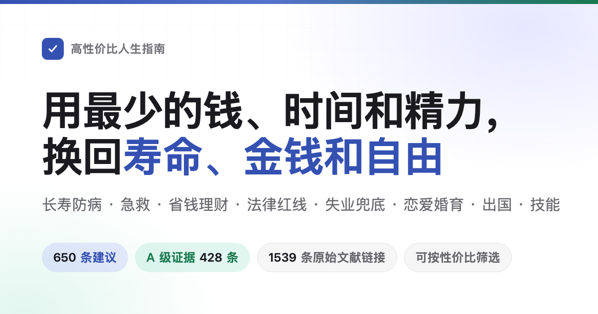

<div align="center">



# HowToLiveBetter: The Cost-Effective Life Guide

How to live longer, fall ill less often, and what to do when emergencies strike. How to avoid wasting hard-earned money, getting scammed, or getting entangled in lawsuits. What aid you can claim when unemployed or broke, and what procedures you need to open a shop, register a company, or launch a website. Also covers dating, marriage, parenting, moving abroad, and learning high-value crafts.<br>
**630 actionable pieces of advice**, each specifying what you spend, what you get back, and how hard the evidence is. Sources cite only peer-reviewed journal papers and official government documents.

You don't have to do it all: This is a prioritized shortlist ranked by cost-effectiveness, not a chore list. Adopting even one or two items counts—the author hasn't done most of them either.

[](https://eternity4719.github.io/HowToLiveBetter/)
[](#table-of-contents)
[](#evidence-grading)
[](docs/核实记录/)
[](#license)
[](README.md)

### [Open Online Search](https://eternity4719.github.io/HowToLiveBetter/) · [AI Skill](skills/life-decision-guide/README.md) · [中文版 README](README.md)

The AI assistant skill supports Claude Code and Codex. Once installed, ask questions like *"Should I co-sign a loan for a friend?"* or *"Is a 2-hour daily commute worth it?"*, and it looks up the book's entries first, computes cost-effectiveness, and quotes the exact section and entry number.

<table>
<tr><td align="right"><b>Downloads</b></td><td align="left">

[PDF](https://github.com/eternity4719/HowToLiveBetter/releases/download/epub-latest/HowToLiveBetter.pdf) · [EPUB](https://github.com/eternity4719/HowToLiveBetter/releases/download/epub-latest/HowToLiveBetter.epub) · [Offline Single-File HTML](https://github.com/eternity4719/HowToLiveBetter/releases/download/epub-latest/HowToLiveBetter.html)

</td></tr>
<tr><td align="right"><b>Reference</b></td><td align="left">

[Table of Contents](#table-of-contents) · [Glossary](#glossary-of-statistical-and-legal-terms) · [Verification Records](docs/核实记录/)

</td></tr>
<tr><td align="right"><b>Long Reads</b></td><td align="left">

[Is Marriage Worth It](docs/结婚划不划算.md) · [Home Emergency Kit](docs/家庭应急装备清单.md) · [Should You Help a Stranger in Distress](docs/遇到陌生人出事该不该停.md) · [What Licenses Does a Platform Need](docs/做平台要办哪些证.md) · [Circadian Rhythm and Night Shifts](docs/生物钟和夜班.md)

</td></tr>
<tr><td align="right"><b>Other Languages</b></td><td align="left">

[English](https://dlgrv.github.io/HowToLiveBetter/en/) · [Русский](https://dlgrv.github.io/HowToLiveBetter/ru/) · [Español](https://dlgrv.github.io/HowToLiveBetter/es/) (Translations maintained by [dlgrv](https://github.com/dlgrv) at [dlgrv/HowToLiveBetter](https://github.com/dlgrv/HowToLiveBetter))

</td></tr>
<tr><td align="right"><b>Derived Tools</b></td><td align="left">

[howtolivebetter.net](https://howtolivebetter.net/) — Interactive checklist by [littleben](https://github.com/littleben) to add to-dos, mark progress, and bookmark

</td></tr>
</table>

<sub>Other language sites and community tools are maintained by third parties and may lag behind. The Chinese text in this repository is the definitive source of truth.</sub>

</div>

---

## Questions This Guide Answers

| Question | Where to look |
| --- | --- |
| What can you do almost for free that noticeably reduces your risk of premature death? | [1. Do Not Die Early](book/01-不要早死.md) |
| Exactly how much do smoking, alcohol, sitting too long, and lack of sleep shorten life? How to quit, and how to choose cooking oils? | [2. Do Not Die Slowly](book/02-不要慢慢死.md) |
| Running out of energy every day and constantly interrupted—how to fix it? | [3. Do Not Waste Energy](book/03-不要浪费精力.md) |
| Where did all the time go? How to eliminate zero-yield tasks and cure procrastination? | [4. Do Not Waste Time](book/04-不要浪费时间.md) |
| How should saved money be stored so interest, fees, and scams don't eat it up? | [5. Do Not Waste Money](book/05-不要浪费钱.md) |
| Which health supplements, checkup packages, and "IQ taxes" can you safely skip? | [6. The Negative List](book/06-反面清单.md) |
| Unemployed, unpaid wages, completely broke—what aid can you claim and where to seek help? | [7. How to Survive When Broke](book/07-没钱的时候怎么活.md) |
| Betrothal gifts, premarital property, large dating transfers—who owns them? What to do first if falsely reported or accused? How much can voluntary confession reduce a sentence? | [8. Legal & Property Safety](book/08-别把自己搭进去.md) |
| Which "side gigs" and casual favors turn regular people into criminal defendants? | [9. Common Legal Red Lines](book/09-普通人容易踩的法律红线.md) |
| Should you pursue multiple romantic prospects or focus on one? Can long-distance work? What is needed to register a marriage? | [10. Are Dating and Marriage Worth It](book/10-恋爱和结婚划不划算.md) |
| Writing which code and taking which freelance projects can lead to criminal charges? | [11. Red Lines for Programmers & Techies](book/11-程序员和技术人容易踩的红线.md) |
| Before borrowing money to open a shop or start a company, what must you think through first? | [12. Starting a Business & Entrepreneurship](book/12-创业与做生意.md) |
| Someone collapsed without breathing, severe bleeding, fire, or lost outdoors—what to do first? | [13. Emergencies: What to Do First](book/13-紧急情况.md) |
| Account stolen or phone lost—what is step one? | [14. Account & Information Security](book/14-账号与信息安全.md) |
| Deposit withheld, landlord evicting you, rental platform defaulting—what to do? | [15. Renting and Buying a Home](book/15-租房与买房.md) |
| Diagnosed with a chronic disease—how to manage it long-term while spending less? | [16. Living With Chronic Illness](book/16-得了慢性病之后怎么活.md) |
| How should an elderly parent's guardianship, will, and finances be arranged in advance? | [17. Having Elderly Parents at Home](book/17-家里有老人.md) |
| What subsidies can you claim for having a child, and how much time and money does it consume? | [18. Is Having Kids Worth It](book/18-养孩子划不划算.md) |
| How to calculate overtime and leave? How much layoff severance are you owed? How to claim for work injuries? | [19. Employment, Resignation & Work Injuries](book/19-在职离职和工伤.md) |
| Just had a newborn—what are the most critical priorities? | [20. Caring for a Newborn](book/20-刚出生的孩子怎么带.md) |
| Which countries should you avoid traveling to right now? What are the limits of consular protection? | [21. Going Abroad, Travel & Overseas Safety](book/21-出国旅行与境外安全.md) |
| How to avoid traps in entertainment venues (KTV, internet cafes, escape rooms)? What actually relieves stress? | [22. How to Relax: Venues & Stress Relief](book/22-怎么放松.md) |
| Welding, English, certifications—which skills truly pay off? How to study efficiently? Are professional titles worth pursuing? | [23. Which Skills Are Worth Learning](book/23-学什么技能划算.md) |
| How big is the cost difference between community clinics and tertiary hospitals? Should you wait in line or go to ER triage? | [24. Healthcare: Saving Money & Avoiding Traps](book/24-看病.md) |
| A family member passed away—what to do immediately? Which money can be claimed back, and which fees can be waived? | [25. What to Do After Someone Dies](book/25-人走了以后要办什么.md) |
| Building a website or platform to accept payments—what licenses and filings are needed, and where to host servers? | [26. Building a Website or Platform](book/26-做一个网站或平台.md) |
| Pregnant and preparing to give birth—what to do when, and which documents to obtain before discharge? | [27. Pregnancy and Childbirth](book/27-怀孕和生产.md) |
| Want to lose weight or improve your looks—which practices permanently ruin your body? | [28. Do Not Ruin Your Body for Appearance](book/28-别为了外形把身体搞坏.md) |
| Lost a loved one, got laid off, or received a critical diagnosis—what matters most in the first few months? | [29. Surviving Major Life Crises](book/29-遭遇重大打击之后.md) |
| Once your child starts school, which physical and mental health issues cannot wait until after exams? | [30. School-Age Children](book/30-上学以后的孩子.md) |
| After turning 18, what paths exist beyond regular university or factory work, and what are their thresholds? | [31. Paths After Eighteen](book/31-十八岁之后有哪几条路.md) |
| Studying abroad: how to keep legal visa status, work allowances, insurance, and degree accreditation? | [32. Studying Abroad: Visas, Work, Insurance](book/32-出国留学.md) |
| You or a family member became disabled—which complications to prevent first, which subsidies exist, and what about schooling and employment? | [33. Living With a Disability](book/33-残疾之后怎么活.md) |
| Home medicine cabinet: which pain/fever/cold meds must never be mixed, and what must kids, pregnant women, and the elderly avoid? | [34. Safe Use of Household Medicines](book/34-家里的常备药别吃出事.md) |

---

## How to Read This Guide

- **You don't have to do it all**: This is a prioritized shortlist based on cost-effectiveness, not a chore list. Picking just one or two items to implement is a success; leave the rest for when you need them. The feeling that "it's easier said than done" is completely normal—the author has not accomplished most of them either.
- **Want an AI to check it for you?**: The repository includes an AI assistant skill ([skills/life-decision-guide](skills/life-decision-guide/)), installable in Claude Code or Codex. Ask questions like *"Should I co-sign for a friend?"* or *"Is a 2-hour daily commute worth it?"*. It retrieves relevant items from the text, ranks advice by the book's cost-benefit framework, and cites the exact section and entry number without hallucinating figures. See [skills/life-decision-guide/README.md](skills/life-decision-guide/README.md).
- **Filter by criteria**: Open the [online search page](https://eternity4719.github.io/HowToLiveBetter/) to filter by keyword, chapter, evidence grade, and cost dimensions (costs money, takes time, requires willpower). The web page reads directly from the markdown files in `book/`.
- **Cross-references between entries** (e.g., *"see Section 8, Item 17"*): On the online search page, these cross-references have a dashed underline. Clicking them displays a quick preview card with the target's title and "in plain terms" summary without losing your place.
- **Read in order**: Entries within each section are sorted from highest to lowest cost-effectiveness. Starting with the first few entries of each chapter yields the highest return.
- **Read offline or share with others**: Download the [offline single-file HTML](https://github.com/eternity4719/HowToLiveBetter/releases/download/epub-latest/HowToLiveBetter.html). The entire book, complete with instant search and filtering, is packaged into a single self-contained HTML file. Double-click to open in any browser without needing a server or internet access.
- **Print or read on mobile**: Download the [PDF](https://github.com/eternity4719/HowToLiveBetter/releases/download/epub-latest/HowToLiveBetter.pdf) (A4 layout, 200+ pages, with table of contents, page numbers, bookmarks, and section breaks).
- **Read on Kindle / E-readers**: Download the [EPUB eBook](https://github.com/eternity4719/HowToLiveBetter/releases/download/epub-latest/HowToLiveBetter.epub) and deliver it via "Send to Kindle".
- **All three formats are automatically rebuilt on every commit to main**. Download links remain permanent.
- **Can't decipher the statistical figures?**: Every entry includes an **"In Plain Terms"** line. It translates academic numbers from the "Benefit" field into clear, everyday language (e.g., *"about 20% lower chance of dying in the same period"*, *"several days of detention, a fine of X yuan"*). It never invents new numbers; reading this line alone is sufficient to make a sound decision.
- **Looking only for rock-solid conclusions?**: Check **Evidence Grade A** on the search page to see the 420 entries backed by concrete figures from meta-analyses or large-scale randomized controlled trials.
- **Looking only for the most worthwhile actions?**: Check cost-effectiveness **"Very High"** to reveal the 108 entries that cost almost nothing, take negligible time, require virtually no willpower, yet deliver top-tier gains.
- **Don't be startled by "Do Not..." chapter titles**: Section headings state the adverse outcome the section aims to prevent (e.g., *Do Not Die Early*, *Do Not Waste Time*). Individual entries within each chapter always start with an active verb stating clearly what action to take or avoid.

---

### Anatomy of an Entry

```markdown
### 5. Switch Household Table Salt to Low-Sodium (Potassium-Enriched) Salt
- Cost: A few yuan more per bag. Swap it during routine grocery shopping; no extra time needed. Taste is virtually identical.
- In plain terms: In a randomized trial of 20,000 people, those who switched to low-sodium salt had an approximate 12% lower risk of dying within five years and a 14% lower risk of stroke. Because participants were randomly assigned, this is far more trustworthy than purely observational data.
- Benefit: A cluster-randomized trial conducted across 600 villages in rural China (20,995 individuals with prior stroke or aged ≥60 with hypertension, followed for 4.74 years). Results: Low-sodium salt vs. regular salt reduced all-cause mortality by 12% (RR 0.88), stroke by 14% (RR 0.86), and major adverse cardiovascular events by 13% (RR 0.87).
- Evidence Grade: A
- Sources: Neal B, et al. (2021). Effect of Salt Substitution on Cardiovascular Events and Death. NEJM. https://doi.org/10.1056/NEJMoa2105675
- Notes: Contested for young healthy groups. Trial participants were high-risk elderly; benefits are substantially smaller for healthy young adults. Individuals with chronic kidney disease or taking potassium-sparing medications must consult a physician before switching.
```

---

## Running Locally

Most people do not need to run a local server: the [online search page](https://eternity4719.github.io/HowToLiveBetter/) is ready to use, or you can download the [offline single-file HTML](https://github.com/eternity4719/HowToLiveBetter/releases/download/epub-latest/HowToLiveBetter.html).

If you want to host it locally on your computer or server:

```bash
git clone https://github.com/eternity4719/HowToLiveBetter.git
cd HowToLiveBetter
python -m http.server 8000
```

Open `http://localhost:8000/` in your browser. The search interface is 100% static: `README.md` and `book/` are its data sources. There is no backend, no database, and zero dependencies. Note: `index.html` must be accessed over HTTP/HTTPS; double-clicking it directly off disk will result in a blank page because modern browsers block local file fetching (use the single-file offline HTML instead).

To manually build the three release artifacts (Node.js required):

```bash
cd tools/epub && npm ci && npm run build   # EPUB
node tools/offline/build.mjs               # Offline single-file HTML
node tools/pdf/build.mjs                   # PDF (requires pandoc ≥ 3.1 and typst ≥ 0.13)
```

Outputs are saved in `dist/`.

---

## The Four Resources Optimized

This book optimizes four fundamental resources:

- **Lifespan**: Live longer and avoid premature, preventable causes of death.
- **Time and Energy**: Eliminate unrewarding activities; protect daily focus and physical stamina from meaningless exhaustion.
- **Money**: Stop wasting money on scams or low-value expenses; invest capital where returns are well-established.
- **Personal Freedom**: Avoid crossing legal red lines that land regular people in detention centers or prison.

Each recommendation answers two questions: **what you spend** (money / time / energy / willpower) and **what you buy back** (reduction in all-cause mortality / reduction in specific cause of death / time & energy saved / money saved / legal safeguards & personal freedom). Entries are sorted by cost-effectiveness rather than category: near-zero cost actions with large gains appear first.

### Beneficiary Tiers

The benefit of an action is categorized by who receives it, ranked by the likelihood of that benefit circulating back to you:
1. **You Yourself** (highest priority)
2. **Spouse and Immediate Family** (parents, children, grandparents, grandchildren)
3. **Friends, Colleagues, and Extended Family** (reciprocal relationships where help may be returned)
4. **Strangers** (lowest tier, but non-zero: low probability of return, risk of retaliation, false accusations, or civil disputes)

Benefits across different tiers are never mixed together. When an action involves tier ④, both benefits and risks (such as extortion or secondary injury) are clearly stated. For example, in first aid: in China, 79.2% of out-of-hospital cardiac arrests occur at home; learning CPR is primarily for saving your own family. Rules like *"never jump into water yourself to save a drowning person"* and *"never physically intervene in a street brawl"* are fundamental self-preservation principles designed to prevent a bystander from becoming a second victim.

---

## Evidence Grading

Every piece of advice is marked with an evidence grade:

| Grade | Meaning |
| --- | --- |
| **A** | Quantifiable evidence with concrete numbers, sourced from meta-analyses, large long-term cohort studies, or randomized controlled trials (RCTs). States specific effect sizes (HR, RR, percentage reduction). |
| **B** | Supported by peer-reviewed research, but difficult to quantify precisely, or supported by a single small-sample study. |
| **C** | Author experience or established consensus practices without direct experimental literature. |

Across all 630 entries: **420 are Grade A, 159 are Grade B, and 51 are Grade C**. In addition, 58 items note scientific controversy, and 35 points are marked TODO for verification. Contested items are labeled "Controversy" with counter-evidence presented. All sources cite primary literature (journal papers with DOI/PubMed links or reports from official bodies like WHO, CDC, or national bureaus of statistics).

---

## Value-for-Money Tiers

Evidence grade only answers *"how trustworthy is this figure"*, not *"is this action worth doing"*. Therefore, each entry also specifies its **benefit magnitude** and **resource scope**. Together with the three cost dimensions, they determine a cost-effectiveness tier:

| Dimension | Values | Criteria |
| --- | --- | --- |
| **Scope** | Lifespan / Money / Time & Energy / Personal Freedom | Primary resource bought back. **Different scopes are never compared against each other**: a 12% lower mortality cannot be weighed on the same scale as saving $50/year. |
| **Benefit Magnitude** | Large / Moderate / Small | Strictly benchmarked against pre-set cutoffs: **Lifespan**: relative reduction ≥20% is Large, 10–20% Moderate, <10% or surrogate endpoints Small; **Money**: tens of thousands is Large, hundreds to thousands Moderate, small change Small; **Freedom**: avoiding criminal liability is Large, administrative detention Moderate, civil dispute Small; **Time**: hours saved daily is Large, hours weekly Moderate, one-off saving Small. |
| **Cost-Effectiveness** | Very High / High / Moderate | Large benefit + zero across all three costs = **Very High**; Large benefit + low cost, or Moderate benefit + zero cost = **High**; remaining = **Moderate**. |

Across the 630 entries: **108 are Very High (17%), 288 are High (46%), and 234 are Moderate (37%)**.

---

## Glossary of Statistical and Legal Terms

<details>
<summary>Expand 41 terms (All-Cause Mortality, HR, RR, 95% CI, Meta-analysis, BMI, LPR, etc.)</summary>

| Term | Meaning |
| --- | --- |
| **All-Cause Mortality (ACM)** | The proportion of individuals in a population who die during a specified period, regardless of cause. Used throughout this book to measure longevity. |
| **HR (Hazard Ratio)** | The rate at which events (death, disease) occur in the exposed group divided by the rate in the unexposed group. An HR of 0.87 means a 13% lower hazard; HR 1.21 means 21% higher. |
| **RR (Relative Risk)** | The ratio of the probability of an outcome in an exposed group to the probability in an unexposed group. Interpreted identically to HR. |
| **OR (Odds Ratio)** | Ratio of the odds of an event occurring in one group compared to another. Close to RR for rare events; overstates differences when events are common. |
| **IRR (Incidence Rate Ratio)** | The ratio of incidence rates between two cohorts over person-time. Read like RR. |
| **RaR (Rate Ratio)** | Compares the frequency of events (e.g., number of falls) rather than headcount. |
| **SMR (Standardized Mortality Ratio)** | Observed deaths divided by expected deaths in a general age-matched population. SMR 5.86 means 5.86 times the mortality of peers. |
| **Risk Difference (Absolute Risk Reduction)** | The absolute difference in probability between two groups (e.g., "5 fewer events per 1,000 people"). |
| **95% CI (95% Confidence Interval)** | The estimated range likely to contain the true value. If a ratio CI crosses 1 (or a difference CI crosses 0), the finding is considered not statistically significant. |
| **RCT (Randomized Controlled Trial)** | Study where participants are randomly assigned to an intervention or control group. The gold standard for establishing causality. |
| **Meta-analysis** | Statistical synthesis of results from multiple independent studies to derive a pooled effect estimate. |
| **Cohort Study** | Observational study following a large group over time to see who develops specific outcomes. Identifies correlations but cannot definitively prove causation. |
| **Observational Study** | Study where investigators observe outcomes without manipulating exposures. Susceptible to confounding and reverse causation. |
| **Confounding** | A third variable linked to both the exposure and outcome that creates a spurious relationship (e.g., people who eat vegetables also exercise more). |
| **Reverse Causation** | The outcome actually causes the exposure, rather than vice versa (e.g., severe illness causes long sleep duration, not the other way around). |
| **Cohen's d / Hedges' g** | Standardized effect sizes. 0.2 is small, 0.5 medium, 0.8 large. |
| **Correlation (r)** | Strength of a linear relationship (-1 to 1). 0.1 is weak, 0.3 moderate, 0.5 strong. |
| **MET (Metabolic Equivalent of Task)** | Unit of physical activity intensity. 1 MET = resting quietly; brisk walking = ~3–4 METs. MET-hours multiply intensity by duration. |
| **GRADE** | Systematic framework for grading certainty in evidence (High, Moderate, Low, Very Low). |
| **Intention-to-Treat (ITT)** | Analyzing participants based on initial group assignment regardless of whether they complied with the screening or treatment protocol. |
| **Pack-Year** | Metric for smoking exposure: packs smoked per day multiplied by years smoked (30 pack-years = 1 pack/day for 30 years). |
| **BMI (Body Mass Index)** | Weight in kilograms divided by height in meters squared ($kg/m^2$). |
| **LDL-C** | Low-density lipoprotein cholesterol ("bad cholesterol"). |
| **eGFR** | Estimated glomerular filtration rate measuring kidney function ($mL/min/1.73 m^2$). Lower scores indicate worse kidney function. |
| **HBsAg** | Hepatitis B surface antigen; a positive test indicates active HBV infection. |
| **HPV** | Human papillomavirus. High-risk strains are the primary cause of cervical cancer. |
| **LDCT** | Low-dose computed tomography; delivers 1/5 to 1/10 the radiation of conventional chest CT scans. |
| **PM2.5** | Fine inhalable particles with diameters 2.5 micrometers and smaller. |
| **NOVA** | Classification system grouping foods by degree of processing; Category 4 represents Ultra-Processed Foods (UPFs). |
| **LPR (Loan Prime Rate)** | Benchmark loan rate in China, updated monthly on the 20th; sets the cap for civil lending interest. |
| **Final Arbitration Award (一裁终局)** | Labor arbitration rulings that take legal effect immediately without the employer being able to appeal to court. |
| **Crude Marriage / Divorce Rate** | Annual marriages or divorces per 1,000 total population. Distinct from the divorce-to-marriage ratio. |
| **AED** | Automated External Defibrillator; voice-prompted portable medical device that delivers shocks only if ventricular fibrillation is detected. |
| **CPR** | Cardiopulmonary Resuscitation; rhythmic chest compressions to maintain circulatory blood flow during cardiac arrest. |
| **3C Certification** | China Compulsory Certificate; mandatory safety mark required before products in its catalog may be sold or distributed in China. |
| **ICP Filing (ICP备案)** | Mandatory telecommunications registration with China's MIIT before hosting websites or apps domestically. |
| **MLPS (等级保护)** | Multi-Level Protection Scheme; Chinese cybersecurity compliance framework categorizing systems by security tier. |
| **GPL** | General Public License; copyleft software license requiring derivative works to make source code available under identical terms. |
| **Non-compete Agreement** | Contract clause barring departing employees from joining competitors, requiring monthly compensation for up to 2 years under Chinese law. |
| **Subscribed Capital (认缴出资)** | Capital committed during company registration that shareholders are legally obligated to pay in full within statutory deadlines. |
| **Deposit: Dingjin (定金) vs. Dingjin (订金)** | Chinese legal distinction: 定金 (Earnest Deposit) incurs statutory double refund penalties if the recipient defaults; 订金 (Advance Payment) carries no automatic punitive penalty. |

</details>

---

## Table of Contents

1. [Do Not Die Early](book/01-不要早死.md): External causes of death, traffic, gas leaks, poisoning, vaccines, cancer screening, psychological crises & suicidal ideation time-horizons, long-term costs of survived falls, living with a single kidney after organ sale, home emergency kits, hematuria as a warning sign. *Scope: All-cause mortality / Specific mortality.*
2. [Do Not Die Slowly](book/02-不要慢慢死.md): Smoking, alcohol, physical exercise, sleep, diet (low-sodium salt, nuts, whole grains, processed meat, bulk unrefined peanut oil, swapping animal fat for vegetable oil), sedentary behavior, medication-assisted smoking cessation, alcohol withdrawal risks, midday naps, recovering from all-nighters, shift work health costs. *Scope: All-cause mortality / Specific mortality. Long read: [Circadian Rhythm and Night Shifts](docs/生物钟和夜班.md).*
3. [Do Not Waste Energy](book/03-不要浪费精力.md): Sleep hygiene, reducing interruptions, multitasking traps, decision fatigue, interpersonal friction, setting realistic expectations when interacting with institutions. *Scope: Energy & Time.*
4. [Do Not Waste Time](book/04-不要浪费时间.md): Zero-yield obligations, sunk cost fallacy, tackling procrastination (emotional regulation, environmental friction, commitment devices, realistic habit formation timelines), meetings, commutes. *Scope: Time.*
5. [Do Not Waste Money](book/05-不要浪费钱.md): Recurring subscriptions, lotteries, debt interest, insurance fundamentals, mutual fund expense ratios, individual pensions, car insurance, prepayments, livestream shopping, health insurance personal accounts, protecting children from scams, avoiding collectibles/jade as "investments", overseas asset rules. *Scope: Money.*
6. [The Negative List](book/06-反面清单.md): Things that appear cost-effective but deliver negligible real-world returns (including debunking "ego depletion / willpower runs out like a muscle", and non-targeted commercial checkups).
7. [How to Survive When Broke](book/07-没钱的时候怎么活.md): Unemployment insurance, emergency financial assistance, finding day labor, temporary shelter and food banks, healthcare relief, recovering withheld wages, dodging predatory traps. *Scope: Money & Social safety.*
8. [Legal & Property Safety](book/08-别把自己搭进去.md): Traffic accident protocol, emergency account freezing after scams, AI deepfake audio/video imposters, sentence reductions from confession, defending against false accusations, resolving disputes without crossing into extortion, restraining violent impulses, civil protections during online harassment, premarital property, loan guarantees, debt enforcement blacklists. *Scope: Money & Personal Freedom.*
9. [Common Legal Red Lines](book/09-普通人容易踩的法律红线.md): Defamation and online rumors, illegal money laundering gigs, fraudulent loans and insurance claims, falling objects from heights, imitation firearms, unauthorized drones, illicit recordings, gambling, illegal wildlife, organ trafficking prohibitions. *Scope: Personal Freedom & Money.*
10. [Are Dating and Marriage Worth It](book/10-恋爱和结婚划不划算.md): Mate selection strategies ("broad search vs. single focus"), harassment laws, relationship quality, long-distance relationships, marriage registration procedure, premarital checkups, health & financial ledgers, joint debts, divorce costs. *Scope: Time, Money & Well-being. Long read: [Is Marriage Worth It](docs/结婚划不划算.md).*
11. [Red Lines for Programmers & Techies](book/11-程序员和技术人容易踩的红线.md): Game bots and cheats, web scrapers, ticket scalping scripts, deleting production databases, exfiltrating proprietary source code, freelance risks, non-compete clauses, open-source licensing compliance, mandatory web filings. *Scope: Personal Freedom & Money.*
12. [Starting a Business & Entrepreneurship](book/12-创业与做生意.md): Starting capital, personal liability and guarantees, entity selection, business registration, licenses, tax declarations, invoice fraud risks, commercial contracts, employment compliance, inventory and IP infringement risks, exit strategies. *Scope: Money & Legal Liability.*
13. [Emergencies: What to Do First](book/13-紧急情况.md): Out-of-hospital cardiac arrest, stroke recognition, myocardial infarction, aortic dissection, thunderclap headaches, chronic subdural hematoma, pulmonary embolism, massive hemorrhage, animal bites, burns, anaphylaxis, seizures, severe hypoglycemia, electrocution, carbon monoxide poisoning, chemical burns, foreign object impalement, fractures, heatstroke, structural fires, drowning, getting lost outdoors, hypothermia, snakebites, earthquakes, wild animal attacks, lightning, altitude sickness, tick bites, wild water safety; assisting fallen elderly and avoiding liability. *Scope: Survival Rate & Money.*
14. [Account & Information Security](book/14-账号与信息安全.md): Two-factor authentication (2FA), password management, SIM PIN lock, lost phone emergency steps, unauthorized bank charges, session management, mobile app permissions, facial recognition risks, data privacy rights. *Scope: Money & Information Privacy.*
15. [Renting and Buying a Home](book/15-租房与买房.md): Security deposit retrieval, illegal lockouts, tenant agency risks, escrow fund supervision, leases surviving property sales, title verification, escrow trading accounts, partitioned room hazards. *Scope: Money.*
16. [Living With Chronic Illness](book/16-得了慢性病之后怎么活.md): Medication adherence, cross-provincial medical billing settlement, medical record management, avoiding unproven folk remedies, long-term prescriptions, family doctor contracting, complication screenings, kidney stone recurrence prevention, target-directed gout management. *Scope: All-cause mortality & Money.*
17. [Having Elderly Parents at Home](book/17-家里有老人.md): Designated adult guardianship, formal wills, fraud targeting seniors, long-term care insurance, bedridden pressure ulcer prevention. *Scope: Money, Freedom & Mortality.*
18. [Is Having Kids Worth It](book/18-养孩子划不划算.md): Childcare subsidies, maternity leave and benefits, statutory employment protections, time and economic ledgers of child rearing. *Scope: Money & Time.*
19. [Employment, Resignation & Work Injuries](book/19-在职离职和工伤.md): Overtime compensation, paid annual leave, probation rules; occupational hazards, dust and noise safety; severance calculation ($N$, $N+1$, $2N$), resisting coerced resignations, gathering evidence; injury claim deadlines, uninsuring employers, disability assessments, workplace death payouts. *Scope: Money.*
20. [Caring for a Newborn](book/20-刚出生的孩子怎么带.md): Safe infant sleep, birth Hepatitis B vaccination, national immunization schedule, breastfeeding and solids, formula preparation water temperature, honey hazards (botulism), Vitamin K1 prophylaxis, fever warning signs, shaken baby syndrome prevention, diaper economics, early peanut introduction for allergy prevention. *Scope: Infant Mortality & Money.*
21. [Going Abroad, Travel & Overseas Safety](book/21-出国旅行与境外安全.md): Travel security warning tiers, 12308 consular hotline, boundaries of consular assistance, overseas medical insurance, high-paying overseas job scams, annual foreign currency cash limits, lost passport procedures, international driving permits. *Scope: Money & Personal Freedom.*
22. [How to Relax: Venues & Stress Relief](book/22-怎么放松.md): Entertainment venue exits, price transparency, drug risks, accepting open drinks, internet café identity rules; evidence-based stress relief (exercise, mindfulness, breathwork, social bonding, green spaces). *Scope: Money, Freedom, Energy & Mortality.*
23. [Which Skills Are Worth Learning](book/23-学什么技能划算.md): Schooling vs. manual labor (child labor laws, educational attainment and mortality, national degree demographics, tuition waivers and grants), educational ROI, counterfeit certificates, government training subsidies, skills resilient to AI automation, how to learn effectively (retrieval practice, spaced learning, interleaving), professional title accreditation. *Scope: Money, Time & Mortality.*
24. [Healthcare: Saving Money & Avoiding Traps](book/24-看病.md): Tiered medical referral systems, continuous deductible calculation, reimbursement differentials, outpatient slot booking, evaluating cross-regional medical travel, preserving medical records, ER triage 4-level classification, emergency indigent medical assistance, disability assessments, skipping medical kickbacks. *Scope: Money & Time.*
25. [What to Do After Someone Dies](book/25-人走了以后要办什么.md): Police notification and death certificates, body transport and cremation, dispute resolution and autopsies, household registration cancellation, funeral item pricing laws, housing fund and pension settlement, deceased personal data rights. *Scope: Money.*
26. [Building a Website or Platform](book/26-做一个网站或平台.md): Payment settlement legal boundaries, ICP licenses and filings, audio/video streaming permits, platform seller verification and tax reporting, content moderation, real-name registration, minor protection, notice-and-takedown procedures, cross-border data transfer, server hosting choices. *Scope: Personal Freedom & Money. Long read: [What Licenses Does a Platform Need](docs/做平台要办哪些证.md).*
27. [Pregnancy and Childbirth](book/27-怀孕和生产.md): Folic acid supplementation, maternal handbook registration and free antenatal screenings, PMTCT screening, avoiding smoking/alcohol, aspirin and gestational diabetes, warning signs requiring immediate hospitalization, water breaking protocol, epidural analgesia, C-section indications, maternity insurance, birth certificates, newborn screenings. *Scope: Mortality & Money.*
28. [Do Not Ruin Your Body for Appearance](book/28-别为了外形把身体搞坏.md): Extreme fasting and eating disorders, cosmetic surgery licensing verification, facial filler blindness danger zones, illegal sibutramine diet pills, anabolic steroids, prescription protocols for GLP-1s and sex hormones, body dysmorphic assessments. *Scope: Health & Mortality.*
29. [Surviving Major Life Crises](book/29-遭遇重大打击之后.md): Cardiovascular risk window during the first month of bereavement, first week following critical illness diagnosis, navigating sudden unemployment, post-spousal loss mortality window, suicide loss bereavement, building support systems when isolated, supporting grieving children, complex grief clinics, divorce resilience, hotlines, avoiding irreversible decisions during acute stress, debunking suicide as debt relief. *Scope: All-cause mortality & Money.*
30. [School-Age Children](book/30-上学以后的孩子.md): Pediatric acute medical emergencies requiring hourly intervention, never postponing urgent medical care for exams, anti-bullying protocols, 2 hours of daily outdoor light, interpreting school health screenings, adolescent depression screening, debunking "myopia cure" scams, statutory limits on homework and sleep, medical leaves of absence, cycloplegic refraction, pit and fissure sealants. *Scope: Mortality, Health & Time.*
31. [Paths After Eighteen](book/31-十八岁之后有哪几条路.md): Statutory eligibility thresholds for 12 adult career pathways; military service (draft registration, 2-year conscription, legal consequences of refusal, tuition compensation, veteran reintegration); grassroots civil service programs; Special Post Teachers; firefighting and civilian military personnel; adult higher education exams; tuition-free normal university and rural medical student contractual obligations; overseas employment agencies; remote freelance tax filings; entrepreneurship loans; gig worker occupational injury protections. *Scope: Money, Time & Personal Freedom.*
32. [Studying Abroad: Visas, Work, Insurance](book/32-出国留学.md): Verifying accredited institution lists before paying tuition; US F-1 student status regulations and 60-day grace periods; working hour limits across the US, UK, Canada, and Australia; maintaining full-time enrollment as the foundation of legal status; 10-day address change reporting; consular study advisories; maintaining mandatory overseas student health cover (OSHC); UK immigration health surcharge; national credential verification processing timelines. *Scope: Money & Personal Freedom.*
33. [Living With a Disability](book/33-残疾之后怎么活.md): Emergency 3-step management of autonomic dysreflexia, 10-year post-injury suicide risk window, voluntary principles in psychiatric hospitalizations, caregiver mortality risks, wheelchair pressure-relief cushions, debunking "miracle cure" scams, claiming all six statutory disability benefits, long-term care insurance expansion, pediatric 0–6 rehabilitation grants, home accessibility modification subsidies, quota employment policies and fund assessments, tax exemptions, guide dog transit rights, Gaokao accessibility accommodations, inclusive education mandates, C5 adaptive driving licenses, selecting rehabilitation facilities, hearing aids, legal guardianship procedures. *Scope: Mortality, Money, Time & Personal Freedom.*
34. [Safe Use of Household Medicines](book/34-家里的常备药别吃出事.md): Avoiding duplicate acetaminophen toxicity, strictly avoiding aspirin/nimesulide/metamizole in pediatric fevers, high-risk groups for ibuprofen gastrointestinal damage, avoiding OTC compound cold remedies in children under 2, strictly avoiding ibuprofen after 20 weeks of pregnancy, limiting OTC omeprazole to 7 days, avoiding antibiotics for viral colds, oral rehydration therapy for diarrhea while withholding antimotility agents in children, avoiding medication-overuse headaches from analgesics. *Scope: Mortality.*

---

## License

- **Text Content**: Released under [CC BY 4.0](LICENSE), covering all text in `book/`, `docs/`, and this README. You are free to share, adapt, and use commercially without asking permission, provided you:
  1. Attribute the original work: *"HowToLiveBetter (高性价比人生指南)"* with a link to https://github.com/eternity4719/HowToLiveBetter.
  2. Provide a link to the license: https://creativecommons.org/licenses/by/4.0/.
  3. Indicate if changes were made.
- **Code**: Released under the [MIT License](LICENSE-CODE), covering all scripts in `tools/`, `skills/`, `index.html`, and `.github/`.

---

## Star History

[](https://star-history.com/#eternity4719/HowToLiveBetter&Date)

---

## Coffee & Sponsorship

If you find this work valuable, you can scan via WeChat to buy the author a coffee. Sponsorship is entirely voluntary and does not alter any content.


---

## Sponsorship Banner

<a href="https://4.mcyyy.com"></a>
